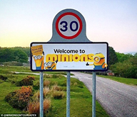

# {{ page.title }}

# Can I arrive earlier or leave later than scheduled?

Yes, please contact Victoria Sutcliffe at FXPlus to arrange accommodation for a longer
stay (victoria.sutcliffe@fxplus.ac.uk). Accommodation is limited so please be aware
that this is subject to availability. Please state that you are attending the
‘Centre for Ecology and Conservation’ PoreCamp event 15-19 August to obtain discounted
rates.

# Campus address

PoreCamp2016 is held at:

University of Exeter  
Penryn Campus  
Penryn  
Cornwall TR10 9FE  

[Directions to the Penryn Campus](http://www.exeter.ac.uk/visit/directions/cornwall)

# Arrival on Monday

Please report to the **Yellow seminar room in the Exchange** from 12.30 onwards on
Monday 15th August to collect you name badge and participant pack and to enjoy the
welcome buffet. The course will get started at 2.30pm.

Once the talks on Monday are complete, please report to **Glasney Lodge Reception
Desk** (a short walk from the Exchange) to collect your room key and settle in.
Please note that you will be unable to check in to your room until 4pm (unless you
have booked to stay an extra night prior to PoreCamp).

# Storing your DNA on arrival

If you are bringing your own samples we will have an ice bucket out during the
reception and will transfer these to a lab fridge. Please ensure your sample is
labelled clearly. We can accept no responsibility for loss or damage to your samples.
If you are arriving earlier and need to store DNA, there are fridges available in the
accommodation block which can be used. Obviously please make sure your sample
container is clean and contaminant-free. Please do not bring any RNA or tissue
samples to the course.

# Dinner on Monday

We have a dinner booked as part of the course which will be in the Lower Stannary
room in the Daphne Du Maurier building at 19.30. Max has sent out a form requesting
your choices for the meal, please complete this by Wednesday 10th August
(http://doodle.com/poll/kgacg7uz67ksshxm).

# Will breakfast and lunch be provided?

Yes. Please ensure you email Max Brunt (m.brunt@exeter.ac.uk) with any dietary
requirements by Wednesday 13th July.

# Is dinner/beer included?

No. This is primarily to reduce costs and give participants the widest possible
choice of options. We have arranged onsite catering for Monday 15th August but will
likely eat off-campus or arrange for take-aways the other evenings.

# Travel information

Details can be found here http://www.exeter.ac.uk/cornwall/about/penryn/findus

Notes for international travellers:

Please note that Penryn is around 5 hours by train from London Paddington. I suggest
catching a red-eye flight to arrive in London early on Sunday 14th August so you have
plenty of time to complete the journey to Penryn. You will need to book an additional
nights’ accommodation for the 14th August in Penryn (see above).

If you are booking trans-atlantic flights, I highly recommend one which lands at
London Heathrow. That way you can catch the Heathrow Express or Heathrow Connect
directly to London Paddington. From there you can catch a train to Truro and then
change for a train to Falmouth. Alternatively you may be able to fly via Amsterdam
and connect to a flight to Exeter before catching the train to Truro (cuts about 2
hours off the train travel time). Details can be obtained from
http://www.nationalrail.co.uk

# Taxi shares for departure on Friday 19th August

If you will be requiring a taxi after PoreCamp has finished on Friday, please contact
Vicki Sutcliffe who will help arrange shared taxis for those heading in the same
direction (victoria.sutcliffe@fxplus.ac.uk).   

# Who to contact for help

If you encounter any problems during your travels to Penryn, or have any questions
about accommodation, please contact Vicki Sutcliffe on +44 (0) 1326 253466
(victoria.sutcliffe@fxplus.ac.uk).

If you have any course queries, please contact Max Brunt (m.brunt@exeter.ac.uk).

# Safe travels and we look forward to seeing you next week!

We are looking forward to a productive and enjoyable week in one of the most
picturesque areas of the UK.

Cornwall even has a village with the name MinIONs – clearly in our honour:

