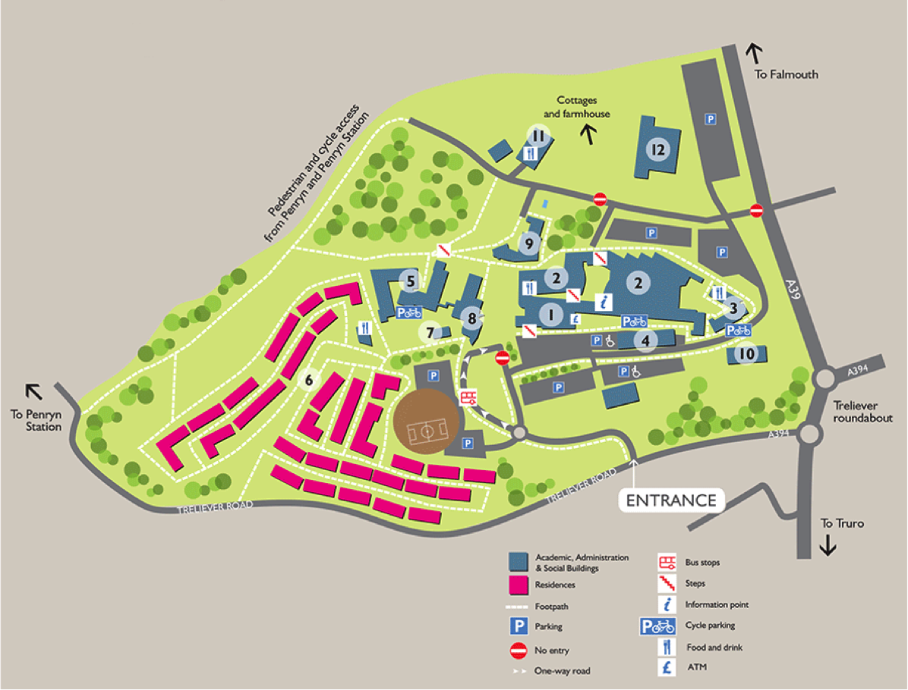

# {{ page.title }}

# Campus address

University of Exeter  
Penryn Campus  
Penryn  
Cornwall TR10 9FE  

[Directions to the Penryn Campus](http://www.exeter.ac.uk/visit/directions/cornwall)

# Places you'll be at during the week

[Map](https://www.google.com/maps/d/edit?mid=1ltOMwUeVgGT0Vow3OQ5x4eDuits) of course and excusion locations.

# Penryn Campus

