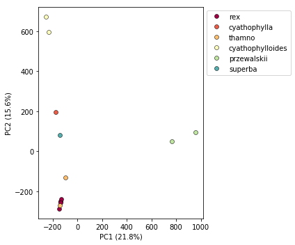

# The ipyrad.analysis module: *PCA*

As part of the `ipyrad.analysis` toolkit we've created convenience functions for easily performing exploratory principal component analysis (PCA) on your data. PCA is a very standard dimension-reduction technique that is often used to get a general sense of how samples are related to one another. PCA has the advantage over STRUCTURE type analyases in that it is very fast. Similar to STRUCTURE, PCA can be used to produce simple and intuitive plots that can be used to guide downstream analysis. These are three very nice papers that talk about the application and interpretation of PCA in the context of population genetics:

* [Reich et al (2008) Principal component analysis of genetic data](https://www.nature.com/articles/ng0508-491)
* [Novembre & Stephens (2008) Interpreting principal component analyses of spatial population genetic variation](https://www.nature.com/articles/ng.139)
* [McVean (2009) A genealogical interpretation of principal components analysis](http://journals.plos.org/plosgenetics/article?id=10.1371/journal.pgen.1000686)

## A note on Jupyter/IPython
[Jupyter notebooks](http://jupyter.org/) are primarily a way to generate reproducible scientific analysis workflows in python. ipyrad analysis tools are best run inside Jupyter notebooks, as the analysis can be monitored and tweaked and provides a self-documenting workflow.

First begin by [setting up and configuring jupyter notebooks](Jupyter_Notebook_Setup.md). **The rest of the materials in this part of the workshop assume you are running all code in cells of a jupyter notebook** that is running on the USP cluster.


# *PCA* analyses

* [Simple PCA from a VCF file](#simple-pca-from-vcf-file)
* [Coloring by population assignment](#population-assignment-for-sample-colors)
* [Removing "bad" samples and replotting](#removing-bad-samples-and-replotting)
* [Accessing the raw PC values](#inspecting-pcs-directly)
* [Specifying which PCs to plot](#looking-at-pcs-other-than-1--2)
* [Fine grained color control per popluation](#controlling-colors)
* [Dealing with missing data](#dealing-with-missing-data)

## Create a new notebook for the PCA
On your local computer open a new web browser and enter the link to your notebook server in the address bar:
```
http://localhost:<your_port_#>
```
Now you should see a view of your home directory on the cluster:


Lets create our first new notebook using the 'New' button:


First things first, rename your new notebook to give it a meaningful name:


### Import Python libraries
The `import` keyword directs python to load a module into the currently running context. This is very similar to the `library()` function in R. We begin by importing ipyrad, as well as the analysis module. 

```python
%matplotlib inline
import ipyrad
import ipyrad.analysis as ipa      ## ipyrad analysis toolkit
```
> **Note:** The call to `%matplotlib inline` here is a jupyter notebook 'magic' command that enables support for plotting directly inside the notebook.

## Quick guide (tl;dr)
The following cell shows the quickest way to results using a small simulated dataset in `/scratch/af-biota`. Complete explanation of all of the features and options of the PCA module is the focus of the rest of this tutorial. Copy this code into a notebook cell and run it.

```python
## Load your assembly
data = ipyrad.load_json("/scratch/af-biota/simulated-example/simrad.json")
## Create they pca object
pca = ipa.pca(data)
## Bam!
pca.plot()
```
    loading Assembly: simrad
    from saved path: /scratch/af-biota/simulated-example/simrad.json
    Using default cmap: Spectral
    <matplotlib.axes._subplots.AxesSubplot at 0x7fb6fdf82050>


## Full guide

### Simple pca from vcf file

In the most common use you'll want to plot the first two PCs, then inspect the output, remove any obvious outliers, and then redo the pca. It's often desirable to import a vcf file directly rather than to use the ipyrad assembly, so here we'll demonstrate this with the Anolis data.

```python
## Path to the input vcf.
vcffile = "/home/<username>/ipyrad-workshop/anolis_outfiles/anolis.vcf"
pca = ipa.pca(vcffile)
```
> **Note:** Here we use the anolis vcf generated with ipyrad, but the `ipyrad.analysis.pca` module can read in from *any* vcf file, so it's possible to quickly generate PCA plots for any vcf from any dataset.

We can inspect the samples included in the PCA plot by asking the `pca` object for `samples_vcforder`.
```python
print(pca.samples_vcforder)
```
    [u'punc_IBSPCRIB0361' u'punc_ICST764' u'punc_JFT773' u'punc_MTR05978'
     u'punc_MTR17744' u'punc_MTR21545' u'punc_MTR34414' u'punc_MTRX1468'
     u'punc_MTRX1478' u'punc_MUFAL9635']

Now construct the default plot, which shows all samples and PCs 1 and 2. By default all samples are assigned to one population, so everything will be the same color.

```python
pca.plot()
```
    Using default cmap: Spectral

    <matplotlib.axes._subplots.AxesSubplot at 0x7fe0beb3a650>


### Population assignment for sample colors
In the tl;dr example the assembly of our simulated data had included a `pop_assign_file` so the pca() was smart enough to find this and color samples accordingly. In some cases you might not have used a pops file, so it's also possible to specify population assignments in a dictionary. The format of the dictionary should have populations as keys and lists of samples as values. Sample names need to be identical to the names in the vcf file, which we can verify with the `samples_vcforder` property of the pca object.


```python
pops_dict = {
    "superba":["29154_superba_SRR1754715"],
    "thamno":["30556_thamno_SRR1754720", "33413_thamno_SRR1754728"],
    "cyathophylla":["30686_cyathophylla_SRR1754730"],
    "przewalskii":["32082_przewalskii_SRR1754729", "33588_przewalskii_SRR1754727"],
    "rex":["35236_rex_SRR1754731", "35855_rex_SRR1754726", "38362_rex_SRR1754725",\
            "39618_rex_SRR1754723", "40578_rex_SRR1754724"],
    "cyathophylloides":["41478_cyathophylloides_SRR1754722", "41954_cyathophylloides_SRR1754721"]
}
```


```python
pca = ipa.pca(vcffile, pops_dict)
pca.plot()
```

    Using default cmap: Spectral


    <matplotlib.axes._subplots.AxesSubplot at 0x7fe092fbbe50>





This is just much nicer looking now, and it's also much more straightforward to interpret.

## Removing "bad" samples and replotting.
In PC analysis, it's common for "bad" samples to dominate several of the first PCs, and thus "pop out" in a degenerate looking way. Bad samples of this kind can often be attributed to poor sequence quality or sample misidentifcation. Samples with lots of missing data tend to pop way out on their own, causing distortion in the signal in the PCs. Normally it's best to evaluate the quality of the sample, and if it can be seen to be of poor quality, to remove it and replot the PCA. The Pedicularis dataset is actually very nice, and clean, but for the sake of demonstration lets imagine the cyathophylloides samples are "bad samples".

We can see that the cyathophylloides samples have particularly high values of PC2, so we can target them for removal in this way.


```python
## pca.pcs is a property of the pca object that is populated after the plot() function is called. It contains
## the first 10 PCs for each sample. We construct a 'mask' based on the value of PC2, which here is the '1' in
## the first line of code (numpy arrays are 0-indexed and it's typical for PCs to be 1-indexed)
mask = pca.pcs.values[:, 1] > 500
print(mask)

## You can see here that the mask is a list of booleans that is the same length as the number of samples.
## We can use this list to print out the names of just the samples of interest
print(pca.samples_vcforder[mask])
```

    [False False False False False False False False False False False  True
      True]
    [u'41478_cyathophylloides_SRR1754722' u'41954_cyathophylloides_SRR1754721']


```python
## We can then use this list of "bad" samples in a call to pca.remove_samples
## and then replot the new pca
pca.remove_samples(pca.samples_vcforder[mask])

## Lets prove that they're gone now
print(pca.samples_vcforder)
```

    [u'29154_superba_SRR1754715' u'30556_thamno_SRR1754720'
     u'30686_cyathophylla_SRR1754730' u'32082_przewalskii_SRR1754729'
     u'33413_thamno_SRR1754728' u'33588_przewalskii_SRR1754727'
     u'35236_rex_SRR1754731' u'35855_rex_SRR1754726' u'38362_rex_SRR1754725'
     u'39618_rex_SRR1754723' u'40578_rex_SRR1754724']


```python
## and do the plot
pca.plot()
```

    Using default cmap: Spectral


    <matplotlib.axes._subplots.AxesSubplot at 0x7fe0f8c25410>


## Inspecting PCs directly
At any time after calling plot() you can inspect the PCs for all the samples using the `pca.pcs` property. The PC values are saved internally in a convenient pandas dataframe format.


```python
pca.pcs
```


<div>
<style scoped>
    .dataframe tbody tr th:only-of-type {
        vertical-align: middle;
    }

    .dataframe tbody tr th {
        vertical-align: top;
    }

    .dataframe thead th {
        text-align: right;
    }
</style>
<table border="1" class="dataframe">
  <thead>
    <tr style="text-align: right;">
      <th></th>
      <th>PC1</th>
      <th>PC2</th>
      <th>PC3</th>
      <th>PC4</th>
      <th>PC5</th>
      <th>PC6</th>
      <th>PC7</th>
      <th>PC8</th>
      <th>PC9</th>
      <th>PC10</th>
    </tr>
  </thead>
  <tbody>
    <tr>
      <th>29154_superba_SRR1754715</th>
      <td>-143.458</td>
      <td>344.601</td>
      <td>-9.146</td>
      <td>654.063</td>
      <td>-71.953</td>
      <td>-7.616</td>
      <td>-19.466</td>
      <td>44.390</td>
      <td>-52.568</td>
      <td>-8.116</td>
    </tr>
    <tr>
      <th>30556_thamno_SRR1754720</th>
      <td>-194.318</td>
      <td>-181.059</td>
      <td>-348.673</td>
      <td>-94.304</td>
      <td>-212.550</td>
      <td>-492.266</td>
      <td>-199.647</td>
      <td>54.872</td>
      <td>-71.137</td>
      <td>-5.081</td>
    </tr>
    <tr>
      <th>30686_cyathophylla_SRR1754730</th>
      <td>-171.720</td>
      <td>783.009</td>
      <td>21.897</td>
      <td>-354.809</td>
      <td>23.015</td>
      <td>-0.905</td>
      <td>4.389</td>
      <td>15.448</td>
      <td>-19.187</td>
      <td>-3.718</td>
    </tr>
    <tr>
      <th>32082_przewalskii_SRR1754729</th>
      <td>693.254</td>
      <td>-18.583</td>
      <td>-4.085</td>
      <td>35.981</td>
      <td>527.664</td>
      <td>-210.055</td>
      <td>-10.588</td>
      <td>19.116</td>
      <td>-22.978</td>
      <td>-3.683</td>
    </tr>
    <tr>
      <th>33413_thamno_SRR1754728</th>
      <td>-126.793</td>
      <td>-59.102</td>
      <td>-29.833</td>
      <td>24.647</td>
      <td>4.006</td>
      <td>-17.379</td>
      <td>8.998</td>
      <td>-339.049</td>
      <td>438.306</td>
      <td>-32.892</td>
    </tr>
    <tr>
      <th>33588_przewalskii_SRR1754727</th>
      <td>881.139</td>
      <td>-8.878</td>
      <td>5.835</td>
      <td>-53.687</td>
      <td>-434.127</td>
      <td>170.774</td>
      <td>6.425</td>
      <td>3.491</td>
      <td>-3.660</td>
      <td>-1.877</td>
    </tr>
    <tr>
      <th>35236_rex_SRR1754731</th>
      <td>-187.931</td>
      <td>-165.702</td>
      <td>-163.637</td>
      <td>-47.395</td>
      <td>148.425</td>
      <td>430.936</td>
      <td>-459.261</td>
      <td>35.808</td>
      <td>-54.179</td>
      <td>-5.964</td>
    </tr>
    <tr>
      <th>35855_rex_SRR1754726</th>
      <td>-184.338</td>
      <td>-161.701</td>
      <td>-164.247</td>
      <td>-36.742</td>
      <td>41.453</td>
      <td>125.039</td>
      <td>357.653</td>
      <td>-286.551</td>
      <td>-318.039</td>
      <td>-8.572</td>
    </tr>
    <tr>
      <th>38362_rex_SRR1754725</th>
      <td>-201.661</td>
      <td>-205.271</td>
      <td>502.125</td>
      <td>-54.539</td>
      <td>-41.762</td>
      <td>-76.632</td>
      <td>-30.824</td>
      <td>58.575</td>
      <td>-66.826</td>
      <td>-260.359</td>
    </tr>
    <tr>
      <th>39618_rex_SRR1754723</th>
      <td>-175.793</td>
      <td>-160.807</td>
      <td>368.111</td>
      <td>-31.844</td>
      <td>-28.502</td>
      <td>-56.008</td>
      <td>-17.545</td>
      <td>16.067</td>
      <td>-16.588</td>
      <td>337.616</td>
    </tr>
    <tr>
      <th>40578_rex_SRR1754724</th>
      <td>-188.110</td>
      <td>-166.450</td>
      <td>-178.318</td>
      <td>-41.402</td>
      <td>44.339</td>
      <td>134.100</td>
      <td>359.870</td>
      <td>377.916</td>
      <td>186.759</td>
      <td>-7.397</td>
    </tr>
  </tbody>
</table>
</div>


## Looking at PCs other than 1 & 2
PCs 1 and 2 by definition explain the most variation in the data, but sometimes PCs further down the chain can also be useful and informative. The plot function makes it simple to ask for PCs directly.


```python
## Lets reload the full dataset so we have all the samples
pca = ipa.pca(vcffile, pops_dict)
pca.plot(pcs=[3,4])
```

    Using default cmap: Spectral


    <matplotlib.axes._subplots.AxesSubplot at 0x7fa3d05fd190>


```python
import matplotlib.pyplot as plt

fig = plt.figure(figsize=(12, 5))
ax1 = fig.add_subplot(1, 2, 1)
ax2 = fig.add_subplot(1, 2, 2)

pca.plot(ax=ax1, pcs=[1, 2])
pca.plot(ax=ax2, pcs=[3, 4])
```

    Using default cmap: Spectral
    Using default cmap: Spectral


    <matplotlib.axes._subplots.AxesSubplot at 0x7fa3d0a04290>


It's nice to see PCs 1-4 here, but it's kind of stupid to plot the legend twice, so we can just turn off the legend on the first plot.


```python
fig = plt.figure(figsize=(12, 5))
ax1 = fig.add_subplot(1, 2, 1)
ax2 = fig.add_subplot(1, 2, 2)

pca.plot(ax=ax1, pcs=[1, 2], legend=False)
pca.plot(ax=ax2, pcs=[3, 4])
```

    Using default cmap: Spectral
    Using default cmap: Spectral


    <matplotlib.axes._subplots.AxesSubplot at 0x7fa3d0a8db10>


## Controlling colors
You might notice the default color scheme is unobtrusive, but perhaps not to your liking. There are two ways of modifying the color scheme, one simple and one more complicated, but which gives extremely fine grained control over colors.

Colors for the more complicated method can be specified according to [python color conventions](https://matplotlib.org/users/colors.html). I find [this visual page of python color names useful](https://matplotlib.org/2.0.0/examples/color/named_colors.html).


```python
## Here's the simple way, just pass in a matplotlib cmap, or even better, the name of a cmap
pca.plot(cmap="jet")
```


    <matplotlib.axes._subplots.AxesSubplot at 0x7fa3d099ac50>


```python
## Here's the harder way that gives you uber control. Pass in a dictionary mapping populations to colors.
my_colors = {
    "rex":"aliceblue",
    "thamno":"crimson",
    "przewalskii":"deeppink",
    "cyathophylloides":"fuchsia",
    "cyathophylla":"goldenrod",
    "superba":"black"
}
pca.plot(cdict=my_colors)
```


    <matplotlib.axes._subplots.AxesSubplot at 0x7fa3d0646b50>


## Dealing with missing data
RAD-seq datasets are often characterized by moderate to high levels of missing data. While there may be many thousands or tens of thousands of loci recovered overall, the number of loci that are recovered in all sequenced samples is often quite small. The distribution of depth of coverage per locus is a complicated function of the size of the genome of the focal organism, the restriction enzyme(s) used, the size selection tolerances, and the sequencing effort. 

Both model-based (STRUCTURE and the like) and model-free (PCA/sNMF/etc) genetic "clustering" methods are sensitive to missing data. Light to moderate missing data that is distributed randomly among samples is often not enough to seriously impact the results. These are, after all, only exploratory methods. However, if missing data is biased in some way then it can distort the number of inferred populations and/or the relationships among these. For example, if several unrelated samples recover relatively few loci, for whatever reason (mistakes during library prep, failed sequencing, etc), clustering methods may erroniously identify this as true "similarity" with respect to the rest of the samples, and create spurious clusters.

In the end, all these methods must do something with sites that are uncalled in some samples. Some methods adopt a strategy of silently asigning missing sites the "Reference" base. Others, assign missing sites the average base. 

There are several ways of dealing with this:

 * One method is to simply __eliminate all loci with missing data__. This can be ok for SNP chip type data, where missingness is very sparse. For RAD-Seq type data, eliminating data for all missing loci often results in a drastic reduction in the size of the final data matrix. Assemblies with thousands of loci can be pared down to only tens or hundreds of loci.
 * Another method is to __impute missing data__. This is rarely done for RAD-Seq type data, comparatively speaking. Or at least it is rarely done intentionally. 
 * A third method is to __downsample using a hypergeometric projection__. This is the strategy adopted by dadi in the construction of the SFS (which abhors missing data). It's a little complicated though, so we'll only look at the first two strategies.

## Inspect the amount of missing data under various conditions
The pca module has various functions for inspecting missing data. The simples is the `get_missing_per_sample()` function, which does exactly what it says. It displays the number of ungenotyped snps per sample in the final data matrix. Here you can see that since we are using simulated data the amount of missing data is very low, but in real data these numbers will be considerable. 


```python
pca.get_missing_per_sample()
```


    1A_0    2
    1B_0    2
    1C_0    1
    1D_0    4
    2E_0    0
    2F_0    0
    2G_0    0
    2H_0    1
    3I_0    2
    3J_0    2
    3K_0    1
    3L_0    2
    dtype: int64


This is useful, but it doesn't give us a clear direction for how to go about dealing with the missingness. One way to reduce missing data is to reduce the tolerance for samples ungenotyped at a snp. The other way to reduce missing data is to remove samples with very poor sequencing. To this end, the `.missingness()` function will show a table of number of retained snps for various of these conditions.


```python
pca.missingness()
```


<div>
<style scoped>
    .dataframe tbody tr th:only-of-type {
        vertical-align: middle;
    }

    .dataframe tbody tr th {
        vertical-align: top;
    }

    .dataframe thead th {
        text-align: right;
    }
</style>
<table border="1" class="dataframe">
  <thead>
    <tr style="text-align: right;">
      <th></th>
      <th>Full</th>
      <th>2E_0</th>
      <th>2F_0</th>
      <th>2G_0</th>
      <th>1C_0</th>
      <th>2H_0</th>
    </tr>
  </thead>
  <tbody>
    <tr>
      <th>0</th>
      <td>2547</td>
      <td>2452</td>
      <td>2313</td>
      <td>2093</td>
      <td>1958</td>
      <td>1640</td>
    </tr>
    <tr>
      <th>1</th>
      <td>2553</td>
      <td>2458</td>
      <td>2319</td>
      <td>2098</td>
      <td>1963</td>
      <td>1643</td>
    </tr>
    <tr>
      <th>3</th>
      <td>2554</td>
      <td>2459</td>
      <td>2320</td>
      <td>2099</td>
      <td>1963</td>
      <td>1643</td>
    </tr>
    <tr>
      <th>8</th>
      <td>2555</td>
      <td>2460</td>
      <td>2321</td>
      <td>2099</td>
      <td>1963</td>
      <td>1643</td>
    </tr>
  </tbody>
</table>
</div>


Here the columns indicate progressive removal of the samples with the fewest number of snps. So "Full" indicates retention of all samples. "2E_0" shows # snps after removing this sample (as it has the most missing data). "2F_0" shows the # snps after removing both this sample & "2E_0". And so on. You can see as we move from left to right the total number of snps goes down, but also so does the amount of missingness.

Rows indicate thresholds for number of allowed missing samples per snp. The "0" row shows the condition of allowing 0 missing samples, so this is the complete data matrix. The "1" row shows # of snps retained if you allow 1 missing sample. And so on.

### Filter by missingness threshold - trim_missing()

The `trim_missing()` function takes one argument, namely the maximum number of missing samples per snp. Then it removes all sites that don't pass this threshold.


```python
pca.trim_missing(1)
pca.missingness()
```


<div>
<style scoped>
    .dataframe tbody tr th:only-of-type {
        vertical-align: middle;
    }

    .dataframe tbody tr th {
        vertical-align: top;
    }

    .dataframe thead th {
        text-align: right;
    }
</style>
<table border="1" class="dataframe">
  <thead>
    <tr style="text-align: right;">
      <th></th>
      <th>Full</th>
      <th>1A_0</th>
      <th>1B_0</th>
      <th>1C_0</th>
      <th>2E_0</th>
      <th>2F_0</th>
    </tr>
  </thead>
  <tbody>
    <tr>
      <th>0</th>
      <td>2547</td>
      <td>2456</td>
      <td>2282</td>
      <td>2079</td>
      <td>1985</td>
      <td>1845</td>
    </tr>
    <tr>
      <th>1</th>
      <td>2553</td>
      <td>2462</td>
      <td>2286</td>
      <td>2083</td>
      <td>1989</td>
      <td>1849</td>
    </tr>
  </tbody>
</table>
</div>


You can see that this also has the effect of reducing the amount of missingness per sample.


```python
pca.get_missing_per_sample()
```


    1A_0    0
    1B_0    0
    1C_0    0
    1D_0    2
    2E_0    0
    2F_0    0
    2G_0    0
    2H_0    1
    3I_0    1
    3J_0    1
    3K_0    0
    3L_0    1
    dtype: int64


__NB:__ This operation is _destructive_ of the data inside the pca object. It doesn't do anything to your data on file, though, so if you want to rewind you can just reload your vcf file.


```python
## Voila. Back to the full dataset.
pca = ipa.pca(data)
pca.missingness()
```


<div>
<style scoped>
    .dataframe tbody tr th:only-of-type {
        vertical-align: middle;
    }

    .dataframe tbody tr th {
        vertical-align: top;
    }

    .dataframe thead th {
        text-align: right;
    }
</style>
<table border="1" class="dataframe">
  <thead>
    <tr style="text-align: right;">
      <th></th>
      <th>Full</th>
      <th>2E_0</th>
      <th>2F_0</th>
      <th>2G_0</th>
      <th>1C_0</th>
      <th>2H_0</th>
    </tr>
  </thead>
  <tbody>
    <tr>
      <th>0</th>
      <td>2547</td>
      <td>2452</td>
      <td>2313</td>
      <td>2093</td>
      <td>1958</td>
      <td>1640</td>
    </tr>
    <tr>
      <th>1</th>
      <td>2553</td>
      <td>2458</td>
      <td>2319</td>
      <td>2098</td>
      <td>1963</td>
      <td>1643</td>
    </tr>
    <tr>
      <th>3</th>
      <td>2554</td>
      <td>2459</td>
      <td>2320</td>
      <td>2099</td>
      <td>1963</td>
      <td>1643</td>
    </tr>
    <tr>
      <th>8</th>
      <td>2555</td>
      <td>2460</td>
      <td>2321</td>
      <td>2099</td>
      <td>1963</td>
      <td>1643</td>
    </tr>
  </tbody>
</table>
</div>


### Imputing missing genotypes
McVean (2008) recommends filling missing sites with the average genotype of the population, so that's what we're doing here. For each population, we determine the average genotype at any site with missing data, and then fill in the missing sites with this average. In this case, if the average "genotype" is "./.", then this is what gets filled in, so essentially any site missing more than 50% of the data isn't getting imputed. If two genotypes occur with equal frequency then the average is just picked as the first one.


```python
pca.fill_missing()
pca.missingness()
```


<div>
<style scoped>
    .dataframe tbody tr th:only-of-type {
        vertical-align: middle;
    }

    .dataframe tbody tr th {
        vertical-align: top;
    }

    .dataframe thead th {
        text-align: right;
    }
</style>
<table border="1" class="dataframe">
  <thead>
    <tr style="text-align: right;">
      <th></th>
      <th>Full</th>
      <th>2E_0</th>
      <th>2F_0</th>
      <th>2G_0</th>
      <th>2H_0</th>
      <th>1C_0</th>
    </tr>
  </thead>
  <tbody>
    <tr>
      <th>0</th>
      <td>2553</td>
      <td>2458</td>
      <td>2319</td>
      <td>2099</td>
      <td>1779</td>
      <td>1643</td>
    </tr>
    <tr>
      <th>3</th>
      <td>2554</td>
      <td>2459</td>
      <td>2320</td>
      <td>2100</td>
      <td>1780</td>
      <td>1643</td>
    </tr>
    <tr>
      <th>8</th>
      <td>2555</td>
      <td>2460</td>
      <td>2321</td>
      <td>2100</td>
      <td>1780</td>
      <td>1643</td>
    </tr>
  </tbody>
</table>
</div>


In comparing this missingness matrix with the previous one, you can see that indeed some snps are being recovered (though not many, again because of the clean simulated data). 

You can also examine the effect of imputation on the amount of missingness per sample. You can see it doesn't have as drastic of an effect as trimming, but it does have some effect, plus you are retaining more data!


```python
pca.get_missing_per_sample()
```


    1A_0    2
    1B_0    2
    1C_0    1
    1D_0    2
    2E_0    0
    2F_0    0
    2G_0    0
    2H_0    0
    3I_0    1
    3J_0    1
    3K_0    1
    3L_0    1
    dtype: int64


## Dealing with unequal sampling
Unequal sampling of populations can potentially distort PC analysis (see for example [Bradburd et al 2016](http://journals.plos.org/plosgenetics/article?id=10.1371/journal.pgen.1005703)). Model based ancestry analysis suffers a similar limitation [Puechmaille 2016](https://onlinelibrary.wiley.com/doi/full/10.1111/1755-0998.12512)). McVean (2008) recommends downsampling larger populations, but nobody likes throwing away data. [Weighted PCA](https://www.asas.org/docs/default-source/wcgalp-proceedings-oral/210_paper_8713_manuscript_220_0.pdf?sfvrsn=2) was proposed, but has not been adopted by the community. 


```python
{x:len(y) for x, y in pca.pops.items()}
```


    {'cyathophylla': 1,
     'cyathophylloides': 2,
     'przewalskii': 2,
     'rex': 5,
     'superba': 1,
     'thamno': 2}


## Dealing with linked snps


```python

prettier_labels = {
    
    "32082_przewalskii":"przewalskii", 
    "33588_przewalskii":"przewalskii",
    "41478_cyathophylloides":"cyathophylloides", 
    "41954_cyathophylloides":"cyathophylloides", 
    "29154_superba":"superba",
    "30686_cyathophylla":"cyathophylla", 
    "33413_thamno":"thamno", 
    "30556_thamno":"thamno", 
    "35236_rex":"rex", 
    "40578_rex":"rex", 
    "35855_rex":"rex",
    "39618_rex":"rex", 
    "38362_rex":"rex"
}
```

### Copying this notebook to your computer/cluster
You can easily copy this notebook and then just replace my file names with your filenames to run your analysis. Just click on the [Download Notebook] link at the top of this page. Then run `jupyter-notebook` from a terminal and open this notebook from the dashboard.
