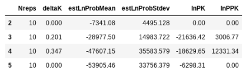
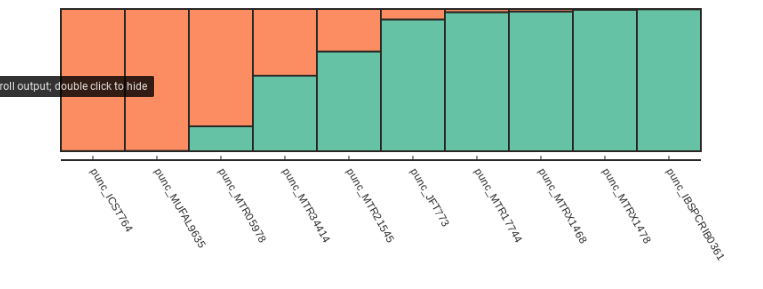

# The ipyrad.analysis module: Parallelized *STRUCTURE* analyses on unlinked SNPs

As part of the `ipyrad.analysis` toolkit we've created convenience functions for easily distributing **STRUCTURE** analysis jobs on an HPC cluster, and for doing so in a programmatic and reproducible way. Importantly, *our workflow allows you to easily sample different distributions of unlinked SNPs among replicate analyses*, with the final inferred population structure summarized from a distribution of replicates. We also provide some simple examples of interactive plotting functions to make barplots. 

### Why STRUCTURE?
Although there are many newer and faster implementations of STRUCTURE, such as `faststructure` or `admixture`, the original STRUCTURE works much better with missing data, which is of course a common feature of RAD-seq data sets. 

# **STRUCTURE** Analyses

## Configure HPC environment for ipyparallel ***(THIS IS VERY IMPORTANT)***
In this tutorial we will be using a python package for parallel computation called `ipyparallel`. The USP cluster does not have a GUI, as is typical of cluster systems. Unfortunately ipyparallel and this particular GUI-less environment have a hard time interacting (for complicated reasons). We have derived a workaround that allows the parallelization to function. You should execute the following commands **in a terminal on the USP cluster before doing anything else**.
```
$ echo "# Prevent ipyparallel engines from dying in a headless environment" >> ~/.bashrc
$ echo "export QT_QPA_PLATFORM=offscreen" >> ~/.bashrc
$ source ~/.bashrc
$ env | grep QT
```
```
    QT_QPA_PLATFORM=offscreen
```    

> **Note:** Don't worry if this seems like black magic, because ***IT IS!*** ;p

First, begin by creating a new notebook inside your `/home/<username>/ipyrad-workshop/` directory called `anolis-structure.ipynb` (refer to the [jupyter notebook configuration page](Jupyter_Notebook_Setup.md) for a refresher on connecting to the notebook server). **The rest of the materials in this part of the workshop assume you are running all code in cells of a jupyter notebook** that is running on the USP cluster.

* [Parallel cluster setup](#parallel-cluster-setup)
* [Quick guide (tl;dr)](#quick-guide-(tl;dr))

## Required software
You can easily install the required software for this notebook using `conda`. This can even be accomplished inside your jupyter notebook. Preceding a command with `!` will tell the notebook to run the line as a terminal command, instead of as python.

```
## The `-y` here means "Answer yes to all questions". It prevents
## conda from asking whether the install looks ok.

!conda install -y -c ipyrad structure clumpp
```
    Solving environment: done
    ## Package Plan ##
    ...
    ...
    Preparing transaction: done
    Verifying transaction: done
    Executing transaction: done

> **Note:** You only have to run this conda install command once on the cluster. It does not need to be run every time you run a notebook or every time you create a new notebook. Once the install finishes STRUCTURE and CLUMPP will be available for all your notebooks.

### Import Python libraries

```python
## ipyrad analysis toolkit
import ipyrad.analysis as ipa

## parallel processing
import ipyparallel as ipp

## plotting library
import toyplot                     
```

## Parallel cluster setup
Normally, Jupyter notebook processes run on just one core. If we want to run multiple iterations of an algorithm then we would have to run them one at a time, and this is tedious and time consuming. Fortunately, Jupyter notebook servers have a built in parallelization engine (`ipcluster`), which is really easy to use.

A very easy way to start the `ipcluster` parallelization backend is to go to your Jupyter dashboard, choose the `IPython Clusters` tab, choose the number of "engines" (the number of independent processes), and click `Start`. 


Now you have 4 mighty cores to process your jobs instead of just 1!


How do we interact with or `ipcluster`? Lets just get some information from it first:
```python
## get parallel client
ipyclient = ipp.Client()
print("Connected to {} cores".format(len(ipyclient)))
```
    Connected to 4 cores
> **Note:** The `format()` function takes arguments and "formats" them properly for insertion into a string. In this case it takes the Integer value of `len(ipyclient)` (the count of the number of engines) and substitutes this in place of `{}` in the output.

## Quick guide (tl;dr)
The following cell shows the quickest way to results. Detailed explanations of all of the features and options are provided further below. 

```python
## set N values of K to test across
kvalues = [2, 3, 4]

## init an analysis object
struct = ipa.structure(
    name="anolis-quick",
    workdir="./anolis-structure",
    data="./anolis_outfiles/anolis.ustr",
    )

## set main params (use much larger values in a real analysis)
struct.mainparams.burnin = 1000
struct.mainparams.numreps = 5000

## submit 5 replicates of each K value to run on parallel client
for kpop in kvalues:
    struct.run(kpop=kpop, nreps=5, ipyclient=ipyclient)

## wait for parallel jobs to finish
ipyclient.wait()
```
    submitted 5 structure jobs [quick-K-2]
    submitted 5 structure jobs [quick-K-3]
    submitted 5 structure jobs [quick-K-4]

    True

```python
## return the evanno table (deltaK) for best K 
etable = struct.get_evanno_table(kvalues)
etable
```


```python
## get admixture proportion tables avgeraged across reps
tables = struct.get_clumpp_table(kvalues, quiet=True)
```

```python
## plot bars for a k-test in tables w/ hover labels
table = tables[3].sort_values(by=[0, 1, 2])

toyplot.bars(
    table,
    width=500, 
    height=200,
    title=[[i] for i in table.index.tolist()],
    xshow=False,
);
```


## Full guide

### Enter input and output file locations
The `.str` file is a STRUCTURE formatted file output by ipyrad. It includes all SNPs present in the data set. The `.snps.map` file is an optional file that maps which locus each SNP is from. If this file is used then each replicate analysis will *randomly* sample a single SNP from each locus in reach rep. The results from many reps therefore will represent variation across unlinked SNP data sets, as well as variation caused by uncertainty. The `.ustr` file that was used in the tl;dr analysis represents just one sample of unlinked snps, so it's good for quick and dirty analysis, but it doesn't fully capture uncertainty in the data. The `workdir` is the location where you want output files to be written and will be created if it does not already exist. 

```python
## the structure formatted file
strfile = "./anolis_outfiles/anolis.str"

## an optional mapfile, to sample unlinked SNPs
mapfile = "./anolis_outfiles/anolis.snps.map"

## the directory where outfiles should be written
workdir = "./anolis-structure/"
```
> **Note:** The .str/.map file combination is more robust and more fully captures the variation in the data. The .ustr file is one sample of unlinked snps that's useful for basic exploratory analysis.

### Create a *STRUCTURE* Class object
STRUCTURE is kind of an old fashioned program that requires creating quite a few input files to run, which makes it not very convenient to use in a programmatic and reproducible way. To work around this the `ipyrad.analysis.structure` module introduces a convenience wrapper object to make it easy to submit STRUCTURE jobs and to summarize their results. 

```python
## create a Structure object
struct = ipa.structure(name="anolis-test",
                       data=strfile, 
                       mapfile=mapfile,
                       workdir=workdir)
```

### Set parameter options for this object
The STRUCTURE object will be used to submit jobs to the ipyparallel cluster. It has associated with it a name, a set of input files, and a large number of parameter settings. You can modify the parameters by setting them like below. You can also use tab-completion to see all of the available options, or print them like below. See the [full STRUCTURE docs here](https://www.google.com/url?sa=t&rct=j&q=&esrc=s&source=web&cd=3&ved=0ahUKEwjt9tjpkszYAhWineAKHZ4-BxAQFgg4MAI&url=https%3A%2F%2Fwww.researchgate.net%2Ffile.PostFileLoader.html%3Fid%3D591c636cdc332d78a46a1948%26assetKey%3DAS%253A495017111953409%25401495032684846&usg=AOvVaw0WjG0uD0MXrs5ResMIHnik) for further details on the function of each parameter. In support of *reproducibility*, it's good practice to print both the mainparams and extraparams so it's clear which options you used.

```python
## set mainparams for object
struct.mainparams.burnin = 10000
struct.mainparams.numreps = 100000

## see all mainparams
print struct.mainparams

## see or set extraparams
print struct.extraparams
```

    burnin             10000               
    extracols          0                   
    label              1                   
    locdata            0                   
    mapdistances       0                   
    markernames        0                   
    markovphase        0                   
    missing            -9                  
    notambiguous       -999                
    numreps            100000              
    onerowperind       0                   
    phased             0                   
    phaseinfo          0                   
    phenotype          0                   
    ploidy             2                   
    popdata            0                   
    popflag            0                   
    recessivealleles   0                   
    
    admburnin           500                 
    alpha               1.0                 
    alphamax            10.0                
    alphapriora         1.0                 
    alphapriorb         2.0                 
    alphapropsd         0.025               
    ancestdist          0                   
    ancestpint          0.9                 
    computeprob         1                   
    echodata            0                   
    fpriormean          0.01                
    fpriorsd            0.05                
    freqscorr           1                   
    gensback            2                   
    inferalpha          1                   
    inferlambda         0                   
    intermedsave        0                   
    lambda_             1.0                 
    linkage             0                   
    locispop            0                   
    locprior            0                   
    locpriorinit        1.0                 
    log10rmax           1.0                 
    log10rmin           -4.0                
    log10rpropsd        0.1                 
    log10rstart         -2.0                
    maxlocprior         20.0                
    metrofreq           10                  
    migrprior           0.01                
    noadmix             0                   
    numboxes            1000                
    onefst              0                   
    pfrompopflagonly    0                   
    popalphas           0                   
    popspecificlambda   0                   
    printlambda         1                   
    printlikes          0                   
    printnet            1                   
    printqhat           0                   
    printqsum           1                   
    randomize           0                   
    reporthitrate       0                   
    seed                12345               
    sitebysite          0                   
    startatpopinfo      0                   
    unifprioralpha      1                   
    updatefreq          10000               
    usepopinfo          0                   
> **Note:** Don't worry about trying to understand all of these parameters at this time. The defaults are sensible. But do notice that the `burnin` and `numreps` here are still well below the values you'd use in real analysis.

### Submit many jobs to run in parallel
The function `run()` distributes jobs to run on the cluster via the `ipyparallel` backend. It takes a number of arguments. The first, `kpop`, is the number of populations. The second, `nreps`, is the number of replicated runs to perform. Each rep has a different random seed, and if you entered a mapfile for your STRUCTURE object then it will subsample unlinked SNPs independently in each replicate. The `seed` argument can be used to make the replicate analyses reproducible (i.e. a STRUCTURE run using the same SNPs and started with the same seed will always produce the same results). The `extraparams.seed` parameter will be generated from this for each replicate. And finally, provide it the `ipyclient` object that we created above. The STRUCTURE object will store an *asynchronous results object* for each job that is submitted so that we can query whether the jobs are finished. Using a simple for-loop we'll submit 20 replicate jobs to run at three different values of K. 

```python
## a range of K-values to test
kvalues = [2, 3, 4]

## submit batches of 10 replicate jobs for each value of K 
for kpop in kvalues:
    struct.run(
        kpop=kpop, 
        nreps=10, 
        seed=12345,
        ipyclient=ipyclient,
        )
```
    submitted 10 structure jobs [structure-test-K-2]
    submitted 10 structure jobs [structure-test-K-3]
    submitted 10 structure jobs [structure-test-K-4]

> **Note** This step may take some time...

### Track progress until finished
You can check for finished results by using the `get_clumpp_table()` function, which tries to summarize the finished results files. If no results are ready it will simply print a warning message telling you to wait. A more straightforward way to monitor progress is to just ask the jobs whether they are finished yet. The list of jobs for a STRUCTURE analysis are retained in the `asysncs` list, which can be examined like so:

```python
## see submitted jobs (we query first 5 here)
struct.asyncs[:5]
```
    [<AsyncResult: _call_structure>,
     <AsyncResult: _call_structure>,
     <AsyncResult: _call_structure>,
     <AsyncResult: _call_structure>,
     <AsyncResult: _call_structure>]

Now we can ask one of the jobs whether it's done yet:
```python
## check if a specific job is done
struct.asyncs[0].ready()
```
    False

You can run this over and over again until this job returns `True`, but this is tedious. Simpler is to block/wait until all jobs are finished by using the `wait()` function of the ipyclient object:
```python
## block/wait until all jobs finished
ipyclient.wait() 
```

### Summarize replicates with CLUMPP
We ran 10 replicates per K-value hypothesis. We now need to concatenate and purmute those results so they can be summarized. For this we use the software CLUMPP. The default arguments to CLUMPP are generally good, but if you're running a dataset with high numbers of K, you may want to modify the 'greedy_option', for example. However, we don't need to do this with the dataset for this workshop. You can modify the parameters in the same as the STRUCTURE params, by accessing the `.clumppparams` attribute of your STRUCTURE object. See the [CLUMPP documentation](https://web.stanford.edu/group/rosenberglab/software/CLUMPP_Manual.pdf) for more details. Below we run CLUMPP for each value of K that we ran STRUCTURE on. You only need to tell the `get_clumpp_table()` function the value of K and it will find all of the result files given the STRUCTURE object's `name` and `workdir`.

```python
## set some clumpp params and print params to the screen
struct.clumppparams.repeats = 10000
struct.clumppparams
```
    datatype                  0                   
    every_permfile            0                   
    greedy_option             2                   
    indfile                   0                   
    m                         3                   
    miscfile                  0                   
    order_by_run              1                   
    outfile                   0                   
    override_warnings         0                   
    permfile                  0                   
    permutationsfile          0                   
    permuted_datafile         0                   
    popfile                   0                   
    print_every_perm          0                   
    print_permuted_data       0                   
    print_random_inputorder   0                   
    random_inputorderfile     0                   
    repeats                   10000               
    s                         2                   
    w                         1                   

```python
## run clumpp for each value of K
tables = struct.get_clumpp_table(kvalues)
```
    [K3] 10/10 results permuted across replicates (max_var=0).
    [K4] 10/10 results permuted across replicates (max_var=0).
    [K5] 10/10 results permuted across replicates (max_var=0).

```python
## return the evanno table w/ deltaK
struct.get_evanno_table(kvalues)
```


### Sort the table order how you like it
This can be useful if, for example, you want to order the names to be in the same order as tips on your phylogeny. 

```python
## custom sorting order
myorder = [
    "punc_ICST764",
    "punc_MUFAL9635",
    "punc_IBSPCRIB0361",
    "punc_JFT773",
    "punc_MTR05978",
    "punc_MTR17744",
    "punc_MTR21545",
    "punc_MTR34414",
    "punc_MTRX1468",
    "punc_MTRX1478"
]
```
We can then extract the results for any give K value with the samples in the order that we want them. Here we inspect the ancestry components for K=3.
```
print("custom ordering")
print(tables[3].loc[myorder])
```
    custom ordering
                           0          1      2
    punc_ICST764       0.102  8.000e-04  0.897
    punc_MUFAL9635     0.139  1.000e-03  0.860
    punc_IBSPCRIB0361  0.021  9.774e-01  0.001
    punc_JFT773        0.132  8.340e-01  0.034
    punc_MTR05978      0.844  5.980e-02  0.097
    punc_MTR17744      0.115  8.566e-01  0.029
    punc_MTR21545      0.267  5.963e-01  0.137
    punc_MTR34414      0.394  4.582e-01  0.148
    punc_MTRX1468      0.028  9.590e-01  0.013
    punc_MTRX1478      0.044  9.532e-01  0.002
> **Note:** The `.loc[]` notation specifies to fetch from the table by row.

### Visualize population STRUCTURE in barplots 

```python
for kpop in kvalues:
    ## parse outfile to a table and re-order it
    table = tables[kpop]
    table = table.ix[myorder]
    
    ## plot barplot w/ hover
    canvas, axes, mark = toyplot.bars(
                            table,
                            width=400,
                            height=200,
                            style={"stroke": toyplot.color.near_black},
                            )
```


### Make a slightly fancier plot and save to file

Lets define a function to make the fancy plot, so we can call the function multiple times easily. The `def` keyword indicates that we are "defining" a python function.
```python
def fancy_plot(table):
    ## further styling of plot with css 
    style = {"stroke":toyplot.color.near_black, 
         "stroke-width": 2}

    ## build barplot
    canvas = toyplot.Canvas(width=800, height=400)
    axes = canvas.cartesian(bounds=("5%", "95%", "5%", "45%"))
    axes.bars(table, style=style)

    ## add names to x-axis
    ticklabels = [i for i in table.index.tolist()]
    axes.x.ticks.locator = toyplot.locator.Explicit(labels=ticklabels)
    axes.x.ticks.labels.angle = -60
    axes.x.ticks.show = True
    axes.x.ticks.labels.offset = 10
    axes.x.ticks.labels.style = {"font-size": "12px"}
    axes.x.spine.style = style
    axes.y.show = False
    
    import toyplot.svg
    import toyplot.pdf
    toyplot.svg.render(canvas, "anolis-struct.svg")
    toyplot.pdf.render(canvas, "anolis-struct.pdf")

    ## show in notebook
    return canvas
```

Now we can call our `fancy_plot()` function using the sample order we defined earlier and K=2.

```python
## save plots for your favorite value of K
table = struct.get_clumpp_table(kvalues=2)
table = table.loc[myorder]
fancy_plot(table)
```
    [K2] 10/10 results permuted across replicates (max_var=0).


Alternatively if we want to just sort by increasing values of ancestry components we can use the `sort_values()` function, which is illustrated below:

```
table = struct.get_clumpp_table(kpop=2)
table = table.sort_values(by=[0, 1])
fancy_plot(table)
```


### Testing for convergence
The `.get_evanno_table()` and `.get_clumpp_table()` functions each take an optional argument called `max_var_multiple`, which is the max multiple by which you'll allow the variance in a 'replicate' run to exceed the minimum variance among replicates for a specific test. In the example below you can see that many reps were excluded for the higher values of K, such that fewer reps were analyzed for the final results. By excluding the reps that had much higher variance than other (one criterion for asking if they converged) this can increase the support for higher K values. If you apply this method take care to think about what it is doing and how to interpret the K values. Also take care to consider whether your replicates are using the same input SNP data but just different random seeds, or if you used a `map` file, in which case your replicates represent different sampled SNPs and different random seeds. I'm of the mind that there is no true K value, and sampling across a distribution of SNPs across many replicates gives you a better idea of the variance in population structure in your data. 

```python
struct.get_evanno_table([3, 4, 5, 6], max_var_multiple=50.)
```

    [K3] 4 reps excluded (not converged) see 'max_var_multiple'.
    [K4] 11 reps excluded (not converged) see 'max_var_multiple'.
    [K5] 1 reps excluded (not converged) see 'max_var_multiple'.
    [K6] 17 reps excluded (not converged) see 'max_var_multiple'.
