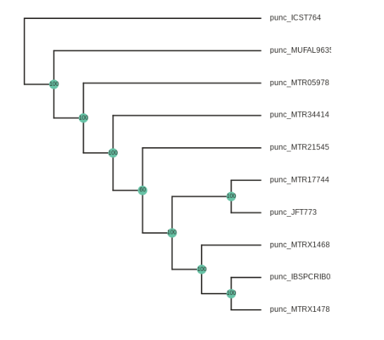

## The ipyrad.analysis module: RAxML

As part of the `ipyrad.analysis` toolkit we've created convenience functions for easily running common [**RAxML**](https://sco.h-its.org/exelixis/web/software/raxml/index.html) commands. This can be useful when you want to run all of your analyes in a clean stream-lined way in a jupyter notebook to create a completely reproducible study. 

### Install software
There are many ways to install raxml, the simplest of which is to use conda. This will install several raxml binaries into your conda path. Open an ssh session on the cluster and run the following command:

```
$ conda install raxml -c bioconda
```
# **RAxML** Phylogenetic Inference

Create a new notebook inside your `/home/<username>/ipyrad-workshop/` directory called `anolis-raxml.ipynb` (refer to the [jupyter notebook configuration page](Jupyter_Notebook_Setup.md) for a refresher on connecting to the notebook server). The rest of the materials in this part of the workshop assume you are running all code in cells of a jupyter notebook that is running on the USP cluster.

## Create a raxml Class object
First, copy and paste the usual imports into a new cell and run it:
```python
import ipyrad.analysis as ipa
import toyplot
import toytree
```

Now create a raxml object. The only required argument to initialize the object is a phylip formatted sequence file. In this example we provide a name and working directory as well:

```python
rax = ipa.raxml(
    data="./anolis_outfiles/anolis.phy",
    name="aligntest", 
    workdir="./analysis-raxml",
    );
```

### Additional options
RAxML has a **ton** of parameters for modifying how it behaves, and we will only explore just a fraction of these. You can also specify many of these parameters by setting values in the params dictionary of your raxml object. In the following cell we modify the number of runs on distinct starting trees (`params.N`), the number of threads to use (`params.T`), and the outgroup samples (`params.o`). 

```python
## Number of runs
rax.params.N = 10

## Number of threads
rax.params.T = 2

## Set the outgroup. Because we don't have an outgroup for Anolis we use None.
rax.params.o = None 

## Alternatively, if we had an outgroup we could specify this with sample names
## Here we could specify the Northern samples as the outgroup, this is just for illustration
## rax.params.o = ['punc_ICST764', 'punc_MUFAL9635']
```

### Print the command string 
It is good practice to always print the command string so that you know exactly what was called for you analysis and it is documented. 

```python
print(rax.command)
```
    raxmlHPC-PTHREADS-SSE3 -f a -T 2 -m GTRGAMMA -N 10 -x 12345 -p 54321 -n aligntest -w /home/isaac/ipyrad-workshop/ipyrad-workshop/analysis-raxml -s /home/isaac/ipyrad-workshop/ipyrad-workshop/anolis_outfiles/anolis.phy

### Run the job
This will start the job running. The subsampled dataset we are using should run very quickly (~1-2 minutes).

```python
rax.run(force=True)
```
    job aligntest finished successfully

### Access results
One of the reasons it is so convenient to run your raxml jobs this way is that the results files are easily accessible from your raxml objects. 

```python
rax.trees
```
    bestTree                   ~/ipyrad-workshop/analysis-raxml/RAxML_bestTree.aligntest
    bipartitions               ~/ipyrad-workshop/analysis-raxml/RAxML_bipartitions.aligntest
    bipartitionsBranchLabels   ~/ipyrad-workshop/analysis-raxml/RAxML_bipartitionsBranchLabels.aligntest
    bootstrap                  ~/ipyrad-workshop/analysis-raxml/RAxML_bootstrap.aligntest
    info                       ~/ipyrad-workshop/analysis-raxml/RAxML_info.aligntest

**TODO:** Could use more info on what all these different results files mean.

### Plot the results
Here we use toytree to plot the bootstrap results. 

```python
tre = toytree.tree(rax.trees.bipartitions)
tre.draw(
    height=300,
    width=800,
    node_labels=tre.get_node_values("support"),
);
```


### Rooting the tree
Now lets say we want to root the tree and replot. This is accomplished by adding the `root` parameter to the `tree.draw()` function. We'll just choose a random sample to root the tree here:
```
tre = toytree.tree(rax.trees.bipartitions)
tre.draw(
    tre.root(["punc_ICST764"]),
    width=600,
    node_labels=tre.get_node_values("support"),
);
```


> **Note:** The `root()` function accepts a list of samples, so if you have multiple samples from the root taxon, you can include them like this: `tre.root(["punc_ICST764", "punc_MUFAL9635", "punc_MTR05978"])`

### Experimenting with the simulated data
Tree rooting can also be accomplished with the `wildcard` parameter of the `tree.root()` function. This is somewhat more straightforward to demonstrate with the simulated data, so we can create a new `raxml` object with the simulated phylip file, rerun the RAxML tree inference, and then do some plotting:
```
rax = ipa.raxml(
    data="/scratch/af-biota/simulated-example/simrad_outfiles/simrad.phy",
    name="aligntest", 
    workdir="./analysis-raxml",
    );

rax.params.N = 10
rax.params.T = 2
rax.params.o = None 

rax.run(force=True)
```
Here the `wildcard="3"` argument specifies to root the tree using all the samples that include "3" in their names.
```
tre = toytree.tree(rax.trees.bipartitions)
tre.draw(
    tre.root(wildcard="3"),
    width=600,
    node_labels=tre.get_node_values("support"),
);
```


### Further exploration

We provide a more thorough exploration of the `ipyrad.analysis.raxml` module in a notebook on the [ipyrad github site](https://github.com/dereneaton/ipyrad/blob/master/tests/cookbook-raxml-pedicularis.ipynb), including more details about how to take full advantage of running parallel RAxML processes on a cluster.
