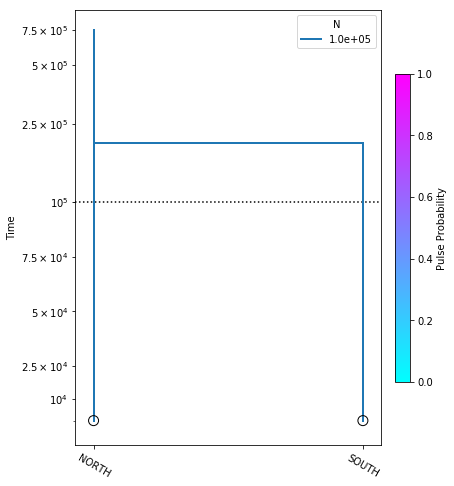
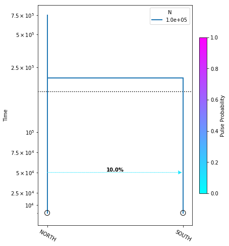
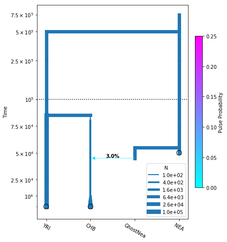
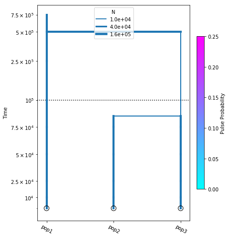
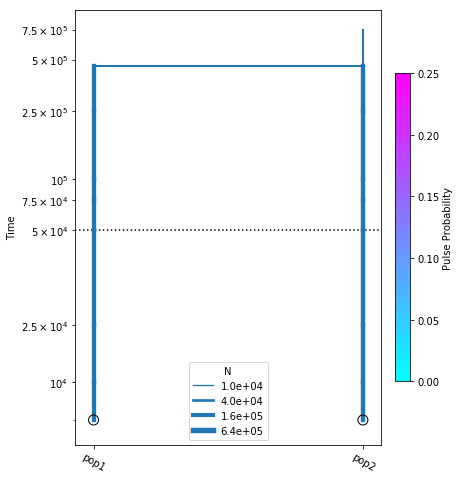
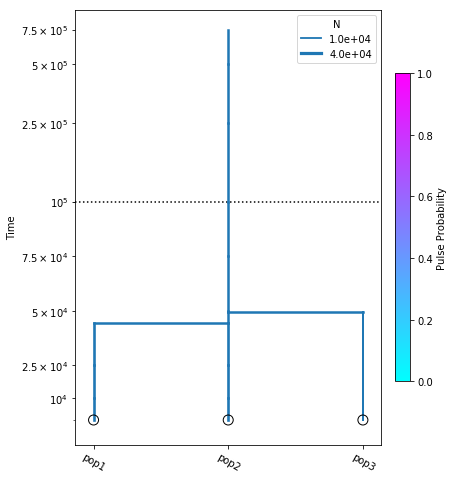
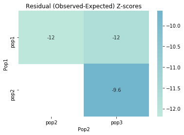

# Demographic inference using the Site Frequency Spectrum (SFS) with **momi2**

**TODO:** Put a bunch of explanatory information here.
### What is demographic inference?
### What is the SFS?
### What are some other familiar programs that use the SFS?
### How is momi2 different? And why are we using it? Most importantly, how do you pronounce it?

**Pronunciation:** Care of Jonathan Terhorst (somewhat cryptically), from a [github issue I created to resolve this conundrum](https://github.com/popgenmethods/momi2/issues/6): "How do you pronounce ∂a∂i? ;-)"

## momi2 installation
`momi2` requires python3, which is a different version of python we've been using up to now. Fortunately conda makes it easy to run python2 and python3 side by side. We will install python3 in a separate [conda environment](https://conda.io/docs/user-guide/concepts.html#conda-environments), and then install and run momi2 analyses using this environment. A conda environment is a container for python packages and configurations. More on creating/managing [conda environments](https://conda.io/docs/user-guide/tasks/manage-environments.html).

**TODO:** Would be nice to have a simple figure illustrating conda environments here.

Begin by opening an ssh session on the cluster and creating our new environment:
```
## -n          assigns a name to the environment
## python=3.6  specifies the python version of the new environment
$ conda create -n momi-py36 python=3.6
```
After the install finishes you can inspect the currently available environments:
```
$ conda env list
# conda environments:
#
base                  *  /home/isaac/miniconda2
momi-py36                /home/isaac/miniconda2/envs/momi-py36
```
And now switch to the new python3 environment:
```
$ source activate momi-py36
(momi-py36) <username>@darwin:~$ 
```
> **Note:** You'll notice that the conda env you are currently using is now displayed as part of your prompt. We will maintain this convention for the rest of this notebook.

Now use `conda` to install momi and jupyter. All the `-c` arguments again are specifying
channels that momi pulls dependencies from. Order matters here, so copy and paste this
command to your terminal.
```
(momi-py36)$ conda install momi jupyter -c defaults -c conda-forge -c bioconda -c jackkamm
```
This will produce copious output, and should take ~5-10 minutes. 
Finally, submit an interactive job to the cluster, and start the 
notebook server in the same way as before.
```
(momi-py36)$ qsub -q proto -l nodes=1:ppn=2 -l mem=64gb -I
qsub: waiting for job 24824.darwin to start
qsub: job 24824.darwin ready
(momi-py36)$ jupyter notebook &
```

Now when you open a browser on your local machine and connect to 
`localhost:<my_port_#>` the familiar notebook server file browser 
interface will show up, but this time when you choose "New" you'll 
see an option to create a python3 notebook!


# **momi2** Analyses
Create a new notebook inside your `/home/<username>/ipyrad-workshop/` 
directory called `anolis-momi2.ipynb` (refer to the [jupyter notebook configuration page](Jupyter_Notebook_Setup.md) for a refresher on connecting to the notebook server). **The rest of the 
materials in this part of the workshop assume you are running all code 
in cells of a jupyter notebook** that is running on the USP cluster.

* [Constructing and plotting a simple model](#constructing-and-plotting-a-simple-model)
* [Preparing real data for analysis](#preparing-real-data-for-analysis)
* [Inference procedure](#inference-procedure)
* [Bootstrapping confidence intervals](#bootstrapping-confidence-intervals)

## Constructing and plotting a simple model
One of the real strengths of momi2 is the ability not only to construct a
demographic history for a set of populations, but also to plot the model
to verify that it corresponds to what you expect!

Begin with the usual import statements, except this time we also add `logging`,
which allows momi to write progress to a log file. This can be useful for
debugging, so we encourage this practice.

```python
%matplotlib inline
import momi
import logging

logging.basicConfig(level=logging.INFO,
                    filename="momi_log.txt")
```

A demographic model is composed of leaf nodes, migration events, 
and size change events. We start with the simplest possible 2 
population model, with no migration, and no size changes. For the 
sake of demonstrating model construction we choose arbitrary 
values for `N_e` (the diploid effective size), and `t` (the time
at which all lineages move from the "South" population to the
"North" population). 
```
model = momi.DemographicModel(N_e=1e5)
model.add_leaf("NORTH")
model.add_leaf("SOUTH")
model.move_lineages("SOUTH", "NORTH", t=2e5)
```
> **Note:** The default migration fraction of the `DemographicModel.move_lineages()` function is 100%, so if we do not specify this value then when we call `move_lineages` momi assumes we want to move **all** lineages from the source to the destination. Later we will see how to manipulate the migration fraction to only move some portion of lineages.

Executing this cell produces no output, but that's okay, we are just specifying the model. Also, be aware that the names assigned to leaf nodes have no specific meaning to momi2, so these names should be selected to have specific meaning to your target system. Here "NORTH" and "SOUTH" are simply stand-ins for some hypothetical populations. Now that we have this simple demographic model parameterized we can plot it, to see how it looks.

```
yticks = [1e4, 2.5e4, 5e4, 7.5e4, 1e5, 2.5e5, 5e5, 7.5e5]

fig = momi.DemographyPlot(
    model, 
    ["NORTH", "SOUTH"],
    figsize=(6,8),
    major_yticks=yticks,
    linthreshy=1e5)
```


There's a little bit going on here, but we'll walk you through it:
* `yticks` - This is a list of elements specifying the timepoints to highlight on the y-axis of the figure.

The first two arguments to `momi.DemographyPlot()` are required, namely the model to plot, and the populations of the model to include. The next three arguments are optional, but useful:
* `figsize` - Specify the output figure size as (width, height) in inches.
* `major_yticks` - Tells the momi plotting routine to use the time demarcations we specified in thie `yticks` variable.
* `linthreshy` - The time point at which to switch from linear to log-scale, backwards in time. This is really useful if you have many "interesting" events happening relatively recently, and you don't want them to get "smooshed" together by the depth of the older events. This will become clearer as we add migration events later in the tutorial.
**Experiment:** Try changing the value of `linthreshy` and replotting. Try `1e4` and `1.5e5` and notice how the figure changes. You can also experiment with changing the values in the `yticks` list. 

Let's create a new model and introduce one migration event that only moves some fraction of lineages, and not the totality of them:
```
model = momi.DemographicModel(N_e=1e5)

model.add_leaf("NORTH")
model.add_leaf("SOUTH")
model.move_lineages("SOUTH", "NORTH", p=0.1, t=5e4)
model.move_lineages("SOUTH", "NORTH", t=2e5)

yticks = [1e4, 2.5e4, 5e4, 7.5e4, 1e5, 2.5e5, 5e5, 7.5e5]

fig = momi.DemographyPlot(
    model, ["NORTH", "SOUTH"],
    figsize=(6,8),
    major_yticks=yticks,
    linthreshy=1.5e5)
```


This is almost the exact same model as above, except now we have introduce the `move_lineages` call which inclues the `p=0.1` argument. This indicates that we wish to move 10% of lineages from  the "SOUTH" population to the "NORTH" population at the specified timepoint.
> **Note:** It may seem odd that the arrow in this figure points from "NORTH" to "SOUTH", but this is simply because we are operating in a coalescent framework and therefore the `move_lineages` function operates **backwards in time**.

## Preparing real data for analysis
## Inference procedure
## Bootstrapping confidence intervals


# Constructing a (complex) model


```python
model = momi.DemographicModel(N_e=1.2e4, gen_time=29,
                              muts_per_gen=1.25e-8)
# add YRI leaf at t=0 with size N=1e5
model.add_leaf("YRI", N=1e5)
# add  CHB leaf at t=0, N=1e5, growing at rate 5e-4 per unit time (year)
model.add_leaf("CHB", N=1e5, g=5e-4)
# add NEA leaf at 50kya and default N
model.add_leaf("NEA", t=5e4)

# stop CHB growth at 10kya
model.set_size("CHB", g=0, t=1e4)

# at 45kya CHB receive a 3% pulse from GhostNea
model.move_lineages("CHB", "GhostNea", t=4.5e4, p=.03)
# at 55kya GhostNea joins onto NEA
model.move_lineages("GhostNea", "NEA", t=5.5e4)

# at 80 kya CHB goes thru bottleneck
model.set_size("CHB", N=100, t=8e4)
# at 85 kya CHB joins onto YRI; YRI is set to size N=1.2e4
model.move_lineages("CHB", "YRI", t=8.5e4, N=1.2e4)

# at 500 kya YRI joins onto NEA
model.move_lineages("YRI", "NEA", t=5e5)

```

# Plot the model


```python
%matplotlib inline

yticks = [1e4, 2.5e4, 5e4, 7.5e4, 1e5, 2.5e5, 5e5, 7.5e5]

fig = momi.DemographyPlot(
    model, ["YRI", "CHB", "GhostNea", "NEA"],
    figsize=(6,8),
    major_yticks=yticks,
    linthreshy=1e5, pulse_color_bounds=(0,.25))
```





# Simulate under the model we just created


```python
recoms_per_gen = 1.25e-8
bases_per_locus = int(5e4)
n_loci = 20
ploidy = 2

# n_alleles per population (n_individuals = n_alleles / ploidy)
sampled_n_dict = {"NEA":2, "YRI":4, "CHB":4}

# create data directory if it doesn't exist
!mkdir -p tutorial_datasets/

# simulate 20 "chromosomes", saving each in a separate vcf file
for chrom in range(1, n_loci+1):
      model.simulate_vcf(
            f"tutorial_datasets/{chrom}",
            recoms_per_gen=recoms_per_gen,
            length=bases_per_locus,
            chrom_name=f"chr{chrom}",
            ploidy=ploidy,
            random_seed=1234+chrom,
            sampled_n_dict=sampled_n_dict,
            force=True)

```


```python
## Look at what we simulated
!ls tutorial_datasets/
```

    10.bed	       14.bed	      18.bed	     2.bed	   6.bed
    10.vcf.gz      14.vcf.gz      18.vcf.gz      2.vcf.gz	   6.vcf.gz
    10.vcf.gz.tbi  14.vcf.gz.tbi  18.vcf.gz.tbi  2.vcf.gz.tbi  6.vcf.gz.tbi
    11.bed	       15.bed	      19.bed	     3.bed	   7.bed
    11.vcf.gz      15.vcf.gz      19.vcf.gz      3.vcf.gz	   7.vcf.gz
    11.vcf.gz.tbi  15.vcf.gz.tbi  19.vcf.gz.tbi  3.vcf.gz.tbi  7.vcf.gz.tbi
    12.bed	       16.bed	      1.bed	     4.bed	   8.bed
    12.vcf.gz      16.vcf.gz      1.vcf.gz	     4.vcf.gz	   8.vcf.gz
    12.vcf.gz.tbi  16.vcf.gz.tbi  1.vcf.gz.tbi   4.vcf.gz.tbi  8.vcf.gz.tbi
    13.bed	       17.bed	      20.bed	     5.bed	   9.bed
    13.vcf.gz      17.vcf.gz      20.vcf.gz      5.vcf.gz	   9.vcf.gz
    13.vcf.gz.tbi  17.vcf.gz.tbi  20.vcf.gz.tbi  5.vcf.gz.tbi  9.vcf.gz.tbi


# We need a file mapping samples to populations

These are diploid samples


```python
# a dict mapping samples to populations
ind2pop = {}
for pop, n in sampled_n_dict.items():
    for i in range(int(n / ploidy)):
        # in the vcf, samples are named like YRI_0, YRI_1, CHB_0, etc
        ind2pop["{}_{}".format(pop, i)] = pop

with open("tutorial_datasets/ind2pop.txt", "w") as f:
    for i, p in ind2pop.items():
        print(i, p, sep="\t", file=f)

!cat tutorial_datasets/ind2pop.txt
```

    NEA_0	NEA
    YRI_0	YRI
    YRI_1	YRI
    CHB_0	CHB
    CHB_1	CHB


```sh
%%sh
for chrom in `seq 1 20`;
do
    python -m momi.read_vcf \
           tutorial_datasets/$chrom.vcf.gz tutorial_datasets/ind2pop.txt \
           tutorial_datasets/$chrom.snpAlleleCounts.gz \
           --bed tutorial_datasets/$chrom.bed
done
```

    /home/isaac/miniconda3/lib/python3.6/site-packages/h5py/__init__.py:36: FutureWarning: Conversion of the second argument of issubdtype from `float` to `np.floating` is deprecated. In future, it will be treated as `np.float64 == np.dtype(float).type`.
      from ._conv import register_converters as _register_converters
    /home/isaac/miniconda3/lib/python3.6/site-packages/h5py/__init__.py:36: FutureWarning: Conversion of the second argument of issubdtype from `float` to `np.floating` is deprecated. In future, it will be treated as `np.float64 == np.dtype(float).type`.
      from ._conv import register_converters as _register_converters
    /home/isaac/miniconda3/lib/python3.6/site-packages/h5py/__init__.py:36: FutureWarning: Conversion of the second argument of issubdtype from `float` to `np.floating` is deprecated. In future, it will be treated as `np.float64 == np.dtype(float).type`.
      from ._conv import register_converters as _register_converters
    /home/isaac/miniconda3/lib/python3.6/site-packages/h5py/__init__.py:36: FutureWarning: Conversion of the second argument of issubdtype from `float` to `np.floating` is deprecated. In future, it will be treated as `np.float64 == np.dtype(float).type`.
      from ._conv import register_converters as _register_converters
    /home/isaac/miniconda3/lib/python3.6/site-packages/h5py/__init__.py:36: FutureWarning: Conversion of the second argument of issubdtype from `float` to `np.floating` is deprecated. In future, it will be treated as `np.float64 == np.dtype(float).type`.
      from ._conv import register_converters as _register_converters
    /home/isaac/miniconda3/lib/python3.6/site-packages/h5py/__init__.py:36: FutureWarning: Conversion of the second argument of issubdtype from `float` to `np.floating` is deprecated. In future, it will be treated as `np.float64 == np.dtype(float).type`.
      from ._conv import register_converters as _register_converters
    /home/isaac/miniconda3/lib/python3.6/site-packages/h5py/__init__.py:36: FutureWarning: Conversion of the second argument of issubdtype from `float` to `np.floating` is deprecated. In future, it will be treated as `np.float64 == np.dtype(float).type`.
      from ._conv import register_converters as _register_converters
    /home/isaac/miniconda3/lib/python3.6/site-packages/h5py/__init__.py:36: FutureWarning: Conversion of the second argument of issubdtype from `float` to `np.floating` is deprecated. In future, it will be treated as `np.float64 == np.dtype(float).type`.
      from ._conv import register_converters as _register_converters
    /home/isaac/miniconda3/lib/python3.6/site-packages/h5py/__init__.py:36: FutureWarning: Conversion of the second argument of issubdtype from `float` to `np.floating` is deprecated. In future, it will be treated as `np.float64 == np.dtype(float).type`.
      from ._conv import register_converters as _register_converters
    /home/isaac/miniconda3/lib/python3.6/site-packages/h5py/__init__.py:36: FutureWarning: Conversion of the second argument of issubdtype from `float` to `np.floating` is deprecated. In future, it will be treated as `np.float64 == np.dtype(float).type`.
      from ._conv import register_converters as _register_converters
    /home/isaac/miniconda3/lib/python3.6/site-packages/h5py/__init__.py:36: FutureWarning: Conversion of the second argument of issubdtype from `float` to `np.floating` is deprecated. In future, it will be treated as `np.float64 == np.dtype(float).type`.
      from ._conv import register_converters as _register_converters
    /home/isaac/miniconda3/lib/python3.6/site-packages/h5py/__init__.py:36: FutureWarning: Conversion of the second argument of issubdtype from `float` to `np.floating` is deprecated. In future, it will be treated as `np.float64 == np.dtype(float).type`.
      from ._conv import register_converters as _register_converters
    /home/isaac/miniconda3/lib/python3.6/site-packages/h5py/__init__.py:36: FutureWarning: Conversion of the second argument of issubdtype from `float` to `np.floating` is deprecated. In future, it will be treated as `np.float64 == np.dtype(float).type`.
      from ._conv import register_converters as _register_converters
    /home/isaac/miniconda3/lib/python3.6/site-packages/h5py/__init__.py:36: FutureWarning: Conversion of the second argument of issubdtype from `float` to `np.floating` is deprecated. In future, it will be treated as `np.float64 == np.dtype(float).type`.
      from ._conv import register_converters as _register_converters
    /home/isaac/miniconda3/lib/python3.6/site-packages/h5py/__init__.py:36: FutureWarning: Conversion of the second argument of issubdtype from `float` to `np.floating` is deprecated. In future, it will be treated as `np.float64 == np.dtype(float).type`.
      from ._conv import register_converters as _register_converters
    /home/isaac/miniconda3/lib/python3.6/site-packages/h5py/__init__.py:36: FutureWarning: Conversion of the second argument of issubdtype from `float` to `np.floating` is deprecated. In future, it will be treated as `np.float64 == np.dtype(float).type`.
      from ._conv import register_converters as _register_converters
    /home/isaac/miniconda3/lib/python3.6/site-packages/h5py/__init__.py:36: FutureWarning: Conversion of the second argument of issubdtype from `float` to `np.floating` is deprecated. In future, it will be treated as `np.float64 == np.dtype(float).type`.
      from ._conv import register_converters as _register_converters
    /home/isaac/miniconda3/lib/python3.6/site-packages/h5py/__init__.py:36: FutureWarning: Conversion of the second argument of issubdtype from `float` to `np.floating` is deprecated. In future, it will be treated as `np.float64 == np.dtype(float).type`.
      from ._conv import register_converters as _register_converters
    /home/isaac/miniconda3/lib/python3.6/site-packages/h5py/__init__.py:36: FutureWarning: Conversion of the second argument of issubdtype from `float` to `np.floating` is deprecated. In future, it will be treated as `np.float64 == np.dtype(float).type`.
      from ._conv import register_converters as _register_converters
    /home/isaac/miniconda3/lib/python3.6/site-packages/h5py/__init__.py:36: FutureWarning: Conversion of the second argument of issubdtype from `float` to `np.floating` is deprecated. In future, it will be treated as `np.float64 == np.dtype(float).type`.
      from ._conv import register_converters as _register_converters


# Construct the SFS from all the input vcfs


```python
!python -m momi.extract_sfs tutorial_datasets/sfs.gz 100 tutorial_datasets/*.snpAlleleCounts.gz
```

    /home/isaac/miniconda3/lib/python3.6/site-packages/h5py/__init__.py:36: FutureWarning: Conversion of the second argument of issubdtype from `float` to `np.floating` is deprecated. In future, it will be treated as `np.float64 == np.dtype(float).type`.
      from ._conv import register_converters as _register_converters


# Inference

Grab a copy of the simple simulated data


```python
!cp ../rad.vcf .
!cp ../radpops.txt .
```


```python
## You have to bgzip and tabix the vcf file and create a bed file before read_vcf() will work
## python -m momi.read_vcf --no_aa --verbose rad.vcf.gz rad_example_barcodes.txt out.gz --bed rad.bed 

!bgzip rad.vcf
!tabix rad.vcf.gz
!echo "MT 1 2549974" > rad.bed
```


```python
## Now you can read the vcf
!python -m momi.read_vcf --no_aa --verbose rad.vcf.gz radpops.txt rad_allele_counts.gz --bed rad.bed
!ls -ltr
```

    /home/isaac/miniconda3/lib/python3.6/site-packages/h5py/__init__.py:36: FutureWarning: Conversion of the second argument of issubdtype from `float` to `np.floating` is deprecated. In future, it will be treated as `np.float64 == np.dtype(float).type`.
      from ._conv import register_converters as _register_converters
    total 88
    drwxrwxr-x 2 isaac isaac  4096 May 16 12:04 tutorial_datasets
    -rw-rw-r-- 1 isaac isaac 55982 May 16 12:16 rad.vcf.gz
    -rw-rw-r-- 1 isaac isaac  1379 May 16 12:16 rad.vcf.gz.tbi
    -rw-rw-r-- 1 isaac isaac    13 May 16 12:16 rad.bed
    -rw-rw-r-- 1 isaac isaac  2946 May 16 12:28 rad_sfs.gz
    -rw-rw-r-- 1 isaac isaac   110 May 16 12:29 radpops.txt
    -rw-rw-r-- 1 isaac isaac  8343 May 16 12:29 rad_allele_counts.gz


```python
# python -m momi.extract_sfs $OUTFILE $NBLOCKS $COUNTS
!python -m momi.extract_sfs rad_sfs.gz 100 rad_allele_counts.gz
!ls -ltr
```

    /home/isaac/miniconda3/lib/python3.6/site-packages/h5py/__init__.py:36: FutureWarning: Conversion of the second argument of issubdtype from `float` to `np.floating` is deprecated. In future, it will be treated as `np.float64 == np.dtype(float).type`.
      from ._conv import register_converters as _register_converters
    total 88
    drwxrwxr-x 2 isaac isaac  4096 May 16 12:04 tutorial_datasets
    -rw-rw-r-- 1 isaac isaac 55982 May 16 12:16 rad.vcf.gz
    -rw-rw-r-- 1 isaac isaac  1379 May 16 12:16 rad.vcf.gz.tbi
    -rw-rw-r-- 1 isaac isaac    13 May 16 12:16 rad.bed
    -rw-rw-r-- 1 isaac isaac   110 May 16 12:29 radpops.txt
    -rw-rw-r-- 1 isaac isaac  8343 May 16 12:29 rad_allele_counts.gz
    -rw-rw-r-- 1 isaac isaac  2949 May 16 12:29 rad_sfs.gz


```python
sfs = momi.Sfs.load("rad_sfs.gz")
print(sfs.avg_pairwise_hets[:5])
print(sfs.populations)
```

    [[3.13333333 1.96428571 2.75      ]
     [2.2        1.53571429 2.75      ]
     [2.26666667 2.60714286 2.42857143]
     [2.8        3.46428571 0.85714286]
     [4.         2.39285714 1.78571429]]
    ('pop1', 'pop2', 'pop3')


```python
%matplotlib inline
model = momi.DemographicModel(N_e=1.2e4, gen_time=29,
                              muts_per_gen=1.25e-8)
# add YRI leaf at t=0 with size N=1e5
model.add_leaf("pop1", N=1e5)
# add  CHB leaf at t=0, N=1e5, growing at rate 5e-4 per unit time (year)
model.add_leaf("pop2", N=1e5)
# add NEA leaf at 50kya and default N
model.add_leaf("pop3", N=1e5)

# at 85 kya CHB joins onto YRI; YRI is set to size N=1.2e4
model.move_lineages("pop2", "pop3", t=8.5e4, N=1.2e4)

# at 500 kya YRI joins onto NEA
model.move_lineages("pop3", "pop1", t=5e5)

yticks = [1e4, 2.5e4, 5e4, 7.5e4, 1e5, 2.5e5, 5e5, 7.5e5]

fig = momi.DemographyPlot(
    model, ["pop1", "pop2", "pop3"],
    figsize=(6,8),
    major_yticks=yticks,
    linthreshy=1e5, pulse_color_bounds=(0,.25))
```





```python
no_pulse_model = momi.DemographicModel(
    N_e=1.2e4, gen_time=1)
no_pulse_model.set_data(sfs)
no_pulse_model.add_size_param("n_pop1")
no_pulse_model.add_size_param("n_pop2")
no_pulse_model.add_time_param("t_pop1_pop2")
no_pulse_model.add_size_param("n_anc")

no_pulse_model.add_leaf("pop1", N="n_pop1")
no_pulse_model.add_leaf("pop2", N="n_pop2")
no_pulse_model.move_lineages("pop1", "pop2", t="t_pop1_pop2", N=2e4)

no_pulse_model.optimize(method="TNC")

```


                fun: 0.17751501140765719
                jac: array([-9.91080152e-06,  2.67621094e-07, -1.29058775e-09,  0.00000000e+00])
      kl_divergence: 0.17751501140765719
     log_likelihood: -2655.467732604657
            message: 'Converged (|f_n-f_(n-1)| ~= 0)'
               nfev: 39
                nit: 10
         parameters: ParamsDict({'n_pop1': 204561.67605896117, 'n_pop2': 220671.84276203267, 't_pop1_pop2': 461763.5262858849, 'n_anc': 13292.879644178945})
             status: 1
            success: True
                  x: array([1.22286248e+01, 1.23044320e+01, 4.61763526e+05, 9.49498381e+00])


```python
no_pulse_model.get_params()
```


    ParamsDict({'n_pop1': 204561.67605896117, 'n_pop2': 220671.84276203267, 't_pop1_pop2': 461763.5262858849, 'n_anc': 13292.879644178945})


```python
fig = momi.DemographyPlot(no_pulse_model, ["pop1", "pop2"],
                          figsize=(6,8), linthreshy=5e4,
                          major_yticks=yticks,
                          pulse_color_bounds=(0,.25))
```





```python
no_pulse_model.add_leaf("pop3")
no_pulse_model.add_time_param("t_anc")
no_pulse_model.move_lineages("pop3", "pop2", t="t_anc")

no_pulse_model.optimize()

fig = momi.DemographyPlot(
    no_pulse_model, ["pop1", "pop2", "pop3"],
    figsize=(6,8), linthreshy=1e5,
    major_yticks=yticks)

```





```python
print(no_pulse_model.get_params())
no_pulse_fit_stats = momi.SfsModelFitStats(no_pulse_model)
print(no_pulse_fit_stats)
no_pulse_fit_stats.expected.pattersons_d(A="pop1", B="pop2", C="pop3")
```

    ParamsDict({'n_pop1': 22376.432068547412, 'n_pop2': 22825.979849271956, 't_pop1_pop2': 44449.31415990158, 'n_anc': 13292.879644178945, 't_anc': 49342.12743617457})
    <momi.sfs_stats.SfsModelFitStats object at 0x7f27983e3390>


    -1.2238981294109822e-15


```python
no_pulse_fit_stats.all_f2()
```


<div>
<style scoped>
    .dataframe tbody tr th:only-of-type {
        vertical-align: middle;
    }

    .dataframe tbody tr th {
        vertical-align: top;
    }

    .dataframe thead th {
        text-align: right;
    }
</style>
<table border="1" class="dataframe">
  <thead>
    <tr style="text-align: right;">
      <th></th>
      <th>Pop1</th>
      <th>Pop2</th>
      <th>Expected</th>
      <th>Observed</th>
      <th>Z</th>
    </tr>
  </thead>
  <tbody>
    <tr>
      <th>0</th>
      <td>pop1</td>
      <td>pop2</td>
      <td>0.138569</td>
      <td>0.076026</td>
      <td>-12.189897</td>
    </tr>
    <tr>
      <th>1</th>
      <td>pop1</td>
      <td>pop3</td>
      <td>0.184409</td>
      <td>0.108118</td>
      <td>-11.697210</td>
    </tr>
    <tr>
      <th>2</th>
      <td>pop2</td>
      <td>pop3</td>
      <td>0.183527</td>
      <td>0.115069</td>
      <td>-9.647095</td>
    </tr>
  </tbody>
</table>
</div>




# Acknowledgements
We relied heavily on the excellent [momi2 documentation](http://momi2.readthedocs.io/en/latest/tutorial.html) during the creation of this tutorial.
