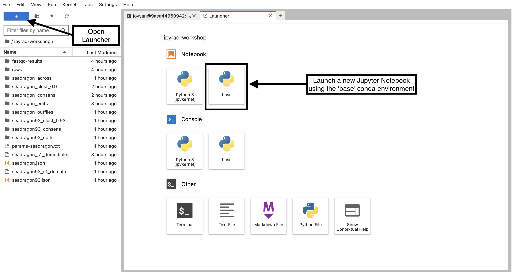
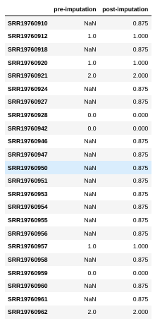

# Spatial population genetic analysis: **FEEMS**

Through methods like PCA and phylogenetic trees, you can gain some insight into 
how populations cluster together, and which population may be more diverged from 
each other. But it's always nice to also look at this in a spatial context, e.g. 
on a map. FEEMS is a faster version of the statistical method Estimating 
Effective Migration Surfaces (EEMS), and it is based on the notion of 
"isolation-by-distance" (IBD). This is the idea that individuals who live near 
each other tend to be more similar to individuals who live far apart. EEMS is a 
good method to visualize deviations from IBD on a map, hereby finding areas where 
gene flow is less than expected (i.e. barriers; indicated in orange) or areas 
where gene flow is higher than expected (i.e. increased connectivity; indicated 
in blue). Below you can see an example for a dataset of lions. The red dots are 
sampling localities, and you can see some orange shading where EEMS inferred 
reduced gene flow. For example, in the central African rain forest, the Zambezi 
valley and the Arabian peninsula.


For more information about EEMS, check out [Petkova *et al* 
(2016)](https://www.nature.com/articles/ng.3464), and for FEEMS, check out 
[Marcus *et al* (2021)](https://elifesciences.org/articles/61927).

## FEEMS install/configuration
FEEMS can be a bit tricky to install, so for the purpose of this workshop
we wrote all the steps into a script that you can simply execute (to save
time). You can see the details of what the script is actually doing
in the [RADCamp technical configuration document.](./technical-configuration.md)

## Input data
What is the necessary input data for FEEMS?
* genotypes
* latlongs (= localities of your samples)
* bounding area for plotting
* .shp file (global map)

# **FEEMS** analyses

## Access the FEEMS environment
The FEEMS module requires a substantially different configuration than the
other analysis tools in this workshop, so we have installed this software
in a separate conda environment with an isolated jupyter notebook server
running on a different port. To access this environment open a new browser
tab and navigate to:

`http://localhost:8801`

## Create a new notebook for the FEEMS analysis
In the jupyter notebook browser interface navigate to your `ipyrad-workshop`
directory and create a "New->Python" Notebook.



First things first, rename your new notebook to give it a meaningful name. Choose `File->Save Notebook` and rename your notebook to "cheetah-FEEMS.ipynb"

## Import FEEMS and other necessary modules
The `import` keyword directs python to load a module into the currently running
context. This is very similar to the `library()` function in R. We begin by
importing the ipyrad analysis module. Copy the code below into a
notebook cell and click run. 

```python
%matplotlib inline

# base
import h5py
import numpy as np
import pandas as pd
from sklearn.impute import SimpleImputer 
# viz 
import matplotlib.pyplot as plt 
import cartopy.crs as ccrs 
# feems 
from feems.utils import prepare_graph_inputs 
from feems import SpatialGraph, Viz 
```

## Import the data and impute missing values

```python
# Path to the input phylip file
data = h5py.File("/home/osboxes/ipyrad-workshop/no-outgroup_outfiles/no-outgroup.snps.hdf5")

raw_genotypes = np.apply_along_axis(np.sum, 2, data["genos"][:])

G = np.where(raw_genotypes <= 2, raw_genotypes, np.nan*raw_genotypes)
imp = SimpleImputer(missing_values=np.nan, strategy="mean") 
genotypes = imp.fit_transform(np.array(G).T) 
```

### What is 'imputation' and why do we need to do it?

```python
locus = 11
print(G[locus])
genotypes[:, locus]
```
```
[nan  1. nan  1.  2. nan nan  0.  0. nan nan nan nan nan nan nan nan  1.
 nan  0. nan nan  2.]
array([0.875, 1.   , 0.875, 1.   , 2.   , 0.875, 0.875, 0.   , 0.   ,
       0.875, 0.875, 0.875, 0.875, 0.875, 0.875, 0.875, 0.875, 1.   ,
       0.875, 0.   , 0.875, 0.875, 2.   ])
```
```python
locus = 11
names = data["snps"].attrs["names"]
pd.DataFrame([G[locus], genotypes[:, locus]], columns=names, index=["pre-imputation", "post-imputation"]).T
```


## Fetch the GPS coordinates for the samples and the 'outer' points
Typically, you will have information about the sampling localities of your data. FEEMS takes these data as a vector of GPS coördinates, and the file should have the extension `.coord`. We've already prepared this file for you, and you can simply download it. 

You also need to provide FEEMS with an outline of the area you want to include in your analysis, and provide this as a file with the extension `.outer`. You can use the following [website](http://www.birdtheme.org/useful/v3tool.html) to create one, simply by clicking on the map and then copy-pasting the coördinates to a new file. 


To save time, we've also prepare this file for you, and for this workshop you can simply download it.

```
!wget https://raw.githubusercontent.com/radcamp/radcamp.github.io/master/Kigali2023/Cheetah.coords
!wget https://raw.githubusercontent.com/radcamp/radcamp.github.io/master/Kigali2023/Cheetah.outer
```

## Load the coordinates of the samples, the outline and the global shp file
```python
# GPS Coordinates per sample in the same order as the genotypes
coord = np.loadtxt("./Cheetah.coords")
outer = np.loadtxt("./Cheetah.outer")
grid_path = "/home/osboxes/src/feems/feems/data/grid_250.shp"

# graph input files
outer, edges, grid, _ = prepare_graph_inputs(coord=coord, ggrid=grid_path, translated=False, buffer=0, outer=outer)
```

## Plot the region and the sample sites
Note that the actual sampling locality is a small black dot, but for the analysis, it is locked to the grid and displayed as a grey circle (size depending on the number of samples). It is important to remember this, because it may look like sampling localities have changed. However, this is just because FEEMS makes it fit to the grid. This step may take a minute or so.

```python
%%time
sp_graph = SpatialGraph(genotypes, coord, grid, edges, scale_snps=False)
projection = ccrs.EquidistantConic(central_longitude=23, central_latitude=8) 
fig = plt.figure(dpi=300) 
ax = fig.add_subplot(1, 1, 1, projection=projection) 
v = Viz(ax, sp_graph, projection=projection, edge_width=.5, 
    edge_alpha=1, edge_zorder=100, sample_pt_size=10, 
    obs_node_size=7.5, sample_pt_color="black", 
    cbar_font_size=10) 
v.draw_map() 
v.draw_samples() 
v.draw_edges(use_weights=False) 
v.draw_obs_nodes(use_ids=False) 
```


## Fit the FEEMS model to the data
This step actually assesses to what degree genetic differentiation is higher or lower compared to what we can expect under IBD. 

```python
%%time 
sp_graph.fit(lamb = 20.0) 
```

## Plot the fitted model
```
fig = plt.figure(dpi=300) 

ax = fig.add_subplot(1, 1, 1, projection=projection) 
v = Viz(ax, sp_graph, projection=projection, edge_width=0.5, 
    edge_alpha=1, edge_zorder=100, sample_pt_size=20, 
    obs_node_size=7.5, sample_pt_color="black", 
    cbar_font_size=10, abs_max=0.5) 
v.draw_map() 
v.draw_edges(use_weights=True) 
v.draw_obs_nodes(use_ids=False) 
v.draw_edge_colorbar() 
```


