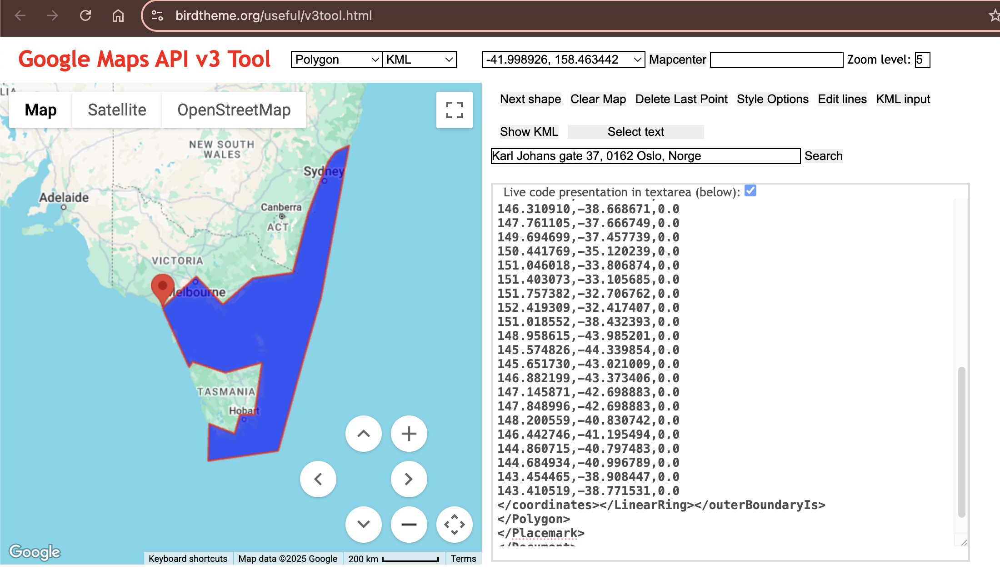

# Spatial population genetic analysis: **FEEMS**

Through methods like PCA and phylogenetic trees, you can gain some insight into 
how populations cluster together, and which population may be more diverged from 
each other. But it's always nice to also look at this in a spatial context, e.g. 
on a map. FEEMS is a faster version of the statistical method Estimating 
Effective Migration Surfaces (EEMS), and it is based on the notion of 
"isolation-by-distance" (IBD). This is the idea that individuals who live near 
each other tend to be more similar to individuals who live far apart. EEMS is a 
good method to visualize deviations from IBD on a map, hereby finding areas where 
gene flow is less than expected (i.e. barriers; indicated in orange) or areas 
where gene flow is higher than expected (i.e. increased connectivity; indicated 
in blue). Below you can see an example for a dataset of lions. The red dots are 
sampling localities, and you can see some orange shading where EEMS inferred 
reduced gene flow. For example, in the central African rain forest, the Zambezi 
valley and the Arabian peninsula.


For more information on these methods see the original manuscripts:
* EEMS - [Petkova *et al* (2016)](https://www.nature.com/articles/ng.3464)
* FEEMS - [Marcus *et al* (2021)](https://elifesciences.org/articles/61927)

## FEEMS install/configuration
FEEMS can be a bit tricky to install, so for the purpose of this workshop
we wrote all the steps into a script that you can simply execute (to save
time). You can see the details of what the script is actually doing
in the [RADCamp technical configuration document.](./technical-configuration.html#feems-install-script)

Open a new Terminal and type:
```
/home/jovyan/work/scripts/install_feems.sh
```
This will run for a few minutes, writing progress to the screen. After it finishes
you can proceed with the rest of this tutorial.

> **Safe to ignore the warning:** You can ignore the warning that says `DEPRECATION: 
Legacy editable install of feems==1.0.1 ...`, it is does not impact the FEEMS install.

## Create a new notebook for the FEEMS analysis
In the jupyter notebook browser interface navigate to your `ipyrad-workshop`
directory and use the Launcher to create a new Notebook using the 'feems' 
environment.


First things first, rename your new notebook to give it a meaningful name. 
Choose `File → Save Notebook` and rename your notebook to "seadragon-FEEMS.ipynb"

## Import FEEMS and other necessary modules
The `import` keyword directs python to load a module into the currently running
context. This is very similar to the `library()` function in R. We begin by
importing several `feems` functions and other needed libraries. Copy the code
below into a notebook cell and click run:

```python
import cartopy.crs as ccrs 
import h5py
import matplotlib.pyplot as plt 
import numpy as np

from feems import SpatialGraph, Viz 
from feems.utils import prepare_graph_inputs 
from sklearn.impute import SimpleImputer 
```

## Input data types
What is the necessary input data for FEEMS? It needs several different
input data streams and we will briefly walk through these different datatypes
and where to get these from.
* Genotype data for all samples
* Latitude/Longitude coordinates for samples
* Coordinates of a polygon circumscribing your focal region
* A vector file of a global-scale triangular grid (.shp file)

### Import the genotype data and impute missing values

FEEMS uses SNP data (not the full sequence). Within the
[FEEMS tutorial](https://github.com/NovembreLab/feems/blob/main/docsrc/notebooks/getting-started.ipynb)
they use data from PLINK, but this is complicated to obtain, and we can actually import
the SNP data directly from an ipyrad output file. Open a new cell in your notebook
and copy/paste this text and run it:

```python
# Import the seadragon SNP data in hdf5 format
data = h5py.File("/home/jovyan/ipyrad-workshop/seadragon_outfiles/seadragon.snps.hdf5")

# Convert the ipyrad SNP format for FEEMS input
raw_genotypes = np.apply_along_axis(np.sum, 2, data["genos"][:])

# Impute missing values (required by FEEMS)
G = np.where(raw_genotypes <= 2, raw_genotypes, np.nan*raw_genotypes)
imp = SimpleImputer(missing_values=np.nan, strategy="mean") 
genotypes = imp.fit_transform(np.array(G).T)
```

> **What is 'imputation' and why do we need to do it?** FEEMS can't deal with
missing data. Here we are filling missing genotypes with the mean value at
a given SNP position, a standard imputation method.

### Latitude/Longitude coordinates for samples
Typically, you will have information about the sampling localities of your data. 
FEEMS takes this data as a vector of Longitude/Latitude coordinates. When running
FEEMS on your own data it's **very important** to ensure the order of the samples 
in the genotypes and the order of the samples in the coords file are identical.

To save time we've already prepared this file for you (with correct ordering of
samples), and you can look at the structure of the file and the first few lines:

```bash
!head ~/work/SeadragonData/seadragon_coords.txt
```
```
148.308428 -41.869351
148.308428 -41.869351
148.308428 -41.869351
148.308428 -41.869351
148.308428 -41.869351
148.308428 -41.869351
151.219347 -34.002666
151.219347 -34.002666
151.219347 -34.002666
151.219347 -34.002666
```
> The `!` at the beginning of this line tells the notebook to run this command
using bash instead of python. It's a trick for running command line commands inside
of the notebook cell context.

### Coordinates of a polygon circumscribing your focal region
You also need to provide FEEMS with an 'outline' of the area you want to include 
in your analysis. The format of the 'outer' file should be a plain text file
with a list of Longitude/Latitude points describing a polygon of your bounding
region. You can use the following [website](http://www.birdtheme.org/useful/v3tool.html) to 
create one of these, by clicking on the map and then copy-pasting the coordinates 
to a new file. 



To save time, we've also prepared this file for you and you can look at the
structure of the file and the first few lines:

```bash
!head ~/work/SeadragonData/seadragon_outer.txt
```
```
143.410519 -38.771531
145.036496 -37.597144
146.310910 -38.668671
147.761105 -37.666749
149.694699 -37.457739
150.441769 -35.120239
151.046018 -33.806874
151.403073 -33.105685
151.757382 -32.706762
152.419309 -32.417407
```

### A vector file of a global-scale triangular grid (.shp file)
Another necessary input file is a shape file containing a triangular grid
at a given resolution. It's easiest to use one of the `.shp` files
provided in the [FEEMS github repository](https://github.com/NovembreLab/feems/tree/main/feems/data),
which are at 100km and 250km resolution. If you need finer resolution you can use
a python package called [`pygplates`](https://www.gplates.org/docs/pygplates/),
or in R you can use the [`sf`](https://r-spatial.github.io/sf/) package. Again,
to save time we provide a grid file scaled for the Seadragon data within the
cloud instance `work/grid` directory.

## Load sample coordinates, the 'outer' bounding polygon, and the global grid file

In the next cell we will read in the 'outer', 'coords', and grid file data, and
then call `prepare_graph_inputs` which is a FEEMS function for preparing the data.

```python
%%time
grid_path = "/home/jovyan/work/grid/world_triangle_res8.shp"
outer = np.loadtxt("/home/jovyan/work/SeadragonData/seadragon_outer.txt")
coords = np.loadtxt("/home/jovyan/work/SeadragonData/seadragon_coords.txt")

outer, edges, grid, _ = prepare_graph_inputs(coord=coords, ggrid=grid_path, translated=False, buffer=0, outer=outer)
```
> The `%%time` directive at the top of this cell is a jupyter 'magic command'
that will track the amount of time it takes to run the code in the cell. It can
be useful, and you'll see `Wall time` for this cell is around 1 minute.

## Plot the region and the sample sites
Note that the actual sampling locality is a small black dot, but for the analysis, 
it is locked to the grid and displayed as a grey circle (size depending on the 
number of samples). It is important to remember this, because it may look like 
sampling localities have changed. However, this is just because FEEMS makes it 
fit to the grid. This step may take a minute or so.

```python
%%time
sp_graph = SpatialGraph(genotypes, coords, grid, edges, scale_snps=False)
projection = ccrs.EquidistantConic(central_longitude=138, central_latitude=-40, standard_parallels=-40) 
fig = plt.figure(dpi=300) 
ax = fig.add_subplot(1, 1, 1, projection=projection) 
v = Viz(ax, sp_graph, projection=projection, edge_width=.5, 
    edge_alpha=1, edge_zorder=100, sample_pt_size=10, 
    obs_node_size=7.5, sample_pt_color="black", 
    cbar_font_size=10) 
v.draw_map() 
v.draw_samples() 
v.draw_edges(use_weights=False) 
v.draw_obs_nodes(use_ids=False)
```


> For your own data you will need to set appropriate values for `central_longitude`,
`central_latitude`, and `standard_parallel` to reduce distortion in the figures.

## Fit the FEEMS model to the data
This step actually assesses to what degree genetic differentiation is higher or 
lower compared to what we can expect under an IBD model. 

```python
%%time 
sp_graph.fit(lamb = 20.0) 
```

> The `lamb` parameter (lambda) determines the similararity of neighboring migration 
edges. With higher values neighboring migration edges are more similar, and with
lower values they can be more different.

Through experimentation we chose `20.0` for this tutorial, but in practice you
would implement a cross-validation procedure over a range of lambda values and
then select the best for your data. A notebook showing this process is avalailble
on the FEEMS github: [FEEMS Cross-Validation](https://github.com/NovembreLab/feems/blob/main/docsrc/notebooks/cross-validation.ipynb)

## Plot the fitted model

Finally, we can replot the fitted model using the inferred edge weights to
show patterns of spatial connectivity. Darker edges show migration that
departs from a model of Isolation by Distance with brown edges indicating 'barriers',
blue edges indicate 'corridors', and white edges showing regions that fit
a model isolation by distance.

```
fig = plt.figure(dpi=300) 

ax = fig.add_subplot(1, 1, 1, projection=projection) 
v = Viz(ax, sp_graph, projection=projection, edge_width=0.5, 
    edge_alpha=1, edge_zorder=100, sample_pt_size=20, 
    obs_node_size=7.5, sample_pt_color="black", 
    cbar_font_size=10, abs_max=0.5) 
v.draw_map() 
v.draw_edges(use_weights=True) 
v.draw_obs_nodes(use_ids=False) 
```


## Save the FEEMS result to a file
You can use the matplotlib fuction [`savefig()`](https://matplotlib.org/stable/api/_as_gen/matplotlib.pyplot.savefig.html)
to save the FEEMS results to a file. `savefig()` supports several different common
formats (like .svg, .pdf, .png and some others) and it determines the
appropriate file type to save as based on the file extension that you specify.
So for example to save the results as a .png you can say:

```python
fig.savefig("Seadragon-Feems.png")
```
And this will save the .png into your `ipyrad-workshop` directory.

## Experiment with different lambda values
With any remaining time you may try changing the value of `lamb`, 
rerunning the call to `sp_graph.fit()` and then replotting, to check
by eye how different lambda values change the spatial migration patterns.
