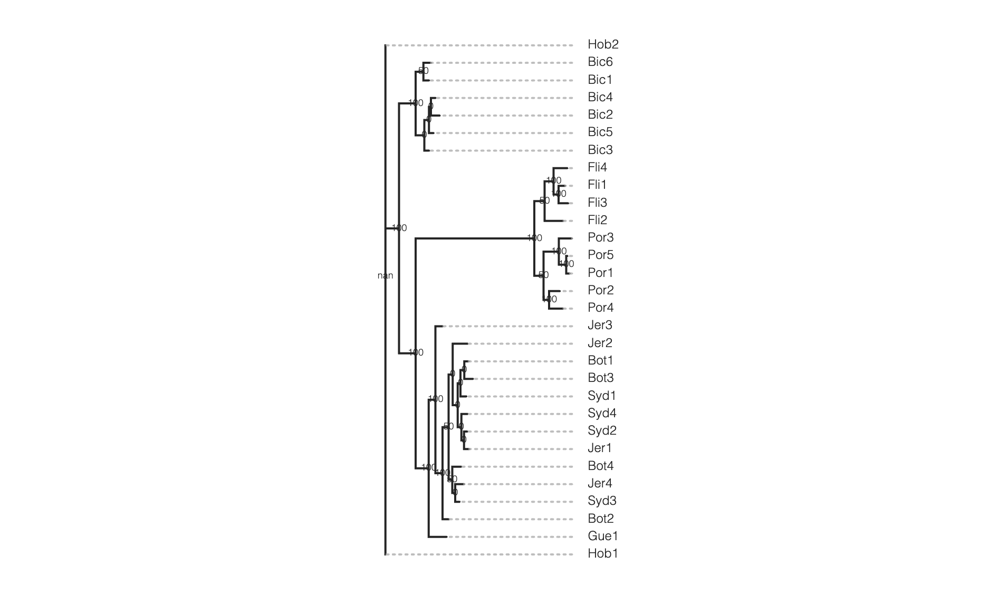
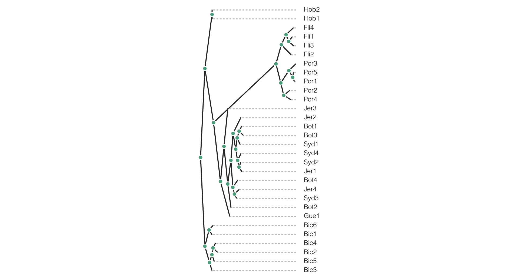

# The ipyrad.analysis module: **RAxML**

RAxML is the most popular tool for inferring phylogenetic trees using maximum
likelihood. It is fast even for very large data sets. The documentation for
raxml is huge, and there are many options. However, we tend to use the same small
number of options very frequently, which motivated us to write the `ipa.raxml()`
tool to automate the process of generating RAxML command line strings, running
them, and accessing the resulting tree files. The simplicity of this tool makes
it easy to incorporate into other more complex tools, for example, to infer
tress in sliding windows along the genome using the `ipa.treeslider` tool.

More information about RAxML can be found [here](https://cme.h-its.org/exelixis/web/software/raxml/) and the scientific paper [Stamatakis *et al.* (2014)](https://academic.oup.com/bioinformatics/article/30/9/1312/238053).

## Input data
The RAxML tool takes a phylip formatted file as input. In addition you can set
a number of analysis options either when you init the tool, or afterwards by
accessing the `.params` dictionary. You can view the RAxML command string that is
generated from the input arguments and you can call `.run()` to start the tree inference.

### Creating a new phylip file with `min_samples_locus` set to 20
In order to get RAxML to run in a reasonable amount of time we will repeat the final 
step of ipyrad, and adjust it so that we have fewer missing data. Remember that 
we've previously set `min_samples_locus` to 4, which means that ipyrad includes 
all SNPs which have data for at least 4 samples. This will result in a matrix 
which also includes lots of missing data, e.g. at positions where only 5 or 6 
samples have data, but the SNP will still be included in the final output. To 
create an output file with fewer missing data (but also fewer SNPs!), we can 
increase `min_samples_locus`, e.g. to 20. However, we don't want to overwrite 
the existing output files, so we'll create a new "branch" of our assembly and 
re-run step 7 to generate new output files.

Go back to a terminal in your `ipyrad-workshop` directory.

```bash
$ ipyrad -p params-seadragon.txt -b minsamples20
```
```
  loading Assembly: seadragon
  from saved path: ~/ipyrad-workshop/seadragon.json
  creating a new branch called 'minsamples20' with 30 Samples
  writing new params file to params-minsamples20.txt
```

This creates a new params file (as it says) which you should edit by double-clicking
on `params-minsamples20.txt` in the leftnav file-browser and modifying it
to update the following parameter (don't forget to File → Save Text):

```
20              ## [21] [min_samples_locus]: Min # samples per locus for output
```

Now you can run step 7 again to generate the new output files with this new
`min_samples_locus` setting:

```bash
$ ipyrad -p params-minsamples20.txt -s 7 -c 4
```

This will create a new set of output files in `minsamples20_outfiles` which
have only retained loci present in 20 or more samples. Look at the stats file
to see how many loci are retained in this dataset? Do you think it will be fewer
or more than in the previous assembly with `min_samples_locus` set to 4?

## A note on Jupyter/IPython
[Jupyter notebooks](http://jupyter.org/) are primarily a way to generate
reproducible scientific analysis workflows in python. ipyrad analysis tools are
best run inside Jupyter notebooks, as the analysis can be monitored and tweaked
and provides a self-documenting workflow.

The rest of the materials in this part of the workshop assume you are running
all code in cells of a jupyter notebook.

# **RAxML** analyses

## Create a new notebook for the RAxML analysis
In the jupyter notebook browser interface navigate to your `ipyrad-workshop`
directory and create a new Noteook using the `base` image as we did previously.


First things first, rename your new notebook to give it a meaningful name. You can
either click the small 'disk' icon in the upper left corner of the notebook or
choose `File → Save Notebook` and rename your notebook to "seadragon_raxml.ipynb"

### Import ipyrad.analysis module
The `import` keyword directs python to load a module into the currently running
context. This is very similar to the `library()` function in R. We begin by
importing the ipyrad analysis module. Copy the code below into a
notebook cell and click run. 

```python
import ipyrad.analysis as ipa
import toytree
```
> The `as ipa` part here creates a short synonym so that we can refer to
`ipyrad.analysis` **as** `ipa`, which is just faster to type.

The following cell shows the quickest way to results using the seadragon
dataset (using `min_samples_locus` 20) we assembled earlier. Copy this 
code into a new notebook cell (or use the small grey *+* button on the 
toolbar) and run it.

```python
# Path to the input phylip file
phyfile = "minsamples20_outfiles/minsamples20.phy"

# init raxml object with input data and (optional) parameter options
rax = ipa.raxml(data=phyfile, T=4, N=2)

# print the raxml command string for prosperity
print(rax.command)

# run the command, (options: block until finishes; overwrite existing)
rax.run(block=True, force=True)
```
> **Note:** In this block of code, the `#` at the beginning of a line indicates
to python that this is a comment, so it doesn't try to run this line. This is a
very handy thing if you want to add or remove lines of code from an analysis
without deleting them. Simply comment them out with the `#`!

This runs for a minute or two...

### Draw the inferred tree
After inferring a tree you can then visualize it in a notebook using `toytree`.

```python
# load from the .trees attribute of the raxml object, or from the saved tree file
tre = toytree.tree(rax.trees.bipartitions)

# draw the unrooted tree
tre.draw(tip_labels_align=True, node_labels="support");
```



### Rooting the tree
Rooting or re-rooting trees orients the direction of ancestor-descendant relationships 
and thus provides "polarization" for the direction of evolution. Most tree inference 
algorithms return an unrooted tree as a result, and it is up to the researcher 
to select the placement of the root based on external information (e.g., outgroup designation)

The `toytree` package provides a number of different methods for rooting trees, which
we will briefly touch on here, but which you can find detailed information about in the
[toytree rooting documentation](http://eaton-lab.org/toytree/rooting/).

One way to root a tree is by passing in a list of sample names (usually out-group
samples). Here we will choose to root on the samples from the "Bic" site, as
an example.

```python
tre = toytree.tree(rax.trees.bipartitions)
# Root the tree on samples from the "Bic" site
rtre = tre.root("Bic1", "Bic2", "Bic3", "Bic4", "Bic5", "Bic6")
rtre.draw(tip_labels_align=True)
```


Rooting on the "midpoint" assumes a clock-like evolutionary rate (i.e., branch 
lengths are equal to time) and may yield odd results when this assumption is 
violated. This algorithm finds the root position by calculating the pairwise path 
length between all tips in an unrooted tree, and places the treenode on an edge 
representing the midpoint of the longest path.

```python
tre = toytree.tree(rax.trees.bipartitions)
tre.mod.root_on_midpoint().draw()
```


## Coloring tip labels by sub-species identity


```python
imap = {'NSW': ['Bot1', 'Bot2', 'Bot3', 'Bot4', 'Syd1', 'Syd2', 
                'Syd3', 'Syd4', 'Jer1', 'Jer2', 'Jer3', 'Jer4', 'Gue1'],
        'TAS': ['Bic1', 'Bic2', 'Bic3', 'Bic4', 'Bic5', 'Bic6', 'Hob1', 'Hob2'], 
        'VIC': ['Fli1', 'Fli2', 'Fli3', 'Fli4', 'Por1', 'Por2', 'Por3', 'Por4', 'Por5']}

colormap = {"NSW":"hotpink", 
           "TAS":"skyblue",
            "VIC": "goldenrod"}

colorlist = []
for sample in rtre.get_tip_labels():
    for species, samples in imap.items():
        if sample in samples:
            colorlist.append(colormap[species])

rtre.draw(tip_labels_align=True,
          tip_labels_colors=colorlist,
          use_edge_lengths=False)
```

<p align="center">
  
</p>


## Setting parameters
By default several parameters are pre-set in the raxml object. To remove those
parameters from the command string you can set them to `None`. Additionally, you
can build complex raxml command line strings by adding almost any parameter to
the raxml object init, as below.

```python
# parameter dictionary for a raxml object
rax.params
```
```
N        2                   
T        4                   
binary   ~/miniconda3/envs/ipyrad/bin/raxmlHPC-PTHREADS-AVX2
f        a                   
m        GTRGAMMA            
n        test                
p        54321               
s        ~/ipyrad-workshop/minsamples20_outfiles/minsamples20.phy
w        ~/src/notebooks/analysis-raxml
x        12345   
```

```python
# Demonstrating setting parameters
rax.params.N = 10
rax.params.f = "d"
```
This will perform 10 rapid hill-climbing ML analyses from random starting trees,
with no bootstrap replicates. 10 is a small value so it will run fast.

## Styling the tree
The default plotted tree can be manipulated with `toytree`, which offers a huge
number of options for styling phylogenetic trees. A complete overview is available
in the [toytree tree styling documentation](https://eaton-lab.org/toytree/quick_guide/#tree-drawings)
here we'll just show a few of these.

```python
# Add node labels showing node support
rtre.draw(node_sizes=15, 
          node_labels="support", 
          use_edge_lengths=False,
          tip_labels_colors=colorlist)
```

<p align="center">
  
</p>

```python
# Change the tree style
rtre.draw(tree_style='d')          # dark-style
rtre.draw(tree_style='o')          # umlaut-style
```




```python
# Change the orientation
rtre.draw(tree_style="o", layout='d')
# Circle plot orientation
rtre.draw(tree_style="o", layout='c')
```


Again, much more is available in the [toytree tree styling documentation](https://eaton-lab.org/toytree/quick_guide/#tree-drawings).

## Saving trees to pdf
The toytree figures can be saved to a file in hi-resolution in many different
formats: [Saving trees to pdf/svg/other output formats](https://eaton-lab.org/toytree/quick_guide/#saving-tree-drawings)

```python
canvas, _, _ = rtre.draw()
toytree.save(canvas, "tree-plot.pdf")
```


If you want to style the saved tree as we have practiced, you'll need to
add whatever styling you want to the `rtre.draw()` call, like this:

```python
canvas, _, _ = rtre.draw(tree_style="o", layout='c')
toytree.save(canvas, "tree-plot-styled.pdf")
```

## More to explore
If the RADSeq assembly was performed with mapping to a reference genome
this creates the opportunity to perform phylogenetic inference within genomic
windows using blocks of RAD loci mapped to contiguous regions of a reference
chromosome. The ipyrad analysis toolkit provides `window_extracter` for doing
this (and more).

[ipyrad-analysis toolkit: window_extracter](https://ipyrad.readthedocs.io/en/latest/API-analysis/cookbook-window_extracter.html)

Window extracter has several key features:
* Automatically concatenates ref-mapped RAD loci in sliding windows.
* Filter to remove sites by missing data.
* Optionally remove samples from alignments.
* Optionally use consensus seqs to represent clades of multiple samples.
