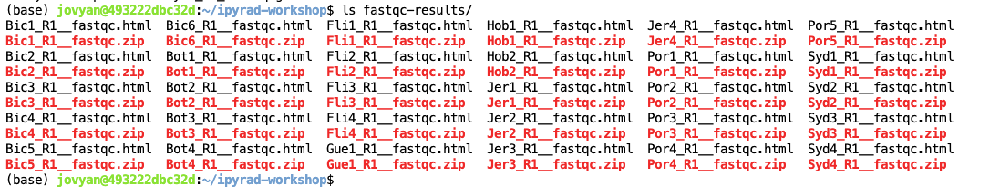
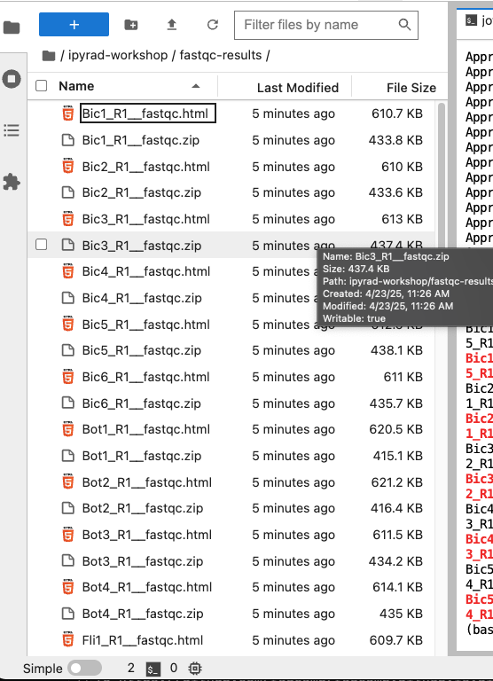

# Empirical data & Quality Control (QC)

## Command line interface (CLI) basics
The CLI provides a way to navigate a file system, move files around, and run commands all inside a little black window. The down side of CLI is that you have to learn many at first seemingly esoteric commands for doing all the things you would normally do with a mouse. However, there are several advantages of CLI: 1) you can use it on servers that don't have a GUI interface (such as HPC clusters); 2) it's scriptable, so you can write programs to execute common tasks or run analyses; 3) it's often faster and more efficient that click-and-drag GUI interfaces. For now we will start with 4 of the most common and useful commands:

```
(base) jovyan@493222dbc32d:~$ pwd
/home/jovyan
```
`pwd` stands for **"print working directory"**, which literally means "where am I now in this filesystem". Just like when you open a file browser with windows or mac, when you open a new terminal the command line will start you out in your "home" directory. Ok, now we know where we are, lets take a look at what's in this directory:

```
(base) jovyan@493222dbc32d:~$ ls
evolution  miniconda3  work
```

`ls` stands for **"list"** and in our home directory there are three folders: 
`miniconda3` which we just created with the conda install, `evolution` which we will
**ignore**, and `work` which is a directory that holds the seadragon data we'll be 
working with. Throughout the workshop we will be adding files and directories and by 
the time we're done, not only will you have a bunch of experience with RAD-Seq 
analysis, but you'll also have a ***ton*** of stuff in your home directory.

### Setting up working directories

We can start out by adding the first directory for this workshop:

```
(base) jovyan@493222dbc32d:~$ mkdir ipyrad-workshop
```

`mkdir` stands for **"make directory"**, and unlike the other two commands, this command takes an "argument". This argument is the name of the directory you wish to create, so here we direct mkdir to create a new directory called "ipyrad-workshop". Now you can use `ls` again, to look at the contents of your home directory and you should see this new directory now:

```
(base) jovyan@493222dbc32d:~$ ls
evolution  ipyrad-workshop  miniconda3  work
```

Throughout the workshop we will be introducing new commands as the need for them arises. We will pay special attention to highlighting and explaining new commands and giving examples to practice with. 

> **Special Note:** Notice that the above directory we are making is not called `ipyrad workshop`. This is **very important**, as spaces in directory names are known to cause problems on HPC systems. All linux based operating systems do not recognize file or directory names that include spaces because spaces act as default delimiters between arguments to commands. There are ways around this (for example Mac OS has half-baked "spaces in file names" support) but it will be so much for the better to get in the habit now of ***never including spaces in file or directory names***.

The raw data lives in a directory called `raws` inside a nested set of
directories in the `work` directory. It will be very convenient for us to create
a shortcut to the raw data inside our ipyrad work directory, so we'll do this first
thing. First **Change Directory** into your `ipyrad-workshop` directory with the `cd` 
command, then make the shortcut with `ln` (just copy/paste this command).

```bash
(base) jovyan@493222dbc32d:~$ cd ipyrad-workshop
(base) jovyan@493222dbc32d:~/ipyrad-workshop$ ln -s /home/jovyan/work/BlackRockData2/SeadragonData/raws ./raws
(base) jovyan@493222dbc32d:~/ipyrad-workshop$ ls -l
```
```
lrwxrwxrwx 1 jovyan users   51 Apr 23 14:51 raws -> /home/jovyan/work/BlackRockData2/SeadragonData/raws
```
The `ls -l` command shows that the new `raws` shortcut indeed points to the shared
raw data.

## Exploring the seadragon data
We will be reanalysing RAD-Seq data from seadragon (*Phyllopteryx taeniolatus*) 
sampled from across across New South Wales, Victoria, and Tasmania and published in 
[Klanten *et al* 2020 - Genomic and morphological evidence of distinct populations 
in the endemic common (weedy) seadragon *Phyllopteryx taeniolatus* (Syngnathidae) 
along the east coast of Australia](https://journals.plos.org/plosone/article?id=10.1371/journal.pone.0243446)

{: width="50%"}

Note that we have downsampled to 30 individuals (there are 82 in the study) and raw 
reads have been randomly downsampled to 125,000 reads per sample, in order to create 
a dataset that will be computationally tractable with the expectation of finishing in 
a reasonable time. 

You can see the fastq files for these samples by listing (`ls`) the directory where 
they are stored, the `raws` shortcut we created earlier:

```
(base) jovyan@493222dbc32d:~/ipyrad-workshop$ ls raws
Bic1_R1_.fastq.gz  Bic6_R1_.fastq.gz  Fli1_R1_.fastq.gz  Hob1_R1_.fastq.gz  Jer4_R1_.fastq.gz  Por5_R1_.fastq.gz
Bic2_R1_.fastq.gz  Bot1_R1_.fastq.gz  Fli2_R1_.fastq.gz  Hob2_R1_.fastq.gz  Por1_R1_.fastq.gz  Syd1_R1_.fastq.gz
Bic3_R1_.fastq.gz  Bot2_R1_.fastq.gz  Fli3_R1_.fastq.gz  Jer1_R1_.fastq.gz  Por2_R1_.fastq.gz  Syd2_R1_.fastq.gz
Bic4_R1_.fastq.gz  Bot3_R1_.fastq.gz  Fli4_R1_.fastq.gz  Jer2_R1_.fastq.gz  Por3_R1_.fastq.gz  Syd3_R1_.fastq.gz
Bic5_R1_.fastq.gz  Bot4_R1_.fastq.gz  Gue1_R1_.fastq.gz  Jer3_R1_.fastq.gz  Por4_R1_.fastq.gz  Syd4_R1_.fastq.gz
```

> **Special Note:** You'll see that every file contains `_R1_`. Most of the time, the data you will be working on are paired-end, meaning that each sample has a `_R1_` and `_R2_` file. For this workshop, and to ensure that the steps run quickly, we will only use `_R1_`.

## The `FASTQ` data file format

Before we get started with the assembly, let's take a look at what the raw data
looks like. Your input data will be in fastQ format, usually ending in `.fq`, `.fastq`, 
`.fq.gz`, or `.fastq.gz`. The file(s) may be compressed with gzip so that they have a 
`.gz` ending (in this case that is how they are), but they do not need to be. We can 
use `zcat` to read the gzip format and `head` to carve off a small part of the data.

```bash
## zcat: unZip and conCATenate the file to the screen
## head -n 20: Just take the first 20 lines of input

(base) jovyan@493222dbc32d:~/ipyrad-workshop$ zcat raws/Bic1_R1_.fastq.gz | head -n 20
```
```
@SRR12395901.1 3_11401_20767_1041/1
TGCAGCTGCTATTCACAGCGACGAGATAATTGTCAATGAAAAGNNNNNNNNNNNNNNTNTGTTGTCGGCAGGGTCATTGTTCATCTCATTGAAGTCTATATGGCAGAGCAGAGTGTTTTCCTTTGAGTCGGGGGCATTGA
+
EEEEEEEEEEEEEE/EEEEEEEEEEEEAEEEEEEEEEEEAEEE##############E#EEEEEEEEEAEEEEEEEEEEEE/EEEAEE6AEEEEEE<AEEEE/<AA<<<AAEEAA/AEE<6<AEEEEAAEAAAAAEEEEE
@SRR12395901.2 3_11401_6247_1055/1
TGCAGGTCAGCGCTCAAGTGCGAGTTTTGCACCTCCAGTCGACTCGACATACCTTGAATCTGAGCCACCTGCAATGAAGAAGACAGATGTGACGCTCTAAACTTTGTGGAAGCTAGCTTTGGGTGTGAGCGCAGAGCCTT
+
EEEEEEEEEEEEEEEEEEEEEAEE6EEEEEAEEEEA/EEAA/EAEE<AAE<EE</</AEE<</EEE/EEAEAAEEAEAE/<EEAEE/EEEE//EE/E<E//E</E/A/AA<A/<6<///<AAAA</A//<<<//AA6A/<
@SRR12395901.3 3_11401_9855_1058/1
TGCAGATTCTTCTATGAAAATAGAGCCCCTTGTCTTCGTCTTGTTTGGTTTTGACAATCATACAGCGTGAGCGCTTCAATTGTTAGCTTTGGCTTTCCATCGCAGGCAATGAACTGGGAATGGAGGACTTGTAATTTAAG
+
EEEEEEEEEEEEEEEEEEEEEEEEEEEEEEEEAEEE<EAEEEEEAEEEEEEEEEAEEEEEEAEEEEEEEEEEEEEAE/EEEEEE/EEEEEEEEEEEAAEA<A<A</<EEE/EEEEAEEAAAAAEEAAAA<<AA<EEEEEE
@SRR12395901.4 3_11401_4121_1059/1
TGCAGCAGCCTAGAAACCCTCCGGAGTGGAACTGAAAGTTCAGCGGGATGCGTCATAGCCCACGGGACCACGCAGCGGGTGTTCCCCTTCATGCTTATTAGCATTGGCGTCATGCGTGCGCGTACAAGAAATCATCCACC
+
EEEEEE6EEEEEEEAEEEEEEAAAEE/EEE/EEEEEEEE/EAEEEEAEEEEEAAEA<EAAE/EEEE/AE</EEAEEAE//A/A6E/EAAAE<AAE6A<AE<A/66/AA<6</A/A</A/AAE/A///E///<<E/AA/A/
@SRR12395901.5 3_11401_17757_1060/1
TGCAGCATTTTGGAATTACCGTAAACAAAACTCAGAGGAAACACAAAAGAAATCGAAAACCACCGTCCACAATTAAGTGTTTGTTGAGCAAACAAGATTTGCTGAGGTCACTGCATGATGGCAATTGAGTTTCCAATTTT
+
EEEEEEEEEEEEEEEEEEEEEEEEEEEEEEEEEEEEEEEEEEEEAEEEEEEEEEAEEEE6AEEAEEAAEAEEEEEEEEEEEEEEAEEEAE<EEAEEEEEEEAEAEEEEEEEEE<AAEAEEA<A6A<AAE66AA<AAEEEE
```

Here we have our first look at a **fastq formatted file**. Each sequenced read is 
spread over four lines, one of which contains sequence and another the quality scores 
stored as ASCII characters. The other two lines are used as headers to store 
information about the read.
* Line 1: The name of the read (its location on the plate)
* Line 2: The sequence data
* Line 3: Unused
* Line 4: Quality scores for the base calls (see the [FASTQ wikipedia](https://en.wikipedia.org/wiki/FASTQ_format) for more details on this)

What do you notice about the beginning of each line of sequence data? In this case 
one of the restriction enzyme used (PstI) leaves a `TGCAG` overhang, so this is
literally the cut site where each DNA molecule was cleaved.

To get a better view of the data quality, without looking at individual reads, we use 
automated approaches to check the quality. We will use [FastQC](https://www.bioinformatics.babraham.ac.uk/projects/fastqc/) to generate a sample-wide summary of data quality.

## FastQC for quality control
The first step of any RAD-Seq assembly is to inspect your raw data to estimate overall quality. At this stage you can then attempt to improve your dataset by identifying and removing samples with failed sequencing. Another key QC procedure involves inspecting average quality scores per base position and trimming read edges, which is where low quality base-calls tend to accumulate. In this figure, the X-axis shows the position on the read in base-pairs and the Y-axis depicts information about [Phred quality score](https://en.wikipedia.org/wiki/Phred_quality_score) per base for all reads, including median (center red line), IQR (yellow box), and 10%-90% (whiskers). As an example, here is a very clean base sequence quality report for a 75bp RAD-Seq library. These reads have generally high quality across their entire length, with only a slight (barely worth mentioning) dip toward the end of the reads:


In contrast, here is a somewhat typical base sequence quality report for R1 of a 
300bp paired-end Illumina run of another RADseq dataset:


This figure depicts a common artifact of current Illumina chemistry, whereby quality scores per base drop off precipitously toward the ends of reads, with the effect being magnified for read lengths >150bp. The purpose of using FastQC to examine reads is to determine whether and how much to trim our reads to reduce sequencing error interfering with basecalling. In the above figure, as in most real dataset, we can see there is a tradeoff between throwing out data to increase overall quality by trimming for shorter length, and retaining data to increase value obtained from sequencing with the result of increasing noise toward the ends of reads.

### Running FastQC on the seadragon data
In preparation for running FastQC on our raw data we need to make an output directory 
to keep the FastQC results organized. ake a new directory with
`mkdir`.

```bash
(base) jovyan@493222dbc32d:~/ipyrad-workshop$ mkdir fastqc-results
(base) jovyan@493222dbc32d:~/ipyrad-workshop$ ls
fastqc-results raws
```
Now run fastqc on one of the samples:
```
(base) jovyan@493222dbc32d:~/ipyrad-workshop$ fastqc -o fastqc-results raws/Bic1_R1_.fastq.gz 
```
> **Note:** The `-o` flag tells fastqc where to write output files.

FastQC will indicate its progress in the terminal. This subset data will run quite 
quickly, but real data can take somewhat longer to analyse (10s of minutes).

```
application/octet-stream
Started analysis of Bic1_R1_.fastq.gz
Approx 5% complete for Bic1_R1_.fastq.gz
Approx 10% complete for Bic1_R1_.fastq.gz
Approx 15% complete for Bic1_R1_.fastq.gz
Approx 20% complete for Bic1_R1_.fastq.gz
Approx 25% complete for Bic1_R1_.fastq.gz
Approx 30% complete for Bic1_R1_.fastq.gz
Approx 35% complete for Bic1_R1_.fastq.gz
Approx 40% complete for Bic1_R1_.fastq.gz
Approx 45% complete for Bic1_R1_.fastq.gz
Approx 50% complete for Bic1_R1_.fastq.gz
Approx 55% complete for Bic1_R1_.fastq.gz
Approx 60% complete for Bic1_R1_.fastq.gz
Approx 65% complete for Bic1_R1_.fastq.gz
Approx 70% complete for Bic1_R1_.fastq.gz
Approx 75% complete for Bic1_R1_.fastq.gz
Approx 80% complete for Bic1_R1_.fastq.gz
Approx 85% complete for Bic1_R1_.fastq.gz
Approx 90% complete for Bic1_R1_.fastq.gz
Approx 95% complete for Bic1_R1_.fastq.gz
Approx 100% complete for Bic1_R1_.fastq.gz
Analysis complete for Bic1_R1_.fastq.gz
```

If you feel so inclined you can QC all the raw data using a wildcard substitution:
```
(base) jovyan@493222dbc32d:~/ipyrad-workshop$ fastqc -o fastqc-results raws/*
```
> **Note:** The `*` here is a special command line character that means "Everything 
that matches this pattern". So here `raws/*` matches _everything_ in the raws 
directory.

Examining the output directory you'll see something like this (assuming that you 
ran FastQC on all files):



Now we have output files that include html and images depicting lots of information 
about the quality of our reads, but we can't inspect these from inside our little black 
window. But we can use the file browser pane in the left-nav, and navigate to the 
results by first clicking on `ipyrad-workshop` and then `fastqc-results`. Open one of 
the html files by double clicking on them.



### Instpecting and Interpreting FastQC Output

Just taking a random one, lets spend a moment looking at the results from 
`Bic1_R1_.fastq.gz`. Opening up this html file, on the left you'll see a summary of 
all the results, which highlights areas FastQC indicates may be worth further 
examination. We will only look at a few of these.


Lets start with `Per base sequence quality`, because it's very easy to interpret, and often times with RAD-Seq data results here will be of special importance.


For the seadragon data the sequence quality per base is is slightly reduced above
about 100bp (but again, this is not atypical for Illumina reads). Based on information 
from this plot we can see that the seadragon data could probably be 3' trimmed a bit,
to reduce noise in the data.

Now lets look at the `Per base sequece content`, which FastQC highlights with a scary 
red **X**.


The squiggles indicate base composition per base position averaged across the reads. 
It looks like the signal FastQC is concerned about here is related to the *extreme* 
base composition bias of the first 5 positions. We happen to know this is a result of 
the restriction enzyme overhang present in all reads (`TGCAG` in this case for the PstI 
enzyme used), and so it is in fact of no concern. 

It's also often useful to look at the `Adapter content` report, to check how much
adapter contamination there is. This tends to be less of a problem for single-end
data, so the seadragon data has very little adapter contamination. 


To give an idea of what bad adapter contamination looks like, here's an example
from a different dataset that had a big problem. The y-axis is the % adapter
contamination per base position, so 10% of the data between bases 20-40 is adapter, 
increasing to ~40% adapter sequence at the 3' end of the reads (which is a lot).


Either way, ipyrad will remove adapter contamination by default, it's just sometimes
good to know about whether this is an issue with your data. At the end of the day, 
the seadragon data look good and we can proceed with the ipyrad analysis.
