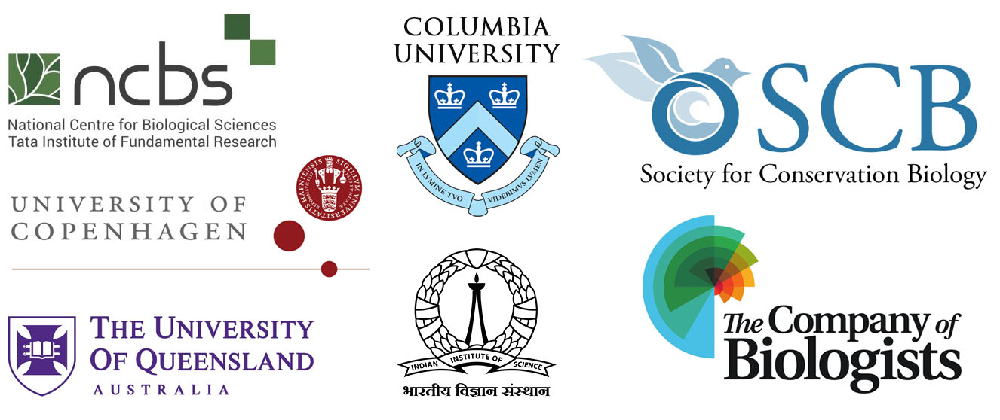

# Welcome to RADCamp 2025 - The Brisbane Edition

In association with the The Society for Conservation Biology's 
[**32nd International Congress for Conservation Biology (ICCB 2025)**](https://conbio.org/mini-sites/iccb-2025/)  

{: width="80%"}  

**RADCamp 2025** 
June 14-15, 2025  
University of Queensland 
St. Lucia Campus
Forgan Smith Building 01-E303

## Arriving at the University
The University campus is 5km from the city centre – either a short bus ride, or a slightly longer ferry ride. All buses and trains use either a credit card or “Go Card.” You must tap ON and OFF with the SAME card. It only costs 50c per ride regardless of the distance but if you forget to tap off you will be charged $10AUD and if you forget to tap on you may get a fine.

The fastest bus to UQ (Lakes bus stop) from the city is the M2 which takes 15-20 minutes from South Brisbane or the city. Or you can use various buses like the 105, connecting to 29, 169 etc. An alternative is the 412 which takes you to the other side of campus (Chancellors Place), also 20 mins. These all go every 5 or 10 minutes. You can also take various buses from Chancellors Place that will connect you to Toowong or Indooroopilly train stations which have trains every 5-15 mins.

If you open “Maps” or “Google Maps” and select the St Lucia campus of The University of Queensland they will give you the fastest public transport alternative. You can also download the Translink app which is for all Brisbane Transport and free. Plan your trips carefully and early.

Uber from the city, or Taxi, will be >$20.

Navigating Campus: UQ Maps App
Please download the App “UQ Maps” now. The UQ campus is vast but the App is comprehensive. To help you more, there will be a few helpers wearing “teal coloured” volunteer jackets around the campus. Talk to them.

## Lunch Options,  Water Coolers, Snacks & Coffee
These events are free, there is no food or coffee provided. However, nearby options are available, with some suggestions below. If in doubt, bring a sandwich and/or muesli bars and some bottled water.

On Saturday we expect the following food and coffee venues to be open during the hours noted, but hours are subject to change:  
Brewpoint The Pool, in the UQ Aquatic Centre: 6am – 5pm  
Merlo’s Café, in the Great Court: 7am – 3pm  
On a Roll, a cafe operated by the UQ Union: 7am - 12pm (hours may be extended)  
St. Lucy’s Cafe, 7am - 9pm

On Sunday we expect the following food and coffee venues to be open, but hours are subject to change:  
Brewpoint The Pool, in the UQ Aquatic Centre: 7am – 3pm  
Merlo’s Café, in the Great Court: 7am – 3pm
St. Lucy’s Cafe, 7am - 3pm  

# Organisers, Instructors, and Facilitators

  - Laura Bertola - National Centre for Biological Sciences
  - Ilha Byrne - University of Queensland
  - Anubhab Khan - Indian Institute of Science
  - Matheus Mello Athayde - University of Queensland
  - Katherine Prata - Australian Institute of Marine Science
  - Isaac Overcast - Columbia University
  - Laura Tensen - University of Copenhagen

### Quick Link to the Cloud Compute Jupyterhub
Cloud server - [https://pinky.eaton-lab.org/](https://pinky.eaton-lab.org/)

# Schedule

[Organiser & Participant Intro Slides (Presented throughout the first day)](https://docs.google.com/presentation/d/1A1HyzV-50gjEywkx3L2HmqtLP0oeBbL1qguBe3cpO0s/edit#slide=id.g359940329b6_0_130)

Times       | Saturday (June 14) | Sunday (June 15) |
-----       | ------------------ | ---------------- | 
8:30-9:00   | Check-in and Introductions | Check-in and Recap Day 1 |
9:00-10:30  | [Intro to Conservation Genetics](https://docs.google.com/presentation/d/1pY-Qs6gBdLOob3SVtcPy7bFoCTVXEol4/edit?usp=sharing&ouid=104169659317553534133&rtpof=true&sd=true) | [RADSeq Assembly w/ ipyrad part II](ipyrad-CLI-FullTutorial.md) |
10:30-10:45 | Coffee Break | Coffee Break |
10:45-12:00 | [Software Setup](setup.md) | Flash Overview w/ Jupter Notebooks & [Clustering Analysis: PCA](PCA_API.md) |
12:00-13:00 | Lunch | Lunch |
13:00-14:00 | [Data Quality Control](data_QC.md) | [Phylogenetic Inference: RAxML](RAxML_API.md) |
14:00-15:00 | [RADSeq Assembly w/ ipyrad part I](ipyrad-CLI-FullTutorial.md) | [Spatial Popgen Analysis: FEEMS](FEEMS_API.md)  |
15:00-15:15 | Coffee Break | Coffee Break |
15:00-17:00 | [RADSeq Assembly w/ ipyrad part I (cont.)](ipyrad-CLI-FullTutorial.md) | N/A (Ends at 3pm) |

## Empirical Data for the Workshop

Klanten _et al._ 2020 - [Genomic and morphological evidence of distinct populations in the endemic common (weedy) seadragon *Phyllopteryx taeniolatus* (Syngnathidae) along the east coast of Australia](https://journals.plos.org/plosone/article?id=10.1371/journal.pone.0243446)

[BioProject PRJNA655499](https://www.ncbi.nlm.nih.gov/bioproject/PRJNA655499)

{: width="50%"}

## Additional ipyrad analysis cookbooks

* [Clustering analysis: STRUCTURE](https://nbviewer.org/github/dereneaton/ipyrad/blob/master/tests/cookbook-structure-pedicularis.ipynb)
* [BPP - Bayesian inference under a multi-species coalescent model](https://nbviewer.jupyter.org/github/dereneaton/ipyrad/blob/master/tests/cookbook-bpp-species-delimitation.ipynb)
* [Bucky - Phylogenetic concordance analysis](https://nbviewer.jupyter.org/github/dereneaton/ipyrad/blob/master/tests/cookbook-bucky.ipynb)
* [ABBA-BABA - Admixture analysis](https://nbviewer.jupyter.org/github/dereneaton/ipyrad/blob/master/tests/cookbook-abba-baba.ipynb)

## RADCamp Brisbane 2025 is co-sponsored by:

## RADCamp Brisbane 2025 Group Photo

**Don't forget to get a group photo!**  

## Acknowledgements
RADCamp tutorial contributors and instructors (over the years): Isaac Overcast, 
Deren Eaton, Sandra Hoffberg, Natalia Bayona-Vasquez, Mariana Vasconcellos, Laura 
Bertola, Josiah Kuja, Anubhab Kahn, Arianna Kuhn.
