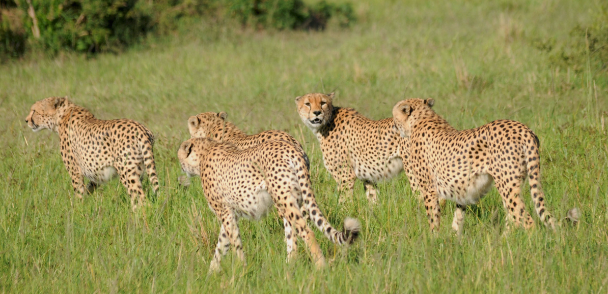

# Welcome to RADCamp 2025 - The Brisbane Edition

In association with the The Society for Conservation Biology's 
[**32nd International Congress for Conservation Biology (ICCB 2025)**](https://conbio.org/mini-sites/iccb-2025/)  

{: width="75%"}  

**RADCamp 2023** 
June 14-15, 2025  
University of Queensland
Exact Location TBD

## Arriving at the University
TBD

## Lunch Options,  Water Coolers, Snacks & Coffee
TBD

# Organisers, Instructors, and Facilitators

  - Isaac Overcast - Columbia University
  - Laura Bertola - National Centre for Biological Sciences
  - Laura Tensen - University of Copenhagen
  - Anubhab Khan - University of Glasgow

# Schedule

Times       | Saturday (July 22) | Sunday (July 23) |
-----       | ------------------ | ---------------- | 
8:30-9:00   | Check-in and Introductions | Check-in and Recap Day 1 |
9:00-10:30  | [Intro to Conservation Genetics](./Kigali workshop intro FINAL.pdf) | [RADSeq Assembly w/ ipyrad part II](ipyrad-CLI-FullTutorial.md) |
10:30-10:45 | Coffee Break | Coffee Break |
10:45-12:00 | [Software Setup](setup.md) | [Clustering Analysis: PCA](PCA_API.md) |
12:00-13:00 | Lunch | Lunch |
13:00-14:45 | [Intro to RADseq data](./radseq-intro) & [Data QC](data_QC.md) | [Phylogenetic Inference: RAxML](RAxML_API.md) |
14:45-15:00 | Coffee Break | Coffee Break |
15:00-17:00 | [RADSeq Assembly w/ ipyrad part I](ipyrad-CLI-FullTutorial.md) | [Spatial Popgen Analysis: FEEMS](FEEMS_API.md) |

## Additional ipyrad analysis cookbooks

* [Clustering analysis: STRUCTURE](05_STRUCTURE_API.md)
* [BPP - Bayesian inference under a multi-species coalescent model](https://nbviewer.jupyter.org/github/dereneaton/ipyrad/blob/master/tests/cookbook-bpp-species-delimitation.ipynb)
* [Bucky - Phylogenetic concordance analysis](https://nbviewer.jupyter.org/github/dereneaton/ipyrad/blob/master/tests/cookbook-bucky.ipynb)
* [ABBA-BABA - Admixture analysis](https://nbviewer.jupyter.org/github/dereneaton/ipyrad/blob/master/tests/cookbook-abba-baba.ipynb)

## Source of Empirical Data for the Workshop
* [Cheetah data from Prost *et al.* 2022](https://onlinelibrary.wiley.com/doi/10.1111/mec.16577)

©Laura Bertola

## RADCamp Kigali 2025 co-sponsored by:

# RADCamp Kigali 2025 Group Photo

**Don't forget to get a group photo!**

## Acknowledgements
RADCamp tutorial contributors and instructors (over the years): Isaac Overcast, Deren Eaton,
Sandra Hoffberg, Natalia Bayona-Vasquez, Mariana Vasconcellos, Laura Bertola, Josiah Kuja, Anhubab Kahn,
Arianna Kuhn.
