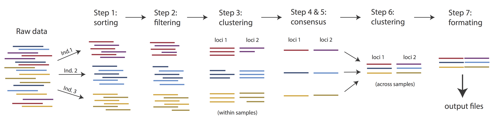

# ipyrad command line assembly tutorial

This is the full tutorial for the command line interface (**CLI**) for ipyrad.
In this tutorial we'll walk through the entire assembly, from raw data to output
files for downstream analysis. This is meant as a broad introduction to
familiarize users with the general workflow, and some of the parameters and
terminology. We will use and empirical dataset of paired-end seadragon ddRAD data as 
an example in this tutorial. Of course, you can replicate the steps described here 
with your own data, or any other RADseq dataset. 

If you are new to RADseq analyses, this tutorial will provide a simple
overview of how to execute ipyrad, what the data files look like, how to
check that your analysis is working, and what the final output formats
will be. We will also cover how to run ipyrad on a cluster and how to do so
efficiently.

Each grey cell in this tutorial indicates a command line interaction. 
Lines starting with `$ ` indicate a command that should be executed in your 
terminal. All lines in code cells beginning with \#\# are 
comments and should not be copied and executed. All other lines should 
be interpreted as output from the issued commands.

# Overview of assembly steps
Very roughly speaking, ipyrad exists to transform raw data coming off the 
sequencing instrument into output files that you can use for downstream 
analysis. 



The basic steps of this process are as follows:

* Step 1 - Demultiplex/Load Raw Data
* Step 2 - Trim and Quality Control
* Step 3 - Cluster or reference-map within Samples
* Step 4 - Calculate Error Rate and Heterozygosity
* Step 5 - Call consensus sequences/alleles
* Step 6 - Cluster across Samples
* Step 7 - Apply filters and write output formats

Detailed information about ipyrad, including instructions for installation and 
troubleshooting, can be found [here](https://ipyrad.readthedocs.io/en/master/).

> **Note on files in the project directory:** Assembling RADseq type 
sequence data requires a lot of different steps, and these steps 
generate a **lot** of intermediary files. ipyrad organizes these files 
into directories, and it prepends the name of your assembly to each 
directory with data that belongs to it. One result of this is that 
you can have multiple assemblies of the same raw data with different 
parameter settings and you don't have to manage all the files yourself! 
(See [Branching assemblies](https://ipyrad.readthedocs.io/en/latest/8-branching.html) for more info). Another
result is that **you should not rename or move any of the directories
inside your project directory**, unless you know what you're doing or
you don't mind if your assembly breaks.

# Getting Started

We will be running through the assembly of the seadragon data using the ipyrad
CLI. So, if you don't have the terminal window open, open a browser window and navigate to 
[https://pinky.eaton-lab.org/](https://pinky.eaton-lab.org/) and create a **new "Terminal"**
using the "New" button. Begin by making sure you are in the `ipyrad-workshop` directory.

```
$ cd ~/ipyrad-workshop
```

## ipyrad help
To better understand how to use ipyrad, let's take a look at the help argument.
We will use some of the ipyrad arguments in this tutorial (for example: -n, -p,
-s, -c, -r). But, the complete list of optional arguments and their explanation
is below.

```
$ ipyrad -h

usage: ipyrad [-h] [-v] [-r] [-f] [-q] [-d] [-n NEW] [-p PARAMS] [-s STEPS] [-b [BRANCH [BRANCH ...]]]
              [-m [MERGE [MERGE ...]]] [-c cores] [-t threading] [--MPI] [--ipcluster [IPCLUSTER]]
              [--download [DOWNLOAD [DOWNLOAD ...]]]

optional arguments:
  -h, --help            show this help message and exit
  -v, --version         show program's version number and exit
  -r, --results         show results summary for Assembly in params.txt and exit
  -f, --force           force overwrite of existing data
  -q, --quiet           do not print to stderror or stdout.
  -d, --debug           print lots more info to ipyrad_log.txt.
  -n NEW                create new file 'params-{new}.txt' in current directory
  -p PARAMS             path to params file for Assembly: params-{assembly_name}.txt
  -s STEPS              Set of assembly steps to run, e.g., -s 123
  -b [BRANCH [BRANCH ...]]
                        create new branch of Assembly as params-{branch}.txt, and can be used to drop samples from
                        Assembly.
  -m [MERGE [MERGE ...]]
                        merge multiple Assemblies into one joint Assembly, and can be used to merge Samples into one
                        Sample.
  -c cores              number of CPU cores to use (Default=0=All)
  -t threading          tune threading of multi-threaded binaries (Default=2)
  --MPI                 connect to parallel CPUs across multiple nodes
  --ipcluster [IPCLUSTER]
                        connect to running ipcluster, enter profile name or profile='default'
  --download [DOWNLOAD [DOWNLOAD ...]]
                        download fastq files by accession (e.g., SRP or SRR)

  * Example command-line usage:
    ipyrad -n data                       ## create new file called params-data.txt
    ipyrad -p params-data.txt -s 123     ## run only steps 1-3 of assembly.
    ipyrad -p params-data.txt -s 3 -f    ## run step 3, overwrite existing data.

  * HPC parallelization across 32 cores
    ipyrad -p params-data.txt -s 3 -c 32 --MPI

  * Print results summary
    ipyrad -p params-data.txt -r

  * Branch/Merging Assemblies
    ipyrad -p params-data.txt -b newdata
    ipyrad -m newdata params-1.txt params-2.txt [params-3.txt, ...]

  * Subsample taxa during branching
    ipyrad -p params-data.txt -b newdata taxaKeepList.txt

  * Download sequence data from SRA into directory 'sra-fastqs/'
    ipyrad --download SRP021469 sra-fastqs/

  * Documentation: http://ipyrad.readthedocs.io
```

## Create a new parameters file
ipyrad uses a text file to hold all the parameters for a given assembly.
Start by creating a new parameters file with the `-n` flag. This flag
requires you to pass in a name for your assembly. In the example we use
`seadragon` but the name can be anything at all. Once you start
analysing your own data you might call your parameters file something
more informative, including some details on the
settings.

```bash
# Now create a new params file named 'seadragon'
$ ipyrad -n seadragon
```

This will create a file in the current directory called `params-seadragon.txt`.
The params file lists on each line one parameter followed by a \#\# mark,
then the name of the parameter, and then a short description of its purpose.
Lets take a look at it.

```bash 
$ cat params-seadragon.txt
```
```
------- ipyrad params file (v.0.9.105)------------------------------------------
seadragon                      ## [0] [assembly_name]: Assembly name. Used to name output directories for assembly steps
/home/jovyan/ipyrad-workshop   ## [1] [project_dir]: Project dir (made in curdir if not present)
                               ## [2] [raw_fastq_path]: Location of raw non-demultiplexed fastq files
                               ## [3] [barcodes_path]: Location of barcodes file
                               ## [4] [sorted_fastq_path]: Location of demultiplexed/sorted fastq files
denovo                         ## [5] [assembly_method]: Assembly method (denovo, reference)
                               ## [6] [reference_sequence]: Location of reference sequence file
rad                            ## [7] [datatype]: Datatype (see docs): rad, gbs, ddrad, etc.
TGCAG,                         ## [8] [restriction_overhang]: Restriction overhang (cut1,) or (cut1, cut2)
5                              ## [9] [max_low_qual_bases]: Max low quality base calls (Q<20) in a read
33                             ## [10] [phred_Qscore_offset]: phred Q score offset (33 is default and very standard)
6                              ## [11] [mindepth_statistical]: Min depth for statistical base calling
6                              ## [12] [mindepth_majrule]: Min depth for majority-rule base calling
10000                          ## [13] [maxdepth]: Max cluster depth within samples
0.85                           ## [14] [clust_threshold]: Clustering threshold for de novo assembly
0                              ## [15] [max_barcode_mismatch]: Max number of allowable mismatches in barcodes
2                              ## [16] [filter_adapters]: Filter for adapters/primers (1 or 2=stricter)
35                             ## [17] [filter_min_trim_len]: Min length of reads after adapter trim
2                              ## [18] [max_alleles_consens]: Max alleles per site in consensus sequences
0.05                           ## [19] [max_Ns_consens]: Max N's (uncalled bases) in consensus
0.05                           ## [20] [max_Hs_consens]: Max Hs (heterozygotes) in consensus
4                              ## [21] [min_samples_locus]: Min # samples per locus for output
0.2                            ## [22] [max_SNPs_locus]: Max # SNPs per locus
8                              ## [23] [max_Indels_locus]: Max # of indels per locus
0.5                            ## [24] [max_shared_Hs_locus]: Max # heterozygous sites per locus
0, 0, 0, 0                     ## [25] [trim_reads]: Trim raw read edges (R1>, <R1, R2>, <R2) (see docs)
0, 0, 0, 0                     ## [26] [trim_loci]: Trim locus edges (see docs) (R1>, <R1, R2>, <R2)
p, s, l                        ## [27] [output_formats]: Output formats (see docs)
                               ## [28] [pop_assign_file]: Path to population assignment file
                               ## [29] [reference_as_filter]: Reads mapped to this reference are removed in step 3
```

In general the defaults are sensible, and we won't mess with them for now, 
but there are a few parameters we *must* check and update:
* The path to the raw data
* The dataype
* The restriction overhang sequence(s)

Because we're looking at population-level data, we suggest to increase the 
clustering threshold `[14] [clust_threshold]`. You can also change `[27] 
[output_formats]`. When you put `*`, ipyrad will automatically save your output 
in all available formats, see [the manual](https://ipyrad.readthedocs.io/en/master/output_formats.html#full-output-formats).

If you look in the file browser pane (to the left) you should
now see a new file `params-seadragon.txt` in the file browser.


Clicking on this new file will open a text editor so you can modify and save
changes to this params file.


We need to specify where the raw data files are located, the type of data we
are using (.e.g., 'gbs', 'rad', 'ddrad', 'pairddrad), and which enzyme cut site
overhangs are expected to be present on the reads. Change the following lines
in your params files to look like this (**Be careful to notice which lines
of the params file you are modifying**):

```bash
./raws/*.fastq.gz               ## [4] [sorted_fastq_path]: Location of demultiplexed/sorted fastq files
ddrad                            ## [7] [datatype]: Datatype (see docs): rad, gbs, ddrad, etc.
TGCAG,ACG                           ## [8] [restriction_overhang]: Restriction overhang (cut1,) or (cut1, cut2)
0.9                             ## [14] [clust_threshold]: Clustering threshold for de novo assembly
*                               ## [27] [output_formats]: Output formats (see docs)
```
**NB:** Don't forget to choose "File->Save Text" after you are done editing!

The Seadragpon data were generated using a double-digest restriction-site associated 
DNA (ddRAD) sequencing approach [Peterson *et al.*, 
2012](https://journals.plos.org/plosone/article?id=10.1371/journal.pone.0037135) and 
used the restriction enzymes [PstI](https://www.neb.com/en-us/products/r0140-psti) & 
[HpyCH4IV](https://www.neb.com/en-us/products/r0619-hpych4iv?srsltid=AfmBOoq-K9hCFJeDDKyKvOnIuK61fDPRicig9SRnzrYmQ1MzA6CraJHC) which leave overhang
sequences of `TGCAG` and `ACG`, respectively.

Once we start running the analysis ipyrad will create several new directories to
hold the output of each step for this assembly. By default the new directories
are created in the `project_dir` directory and use the prefix specified by the
`assembly_name` parameter. For this example assembly all the intermediate
directories will be of the form: `/home/jovyan/ipyrad-workshop/seadragon_*`. 

# Step 1: Loading/Demultiplexing the raw data

Sometimes, you'll receive your data as a huge pile of reads, and you'll need to
split it up and assign each read to the sample it came from. This is called
demultiplexing and is done by unique barcodes which allow you to recognize
individual samples. In that case, you'll have to provide a path to the raw
non-demultiplexed fastq files `[2]` and the path to the barcode file `[3]` in
your params file. In our case, the samples are already demultiplexed and we have
1 file per sample. The path to these files is indicated in `[4]` in the params
file. Even though we do not need to demultiplex our data here, we still need to
run this step to import the data into ipyrad.

> **Note on step 1:** If we would have data which need demultiplexing, Step 1 
will create a new folder, called `seadragon_fastqs`. Because our data are already 
demultiplexed, this folder will not be created.

Now lets run step 1! 

> **Special Note:** In some cases it's useful to specify the number of cores with
the `-c` flag. If you do not specify the number of cores ipyrad assumes you want
**all** of them. 

```bash
## -p    the params file we wish to use
## -s    the step to run
## -c    run on 4 cores
$ ipyrad -p params-seadragon.txt -s 1 -c 4

 -------------------------------------------------------------
  ipyrad [v.0.9.105]
  Interactive assembly and analysis of RAD-seq data
 -------------------------------------------------------------
  Parallel connection | 9aea44960942: 4 cores

  Step 1: Loading sorted fastq data to Samples
  [####################] 100% 0:00:13 | loading reads
  30 fastq files loaded to 30 Samples.
  Parallel connection closed.
```

## In-depth operations of running an ipyrad step
Any time ipyrad is invoked it performs a few housekeeping operations: 
1. Load the assembly object - Since this is our first time running any steps we
need to initialize our assembly.
2. Start the parallel cluster - ipyrad uses a parallelization library called
ipyparallel. Every time we start a step we launch the parallel clients. This
makes your assemblies go **very** fast.
3. Do the work - Actually perform the work of the requested step(s) (in this
case demultiplexing reads to samples).
4. Save, clean up, and exit - Save the state of the assembly, and spin down
the ipyparallel cluster.

As a convenience ipyrad internally tracks the state of all your steps in your 
current assembly, so at any time you can ask for results by invoking the `-r`
flag. We also use the `-p` argument to tell it which params file (i.e., which
assembly) we want it to print stats for.

```bash
$ ipyrad -p params-seadragon.txt -r
```
```
  loading Assembly: seadragon
  from saved path: ~/ipyrad-workshop/seadragon.json

Summary stats of Assembly seadragon
------------------------------------------------
      state  reads_raw
Bic1      1     125000
Bic2      1     125000
Bic3      1     125000
Bic4      1     125000
Bic5      1     125000
Bic6      1     125000
Bot1      1     125000
Bot2      1     125000
Bot3      1     125000
Bot4      1     125000
Fli1      1     125000
Fli2      1     125000
Fli3      1     125000
Fli4      1     125000
Gue1      1     125000
Hob1      1     125000
Hob2      1     125000
Jer1      1     125000
Jer2      1     125000
Jer3      1     125000
Jer4      1     125000
Por1      1     125000
Por2      1     125000
Por3      1     125000
Por4      1     125000
Por5      1     125000
Syd1      1     125000
Syd2      1     125000
Syd3      1     125000
Syd4      1     125000


Full stats files
------------------------------------------------
step 1: ./seadragon_s1_demultiplex_stats.txt
step 2: None
step 3: None
step 4: None
step 5: None
step 6: None
step 7: None
```

If you want to get even **more** info, ipyrad tracks all kinds of wacky stats and
saves them to a file inside the directories it creates for each step. For
instance, to see full stats for step 1 (the wackyness of the step 1 stats at this
point isn't very interesting, but we'll see stats for later steps are more verbose):

# Step 2: Filter reads

This step filters reads based on quality scores and maximum number of uncalled
bases, and can be used to detect Illumina adapters in your reads, which is
sometimes a problem under a couple different library prep scenarios. We know the
our data have an excess of low-quality bases toward the distal end (remember the
FastQC results!), so lets use this opportunity to trim off some of those low
quality regions. To account for this we will trim reads to 100bp, removing the
last 10bp of our 110bp reads. 

Edit your params file again with and change the following two parameter settings:

```
0, 100, 0, 0                     ## [25] [trim_reads]: Trim raw read edges (R1>, <R1, R2>, <R2) (see docs)
```

```bash
$ ipyrad -p params-seadragon.txt -s 2 -c 4
```
```
  loading Assembly: seadragon
  from saved path: ~/ipyrad-workshop/seadragon.json

 -------------------------------------------------------------
  ipyrad [v.0.9.105]
  Interactive assembly and analysis of RAD-seq data
 -------------------------------------------------------------
  Parallel connection | 9aea44960942: 4 cores

  Step 2: Filtering and trimming reads
  [####################] 100% 0:01:29 | processing reads

  Parallel connection closed.
```

The filtered files are written to a new directory called `seadragon_edits`. Again, 
you can look at the results from this step and some handy stats tracked 
for this assembly.

```bash
$ cat seadragon_edits/s2_rawedit_stats.txt 
```
```
      reads_raw  trim_adapter_bp_read1  trim_quality_bp_read1  reads_filtered_by_Ns  reads_filtered_by_minlen  reads_passed_filter
Bic1     125000                   6822                 123182                    70                        73               124857
Bic2     125000                   7052                 145012                    73                       104               124823
Bic3     125000                   6713                 136459                    82                        92               124826
Bic4     125000                   6183                 121220                    82                        88               124830
Bic5     125000                   5717                 142688                    68                        69               124863
Bic6     125000                   6522                 131647                    67                        66               124867
Bot1     125000                   3973                  91566                     0                        31               124969
Bot2     125000                   4078                  97461                     0                        51               124949
Bot3     125000                   5747                 215901                    44                        75               124881
Bot4     125000                   5756                 124134                    44                        95               124861
Fli1     125000                   7283                 139372                    75                        86               124839
Fli2     125000                   7080                 145392                    74                        91               124835
Fli3     125000                   6124                 149969                    68                        78               124854
Fli4     125000                   6857                 144414                    74                        68               124858
Gue1     125000                   7472                 168010                    66                        75               124859
Hob1     125000                   5763                 135579                    67                        78               124855
Hob2     125000                   6038                 150287                    78                        84               124838
Jer1     125000                   6564                 159943                    67                        76               124857
Jer2     125000                   6788                 159088                    74                        75               124851
Jer3     125000                   6595                 159819                    69                        75               124856
Jer4     125000                   6584                 134476                    75                        77               124848
Por1     125000                   6032                 143820                    83                        69               124848
Por2     125000                   5787                 135904                    60                        71               124869
Por3     125000                   6039                 148925                    69                        67               124864
Por4     125000                   6875                 143668                    62                        77               124861
Por5     125000                   6939                 153625                    71                        93               124836
Syd1     125000                   6899                 125813                    61                        79               124860
Syd2     125000                   7380                 153122                    69                        76               124855
Syd3     125000                   7911                 128737                    63                        96               124841
Syd4     125000                   7387                 133453                    68                        91               124841
```

```bash
## Get current stats including # raw reads and # reads after filtering.
$ ipyrad -p params-seadragon.txt -r
```

You might also take a closer look at the filtered reads: 

```bash
$ zcat seadragon_edits/Bic1.trimmed_R1_.fastq.gz | head -n 20
```
```
@SRR12395901.2 3_11401_6247_1055/1
TGCAGGTCAGCGCTCAAGTGCGAGTTTTGCACCTCCAGTCGACTCGACATACCTTGAATCTGAGCCACCTGCAATGAAGAAGACAGATGTGACGCTCTAA
+
EEEEEEEEEEEEEEEEEEEEEAEE6EEEEEAEEEEA/EEAA/EAEE<AAE<EE</</AEE<</EEE/EEAEAAEEAEAE/<EEAEE/EEEE//EE/E<E/
@SRR12395901.3 3_11401_9855_1058/1
TGCAGATTCTTCTATGAAAATAGAGCCCCTTGTCTTCGTCTTGTTTGGTTTTGACAATCATACAGCGTGAGCGCTTCAATTGTTAGCTTTGGCTTTCCAT
+
EEEEEEEEEEEEEEEEEEEEEEEEEEEEEEEEAEEE<EAEEEEEAEEEEEEEEEAEEEEEEAEEEEEEEEEEEEEAE/EEEEEE/EEEEEEEEEEEAAEA
@SRR12395901.4 3_11401_4121_1059/1
TGCAGCAGCCTAGAAACCCTCCGGAGTGGAACTGAAAGTTCAGCGGGATGCGTCATAGCCCACGGGACCACGCAGCGGGTGTTCCCCTTCATGCTTATTA
+
EEEEEE6EEEEEEEAEEEEEEAAAEE/EEE/EEEEEEEE/EAEEEEAEEEEEAAEA<EAAE/EEEE/AE</EEAEEAE//A/A6E/EAAAE<AAE6A<AE
@SRR12395901.5 3_11401_17757_1060/1
TGCAGCATTTTGGAATTACCGTAAACAAAACTCAGAGGAAACACAAAAGAAATCGAAAACCACCGTCCACAATTAAGTGTTTGTTGAGCAAACAAGATTT
+
EEEEEEEEEEEEEEEEEEEEEEEEEEEEEEEEEEEEEEEEEEEEAEEEEEEEEEAEEEE6AEEAEEAAEAEEEEEEEEEEEEEEAEEEAE<EEAEEEEEE
@SRR12395901.6 3_11401_20812_1064/1
TGCAGTGATGCGGACTTTGTATCGGTCCGTTGTGGTAAAGAAGGAGCTAAGCCGAAAGGCGATGCTCTTGATTTACCAGACAGAACGAAAGTACACTGGC
+
EEEEEEEEEEEEEEEEEEEEEEEEEEEAEEEEEEEEEAEEEEEEEEEEAEAE6EEEEEEEEEEE6EEEEEEEEEEEEEEEEEEEEAEAEAE<E<E<E<EA
```

This is actually really cool, because we can already see the results of our
applied parameters. All reads have been trimmed to 100bp.

# Step 3: denovo clustering within-samples

For a *de novo* assembly, step 3 de-replicates and then clusters reads within
each sample by the set clustering threshold and then writes the clusters to new
files in a directory called `seadragon_clust_0.9`. Intuitively, we are trying to
identify all the reads that map to the same locus within each sample. You may
remember the default value is 0.85, but we have increased if to 0.9 in our
params file. This value dictates the percentage of sequence similarity that
reads must have in order to be considered reads at the same locus. 

> **NB:** The true name of this output directory will be dictated by the value
you set for the `clust_threshold` parameter in the params file.

You'll more than likely want to experiment with this value, but 0.9 is a
reasonable default for population genetic-scale data, balancing over-splitting
of loci vs over-lumping. Don't mess with this until you feel comfortable with
the overall workflow, and also until you've learned about [branching assemblies](https://ipyrad.readthedocs.io/en/latest/8-branching.html).

> **NB:** What is the best clustering threshold to choose? "It depends."

It's also possible to incorporate information from a reference genome to
improve clustering at this step, if such a resources is available for your
organism (or one that is relatively closely related). We will not cover
reference based assemblies in this workshop, but you can refer to the
[ipyrad documentation](https://ipyrad.readthedocs.io/en/master/tutorial_advanced_cli.html) for more information.

> **Note on performance:** Steps 3 and 6 generally take considerably longer
than any of the steps, due to the resource intensive clustering and alignment
phases. These can take on the order of 10-100x as long as the next longest
running step. This depends heavily on the number of samples in your dataset,
the number of cores, the length(s) of your reads, and the "messiness" of your
data.

Now lets run step 3:

```bash
$ ipyrad -p params-seadragon.txt -s 3 -c 4
```

**TIME FOR A COFFEE BREAK:** Step 3 will run for about 20 minutes on the
cloud server, so this might be a good time for a coffee break once everyone
gets this step running.

```
  loading Assembly: seadragon
  from saved path: ~/ipyrad-workshop/seadragon.json

 -------------------------------------------------------------
  ipyrad [v.0.9.105]
  Interactive assembly and analysis of RAD-seq data
 -------------------------------------------------------------
  Parallel connection | 9aea44960942: 4 cores

  Step 3: Clustering/Mapping reads within samples
  [####################] 100% 0:00:13 | dereplicating
  [####################] 100% 0:07:46 | clustering/mapping
  [####################] 100% 0:00:00 | building clusters
  [####################] 100% 0:00:00 | chunking clusters
  [####################] 100% 0:10:25 | aligning clusters
  [####################] 100% 0:00:59 | concat clusters
  [####################] 100% 0:00:05 | calc cluster stats

  Parallel connection closed.
```

In-depth operations of step 3:
* dereplicating - Merge all identical reads
* clustering - Find reads matching by sequence similarity threshold
* building clusters - Group similar reads into clusters
* chunking clusters - Subsample cluster files to improve performance of 
alignment step
* aligning clusters - Align all clusters
* concat clusters - Gather chunked clusters into one full file of aligned clusters
* calc cluster stats - Just as it says.

Again we can examine the results. The stats output tells you how many clusters
were found ('clusters_total'), and the number of clusters that pass the mindepth
thresholds ('clusters_hidepth'). We'll go into more detail about mindepth settings
in some of the advanced tutorials.

```bash
$ ipyrad -p params-seadragon.txt -r
```
```
Summary stats of Assembly seadragon
------------------------------------------------
      state  reads_raw  reads_passed_filter  clusters_total  clusters_hidepth
Bic1      3     125000               124859           47612              4100
Bic2      3     125000               124824           48941              4017
Bic3      3     125000               124827           48287              4013
Bic4      3     125000               124830           47282              4211
Bic5      3     125000               124863           46540              4215
Bic6      3     125000               124867           47676              4089
Bot1      3     125000               124969           42028              4706
Bot2      3     125000               124949           41646              4890
Bot3      3     125000               124884           48446              3858
Bot4      3     125000               124862           45790              4282
Fli1      3     125000               124839           48998              3992
Fli2      3     125000               124835           49533              3915
Fli3      3     125000               124854           47710              4125
Fli4      3     125000               124858           49176              4041
Gue1      3     125000               124860           52928              3539
Hob1      3     125000               124856           47074              4270
Hob2      3     125000               124841           47458              4194
Jer1      3     125000               124859           46663              4107
Jer2      3     125000               124855           47953              3985
Jer3      3     125000               124859           46575              4275
Jer4      3     125000               124848           47413              4066
Por1      3     125000               124848           46505              4252
Por2      3     125000               124869           46652              4342
Por3      3     125000               124864           48687              4123
Por4      3     125000               124861           47972              4187
Por5      3     125000               124836           49674              3896
Syd1      3     125000               124869           44755              4510
Syd2      3     125000               124863           46884              4164
Syd3      3     125000               124849           47788              4186
Syd4      3     125000               124852           47547              4180

Full stats files
------------------------------------------------
step 1: ./seadragon_s1_demultiplex_stats.txt
step 2: ./seadragon_edits/s2_rawedit_stats.txt
step 3: ./seadragon_clust_0.9/s3_cluster_stats.txt
step 4: None
step 5: None
step 6: None
step 7: None
```

Again, the final output of step 3 is dereplicated, clustered files for
each sample in `./seadragon_clust_0.9/`. You can get a feel for what
this looks like by examining a portion of one of the files. 

```bash
$ zcat seadragon_clust_0.9/Jer3.clustS.gz | head -n 24
```

You'll see something similar to what is printed below. **Note:** The value
of `size=` in the header of each sequence indicates the number of identical
copies of this read that were dereplicated at the start of step 3.

```
0001e61f40f4261603dbbb248208b917;size=5;*
TGCAGATAGGTGGTTTATGGATAGCAAAATCAGGGAGAATTGAAAGAAAGGGTGAAGAGAGGATATGTTACATTAGCAAGAATCTGGTACAAGACAGTGC
a49f2166e08e8133baa32665157bbc89;size=2;+
TGCAGATAGGTGGTTTATGGATAGCAAAATCAGGGAGAATTGAAAGAAAGGGTGAAGAGAGGATATGTTACATTAGAAAGAATCTGGTACAAGACAGTGC
//
//
0008bb12d45464a3e8142a543ac62744;size=4;*
TGCAGACCTGGACTTCCTGTTCAACCAGCCGGAGCAGAGCGACAACTTCCAGTTCCTCTTCACCTCCGAGAGCCCCACGGATAACAAGGATACCACCACC
9f616141ecb8356eb82ca072af6732d2;size=1;+
TGCAGACCTGGACTTCCTGTTCAACCAGCCCGAGCAAAGCGACAACTTCAAGTTCCTCATCACCACCGAGAGCCCCACGCATAACAAAGAAACCACCACC
cdf61c7f79359cc2468a3cbcd9c42b7d;size=1;+
TGCAGACCTGGACTTCCTGTTCAACCAGCCGGAGCAGAGCGACAACTTCCAGTTCCTCTTCACCTCCGAGAGCCCCACGGATACCAAGGATACCACCCCC
4f3c5723eb97bcd357ab798c67b516de;size=1;+
TGCAGACCTGGACTTCCTGTTCAACCAGCCGGAGCAGAGCGACAACTTCCTGTTCCTCTTCACCTCCGAGAGCCCCACGGATAACAAGGATACCACCACC
e6497766697220afd91c23dbc3f70710;size=1;+
TGCAGACCTGGACTTCCTGTTCAACCAGCCGGAGCAGAGCGACAACTTCCAGTTCCTCTTCACCTCCGAGAGCCCCACGGATAACAAGGATACCCCCACC
//
//
0013f0cc71e034a26d60f0bdba31cd2f;size=1;*
TGCAGCCTATCTGGTACTTGACACCCCTTGAAAGAAGGCAACATGTAGCTTAATGCAAGCATTGTATTACTGTTATCTCACTGTTGCGCATGGTGTCTAC
db5cfa9d18f0c9fec6921bfa24ee1267;size=1;+
TGCAGCCTATCTGGTACTTGACACCCCTTGAAAGAAGGCAACATGAAGCTTAATGCAAGCATTGTATTACTGTTATCTCACTGTTGCGCATGGTGTCTAC
//
//
```

Reads that are sufficiently similar (based on the above sequence similarity
threshold) are grouped together in clusters separated by "//". The first cluster
above is *probably* heterozygous. The second cluster is *probably* homozygous
with some sequencing error. The third cluster is ambiguous. We don't want to go
through and 'decide' by ourselves for each cluster, so thankfully, untangling
this mess is what steps 4 & 5 are all about. 

# Step 4: Joint estimation of heterozygosity and error rate

In Step 3 reads that are sufficiently similar (based on the specified sequence
similarity threshold) are grouped together in clusters separated by "//". We
examined the `head` of one of the sample cluster files at the end of the last
exercise, but here we've cherry picked a couple clusters with more pronounced
features.

Here's a nice homozygous cluster, with probably one read with sequencing error:
```
0082e23d9badff5470eeb45ac0fdd2bd;size=5;*
TGCATGTAGTGAAGTCCGCTGTGTACTTGCGAGAGAATGAGTAGTCCTTCATGCA
a2c441646bb25089cd933119f13fb687;size=1;+
TGCATGTAGTGAAGTCCGCTGTGTACTTGCGAGAGAATGAGCAGTCCTTCATGCA
```

Here's a probable heterozygote, or perhaps repetitive element -- a little bit
messier (note the indels):
```
0091f3b72bfc97c4705b4485c2208bdb;size=3;*
TGCATACAC----GCACACA----GTAGTAGTACTACTTTTTGTTAACTGCAGCATGCA
9c57902b4d8e22d0cda3b93f1b361e78;size=3;-
TGCATACAC----ACACACAACCAGTAGTAGTATTACTTTTTGTTAACTGCAGCATGCA
d48b3c7b5a0f1840f54f6c7808ca726e;size=1;+
TGCATACAC----ACAAACAACCAGTTGTAGTACTACTTTTTGTTAACTGCAGCATGAA
fac0c64aeb8afaa5dfecd5254b81b3c0;size=1;+
TGCATACAC----GCACACAACCAGTAGTAGTACTACTTTTTGTTAACTGCAGCATGTA
f31cbca6df64e7b9cb4142f57e607a88;size=1;-
TGCATGCACACACGCACGCAACCAGTAGTTGTACTACTTTTTGTTAACTGCAGCATGCA
935063406d92c8c995d313b3b22c6484;size=1;-
TGCATGCATACACGCCCACAACCAGTAGTAGTACAACTTTATGTTAACTGCAGCATGCA
d25fcc78f14544bcb42629ed2403ce74;size=1;+
TGCATACAC----GCACACAACCAGTAGTAGTACTACTTTTTGTTAATTGCAGCATGCA
```

Here's a nasty one!
```
008a116c7a22d6af3541f87b36a8d895;size=3;*
TGCATTCCTATGGGAATCATGAAGGGGCTTCTCTCTCCCTCA-TTTTTAAAGCGACCCTTTCCAAACTTGGTACAT----
a7bde31f2034d2e544400c62b1d3cbd5;size=2;+
TGCATTCCTATGGGAAACATGAAGGGACTTCTCTCTCCCTCG-TTTTTAAAGTGACTCTGTCCAAACTTGGTACAT----
107e1390e1ac8564619a278fdae3f009;size=2;+
TGCATTCCTATGGGAAACATGAAGGGGGTTCTCTCTCCCTCG-ATTTTAAAGCGACCCTGTCCAAACTTGGTACAT----
8f870175fb30eed3027b7aec436e93e6;size=2;+
TGCATTCCTATGGGAATCATGGAAGGGCTTCTCTCTCCCTCA-TTTTTAAAGCAACCCTGACCAAAGTTGGTACAT----
445157bc1e7540734bf963eb8629d827;size=2;+
TGCATTCCTACGGGAATCATGGAGGGGCTTCTCTCTCCCTCG-TTTTTAAAGCGACCCTGACCAAACTTGGTACAT----
9ddd2d8b6fb52157f17648682d09afda;size=1;+
TGCATTCCTATGAGAAACATGATGGGGCTTCTCTTTCCCTCATTTTTT--AGTTAGCCTTACCAAAGTTGGTACATT---
fc86d48758313be18587d6f185e5c943;size=1;+
TGCATTCCTGTGGGAAACATGAAGGGGCTTCTCTCTCCATCA-TTTTTAAAGCGACCCTGATCAAATTTGGTACAT----
243a5acbee6cd9cd223252a8bb65667e;size=1;+
TGCATTCCTATGGGAAACATGAAAGGGTTTCTCTCTCCCTCG-TTTTAAAAGCGACCCTGTCCAAACATGGTACAT----
55e50e131ec21fce8021f22de49bb7be;size=1;+
TGCATTCCAATGGGAAACATGAAAGGGCTTCTCTCTCCCTCG-TTTTTAAAGCGACCCTGTCCAAACTTGGTACAT----
```

For this final cluster it's really hard to call by eye, that's why we make the
computer do it! 

In this step we jointly estimate sequencing error rate and heterozygosity to 
help us figure out which reads are "real" and which include sequencing error. 
We need to know which reads are "real" because in diploid organisms there are a
maximum of 2 alleles at any given locus. If we look at the raw data and there
are 20 different "alleles", and 2 of them are very high frequency, and
the rest are singletons then this gives us evidence that the 2 high frequency
alleles are the good reads and the rest are probably junk. This step is pretty
straightforward, and pretty fast. Run it like this:

```bash
$ ipyrad -p params-seadragon.txt -s 4 -c 4
```
```
  loading Assembly: seadragon
  from saved path: ~/ipyrad-workshop/seadragon.json

 -------------------------------------------------------------
  ipyrad [v.0.9.105]
  Interactive assembly and analysis of RAD-seq data
 -------------------------------------------------------------
  Parallel connection | 9aea44960942: 4 cores

  Step 4: Joint estimation of error rate and heterozygosity
  [####################] 100% 0:00:46 | inferring [H, E]

  Parallel connection closed.
```

In terms of results, there isn't as much to look at as in previous steps, though
you can invoke the `-r` flag to see the estimated heterozygosity and error rate
per sample.

```bash
$ ipyrad -p params-seadragon.txt -r
```
```
Summary stats of Assembly seadragon
------------------------------------------------
      state  reads_raw  reads_passed_filter  clusters_total  clusters_hidepth  hetero_est  error_est
Bic1      4     125000               124859           47612              4100    0.005173   0.006077
Bic2      4     125000               124824           48941              4017    0.005009   0.006952
Bic3      4     125000               124827           48287              4013    0.005191   0.006619
Bic4      4     125000               124830           47282              4211    0.005024   0.005970
Bic5      4     125000               124863           46540              4215    0.005032   0.007178
Bic6      4     125000               124867           47676              4089    0.005345   0.006683
Bot1      4     125000               124969           42028              4706    0.004639   0.003464
Bot2      4     125000               124949           41646              4890    0.004088   0.003160
Bot3      4     125000               124884           48446              3858    0.005849   0.005025
Bot4      4     125000               124862           45790              4282    0.004411   0.004392
Fli1      4     125000               124839           48998              3992    0.005767   0.006960
Fli2      4     125000               124835           49533              3915    0.006010   0.007096
Fli3      4     125000               124854           47710              4125    0.005757   0.006959
Fli4      4     125000               124858           49176              4041    0.005880   0.006990
Gue1      4     125000               124860           52928              3539    0.006509   0.007064
Hob1      4     125000               124856           47074              4270    0.004732   0.006482
Hob2      4     125000               124841           47458              4194    0.004710   0.007908
Jer1      4     125000               124859           46663              4107    0.005606   0.006512
Jer2      4     125000               124855           47953              3985    0.005967   0.006701
Jer3      4     125000               124859           46575              4275    0.005007   0.007066
Jer4      4     125000               124848           47413              4066    0.004622   0.007322
Por1      4     125000               124848           46505              4252    0.006397   0.006663
Por2      4     125000               124869           46652              4342    0.005161   0.006732
Por3      4     125000               124864           48687              4123    0.005569   0.007264
Por4      4     125000               124861           47972              4187    0.005276   0.007008
Por5      4     125000               124836           49674              3896    0.006077   0.007597
Syd1      4     125000               124869           44755              4510    0.004418   0.005012
Syd2      4     125000               124863           46884              4164    0.004828   0.005594
Syd3      4     125000               124849           47788              4186    0.005774   0.005724
Syd4      4     125000               124852           47547              4180    0.004631   0.005285


Full stats files
------------------------------------------------
step 1: ./seadragon_s1_demultiplex_stats.txt
step 2: ./seadragon_edits/s2_rawedit_stats.txt
step 3: ./seadragon_clust_0.9/s3_cluster_stats.txt
step 4: ./seadragon_clust_0.9/s4_joint_estimate.txt
step 5: None
step 6: None
step 7: None     
```

Illumina error rates are on the order of 0.1% per base, so your error rates
will ideally be in this neighborhood. Also, under normal conditions error rate
will be much, much lower than heterozygosity (on the order of 10x lower). If
the error rate is >>0.1% then you might be using too permissive a clustering
threshold.

# Step 5: Consensus base calls

Step 5 uses the inferred error rate and heterozygosity per sample to call the
consensus of sequences within each cluster. Here we are identifying what we
believe to be the real haplotypes at each locus within each sample.

```bash
$ ipyrad -p params-seadragon.txt -s 5 -c 4
```
```
  loading Assembly: seadragon
  from saved path: ~/ipyrad-workshop/seadragon.json

 -------------------------------------------------------------
  ipyrad [v.0.9.105]
  Interactive assembly and analysis of RAD-seq data
 -------------------------------------------------------------
  Parallel connection | 9aea44960942: 4 cores

  Step 5: Consensus base/allele calling
  Mean error  [0.00632 sd=0.00116]
  Mean hetero [0.00528 sd=0.00062]
  [####################] 100% 0:00:04 | calculating depths
  [####################] 100% 0:00:05 | chunking clusters
  [####################] 100% 0:02:05 | consens calling
  [####################] 100% 0:00:19 | indexing alleles

  Parallel connection closed.
```

In-depth operations of step 5:
* calculating depths - A simple refinement of the H/E estimates
* chunking clusters - Again, breaking big files into smaller chunks to aid
parallelization
* consensus calling - Actually perform the consensus sequence calling
* indexing alleles - Cleaning up and re-joining chunked data

```bash
$ ipyrad -p params-seadragon.txt -r
```
```
  loading Assembly: seadragon
  from saved path: ~/ipyrad-workshop/seadragon.json

Summary stats of Assembly seadragon
------------------------------------------------
      state  reads_raw  reads_passed_filter  clusters_total  clusters_hidepth  hetero_est  error_est  reads_consens
Bic1      5     125000               124859           47612              4100    0.005173   0.006077           3908
Bic2      5     125000               124824           48941              4017    0.005009   0.006952           3824
Bic3      5     125000               124827           48287              4013    0.005191   0.006619           3812
Bic4      5     125000               124830           47282              4211    0.005024   0.005970           3990
Bic5      5     125000               124863           46540              4215    0.005032   0.007178           4022
Bic6      5     125000               124867           47676              4089    0.005345   0.006683           3881
Bot1      5     125000               124969           42028              4706    0.004639   0.003464           4508
Bot2      5     125000               124949           41646              4890    0.004088   0.003160           4713
Bot3      5     125000               124884           48446              3858    0.005849   0.005025           3660
Bot4      5     125000               124862           45790              4282    0.004411   0.004392           4085
Fli1      5     125000               124839           48998              3992    0.005767   0.006960           3795
Fli2      5     125000               124835           49533              3915    0.006010   0.007096           3694
Fli3      5     125000               124854           47710              4125    0.005757   0.006959           3886
Fli4      5     125000               124858           49176              4041    0.005880   0.006990           3825
Gue1      5     125000               124860           52928              3539    0.006509   0.007064           3319
Hob1      5     125000               124856           47074              4270    0.004732   0.006482           4049
Hob2      5     125000               124841           47458              4194    0.004710   0.007908           3995
Jer1      5     125000               124859           46663              4107    0.005606   0.006512           3876
Jer2      5     125000               124855           47953              3985    0.005967   0.006701           3756
Jer3      5     125000               124859           46575              4275    0.005007   0.007066           4062
Jer4      5     125000               124848           47413              4066    0.004622   0.007322           3873
Por1      5     125000               124848           46505              4252    0.006397   0.006663           4016
Por2      5     125000               124869           46652              4342    0.005161   0.006732           4130
Por3      5     125000               124864           48687              4123    0.005569   0.007264           3913
Por4      5     125000               124861           47972              4187    0.005276   0.007008           3991
Por5      5     125000               124836           49674              3896    0.006077   0.007597           3674
Syd1      5     125000               124869           44755              4510    0.004418   0.005012           4311
Syd2      5     125000               124863           46884              4164    0.004828   0.005594           3959
Syd3      5     125000               124849           47788              4186    0.005774   0.005724           3980
Syd4      5     125000               124852           47547              4180    0.004631   0.005285           3978

Full stats files
------------------------------------------------
step 1: ./seadragon_s1_demultiplex_stats.txt
step 2: ./seadragon_edits/s2_rawedit_stats.txt
step 3: ./seadragon_clust_0.9/s3_cluster_stats.txt
step 4: ./seadragon_clust_0.9/s4_joint_estimate.txt
step 5: ./seadragon_consens/s5_consens_stats.txt
step 6: None
step 7: None
```

And here the important information is the number of `reads_consens`. This is
the number of retained consensus sequences within each sample that we'll send on to the next
step. Retained consensus sequences must pass filters on read depth tolerance (both
`mindepth_majrule` and `maxdepth`), maximum number of uncalled bases
(`max_Ns_consens`) and maximum number of heterozygous sites (`max_Hs_consens`)
per consensus sequence. This number will almost always be lower than
`clusters_hidepth`.

# Step 6: Cluster across samples

Step 6 clusters consensus sequences across samples. Now that we have good
estimates for haplotypes within samples we can try to identify similar sequences
at each locus among samples. We use the same clustering threshold as step 3 to
identify sequences among samples that are probably sampled from the same locus,
based on sequence similarity.

> **Note on performance of each step:** Again, step 6 can take some time
for large empirical datasets, but it's normally faster than step 3.

```bash
$ ipyrad -p params-seadragon.txt -s 6 -c 4
```
```
  loading Assembly: seadragon
  from saved path: ~/ipyrad-workshop/seadragon.json

 -------------------------------------------------------------
  ipyrad [v.0.9.105]
  Interactive assembly and analysis of RAD-seq data
 -------------------------------------------------------------
  Parallel connection | 9aea44960942: 4 cores

  Step 6: Clustering/Mapping across samples
  [####################] 100% 0:00:03 | concatenating inputs
  [####################] 100% 0:00:18 | clustering across
  [####################] 100% 0:00:06 | building clusters
  [####################] 100% 0:00:45 | aligning clusters

  Parallel connection closed.
```
In-depth operations of step 6:
* concatenating inputs - Gathering all consensus files and preprocessing to
improve performance.
* clustering across - Cluster by similarity threshold across samples
* building clusters - Group similar reads into clusters
* aligning clusters - Align within each cluster

Since in general the stats for results of each step are sample based, the output
of `-r` will only display what we had seen after step 5, so this is not that
informative.

It might be more enlightening to consider the output of step 6 by examining the
file that contains the reads clustered across samples:

```bash
$ cat seadragon_across/seadragon_clust_database.fa | head -n 51
```
```
#Bic1,@Bic2,@Bic3,@Bic4,@Bic5,@Bic6,@Bot1,@Bot2,@Bot3,@Bot4,@Fli1,@Fli2,@Fli3,@Fli4,@Gue1,@Hob1,@Hob2,@Jer1,@Jer2,@Jer3,@Jer4,@Por1,@Por2,@Por3,@Por4,@Por5,@Syd1,@Syd2,@Syd3,@Syd4
>Bic1_0
TGCAGATAGGTGGTTTATGGATAGCAAAATCAGGGAGAATTGAAAGAAAGGGTGAAGAGAGGATATGTTACATTAGCAAGAATCTGGTACAAGACAGTGC
>Bic2_0
TGCAGATAGGTGGTTTATGGATAGCAAAATCAGGGAGAATTGAAAGAAAGGGTGAAGAGAGGATATGTTACATTAGCAAGAATCTGGTACAAGACAGTGC
>Bic3_0
TGCAGATAGGTGGTTTATGGATAGCAAAATCAGGGAGAATTGAAAGAAAGGGTGAAGAGAGGATATGTTACATTAGCAAGAATCTGGTACAAGACAGTGC
>Bic4_0
TGCAGATAGGTGGTTTATGGATAGCAAAATCAGGGAGAATTGAAAGAAAGGGTGAAGAGAGGATATGTTACATTAGCAAGAATCTGGTACAAGACAGTGC
>Bic6_0
TGCAGATAGGTGGTTTATGGATAGCAAAATCAGGGAGAATTGAAAGAAAGGGTGAAGAGAGGATATGTTACATTAGCAAGAATCTGGTACAAGACAGTGC
>Bot1_0
TGCAGATAGGTGGTTTATGGATAGCAAAATCAGGGAGAATTGAAAGAAAGGGTGAAGAGAGGATATGTTACATTAGCAAGAATCTGGTACAAGACAGTGC
>Bot2_4545
TGCAGATAGGTGGTTTATGGATAGCAAAATCAGGGAGAATTGAAAGAAAGGGTGAAGAGAGGATATGTTACATTAGCAAGAATCTGGTACAAGACAGTGC
>Bot3_0
TGCAGATAGGTGGTTTATGGATAGCAAAATCAGGGAGAATTGAAAGAAAGGGTGAAGAGAGGATATGTTACATTAGCAAGAATCTGGTACAAGACAGTGC
>Fli1_0
TGCAGATAGGTGGTTTATGGATAGCAAAATCAGGGAGAATTGAAAGAAAGGGTGAAGAGAGGATATGTTACATTAGCAAGAATCTGGTACAAGACAGTGC
>Fli2_3408
TGCAGATAGGTGGTTTATGGATAGCAAAATCAGGGAGAATTGAAAGAAAGGGTGAAGAGAGGATATGTTACATTAGCAAGAATCTGGTACAAGACAGTGC
>Fli4_0
TGCAGATAGGTGGTTTATGGATAGCAAAATCAGGGAGAATTGAAAGAAAGGGTGAAGAGAGGATATGTTACATTAGCAAGAATCTGGTACAAGACAGTGC
>Gue1_0
TGCAGATAGGTGGTTTATGGATAGCAAAATCAGGGAGAATTGAAAGAAAGGGTGAAGAGAGGATATGTTACATTAGCAAGAATCTGGTACAAGACAGTGC
>Hob1_3663
TGCAGATAGGTGGTTTATGGATAGCAAAATCAGGGAGAATTGAAAGAAAGGGTGAAGAGAGGATATGTTACATTAGCAAGAATCTGGTACAAGACAGTGC
>Hob2_0
TGCAGATAGGTGGTTTATGGATAGCAAAATCAGGGAGAATTGAAAGAAAGGGTGAAGAGAGGATATGTTACATTAGCAAGAATCTGGTACAAGACAGTGC
>Jer1_0
TGCAGATAGGTGGTTTATGGATAGCAAAATCAGGGAGAATTGAAAGAAAGGGTGAAGAGAGGATATGTTACATTAGCAAGAATCTGGTACAAGACAGTGC
>Jer3_0
TGCAGATAGGTGGTTTATGGATAGCAAAATCAGGGAGAATTGAAAGAAAGGGTGAAGAGAGGATATGTTACATTAGNAAGAATCTGGTACAAGACAGTGC
>Jer4_0
TGCAGATAGGTGGTTTATGGATAGCAAAATCAGGGAGAATTGAAAGAAAGGGTGAAGAGAGGATATGTTACATTAGCAAGAATCTGGTACAAGACAGTGC
>Por1_0
TGCAGATAGGTGGTTTATGGATAGCAAAATCAGGGAGAATTGAAAGAAAGGGTGAAGAGAGGATATGTTACATTAGCAAGAATCTGGTACAAGACAGTGC
>Por2_0
TGCAGATAGGTGGTTTATGGATAGCAAAATCAGGGAGAATTGAAAGAAAGGGTGAAGAGAGGATATGTTACATTAGCAAGAATCTGGTACAAGACAGTGC
>Por4_0
TGCAGATAGGTGGTTTATGGATAGCAAAATCAGGGAGAATTGAAAGAAAGGGTGAAGAGAGGATATGTTACATTAGCAAGAATCTGGTACAAGACAGTGC
>Syd1_0
TGCAGATAGGTGGTTTATGGATAGCAAAATCAGGGAGAATTGAAAGAAAGGGTGAAGAGAGGATATGTTACATTAGCAAGAATCTGGTACAAGACAGTGC
>Syd2_0
TGCAGATAGGTGGTTTATGGATAGCAAAATCAGGGAGAATTGAAAGAAAGGGTGAAGAGAGGATATGTTACATTAGCAAGAATCTGGTACAAGACAGTGC
>Syd3_0
TGCAGATAGGTGGTTTATGGATAGCAAAATCAGGGAGAATTGAAAGAAAGGGTGAAGAGAGGATATGTTACATTAGCAAGAATCTGGTACAAGACAGTGC
>Syd4_0
TGCAGATAGGTGGTTTATGGATAGCAAAATCAGGGAGAATTGAAAGAAAGGGTGAAGAGAGGATATGTTACATTAGCAAGAATCTGGTACAAGACAGTGM
//
//
```

The final output of step 6 is a file in `seadragon_across` called
`seadragon_clust_database.fa`. This file contains all aligned reads across all
samples. Executing the above command you'll see all the reads that align at
each locus, again with each locus separated by pairs of "//". You'll see the 
sample name of each read followed by the sequence of the read at that locus for 
that sample. If you wish to examine more loci you can increase the number of 
lines you want to view by increasing the value you pass to `head` in the above 
command (e.g. `... | head -n 300`).

# Step 7: Filter and write output files

The final step is to filter the data and write output files in many
convenient file formats. First, we apply filters for maximum number of
indels per locus, max heterozygosity per locus, max number of snps per
locus, and minimum number of samples per locus. All these filters are
configurable in the params file. You are encouraged to explore
different settings, but the defaults are quite good and quite
conservative.

To run step 7:

```bash
(ipyrad) osboxes@osboxes:~/ipyrad-workshop$ ipyrad -p params-seadragon.txt -s 7 -c 4
```
```
  loading Assembly: seadragon
  from saved path: ~/ipyrad-workshop/seadragon.json

 -------------------------------------------------------------
  ipyrad [v.0.9.105]
  Interactive assembly and analysis of RAD-seq data
 -------------------------------------------------------------
  Parallel connection | 9aea44960942: 4 cores

  Step 7: Filtering and formatting output files
  [####################] 100% 0:00:16 | applying filters
  [####################] 100% 0:00:09 | building arrays
  [####################] 100% 0:00:13 | writing conversions
  [####################] 100% 0:00:28 | indexing vcf depths
  [####################] 100% 0:00:05 | writing vcf output

  Parallel connection closed.
```

In-depth operations of step 7:
* applying filters - Apply filters for max # indels, SNPs, & shared hets, and
minimum # of samples per locus
* building arrays - Construct the final output data in hdf5 format
* writing conversions - Write out all designated output formats

Step 7 generates output files in the `seadragon_outfiles` directory. All the
output formats specified by the `output_formats` parameter will be generated
here. Let's see what's been created:

```bash
$ ls seadragon_outfiles/
```
```
seadragon.alleles  seadragon.loci     seadragon.phy        seadragon.snps.hdf5  seadragon.str      seadragon.usnps
seadragon.geno     seadragon.migrate  seadragon.seqs.hdf5  seadragon.snpsmap    seadragon.treemix  seadragon.ustr
seadragon.gphocs   seadragon.nex      seadragon.snps       seadragon_stats.txt  seadragon.ugeno    seadragon.vcf
```

ipyrad always creates the `seadragon.loci` file, as this is our internal format,
as well as the `seadragon_stats.txt` file, which reports final statistics for the
assembly (more below). The other files created fall in to two categories: files
that contain the full sequence (i.e. the `seadragon.phy` and `seadragon.seqs.hdf5`
files) and files that contain only variable sites (i.e. the `seadragon.snps` and
`seadragon.snps.hdf5` files). The `seadragon.snpsmap` is a file which maps SNPs to
loci, which is used downstream in the analysis toolkit for sampling unlinked
SNPs.

The most informative, human-readable file here is `seadragon_stats.txt` which
gives extensive and detailed stats about the final assembly. A quick overview
of the different sections of this file:

```bash
$ cat seadragon_outfiles/seadragon_stats.txt
```
```
## The number of loci caught by each filter.
## ipyrad API location: [assembly].stats_dfs.s7_filters

                           total_filters applied_order retained_loci
total_prefiltered_loci                 0             0         11009
filtered_by_rm_duplicates            101           101         10908
filtered_by_max_indels                28            28         10880
filtered_by_max_SNPs                   2             1         10879
filtered_by_max_shared_het            98            98         10781
filtered_by_min_sample              3053          3053          7728
total_filtered_loci                 3282          3281          7728
```

This block indicates how filtering is impacting your final dataset. Each filter
is applied in order from top to bottom, and the number of loci removed because
of each filter is shown in the `applied_order` column. The total number of
`retained_loci` after each filtering step is displayed in the final column.
This is a good place for inspecting how your filtering thresholds are impacting
your final dataset. For example, you might see that most loci are being filterd
by `min_sample_locus` (a very common result), in which case you might reduce
this threshold in your params file and re-run step 7 in order to retain more loci. 
You can use [branching](https://ipyrad.readthedocs.io/en/latest/8-branching.html), 
so you can re-run part of the analysis, without overwriting the output you already 
generated.

The next block shows a simple summary of the number of loci retained for each
sample in the final dataset. Pretty straightforward. If you have some samples
that have very low `sample_coverage` here it might be good to remove them and
re-run step 7. Also this can be done by using 
[branching](https://ipyrad.readthedocs.io/en/latest/8-branching.html).
```
## The number of loci recovered for each Sample.
## ipyrad API location: [assembly].stats_dfs.s7_samples

      sample_coverage
Bic1             3464
Bic2             3374
Bic3             3397
Bic4             3565
Bic5             3584
Bic6             3464
Bot1             3903
Bot2             3968
Bot3             3300
Bot4             3652
Fli1             3353
Fli2             3202
Fli3             3375
Fli4             3236
Gue1             2860
Hob1             3560
Hob2             3454
Jer1             3485
Jer2             3359
Jer3             3600
Jer4             3478
Por1             3488
Por2             3595
Por3             3431
Por4             3541
Por5             3203
Syd1             3740
Syd2             3375
Syd3             3454
Syd4             3483
```

The next block is `locus_coverage`, which indicates the number of loci that
contain exactly a given number of samples, and `sum_coverage` is just the
running total of these in ascending order. So here, if it weren't being
filtered, locus coverage in the `1` column would indicate singletons (only
one sample at this locus), and locus coverage in the `10` column indicates
loci with full coverage  (all samples have data at these loci).

> **Note:** It's important to notice that locus coverage below your 
`min_sample_locus` parameter setting will all naturally equal 0, since 
by definition these are being removed.

```
## The number of loci for which N taxa have data.
## ipyrad API location: [assembly].stats_dfs.s7_loci

    locus_coverage  sum_coverage
1                0             0
2                0             0
3                0             0
4              841           841
5              665          1506
6              569          2075
7              476          2551
8              426          2977
9              347          3324
10             341          3665
11             310          3975
12             267          4242
13             242          4484
14             228          4712
15             237          4949
16             227          5176
17             200          5376
18             194          5570
19             178          5748
20             175          5923
21             164          6087
22             157          6244
23             185          6429
24             151          6580
25             170          6750
26             165          6915
27             168          7083
28             150          7233
29             249          7482
30             246          7728
```

Whereas the previous block indicated samples per locus, below we are looking at
SNPs per locus. In a similar fashion as above, these columns record the counts
of loci containing given numbers of variable sites and parsimony informative
sites (pis). The `sum_*` columns simply indicate the running total in ascending order.

> **Note:** This block can be a little tricky because loci can end up getting
double-counted. For example, a locus with 1 pis, and 2 autapomorphies will be
counted once in the 3 row for `var`, and once in the 1 row for `pis`. Apply
care when interpreting these values.

```
The distribution of SNPs (var and pis) per locus.
## var = Number of loci with n variable sites (pis + autapomorphies)
## pis = Number of loci with n parsimony informative site (minor allele in >1 sample)
## ipyrad API location: [assembly].stats_dfs.s7_snps
## The "reference" sample is included if present unless 'exclude_reference=True'

     var  sum_var    pis  sum_pis
0   4927        0  5829        0
1   1705     1705  1278     1278
2    550     2805   355     1988
3    197     3396   122     2354
4    101     3800    50     2554
5     68     4140    40     2754
6     52     4452    27     2916
7     35     4697     3     2937
8     29     4929     6     2985
9     16     5073     8     3057
10    18     5253     6     3117
11     7     5330     2     3139
12     5     5390     1     3151
13     7     5481     1     3164
14     4     5537     0     3164
15     3     5582     0     3164
16     1     5598     0     3164
17     2     5632     0     3164
18     1     5650     0     3164
```

The next block displays statistics for each sample in the final dataset.
Many of these stats will already be familiar, but this provides a nice compact
view on how each sample is represented in the output. The one new stat here is
`loci_in_assembly`, which indicates how many loci each sample has data for.
```
## Final Sample stats summary
      state  reads_raw  reads_passed_filter  clusters_total  clusters_hidepth  hetero_est  error_est  reads_consens  loci_in_assembly
Bic1      7     125000               124859           47612              4100    0.005173   0.006077           3908              3464
Bic2      7     125000               124824           48941              4017    0.005009   0.006952           3824              3374
Bic3      7     125000               124827           48287              4013    0.005191   0.006619           3812              3397
Bic4      7     125000               124830           47282              4211    0.005024   0.005970           3990              3565
Bic5      7     125000               124863           46540              4215    0.005032   0.007178           4022              3584
Bic6      7     125000               124867           47676              4089    0.005345   0.006683           3881              3464
Bot1      7     125000               124969           42028              4706    0.004639   0.003464           4508              3903
Bot2      7     125000               124949           41646              4890    0.004088   0.003160           4713              3968
Bot3      7     125000               124884           48446              3858    0.005849   0.005025           3660              3300
Bot4      7     125000               124862           45790              4282    0.004411   0.004392           4085              3652
Fli1      7     125000               124839           48998              3992    0.005767   0.006960           3795              3353
Fli2      7     125000               124835           49533              3915    0.006010   0.007096           3694              3202
Fli3      7     125000               124854           47710              4125    0.005757   0.006959           3886              3375
Fli4      7     125000               124858           49176              4041    0.005880   0.006990           3825              3236
Gue1      7     125000               124860           52928              3539    0.006509   0.007064           3319              2860
Hob1      7     125000               124856           47074              4270    0.004732   0.006482           4049              3560
Hob2      7     125000               124841           47458              4194    0.004710   0.007908           3995              3454
Jer1      7     125000               124859           46663              4107    0.005606   0.006512           3876              3485
Jer2      7     125000               124855           47953              3985    0.005967   0.006701           3756              3359
Jer3      7     125000               124859           46575              4275    0.005007   0.007066           4062              3600
Jer4      7     125000               124848           47413              4066    0.004622   0.007322           3873              3478
Por1      7     125000               124848           46505              4252    0.006397   0.006663           4016              3488
Por2      7     125000               124869           46652              4342    0.005161   0.006732           4130              3595
Por3      7     125000               124864           48687              4123    0.005569   0.007264           3913              3431
Por4      7     125000               124861           47972              4187    0.005276   0.007008           3991              3541
Por5      7     125000               124836           49674              3896    0.006077   0.007597           3674              3203
Syd1      7     125000               124869           44755              4510    0.004418   0.005012           4311              3740
Syd2      7     125000               124863           46884              4164    0.004828   0.005594           3959              3375
Syd3      7     125000               124849           47788              4186    0.005774   0.005724           3980              3454
Syd4      7     125000               124852           47547              4180    0.004631   0.005285           3978              3483
```

The final block displays some very brief, but informative, summaries of
missingness in the assembly at both the sequence and the SNP level:

```bash
## Alignment matrix statistics:
sequence matrix size: (30, 731788), 55.26% missing sites.
snps matrix size: (30, 5650), 55.97% missing sites.
```

> **Note on files in the project directory:** Sometimes you want to rerun a step
that you've run before, and overwrite the results you already obtained. You can
do that by adding the `-f` flag, **forcing** ipyrad to overwrite already
existing files. Remember that if you don't want to overwrite existing data, you
may want to use [branching](https://ipyrad.readthedocs.io/en/latest/8-branching.html).


**Congratulations!** You've completed your first RAD-Seq assembly. Now you can try
applying what you've learned to assemble your own real data. Please consult the
[ipyrad online documentation](http://ipyrad.readthedocs.io) for details about
many of the more powerful features of ipyrad, including reference sequence
mapping, assembly branching, and the extensive `analysis` toolkit, which
includes extensive downstream analysis tools for such things as clustering and
population assignment, phylogenetic tree inference, quartet-based species tree
inference, and much more.


