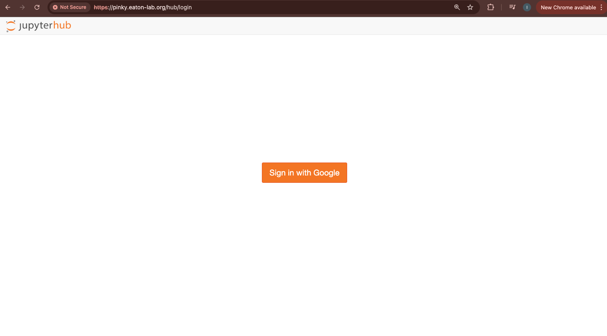
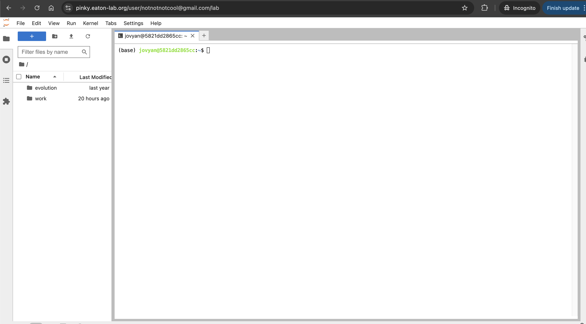

# RADCamp ICCB Brisbane 2025 - Day 1

## Overview of the morning activities:
* [Intro to ipyrad resources](#intro-ipyrad-resources)
* [Software setup](#accessing-cloud-computing-resources)
* [RADseq data quality control (QC)](data_QC)
* [ipyrad assembly of simulated data Part I](ipyrad-CLI-FullTutorial.html)

## Intro ipyrad Resources
* [ipyrad documentation (detailed explanations and tutorials)](https://ipyrad.readthedocs.io/en/latest/)
* [ipyrad gitter channel (a chat room for getting help)](https://app.gitter.im/#/room/#dereneaton_ipyrad:gitter.im)
* [ipyrad github repository (reporting issues)](https://github.com/dereneaton/ipyrad)

## Accessing Cloud Computing Resources
For this workshop we will use a cloud server hosted by the [Eaton Lab at Columbia
University](https://eaton-lab.org/). To log in you will need a Gmail account. Open a browser window and go to:

[https://pinky.eaton-lab.org/](https://pinky.eaton-lab.org/)

You will see a login screen prompting you to log in with Gmail. Click this button,
and you might need to confirm an authorization to verify your identity.



Once logged in, you'll see the JupyterHub File Browser and Launcher panes.


If you'd like to have more information about Jupyter, check out their [website](https://jupyter.org/).

>**IMPORTANT: These cloud resources will not persist past the workshop.** The Eaton lab 
JupyterHub server is only accessible for your account for the duration of this 
workshop. After the workshop we will delete user accounts and restrict access 
permissions, so don't save anything valuable here!

## Installing ipyrad

To start the terminal on the Jupyter dashboard, click "Terminal" in the Launcher.


ipyrad is easy to install, but there are some additional steps needed inside this
cloud environment, so for the purpose of this workshop we wrote all the steps 
into a script that you can execute (to save time and prevent typos). You can see 
the details of what the script is actually doing in the RADCamp 
[technical configuration document](./technical-configuration.html#ipyrad-install-script).

In your terminal type this command (it will run for 3-4 minutes):
```
/home/jovyan/work/scripts/install_ipyrad.sh
```

**After it's finished type 'exit' and then open another terminal**. Your prompt 
should now look like this:

```
(ipyrad) jovyan@493222dbc32d:~$
```

Verify your install by checking the ipyrad version (ignore the deprecation warning).

```
(ipyrad) jovyan@f87cdd4c4f18:~$ ipyrad -v
ipyrad 0.9.105
```

### Installing ipyrad on your home system
For your convenience here is a link to performing the 
[ipyrad installation on laptops and HPC systems](https://ipyrad.readthedocs.io/en/latest/3-installation.html)
