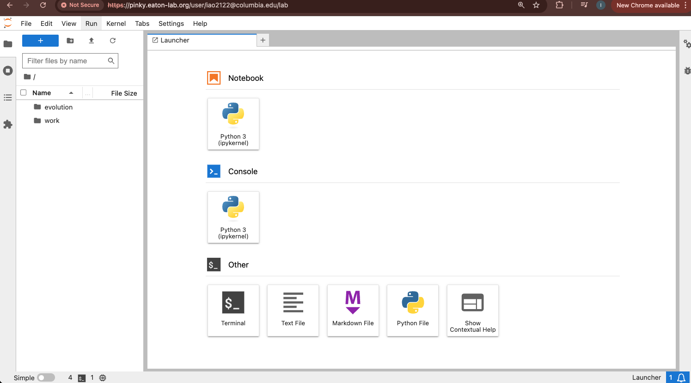
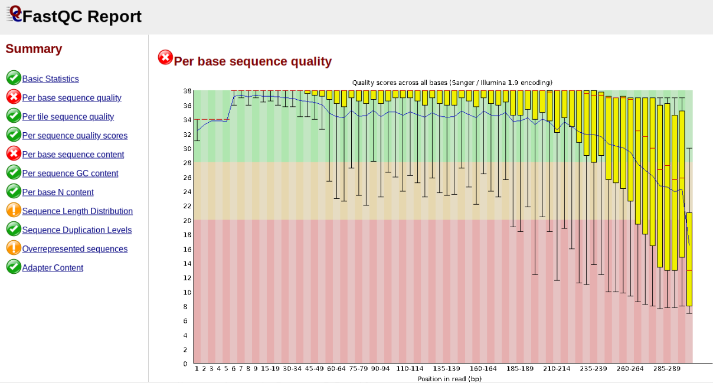

# RADCamp ICCB Brisbane 2025 - Day 1

## Overview of the morning activities:
* [Intro to ipyrad resources](#intro-ipyrad-resources)
* [Software setup](#accessing-cloud-computing-resources)
* [RADseq data quality control (QC)](#data-quality-control)
* [ipyrad assembly of simulated data Part I](ipyrad_CLI_partI.html)

## Intro ipyrad Resources
* [ipyrad documentation (detailed explanations and tutorials)](https://ipyrad.readthedocs.io/en/latest/)
* [ipyrad gitter channel (a chat room for getting help)](https://app.gitter.im/#/room/#dereneaton_ipyrad:gitter.im)
* [ipyrad github repository (reporting issues)](https://github.com/dereneaton/ipyrad)

## Accessing Cloud Computing Resources
For this workshop we will use a cloud server hosted by the [Eaton Lab at Columbia
University](https://eaton-lab.org/). To log in you will need a gmail account. Open a browser window and go to:

[https://pinky.eaton-lab.org/](https://pinky.eaton-lab.org/)

You will see a login screen prompting you to log in with gmail. Click this button,
and you might need to confirm an authorization to verify your identity.


The default view is the 'Classic' jupyter notebook view, but I prefer the newer
JupyterLab view because it keeps everything in one place. Open JuptyerLab by going
to View->Open JupyterLab


Once logged in you'll see the JupyterHub File Browser and Launcher panes.



!!! Warning
	**NB:** The Eaton lab JupyterHub server is only accessible for your account for the
	duration of this workshop. After the workshop we will delete user accounts and 
	restrict access permissions, so don't save anything valuable here!

## Installing ipyrad

ipyrad uses **conda**, which is a package manager for python. We downloaded
the [minconda installer](https://docs.anaconda.com/miniconda/miniconda-other-installer-links/)
and saved it in the `/data` directory, so you can run the installer from there.

```
bash /data/Miniconda-Linux-x86_64.sh
```
During the miniconda installation push the space bar until prompted and
then type 'yes' to acknowledge the license agreement, and 'yes' to
initialize conda. After it's finished type 'exit' and then open another
terminal. Your prompt should now look like this:

```
(base) iovercast@ibss-jupyterhub:~$ 
```

Now you can install ipyrad with conda like this (it will take 1-2 minutes):
```
conda install -c conda-forge -c bioconda ipyrad -y
```

* [Documentation for installation on laptops and HPC systems](https://ipyrad.readthedocs.io/en/latest/3-installation.html)

## Data Quality Control: Fastq format and FastQC

Each grey cell in this tutorial indicates a command line interaction. 
Lines starting with `$ ` indicate a command that should be executed 
in a terminal, for example by copying and pasting the text into your
terminal. Elements in code cells surrounded by angle brackets (e.g.<username>)
are variables that need to be replaced by the user. All
lines in code cells beginning with \#\# are comments and should not
be copied and executed. All other lines should be interpreted as
output from the issued commands.

```bash
## Example Code Cell.
## Create an empty file in my home directory called `watdo.txt`
$ touch ~/watdo.txt

## Print "wat" to the screen
$ echo "wat"
wat
```

To start the terminal on the jupyter dashboard, click "Terminal" in the Launcher.


Here we'll use bash commands and command line arguments. If you have trouble
remembering the different commands, you can find some very usefull commands on
this [cheat sheet](https://www.git-tower.com/blog/command-line-cheat-sheet/).

## Unpack the simulated example data
For this workshop, we provide example datasets, as well as toy genomes for
testing different assembly methods. For now we'll go forward with the `rad`
example dataset. First we need to unpack the data, which are located in the tests
folder.

```bash 

# Unpack the simulated data is stored in the /data directory
# `tar` is a program for reading and writing archive files, somewhat like zip
#   -x eXtract from an archive
#   -z unZip before extracting
#   -f read from the File
$ tar -xzf /data/ipsimdata.tar.gz

# Take a look at what we just unpacked
$ ls ipsimdata
gbs_example_barcodes.txt         pairddrad_example_R2_.fastq.gz         pairgbs_wmerge_example_genome.fa
gbs_example_genome.fa            pairddrad_wmerge_example_barcodes.txt  pairgbs_wmerge_example_R1_.fastq.gz
gbs_example_R1_.fastq.gz         pairddrad_wmerge_example_genome.fa     pairgbs_wmerge_example_R2_.fastq.gz
pairddrad_example_barcodes.txt   pairddrad_wmerge_example_R1_.fastq.gz  rad_example_barcodes.txt
pairddrad_example_genome.fa      pairddrad_wmerge_example_R2_.fastq.gz  rad_example_genome.fa
pairddrad_example_genome.fa.fai  pairgbs_example_barcodes.txt           rad_example_genome.fa.fai
pairddrad_example_genome.fa.sma  pairgbs_example_R1_.fastq.gz           rad_example_genome.fa.sma
pairddrad_example_genome.fa.smi  pairgbs_example_R2_.fastq.gz           rad_example_genome.fa.smi
pairddrad_example_R1_.fastq.gz   pairgbs_wmerge_example_barcodes.txt    rad_example_R1_.fastq.gz
```

### Data QC
The first step of any RADSeq assembly is to inspect your raw data to
estimate overall quality. Your input data will be in fastQ format, usually
ending in `.fq`, `.fastq`, `.fq.gz`, or `.fastq.gz`. The file(s) may be
compressed with gzip so that they have a .gz ending, but they do not need to be.

Now, we will use the `less` command to look at what's inside one of these files.

```bash
$ less ipsimdata/rad_example_R1_.fastq.gz
@lane1_locus0_2G_0_0 1:N:0:
CTCCAATCCTGCAGTTTAACTGTTCAAGTTGGCAAGATCAAGTCGTCCCTAGCCCCCGCGTCCGTTTTTACCTGGTCGCGGTCCCGACCCAGCTGCCCCC
+
BBBBBBBBBBBBBBBBBBBBBBBBBBBBBBBBBBBBBBBBBBBBBBBBBBBBBBBBBBBBBBBBBBBBBBBBBBBBBBBBBBBBBBBBBBBBBBBBBBBB
@lane1_locus0_2G_0_1 1:N:0:
CTCCAATCCTGCAGTTTAACTGTTCAAGTTGGCAAGATCAAGTCGTCCCTAGCCCCCGCGTCCGTTTTTACCTGGTCGCGGTCCCCACCCAGCTGCCCCC
+
BBBBBBBBBBBBBBBBBBBBBBBBBBBBBBBBBBBBBBBBBBBBBBBBBBBBBBBBBBBBBBBBBBBBBBBBBBBBBBBBBBBBBBBBBBBBBBBBBBBB
@lane1_locus0_2G_0_2 1:N:0:
CTCCAATCCTGCAGTTTAACTGTTCAAGTTGGCAAGATCAAGTCGTCCCTAGCCCCCGCGTCCGTTTTTACCTGGTCGCGGTCCCGACCCAGCTGCCCCC
+
BBBBBBBBBBBBBBBBBBBBBBBBBBBBBBBBBBBBBBBBBBBBBBBBBBBBBBBBBBBBBBBBBBBBBBBBBBBBBBBBBBBBBBBBBBBBBBBBBBBB
@lane1_locus0_2G_0_3 1:N:0:
CTCCAATCCTGCAGTTTAACTGTTCAAGTTGGCAAGATCAAGTCGTCCCTAGCCCCCGCGTCCGTTTTTACCTGGTCGCGGTCCCGACCCAGCTGCCCCC
+
BBBBBBBBBBBBBBBBBBBBBBBBBBBBBBBBBBBBBBBBBBBBBBBBBBBBBBBBBBBBBBBBBBBBBBBBBBBBBBBBBBBBBBBBBBBBBBBBBBBB
@lane1_locus0_2G_0_4 1:N:0:
CTCCAATCCTGCAGTTTAACTGTTCAAGTTGGCAAGATCAAGTCGTCCCTAGCCCCCGCGTCCGTTTTTACCTGGTCGCGGTCCCGACCCAGCTGCCCCC
+
BBBBBBBBBBBBBBBBBBBBBBBBBBBBBBBBBBBBBBBBBBBBBBBBBBBBBBBBBBBBBBBBBBBBBBBBBBBBBBBBBBBBBBBBBBBBBBBBBBBB
```

Here we have our first look at a **fastq formatted file**. Each sequenced
read is spread over four lines, one of which contains sequence and another
the quality scores stored as ASCII characters. The other two lines are used
as headers to store information about the read.
* Line 1: The name of the read (its location on the plate)
* Line 2: The sequence data
* Line 3: Unused
* Line 4: Quality scores for the base calls (see the 
[FASTQ wikipedia](https://en.wikipedia.org/wiki/FASTQ_format) for more details on this)

In this case the restriction enzyme leaves a TGCAG overhang. Can you find this
sequence in the raw data? Use `/TGCAG` to *search* for strings inside of `less`.
What's going on with that other stuff at the beginning of each read?

**NB:** Type 'q' to exit `less`.

To get a better view of the data quality, without looking at individual reads,
we use automated approaches to check the quality. We will use
[FastQC](https://www.bioinformatics.babraham.ac.uk/projects/fastqc/) to generate
a sample-wide summary of data quality. 

The logic of FastQC is that we want to obtain a high-level view of the quality
of the sequencing. You may be able to detect low quality samples, but if you
have a *lot* of samples, you may not want to run FastQC for every single file.
Even running it for a few samples will give you good insight into overall
quality of the sequencing run. For example, a key QC procedure involves
inspecting average quality scores per base position and trimming read edges,
which is where low quality base-calls tend to accumulate. In this figure, the
X-axis shows the position on the read in base-pairs and the Y-axis depicts
information about [Phred quality score](https://en.wikipedia.org/wiki/Phred_quality_score)
per base for all reads, including median (center red line), IQR (yellow box),
and 10%-90% (whiskers). As an example, here is a very clean base sequence
quality report for a 75bp RAD-Seq library. These reads have generally high
quality across their entire length, with only a slight (barely worth
mentioning) dip toward the end of the reads:


In contrast, here is a somewhat typical base sequence quality report for R1 of
a 300bp paired-end Illumina run of ezRAD data:



This figure depicts a common artifact of current Illumina chemistry, whereby
quality scores per base drop off precipitously toward the ends of reads, with
the effect being magnified for read lengths > 150bp. The purpose of using
FastQC to examine reads is to determine whether and how much to trim our reads
to reduce sequencing error interfering with basecalling. In the above figure,
as in most real dataset, we can see there is a tradeoff between throwing out
data to increase overall quality by trimming for shorter length, and retaining
data to increase value obtained from sequencing with the result of increasing
noise toward the ends of reads.

Installing and running fastqc can be done like this:

```bash
conda install -c bioconda fastqc -y
# `-o .` will create output files in the current (.) directory
fastqc ipsimdata/rad_example_R1_.fastq.gz -o .
```

FastQC will indicate its progress in the terminal. This toy data will run quite
quickly, but real data can take somewhat longer to analyse (10s of minutes).

FastQC will save the output as an html file in the folder you're currently in.
You want to look at it in your browser window. So look in the file pane on the left
and click on `rad_example_R1__fastqc.html`. This will open the FastQC report which
provides extensive information about the quality of the data, which we will
briefly review here.

### Inspecting and Interpreting FastQC Output

FastQC generates an html file as output, and on the left you'll see a summary
of all the results, which highlights areas FastQC indicates may be worth further
examination. We will only look at a few of these.

**NB:** The simulated data is very boring and too clean, so the following
figures illustrate FastQC results for a real dataset (Anolis; Prates et al 2016).


Lets start with Per base sequence quality.


For the Anolis data the sequence quality per base is uniformly quite high, with
dips only in the first and last 5 bases (again, this is typical for Illumina
reads). Based on information from this plot we can see that the Anolis data
doesn't need any trimming, which is good.

Now lets look at the `Per base sequence content`, which FastQC highlights with a
scary red **X**.


The squiggles indicate base composition per base position averaged across the
reads. It looks like the signal FastQC is concerned about here is related to
the *extreme* base composition bias of the first 5 positions. We happen to know
this is a result of the restriction enzyme overhang present in all reads
(`TGCAT` in this case for the EcoT22I enzyme used), and so it is in fact of no
concern. Now lets look at `Adapter Content`:


Here, we can see adapter contamination increases toward the tail of the reads,
approaching 40% of total read content at the very end. The concern here is that
if adapters represent some significant fraction of the read pool, then they
will be treated as "real" data, and potentially bias downstream analysis. In
the Anolis data this looks like it might be a real concern so we shall keep
this in mind during step 2 of the ipyrad analysis, and incorporate 3' read
trimming and illumina adapter filtering.

# **Exercise:** Run fastqc on real data samples

There are several examples of real fastq files in the `/data/fastqs`
directory. Practice running `fastqc` on these files and interpreting the
results. See if you can answer these questions for each sample:
* How does the per base sequence quality look? Would you trim this data and
if so where would you trim to?
* Can you identify the restriction enzyme recognition sequence from the
per base sequence content report?
* Is there adapter contamination and if so does it look significant?

## ipyrad assembly part I

[ipyrad CLI Part I](ipyrad_CLI_partI.md)

# References
Prates, I., Xue, A. T., Brown, J. L., Alvarado-Serrano, D. F., Rodrigues, M. T., Hickerson, M. J., & Carnaval, A. C. (2016). Inferring responses to climate dynamics from historical demography in neotropical forest lizards. Proceedings of the National Academy of Sciences, 113(29), 7978-7985.
