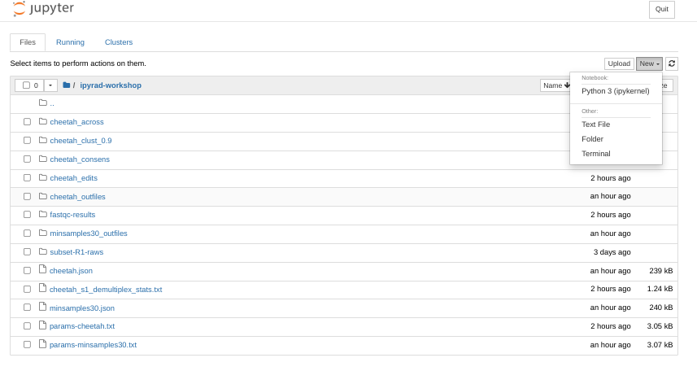
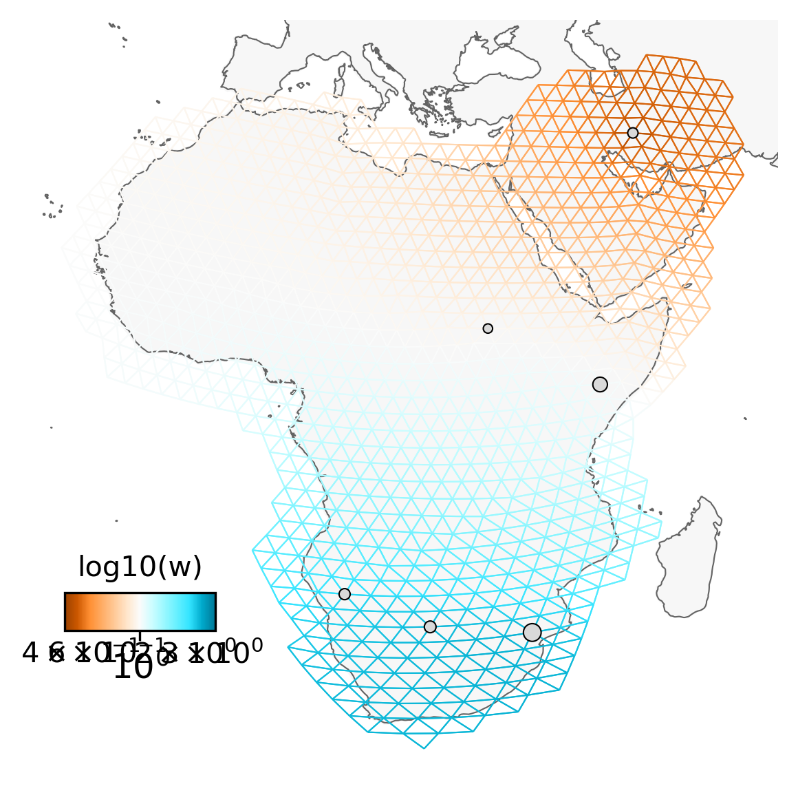

# Spatial population genetic analysis: **FEEMS**


**Brief introduction to the idea of EEMS/FEEMS and maybe some examples**

## Input data
What is the necessary input data for FEEMS?
* genotypes
* latlongs
* bounding area for plotting
* .shp file (global map)

### Creating new output files w/o the P. concolor sample
The *P. concolor* sample was included in the RAxML analysis as an outgroup
to root the tree. For this spatial analysis with FEEMS we need to remove
this sample because it doesn't have GPS coordinates, and FEEMS requires
georeferenced samples.

We can use the ipyrad branching strategy again to remove this outgroup sample
('SRR19760949'). **Notice here that we are branching from the original
assembly with `min_samples_locus` equal to 4.**

```bash
(ipyrad) osboxes@osboxes:~/ipyrad-workshop$ ipyrad -p params-cheetah.txt -b no-outgroup - SRR19760949
```
```
  loading Assembly: cheetah
  from saved path: ~/ipyrad-workshop/minsamples30.json
  dropping 1 samples
  creating a new branch called 'no-outgroup' with 52 Samples
  writing new params file to params-no-outgroup.txt
```

Now you can run step 7 again to generate the new output files with this sample
removed:
```bash
(ipyrad) osboxes@osboxes:~/ipyrad-workshop$ ipyrad -p params-no-outgroup.txt -s 7 -c 4
```

This will create a new set of output files in `no-outgroup_outfiles`.

# **FEEMS** analyses

## Access the FEEMS environment
The FEEMS module requires a substantially different configuration than the
other analysis tools in this workshop, so we have installed this software
in a separate conda environment with an isolated jupyter notebook server
running on a different port. To access this environment open a new browser
tab and navigate to:

`https://localhost:8801`

## Create a new notebook for the FEEMS analysis
In the jupyter notebook browser interface navigate to your `ipyrad-workshop`
directory and create a "New->Python" Notebook.



First things first, rename your new notebook to give it a meaningful name. You can
either click the small 'disk' icon in the upper left corner of the notebook or
choose `File->Save Notebook` and rename your notebook to "cheetah-FEEMS.ipynb"

## Import FEEMS and other necessary modules
The `import` keyword directs python to load a module into the currently running
context. This is very similar to the `library()` function in R. We begin by
importing the ipyrad analysis module. Copy the code below into a
notebook cell and click run. 

```python
%matplotlib inline

# base
import h5py
import numpy as np
import pandas as pd
import pkg_resources 
from sklearn.impute import SimpleImputer 
# viz 
import matplotlib.pyplot as plt 
import cartopy.crs as ccrs 
# feems 
from feems.utils import prepare_graph_inputs 
from feems import SpatialGraph, Viz 
```

## Import the data and impute missing values

```python
# Path to the input phylip file
data = h5py.File("/home/osboxes/ipyrad-workshop/no-outgroup_outfiles/no-outgroup.snps.hdf5")

raw_genotypes = np.apply_along_axis(np.sum, 2, data["genos"][:])

G = np.where(genotypes <= 2 , genotypes, np.nan*genotypes)
imp = SimpleImputer(missing_values=np.nan, strategy="mean") 
G = imp.fit_transform(np.array(G).T) 
```

## Fetch the GPS coordinates for the samples and the 'outer' points
```
!wget https://raw.githubusercontent.com/radcamp/radcamp.github.io/master/Kigali2023/Cheetah.coords
!wget https://raw.githubusercontent.com/radcamp/radcamp.github.io/master/Kigali2023/Cheetah.outer
```

## Load the coordinates and the global shp file
```python
coord = np.loadtxt("./Cheetah.coords")
outer = np.loadtxt("./Cheetah.outer")
grid_path = "/home/osboxes/src/feems/feems/data/grid_250.shp"
```

## Graph input files
```python
# graph input files
outer, edges, grid, _ = prepare_graph_inputs(coord=coord, ggrid=grid_path, translated=False, buffer=0, outer=outer)
```

## Plot the region and the sample sites
```python
projection = ccrs.EquidistantConic(central_longitude=23, central_latitude=8) 
fig = plt.figure(dpi=300) 
ax = fig.add_subplot(1, 1, 1, projection=projection) 
v = Viz(ax, sp_graph, projection=projection, edge_width=.5, 
    edge_alpha=1, edge_zorder=100, sample_pt_size=10, 
    obs_node_size=7.5, sample_pt_color="black", 
    cbar_font_size=10) 
v.draw_map() 
v.draw_samples() 
v.draw_edges(use_weights=False) 
v.draw_obs_nodes(use_ids=False) 
```


## Fit the FEEMS model to the data
```python
%%time 
sp_graph.fit(lamb = 20.0) 
```

## Plot the fitted model
```
fig = plt.figure(dpi=300) 

ax = fig.add_subplot(1, 1, 1, projection=projection) 
v = Viz(ax, sp_graph, projection=projection, edge_width=0.5, 
    edge_alpha=1, edge_zorder=100, sample_pt_size=20, 
    obs_node_size=7.5, sample_pt_color="black", 
    cbar_font_size=10, abs_max=.05) 
v.draw_map() 
v.draw_edges(use_weights=True) 
v.draw_obs_nodes(use_ids=False) 
v.draw_edge_colorbar() 
```



