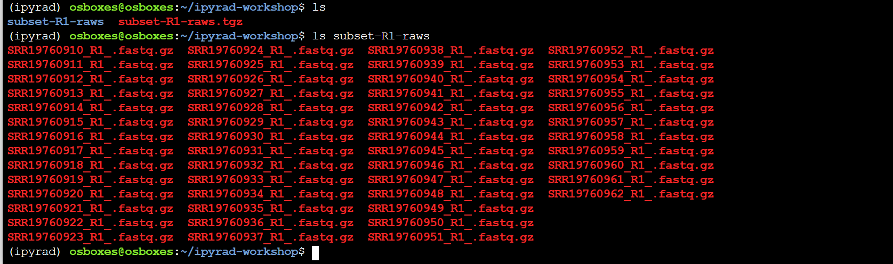
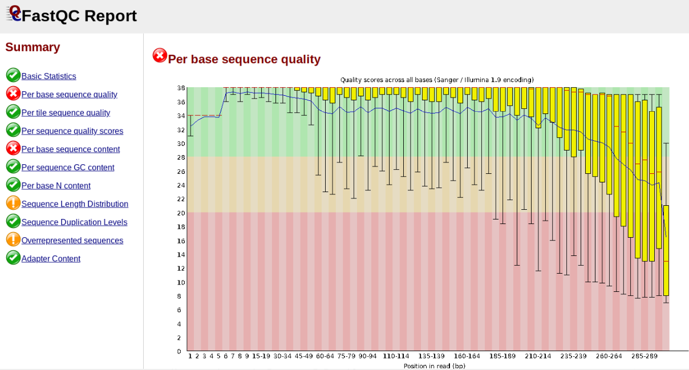
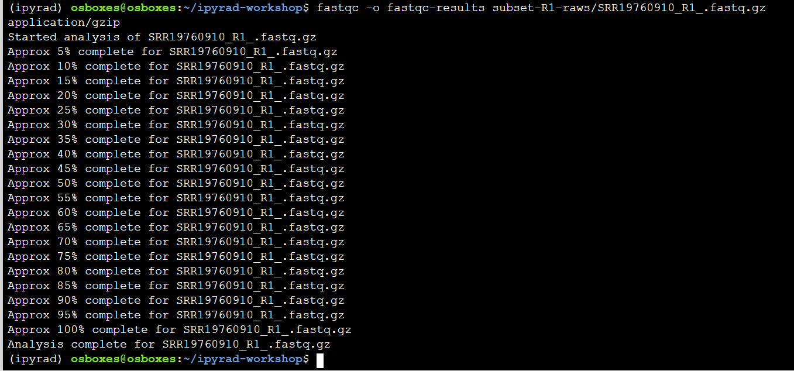
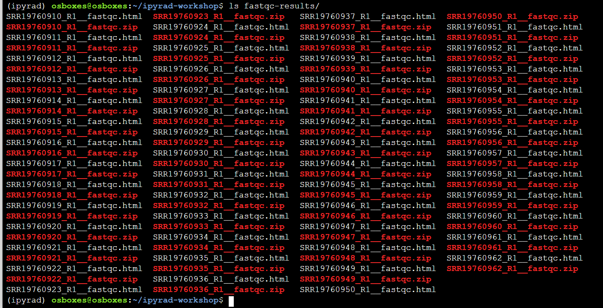
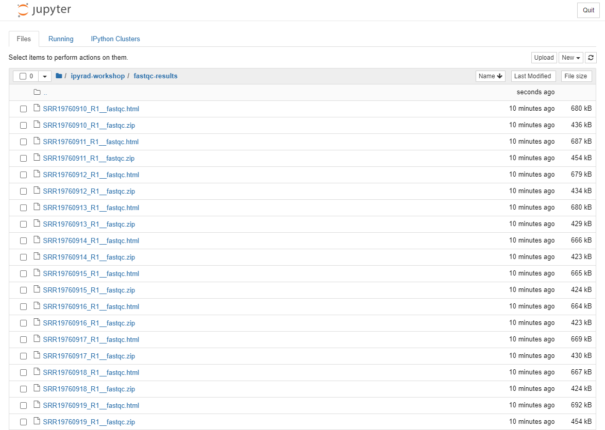
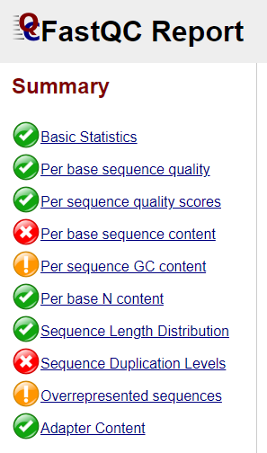
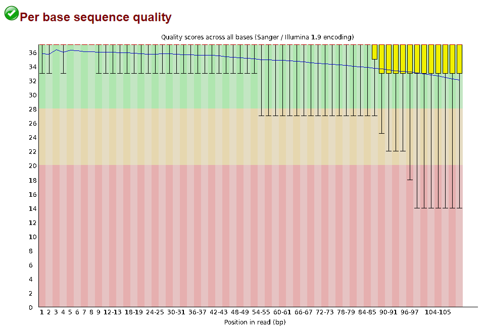

# Empirical data & Quality Control (QC)

## Command line interface (CLI) basics
The CLI provides a way to navigate a file system, move files around, and run commands all inside a little black window. The down side of CLI is that you have to learn many at first seemingly esoteric commands for doing all the things you would normally do with a mouse. However, there are several advantages of CLI: 1) you can use it on servers that don't have a GUI interface (such as HPC clusters); 2) it's scriptable, so you can write programs to execute common tasks or run analyses; 3) it's often faster and more efficient that click-and-drag GUI interfaces. For now we will start with 4 of the most common and useful commands:

```
(ipyrad) osboxes@osboxes:~$ pwd
/home/osboxes
```
`pwd` stands for **"print working directory"**, which literally means "where am I now in this filesystem". Just like when you open a file browser with windows or mac, when you open a new terminal the command line will start you out in your "home" directory. Ok, now we know where we are, lets take a look at what's in this directory:

```
(ipyrad) osboxes@osboxes:~$ ls
miniconda src subset-R1-raws.tgz usr
```

`ls` stands for **"list"** and in our home directory there is are two folders with related to the software we'll be using in the course, and the cheetah data we'll be looking at, called subset-R1-raws.tgz. Throughout the workshop we will be adding files and directories and by the time we're done, not only will you have a bunch of experience with RAD-Seq analysis, but you'll also have a ***ton*** of stuff in your home directory. We can start out by adding the first directory for this workshop:

```
(ipyrad) osboxes@osboxes:~$ mkdir ipyrad-workshop
```

`mkdir` stands for **"make directory"**, and unlike the other two commands, this command takes an "argument". This argument is the name of the directory you wish to create, so here we direct mkdir to create a new directory called "ipyrad-workshop". Now you can use `ls` again, to look at the contents of your home directory and you should see this new directory now:

```
(ipyrad) osboxes@osboxes:~$ ls
ipyrad-workshop miniconda src subset-R1-raws.tgz usr
```

Throughout the workshop we will be introducing new commands as the need for them arises. We will pay special attention to highlighting and explaining new commands and giving examples to practice with. 

> **Special Note:** Notice that the above directory we are making is not called `ipyrad workshop`. This is **very important**, as spaces in directory names are known to cause havoc on HPC systems. All linux based operating systems do not recognize file or directory names that include spaces because spaces act as default delimiters between arguments to commands. There are ways around this (for example Mac OS has half-baked "spaces in file names" support) but it will be so much for the better to get in the habit now of ***never including spaces in file or directory names***.

## Exploring the cheetah data
We will be reanalysing RAD-Seq data from cheetahs (*Acinonyx jubatus*) sampled from across their distribution in Africa and Iran and published in [Prost *et al.* 2022](https://onlinelibrary.wiley.com/doi/10.1111/mec.16577). 

©Laura Bertola

This study used various datatypes, including whole genome sequencing (WGS), mitochondrial data, MHC data, minisatellites and RADseq data. For this workshop, we will focus only on (part of ) the RADseq data, which consists of 23 individuals from 6 populations, and one outgroup (puma; *Puma concolor*). The data were generated using a double-digest restriction-site associated DNA (ddRAD) sequencing approach [Peterson *et al.*, 2012](https://journals.plos.org/plosone/article?id=10.1371/journal.pone.0037135). Note that raw reads have been randomly downsampled to 125,000 reads per sample, in order to create a dataset that will be computationally tractable with the expectation of finishing in a reasonable time. 

You've already seen where the subset of raw data is located when you did `ls` earlier. Now, let's **move** them into the ipyrad-workshop folder you've just created, using the command `mv`. 
```
(ipyrad) osboxes@osboxes:~$ mv subset-R1-raws.tgz ipyrad-workshop
```

If you do `ls` now, you'll see that the subset-R1-raws.tgz file is no longer there, since you've just moved it somewhere else. Let's take a look in your ipyrad-workshop folder, by navigating there first using `cd` and then listing everything in that folder.
```
(ipyrad) osboxes@osboxes:~$ cd ipyrad-workshop
(ipyrad) osboxes@osboxes:~/ipyrad-workshop$ ls
subset-R1-raws.tgz
```

Finally, you'll notice the raw data is in `.tgz` format, which is similar to a zip archive. We can unpack our raw data in the current directory using the `tar` command:
```
(ipyrad) osboxes@osboxes:~/ipyrad-workshop$ tar -xvzf subset-R1-raws.tgz
```
> **Point of interest:** All linux commands, such as `tar`, can have their behavior modified by passing various arguments. Here the arguments are `-x` to "Extract" the archive file; `-v` to add "verbosity" by printing progress to the screen; `z` to "unzip" the archive during extraction; and `-f` to "force" the extraction which prevents `tar` from pestering you with decisions.

Now use `ls` to list the contents of your current directory. You'll see that there is a new directory, called subset-R1-raws, for which you can list the contents as well:
```
(ipyrad) osboxes@osboxes:~$ ls
subset-R1-raws subset-R1-raws.tgz
```
```
(ipyrad) osboxes@osboxes:~$ ls subset-R1-raws/
```


> **Special Note:** You'll see that every file contains `_R1_`. Most of the time, the data you will be working on are paired-end, meaning that each sample has a `_R1_` and `_R2_` file. For this workshop, and to ensure that the steps run quickly, we will only use `_R1_`. 

## The `FASTQ` data file format

Before we get started with the assembly, let's take a look at what the raw data
looks like. We can use `zcat` and `head` to do this.

Here we have our first look at a fastq formatted file. Each sequenced read is spread over four lines, one of which contains sequence and another the quality scores stored as ASCII characters. The other two lines are used as headers to store information about the read.

```bash
## zcat: unZip and conCATenate the file to the screen
## head -n 20: Just take the first 20 lines of input

(ipyrad) osboxes@osboxes:~/ipyrad-workshop$ zcat subset-R1-raws/SRR19760910_R1_.fastq.gz | head -n 20
```
```
@SRR19760910.1 1 length=110
CATGCACGTGCAGCATATAAGAAGGATGTTTGTCATGCATTATCTTATTTGATGTTTACGGAAGCCCCATGGTTATCCCCATTTTAGGGATGAAGAAACGCCACAGAGAT
+SRR19760910.1 1 length=110
BFFFFFF<FBFFFFFF<FB//////<<FFFBFF//<FFFFFFBF/FBFFFFFFFFFFFFBB<F/BFFFFFFFFBFF/<<</BFBBFF/<FF<FF<7FFFF/7B/FF/B<7
@SRR19760910.2 2 length=110
CATGCAACTCTTGGTCTCGGGGTCTTGAGTTCGAGCCCCACGTTGGATTAGAGATTACTTAAATAAATAAAGTTCAAAAGTTTTAGAATGTTATCATTTTCTTTAACAGT
+SRR19760910.2 2 length=110
FFFFFFFFFFFFFFFFFFFFFFFFFFFFFFFFFFFFFFFFFFFFFFFFFFFFFFFFFFFFFFFFFFFFFFFFFFFFFFFFFFFFFFFFFFFFFFFFFFFFFFFFFFFFFF
@SRR19760910.3 3 length=110
CATGCCATTTCCCATGGGCAAGGATCTCAGGCTGTGCTCATTCCCAAGGACAAGACCAAGCCAATTCCCAATCCCCATATTTAAGGAGCTGCTTCCTGGGACCAATTCTG
+SRR19760910.3 3 length=110
FFFFFFFFFFFFFFFFFFFFFFFFFFFFFFFFF<FFFFFFFFFFFFFFFBFFFFFFFFFFFFFFFFFFFFFFFFFFBFFFFFFFFFBFFFFFFFFFFFFFFFFFFFFFFF
@SRR19760910.4 4 length=110
CATGCAACTCTTGATCTCAGGGTCATGAGTTCAAGCCCCACATTGGGTATGGATCCTACTGAAAGAAAAGAAAAGAAAAGAAAAGAAAAGAAAAGAAAAGAAAAGACAAG
+SRR19760910.4 4 length=110
FFBFFFFFFFFFFFFFBFFF<FFBFFBBFBFBF/B/BBFFBF<FFFB</BFBFB<BBFFFFFFBFFFBFFFFFF<FFF/FFFBFFF</FFBFFFFFFBFFFFFFFFFFFF
@SRR19760910.5 5 length=110
CATGCATTTGTGTTTGCTTCTATTTGTATGAAGAGTCGAGAAACCAGAAGCTAATACAAAGGGTTGCCCTTGGTAGGGGATGCTGACTGGATGGCTTTGGGGCAGGAGGA
+SRR19760910.5 5 length=110
FFFFFFFFFFFFFFFFFFFFFFFFFFFFFFFFFFFFFFFFFFFFFFFBFFFFFFFFFFFFFFBFFFFFFFFFFBFFFFFFFFFFF<FFFFFFFFFBFFFFFFFFFFFB/7
```

The first is the name of the read (its location on the plate). The second line
contains the sequence data. The third line is unused. And the fourth line is
the quality scores for the base calls. The [FASTQ wikipedia](https://en.wikipedia.org/wiki/FASTQ_format)
page has a good figure depicting the logic behind how quality scores are encoded.

## FastQC for quality control
The first step of any RAD-Seq assembly is to inspect your raw data to estimate overall quality. At this stage you can then attempt to improve your dataset by identifying and removing samples with failed sequencing. Another key QC procedure involves inspecting average quality scores per base position and trimming read edges, which is where low quality base-calls tend to accumulate. In this figure, the X-axis shows the position on the read in base-pairs and the Y-axis depicts information about [Phred quality score](https://en.wikipedia.org/wiki/Phred_quality_score) per base for all reads, including median (center red line), IQR (yellow box), and 10%-90% (whiskers). As an example, here is a very clean base sequence quality report for a 75bp RAD-Seq library. These reads have generally high quality across their entire length, with only a slight (barely worth mentioning) dip toward the end of the reads:


In contrast, here is a somewhat typical base sequence quality report for R1 of a 300bp paired-end Illumina run of another RADseq dataset:



This figure depicts a common artifact of current Illumina chemistry, whereby quality scores per base drop off precipitously toward the ends of reads, with the effect being magnified for read lengths >150bp. The purpose of using FastQC to examine reads is to determine whether and how much to trim our reads to reduce sequencing error interfering with basecalling. In the above figure, as in most real dataset, we can see there is a tradeoff between throwing out data to increase overall quality by trimming for shorter length, and retaining data to increase value obtained from sequencing with the result of increasing noise toward the ends of reads.

### Running FastQC on the cheetah data
In preparation for running FastQC on our raw data we need to make an output directory to keep the FastQC results organized:

```
(ipyrad) osboxes@osboxes:~/ipyrad-workshop$ mkdir fastqc-results
```
Now run fastqc on one of the samples:
```
(ipyrad) osboxes@osboxes:~/ipyrad-workshop$ fastqc -o fastqc-results subset-R1-raws/SRR19760910_R1_.fastq.gz
```
> **Note:** The `-o` flag tells fastqc where to write output files. **Especially Notice** the *relative path* to the raw file. The difference between *relative* and *absolute* paths is an important one to learn. Relative paths are specified with respect to the current working directory. Since I am in `/home/ipyrad-workshop`, and this is the directory the `subset-R1-raws` directory is in, I can simply reference it directly. If I was in any other directory I could specify the *absolute path* to the target fastq.gz file which would be `/home/ipyrad-workshop/subset-R1-raws/SRR19760910_R1_.fastq.gz`. Absolute paths are always more precise, but also always (often _much_) longer.

FastQC will indicate its progress in the terminal. This toy data will run quite quickly, but real data can take somewhat longer to analyse (10s of minutes).



If you feel so inclined you can QC all the raw data using a wildcard substitution:
```
(ipyrad) osboxes@osboxes:~/ipyrad-workshop$ fastqc -o fastqc-results subset-R1-raws/*
```
> **Note:** The `*` here is a special command line character that means "Everything that matches this pattern". So here `subset-R1-raws/*` matches _everything_ in the raws directory. Equivalent (though more verbose) statements are: `ls subset-R1-raws/*.gz`, `ls subset-R1-raws/*.fastq.gz`, `ls subset-R1-raws/*_R1_.fastq.gz`. All of these will list all the files in the `raws` directory. **Special Challenge:** Can you construct an `ls` command using wildcards that only lists samples in the `subset-R1-raws` directory that include the digit 5 in their sample name?

Examining the output directory you'll see something like this (assuming that you ran FastQC on all files):



Now we have output files that include html and images depicting lots of information about the quality of our reads, but we can't inspect these from inside our little black window. But we can go back to the Notebook server, and navigate to the results by first clicking on `ipyrad-workshop` and then `fastqc-results`. Open one of the html files by double clicking on them.



### Instpecting and Interpreting FastQC Output

Just taking a random one, lets spend a moment looking at the results from `SRR19760910_R1__fastqc.html`. Opening up this html file, on the left you'll see a summary of all the results, which highlights areas FastQC indicates may be worth further examination. We will only look at a few of these.



Lets start with Per base sequence quality, because it's very easy to interpret, and often times with RAD-Seq data results here will be of special importance.



For the cheetah data the sequence quality per base is uniformly quite high, with minor dips only in the first and last few bases (again, this is typical for Illumina reads). Based on information from this plot we can see that the cheetah data doesn't need trimming, which is good.

Now lets look at the `Per base sequece content`, which FastQC highlights with a scary red **X**.


The squiggles indicate base composition per base position averaged across the reads. It looks like the signal FastQC is concerned about here is related to the *extreme* base composition bias of the first 5 positions. We happen to know this is a result of the restriction enzyme overhang present in all reads (`CATGC` in this case for the SphI enzyme used), and so it is in fact of no concern. 

All in all, the data look good and we can proceed with the ipyrad analysis.

# References
Prost, Stefan, Ana Paula Machado, Julia Zumbroich, Lisa Preier, Sarita Mahtani-Williams, Rene Meissner, Katerina Guschanski, et al. 2022. Genomic Analyses Show Extremely Perilous Conservation Status of African and Asiatic Cheetahs (Acinonyx Jubatus). Molecular Ecology 31 (16): 4208–23.

Peterson, Brant K., Jesse N. Weber, Emily H. Kay, Heidi S. Fisher, and Hopi E. Hoekstra. 2012. Double Digest RADseq: An Inexpensive Method for de Novo SNP Discovery and Genotyping in Model and Non-Model Species. PloS One 7 (5): e37135.

