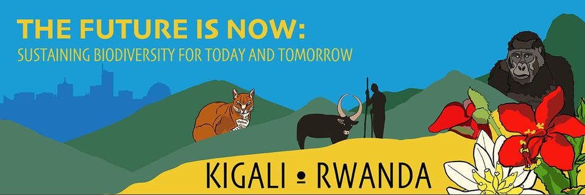
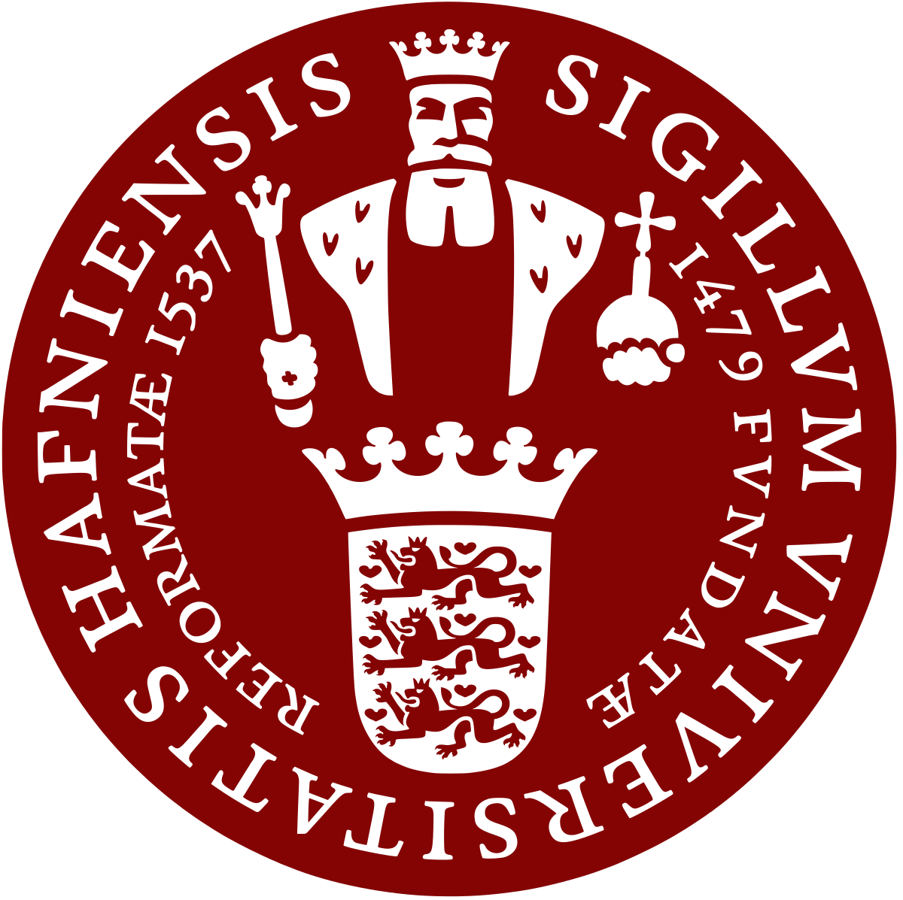
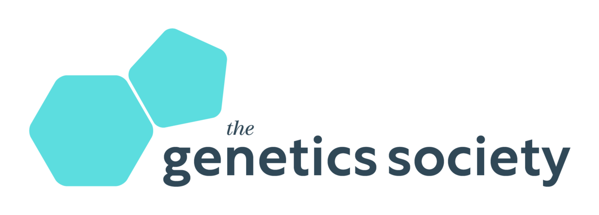

# Welcome to RADCamp 2023 - The Kigali Edition

In association with the The Society for Conservation Biology's 
[**31st International Congress for Conservation Biology (ICCB 2023)**](https://conbio.org/mini-sites/iccb-2023/)  

{: width="75%"}  

**RADCamp 2023** 
July 22-23, 2023  
University of Rwanda  
College of Science and Technology (CST), Former KIST  
Nyarugenge Campus, KN 7 Ave  
Muhabura Block/Building  
Kigali, Rwanda

You can view a [map of the campus here](https://cst.ur.ac.rw/IMG/pdf/ur_nyarugenge_campus_map_eighth_version_.pdf). 

## Arriving at the University
Sessions will take place in the Muhabura Block/Building. There are three gates
to the university. The most convenient gate to enter, and closest to
the Muhabura Block/Building, is the Muhabura Gate. Local drivers (if you’re
taking a taxi or the popular boda boda motorbike taxi) refer to this gate as near
“KUBISMA”). 

## Lunch Options,  Water Coolers, Snacks & Coffee
The University of Rwanda’s cafeteria will be serving an affordable lunch buffet
on Saturday and Sunday, with lunch being available from 12-1pm. Please bring
cash (Rwandan francs) to purchase lunch. There will be vegetarian options. The
University will be setting up water coolers outside of the rooms, so we will be
asking attendees to bring their own reusable water bottles. Make sure to bring
one for yourself. Finally - there will be coffee and snacks that people can grab
during break times (attendees should have Rwandan francs for this as well).

# Organisers, Instructors, and Facilitators

  - Isaac Overcast - University of Maine
  - Laura Bertola - University of Copenhagen
  - Josiah Kuja - University of Copenhagen
  - Anubhab Khan - University of Glasgow

# Schedule

Times       | Saturday (July 22) | Sunday (July 23) |
-----       | ------------------ | ---------------- | 
8:30-9:00   | Check-in and Introductions | Check-in and Recap Day 1 |
9:00-10:30  | Intro to Conservation Genetics | [Phylogenetic Inference: RAxML](RAxML_API.md) |
10:30-10:45 | Coffee Break | Coffee Break |
10:45-12:00 | [Software Setup](setup.md) & [Data QC](data_QC.md) & [RADSeq Assembly w/ ipyrad part I](ipyrad-CLI-FullTutorial.md) | Small Group Work: RAxML analysis w/ Cheetah Data |
12:00-13:00 | Lunch | Lunch |
13:00-14:45 | [RADSeq Assembly w/ ipyrad part II](ipyrad-CLI-FullTutorial.md) | Spatial Popgen Analysis: EEMS |
14:45-15:00 | Coffee Break | Coffee Break |
15:00-17:00 | [Clustering Analysis: PCA](PCA_API.md) & Small Group Work: PCA analysis w/ Cheetah Data | Small Group Work: EEMS analysis w/ Cheetah Data |

## Additional ipyrad analysis cookbooks

* [Clustering analysis: STRUCTURE](05_STRUCTURE_API.md)
* [BPP - Bayesian inference under a multi-species coalescent model](https://nbviewer.jupyter.org/github/dereneaton/ipyrad/blob/master/tests/cookbook-bpp-species-delimitation.ipynb)
* [Bucky - Phylogenetic concordance analysis](https://nbviewer.jupyter.org/github/dereneaton/ipyrad/blob/master/tests/cookbook-bucky.ipynb)
* [ABBA-BABA - Admixture analysis](https://nbviewer.jupyter.org/github/dereneaton/ipyrad/blob/master/tests/cookbook-abba-baba.ipynb)

## Source of Empirical Data for the Workshop
* [Cheetah data from Prost et al 2022](https://onlinelibrary.wiley.com/doi/10.1111/mec.16577)
* [Fetching and formatting the Cheetah data](Cheetah_data.md)

## RADCamp Kigali 2023 co-sponsored by:

* University of Copenhagen  
{: width="15%"}
 
* The Genetics Society  
{: width="60%"}

* University of Rwanda - Center of Excellence in Biodiversity & Natural Resources Management  

* Anonymous donor

# RADCamp Kigali 2023 Group Photo

**Don't forget a nice group photo!**

## Acknowledgements
RADCamp tutorial contributors (over the years): Isaac Overcast, Deren Eaton,
Laura Bertola, and Mariana Vasconcellos.
