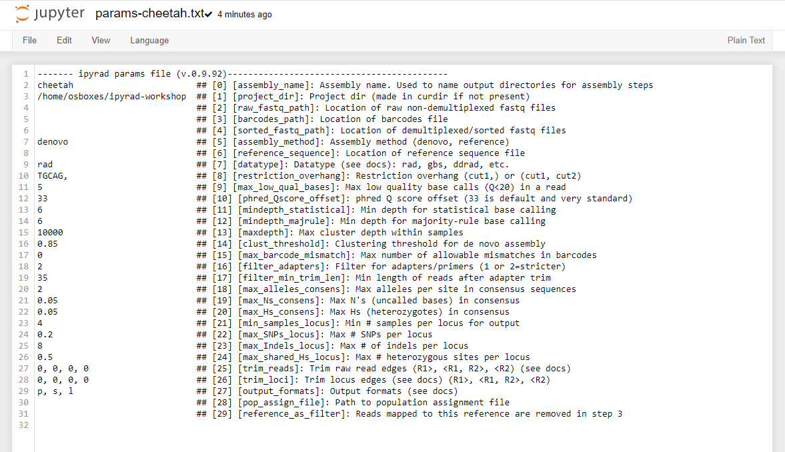

# ipyrad command line assembly tutorial

This is the full tutorial for the command line interface (**CLI**) for ipyrad.
In this tutorial we'll walk through the entire assembly, from raw data to output
files for downstream analysis. This is meant as a broad introduction to
familiarize users with the general workflow, and some of the parameters and
terminology. We will use and empirical dataset of paired-end cheetah ddRAD data as an example in this
tutorial. Of course, you can replicate the steps described here with your own data, or any other RADseq dataset. 

If you are new to RADseq analyses, this tutorial will provide a simple
overview of how to execute ipyrad, what the data files look like, how to
check that your analysis is working, and what the final output formats
will be. We will also cover how to run ipyrad on a cluster and how to do so
efficiently.

Each grey cell in this tutorial indicates a command line interaction. 
Lines starting with `$ ` indicate a command that should be executed in your terminal. All lines in code cells beginning with \#\# are 
comments and should not be copied and executed. All other lines should 
be interpreted as output from the issued commands.

# Overview of Assembly Steps
Very roughly speaking, ipyrad exists to transform raw data coming off the 
sequencing instrument into output files that you can use for downstream 
analysis. 


The basic steps of this process are as follows:

* Step 1 - Demultiplex/Load Raw Data
* Step 2 - Trim and Quality Control
* Step 3 - Cluster or reference-map within Samples
* Step 4 - Calculate Error Rate and Heterozygosity
* Step 5 - Call consensus sequences/alleles
* Step 6 - Cluster across Samples
* Step 7 - Apply filters and write output formats

Detailed information about ipyrad, including instructions for installation and troubleshooting, can be found [here](https://ipyrad.readthedocs.io/en/master/).

> **Note on files in the project directory:** Assembling RADseq type 
sequence data requires a lot of different steps, and these steps 
generate a **lot** of intermediary files. ipyrad organizes these files 
into directories, and it prepends the name of your assembly to each 
directory with data that belongs to it. One result of this is that 
you can have multiple assemblies of the same raw data with different 
parameter settings and you don't have to manage all the files yourself! 
(See [Branching assemblies](https://ipyrad.readthedocs.io/en/latest/8-branching.html) for more info). Another
result is that **you should not rename or move any of the directories
inside your project directory**, unless you know what you're doing or
you don't mind if your assembly breaks.

# Getting Started

We will be running through the assembly of the cheetah data using the ipyrad
CLI. So, if you don't have the terminal window open, please start your VM, open a browser
window and navigate to `http://localhost:8800` and create a **new "Terminal"**
using the "New" button.

## ipyrad help
To better understand how to use ipyrad, let's take a look at the help argument.
We will use some of the ipyrad arguments in this tutorial (for example: -n, -p,
-s, -c, -r). But, the complete list of optional arguments and their explanation
is below.

```
(ipyrad) osboxes@osboxes:~/ipyrad-workshop$ ipyrad -h

usage: ipyrad [-h] [-v] [-r] [-f] [-q] [-d] [-n NEW] [-p PARAMS] [-s STEPS] [-b [BRANCH [BRANCH ...]]]
              [-m [MERGE [MERGE ...]]] [-c cores] [-t threading] [--MPI] [--ipcluster [IPCLUSTER]]
              [--download [DOWNLOAD [DOWNLOAD ...]]]

optional arguments:
  -h, --help            show this help message and exit
  -v, --version         show program's version number and exit
  -r, --results         show results summary for Assembly in params.txt and exit
  -f, --force           force overwrite of existing data
  -q, --quiet           do not print to stderror or stdout.
  -d, --debug           print lots more info to ipyrad_log.txt.
  -n NEW                create new file 'params-{new}.txt' in current directory
  -p PARAMS             path to params file for Assembly: params-{assembly_name}.txt
  -s STEPS              Set of assembly steps to run, e.g., -s 123
  -b [BRANCH [BRANCH ...]]
                        create new branch of Assembly as params-{branch}.txt, and can be used to drop samples from
                        Assembly.
  -m [MERGE [MERGE ...]]
                        merge multiple Assemblies into one joint Assembly, and can be used to merge Samples into one
                        Sample.
  -c cores              number of CPU cores to use (Default=0=All)
  -t threading          tune threading of multi-threaded binaries (Default=2)
  --MPI                 connect to parallel CPUs across multiple nodes
  --ipcluster [IPCLUSTER]
                        connect to running ipcluster, enter profile name or profile='default'
  --download [DOWNLOAD [DOWNLOAD ...]]
                        download fastq files by accession (e.g., SRP or SRR)

  * Example command-line usage:
    ipyrad -n data                       ## create new file called params-data.txt
    ipyrad -p params-data.txt -s 123     ## run only steps 1-3 of assembly.
    ipyrad -p params-data.txt -s 3 -f    ## run step 3, overwrite existing data.

  * HPC parallelization across 32 cores
    ipyrad -p params-data.txt -s 3 -c 32 --MPI

  * Print results summary
    ipyrad -p params-data.txt -r

  * Branch/Merging Assemblies
    ipyrad -p params-data.txt -b newdata
    ipyrad -m newdata params-1.txt params-2.txt [params-3.txt, ...]

  * Subsample taxa during branching
    ipyrad -p params-data.txt -b newdata taxaKeepList.txt

  * Download sequence data from SRA into directory 'sra-fastqs/'
    ipyrad --download SRP021469 sra-fastqs/

  * Documentation: http://ipyrad.readthedocs.io
```

## Create a new parameters file
ipyrad uses a text file to hold all the parameters for a given assembly.
Start by creating a new parameters file with the `-n` flag. This flag
requires you to pass in a name for your assembly. In the example we use
`cheetah` but the name can be anything at all. Once you start
analysing your own data you might call your parameters file something
more informative, including some details on the
settings.

```bash
# Now create a new params file named 'cheetah'
(ipyrad) osboxes@osboxes:~/ipyrad-workshop$ ipyrad -n cheetah
```

This will create a file in the current directory called `params-cheetah.txt`.
The params file lists on each line one parameter followed by a \#\# mark,
then the name of the parameter, and then a short description of its purpose.
Lets take a look at it.

``` 
(ipyrad) osboxes@osboxes:~/ipyrad-workshop$ cat params-cheetah.txt
------- ipyrad params file (v.0.9.92)-------------------------------------------
cheetah                          ## [0] [assembly_name]: Assembly name. Used to name output directories for assembly steps
/home/osboxes//ipyrad-workshop   ## [1] [project_dir]: Project dir (made in curdir if not present)
                                 ## [2] [raw_fastq_path]: Location of raw non-demultiplexed fastq files
                                 ## [3] [barcodes_path]: Location of barcodes file
                                 ## [4] [sorted_fastq_path]: Location of demultiplexed/sorted fastq files
denovo                           ## [5] [assembly_method]: Assembly method (denovo, reference)
                                 ## [6] [reference_sequence]: Location of reference sequence file
rad                              ## [7] [datatype]: Datatype (see docs): rad, gbs, ddrad, etc.
TGCAG,                           ## [8] [restriction_overhang]: Restriction overhang (cut1,) or (cut1, cut2)
5                                ## [9] [max_low_qual_bases]: Max low quality base calls (Q<20) in a read
33                               ## [10] [phred_Qscore_offset]: phred Q score offset (33 is default and very standard)
6                                ## [11] [mindepth_statistical]: Min depth for statistical base calling
6                                ## [12] [mindepth_majrule]: Min depth for majority-rule base calling
10000                            ## [13] [maxdepth]: Max cluster depth within samples
0.85                             ## [14] [clust_threshold]: Clustering threshold for de novo assembly
0                                ## [15] [max_barcode_mismatch]: Max number of allowable mismatches in barcodes
0                                ## [16] [filter_adapters]: Filter for adapters/primers (1 or 2=stricter)
35                               ## [17] [filter_min_trim_len]: Min length of reads after adapter trim
2                                ## [18] [max_alleles_consens]: Max alleles per site in consensus sequences
0.05                             ## [19] [max_Ns_consens]: Max N's (uncalled bases) in consensus (R1, R2)
0.05                             ## [20] [max_Hs_consens]: Max Hs (heterozygotes) in consensus (R1, R2)
4                                ## [21] [min_samples_locus]: Min # samples per locus for output
0.2                              ## [22] [max_SNPs_locus]: Max # SNPs per locus (R1, R2)
8                                ## [23] [max_Indels_locus]: Max # of indels per locus (R1, R2)
0.5                              ## [24] [max_shared_Hs_locus]: Max # heterozygous sites per locus
0, 0, 0, 0                       ## [25] [trim_reads]: Trim raw read edges (R1>, <R1, R2>, <R2) (see docs)
0, 0, 0, 0                       ## [26] [trim_loci]: Trim locus edges (see docs) (R1>, <R1, R2>, <R2)
p, s, l                          ## [27] [output_formats]: Output formats (see docs)
                                 ## [28] [pop_assign_file]: Path to population assignment file
                                 ## [29] [reference_as_filter]: Reads mapped to this reference are removed in step 3
```

In general the defaults are sensible, and we won't mess with them for now, 
but there are a few parameters we *must* check and update:
* The path to the raw data
* The dataype
* The restriction overhang sequence(s)

Because we're looking at population-level data, we suggest to increase the clustering threshold `[14] [clust_threshold]`. You can also change `[27] [output_formats]`. When you put `*`, ipyrad will automatically save your output in all available formats, see [the manual](https://ipyrad.readthedocs.io/en/master/output_formats.html#full-output-formats).

If you return to the browser tab with your jupyter notebook interface you'll
now see a new file `params-cheetah.txt` in the file browser.


Clicking on this new file will open a text editor so you can modify and save
changes to this params file.



We need to specify where the raw data files are located, the type of data we
are using (.e.g., 'gbs', 'rad', 'ddrad', 'pairddrad), and which enzyme cut site
overhangs are expected to be present on the reads. Change the following lines
in your params files to look like this:

```bash
./subset-R1-raws/*.fastq.gz     ## [4] [sorted_fastq_path]: Location of demultiplexed/sorted fastq files
CATGC                           ## [8] [restriction_overhang]: Restriction overhang (cut1,) or (cut1, cut2)
0.9                             ## [14] [clust_threshold]: Clustering threshold for de novo assembly
*                               ## [27] [output_formats]: Output formats (see docs)
```
**NB:** Don't forget to choose "File->Save Text" after you are done editing!

Once we start running the analysis ipyrad will create several new directories to
hold the output of each step for this assembly. By default the new directories
are created in the `project_dir` directory and use the prefix specified by the
`assembly_name` parameter. For this example assembly all the intermediate
directories will be of the form: `/ipyrad-workshop/cheetah_*`. 

# Step 1: Loading/Demultiplexing the raw data

Sometimes, you'll receive your data as a huge pile of reads, and you'll need to
split it up and assign each read to the sample it came from. This is called
demultiplexing and is done by unique barcodes which allow you to recognize
individual samples. In that case, you'll have to provide a path to the raw
non-demultiplexed fastq files `[2]` and the path to the barcode file `[3]` in
your params file. In our case, the samples are already demultiplexed and we have
1 file per sample. The path to these files is indicated in `[4]` in the params
file. Even though we do not need to demultiplex our data here, we still need to
run this step to import the data into ipyrad.

> **Note on step 1:** If we would have data which need demultiplexing, Step 1 will create a new folder, called `cheetah_fastqs`. Because our data are already demultiplexed, this folder will not be created.

Now lets run step 1! 

> **Special Note:** In some cases it's useful to specify the number of cores with
the `-c` flag. If you do not specify the number of cores ipyrad assumes you want
**all** of them. 

```bash
## -p    the params file we wish to use
## -s    the step to run
## -c    run on 4 cores
(ipyrad) osboxes@osboxes:~/ipyrad-workshop$ ipyrad -p params-cheeteah.txt -s 1 -c 4

 -------------------------------------------------------------
  ipyrad [v.0.9.92]
  Interactive assembly and analysis of RAD-seq data
 -------------------------------------------------------------
  Parallel connection | osboxes: 4 cores

  Step 1: Loading sorted fastq data to Samples
  [####################] 100% 0:00:13 | loading reads
  53 fastq files loaded to 52 Samples.
  Parallel connection closed.
```

## In-depth operations of running an ipyrad step
Any time ipyrad is invoked it performs a few housekeeping operations: 
1. Load the assembly object - Since this is our first time running any steps we
need to initialize our assembly.
2. Start the parallel cluster - ipyrad uses a parallelization library called
ipyparallel. Every time we start a step we fire up the parallel clients. This
makes your assemblies go **smokin'** fast.
3. Do the work - Actually perform the work of the requested step(s) (in this
case demultiplexing reads to samples).
4. Save, clean up, and exit - Save the state of the assembly, and spin down
the ipyparallel cluster.

As a convenience ipyrad internally tracks the state of all your steps in your 
current assembly, so at any time you can ask for results by invoking the `-r`
flag. We also use the `-p` argument to tell it which params file (i.e., which
assembly) we want it to print stats for.

```bash
## -r fetches informative results from currently executed steps  
(ipyrad) osboxes@osboxes:~/ipyrad-workshop$ ipyrad -p params-cheetah.txt -r
  loading Assembly: cheetah
  from saved path: ~/ipyrad-workshop/cheetah.json

Summary stats of Assembly cheetah
------------------------------------------------
              state  reads_raw
SRR19760910      1     125000
SRR19760911      1     125000
SRR19760912      1     125000
SRR19760913      1     125000
SRR19760914      1     125000
SRR19760915      1     125000
SRR19760916      1     125000
SRR19760917      1     125000
SRR19760918      1     125000
SRR19760919      1     125000
SRR19760920      1     125000
SRR19760921      1     125000
SRR19760922      1     125000
SRR19760923      1     125000
SRR19760924      1     125000
SRR19760925      1     125000
SRR19760926      1     125000
SRR19760927      1     125000
SRR19760928      1     125000
SRR19760929      1     125000
SRR19760930      1     125000
SRR19760931      1     125000
SRR19760932      1     125000
SRR19760933      1     125000
SRR19760934      1     125000
SRR19760935      1     125000
SRR19760936      1     125000
SRR19760937      1     125000
SRR19760938      1     125000
SRR19760939      1     125000
SRR19760940      1     125000
SRR19760941      1     125000
SRR19760942      1     125000
SRR19760943      1     125000
SRR19760944      1     125000
SRR19760945      1     125000
SRR19760946      1     125000
SRR19760947      1     125000
SRR19760948      1     125000
SRR19760949      1     125000
SRR19760950      1     125000
SRR19760951      1     125000
SRR19760952      1     125000
SRR19760953      1     120739
SRR19760954      1     125000
SRR19760955      1     125000
SRR19760956      1     125000
SRR19760957      1     125000
SRR19760958      1     125000
SRR19760959      1     125000
SRR19760960      1     125000
SRR19760961      1     125000
SRR19760962      1     125000


Full stats files
------------------------------------------------
step 1: ./cheetah_s1_demultiplex_stats.txt
step 2: None
step 3: None
step 4: None
step 5: None
step 6: None
step 7: None
```

If you want to get even **more** info, ipyrad tracks all kinds of wacky stats and
saves them to a file inside the directories it creates for each step. For
instance, to see full stats for step 1 (the wackyness of the step 1 stats at this
point isn't very interesting, but we'll see stats for later steps are more verbose):

# Step 2: Filter reads

This step filters reads based on quality scores and maximum number of uncalled
bases, and can be used to detect Illumina adapters in your reads, which is
sometimes a problem under a couple different library prep scenarios. We know the
our data have an excess of low-quality bases toward the 5' end (remember the
FastQC results!), so lets use this opportunity to trim off some of those low
quality regions. To account for this we will trim reads to 100bp, removing the
last 10bp of our 110bp reads. 

Edit your params file again with and change the following two parameter settings:

```
0, 100, 0, 0                     ## [25] [trim_reads]: Trim raw read edges (R1>, <R1, R2>, <R2) (see docs)
```

```bash
(ipyrad) osboxes@osboxes:~/ipyrad-workshop$ ipyrad -p params-cheetah.txt -s 2 -c 4
```
```
  loading Assembly: cheetah
  from saved path: ~/ipyrad-workshop/cheetah.json

 -------------------------------------------------------------
  ipyrad [v.0.9.92]
  Interactive assembly and analysis of RAD-seq data
 -------------------------------------------------------------
  Parallel connection | osboxes: 4 cores

  Step 2: Filtering and trimming reads
  [####################] 100% 0:01:29 | processing reads

  Parallel connection closed.
```

The filtered files are written to a new directory called `cheetah_edits`. Again, 
you can look at the results from this step and some handy stats tracked 
for this assembly.

```bash
## View the output of step 2
(ipyrad) osboxes@osboxes:~/ipyrad-workshop$ cat cheetah_edits/s2_rawedit_stats.txt 
```
```
      reads_raw  trim_adapter_bp_read1  trim_adapter_bp_read2  trim_quality_bp_read1  trim_quality_bp_read2  reads_filtered_by_Ns  reads_filtered_by_minlen  reads_passed_filter
reads_raw  trim_adapter_bp_read1  trim_quality_bp_read1  reads_filtered_by_Ns  reads_filtered_by_minlen  reads_passed_filter
SRR19760910     125000                   3907                 151184       53                       266               124681
SRR19760911     125000                   3856                 186458       25                       357               124618
SRR19760912     125000                   4316                 232833       40                       631               124329
SRR19760913     125000                   4265                 193283       41                       521               124438
SRR19760914     125000                   4163                  49957        9                        55               124936
SRR19760915     125000                   4173                  43122        4                        29               124967
SRR19760916     125000                   4146                  40942        6                        34               124960
SRR19760917     125000                   4032                  49573        5                        59               124936
SRR19760918     125000                   4029                  44448        3                        37               124960
SRR19760919     125000                   8438                 255180       40                      4822               120138
SRR19760920     125000                   3981                  46216        5                        47               124948
SRR19760921     125000                   4140                  45663       14                        31               124955
SRR19760922     125000                   4036                  38845        9                        28               124963
SRR19760923     125000                   3990                  47930       12                        43               124945
SRR19760924     125000                   4355                  42285        7                        47               124946
SRR19760925     125000                   3972                  45035       14                        35               124951
SRR19760926     125000                   4156                  44653        4                        38               124958
SRR19760927     125000                   4120                  51549        6                        52               124942
SRR19760928     125000                   4068                  44598        3                        46               124951
SRR19760929     125000                   3995                  54751       12                        75               124913
SRR19760930     125000                   4170                 201275       43                       439               124518
SRR19760931     125000                   4033                  49982        6                        53               124941
SRR19760932     125000                   3989                  42909       14                        45               124941
SRR19760933     125000                   4631                  42686        5                       175               124820
SRR19760934     125000                   4169                  41241       11                        79               124910
SRR19760935     125000                   4060                  54484        3                        70               124927
SRR19760936     125000                   4012                  45833        7                        45               124948
SRR19760937     125000                   6790                  71102       11                      2182               122807
SRR19760938     125000                   4164                  43295       10                        41               124949
SRR19760939     125000                   4255                  45007        8                        32               124960
SRR19760940     125000                   4058                  48365        5                        57               124938
SRR19760941     125000                   4145                 184167       25                       418               124557
SRR19760942     125000                   4210                  48041        5                       250               124745
SRR19760943     125000                   3993                  43990        7                        52               124941
SRR19760944     125000                   4069                  44424       10                        46               124944
SRR19760945     125000                   4190                  46991        4                        52               124944
SRR19760946     125000                   4538                  39388        3                       390               124607
SRR19760947     125000                   4335                  44185       14                        39               124947
SRR19760948     125000                   4034                  46506        7                        58               124935
SRR19760949     125000                   4383                 187211       31                       313               124656
SRR19760950     125000                   3757                 184015       26                       393               124581
SRR19760951     125000                   3956                 261547       43                       677               124280
SRR19760952     125000                   4270                 202805       44                       427               124529
SRR19760953     120739                   4097                 119160       42                       268               120429
SRR19760954     125000                   4176                 238676       31                       639               124330
SRR19760955     125000                   3783                 241923       32                       584               124384
SRR19760956     125000                   4290                 178120       43                       379               124578
SRR19760957     125000                   4068                 191626       27                       410               124563
SRR19760958     125000                   4290                 177849       27                       354               124619
SRR19760959     125000                   4027                 221129       50                       523               124427
SRR19760960     125000                   4127                 171203       36                       316               124648
SRR19760961     125000                   3976                 254342       35                       640               124325
SRR19760962     125000                   3948                 220764       24                       530               124446
```

```bash
## Get current stats including # raw reads and # reads after filtering.
(ipyrad) osboxes@osboxes:~/ipyrad-workshop$ ipyrad -p params-cheetah.txt -r
```

You might also take a closer look at the filtered reads: 

```bash
(ipyrad) osboxes@osboxes:~/ipyrad-workshop$ zcat cheetah_edits/SRR19760910.trimmed_R1_.fastq.gz | head -n 12
```
```
@SRR19760910.1 1 length=110
CATGCACGTGCAGCATATAAGAAGGATGTTTGTCATGCATTATCTTATTTGATGTTTACGGAAGCCCCATGGTTATCCCCATTTTAGGGATGAAGAAACG
+
BFFFFFF<FBFFFFFF<FB//////<<FFFBFF//<FFFFFFBF/FBFFFFFFFFFFFFBB<F/BFFFFFFFFBFF/<<</BFBBFF/<FF<FF<7FFFF
@SRR19760910.2 2 length=110
CATGCAACTCTTGGTCTCGGGGTCTTGAGTTCGAGCCCCACGTTGGATTAGAGATTACTTAAATAAATAAAGTTCAAAAGTTTTAGAATGTTATCATTTT
+
FFFFFFFFFFFFFFFFFFFFFFFFFFFFFFFFFFFFFFFFFFFFFFFFFFFFFFFFFFFFFFFFFFFFFFFFFFFFFFFFFFFFFFFFFFFFFFFFFFFF
@SRR19760910.3 3 length=110
CATGCCATTTCCCATGGGCAAGGATCTCAGGCTGTGCTCATTCCCAAGGACAAGACCAAGCCAATTCCCAATCCCCATATTTAAGGAGCTGCTTCCTGGG
+
FFFFFFFFFFFFFFFFFFFFFFFFFFFFFFFFF<FFFFFFFFFFFFFFFBFFFFFFFFFFFFFFFFFFFFFFFFFFBFFFFFFFFFBFFFFFFFFFFFFF 
```

This is actually really cool, because we can already see the results of our
applied parameters. All reads have been trimmed to 100bp.

# Step 3: denovo clustering within-samples

For a *de novo* assembly, step 3 de-replicates and then clusters reads within
each sample by the set clustering threshold and then writes the clusters to new
files in a directory called `cheetah_clust_0.9`. Intuitively, we are trying to
identify all the reads that map to the same locus within each sample. You may
remember the default value is 0.85, but we have increased if to 0.9 in our
params file. This value dictates the percentage of sequence similarity that
reads must have in order to be considered reads at the same locus. 

> **NB:** The true name of this output directory will be dictated by the value
you set for the `clust_threshold` parameter in the params file.

You'll more than likely want to experiment with this value, but 0.9 is a
reasonable default for population genetic-scale data, balancing over-splitting
of loci vs over-lumping. Don't mess with this until you feel comfortable with
the overall workflow, and also until you've learned about [branching assemblies](https://ipyrad.readthedocs.io/en/latest/8-branching.html).

> **NB:** What is the best clustering threshold to choose? "It depends."

It's also possible to incorporate information from a reference genome to
improve clustering at this step, if such a resources is available for your
organism (or one that is relatively closely related). We will not cover
reference based assemblies in this workshop, but you can refer to the
[ipyrad documentation](https://ipyrad.readthedocs.io/en/master/tutorial_advanced_cli.html) for more information.

> **Note on performance:** Steps 3 and 6 generally take considerably longer
than any of the steps, due to the resource intensive clustering and alignment
phases. These can take on the order of 10-100x as long as the next longest
running step. This depends heavily on the number of samples in your dataset,
the number of cores, the length(s) of your reads, and the "messiness" of your
data.

Now lets run step 3:

```bash
(ipyrad) osboxes@osboxes:~/ipyrad-workshop$ ipyrad -p params-cheetah.txt -s 3 -c 4
```
```
  loading Assembly: cheetah
  from saved path: ~/ipyrad-workshop/cheetah.json

 -------------------------------------------------------------
  ipyrad [v.0.9.92]
  Interactive assembly and analysis of RAD-seq data
 -------------------------------------------------------------
  Parallel connection | osboxes: 4 cores

  Step 3: Clustering/Mapping reads within samples
  [####################] 100% 0:00:13 | dereplicating
  [####################] 100% 0:09:46 | clustering/mapping
  [####################] 100% 0:00:00 | building clusters
  [####################] 100% 0:00:00 | chunking clusters
  [####################] 100% 0:16:25 | aligning clusters
  [####################] 100% 0:00:59 | concat clusters
  [####################] 100% 0:00:05 | calc cluster stats

  Parallel connection closed.
```

In-depth operations of step 3:
* dereplicating - Merge all identical reads
* clustering - Find reads matching by sequence similarity threshold
* building clusters - Group similar reads into clusters
* chunking clusters - Subsample cluster files to improve performance of 
alignment step
* aligning clusters - Align all clusters
* concat clusters - Gather chunked clusters into one full file of aligned clusters
* calc cluster stats - Just as it says.

Again we can examine the results. The stats output tells you how many clusters
were found ('clusters_total'), and the number of clusters that pass the mindepth
thresholds ('clusters_hidepth'). We'll go into more detail about mindepth settings
in some of the advanced tutorials.

```bash
(ipyrad) osboxes@osboxes:~/ipyrad-workshop$ ipyrad -p params-cheetah.txt -r
```
```
Summary stats of Assembly cheetah
------------------------------------------------
             state  reads_raw  ...  clusters_total  clusters_hidepth
SRR19760910      3     125000  ...           35988              6441
SRR19760911      3     125000  ...           34721              6127
SRR19760912      3     125000  ...           38474              6108
SRR19760913      3     125000  ...           35732              6723
SRR19760914      3     125000  ...           35349              6589
SRR19760915      3     125000  ...           35409              6763
SRR19760916      3     125000  ...           34888              6843
SRR19760917      3     125000  ...           34940              6791
SRR19760918      3     125000  ...           34531              6984
SRR19760919      3     125000  ...           34678              6097
SRR19760920      3     125000  ...           34711              6844
SRR19760921      3     125000  ...           34374              7012
SRR19760922      3     125000  ...           34950              6785
SRR19760923      3     125000  ...           33585              7026
SRR19760924      3     125000  ...           35067              6783
SRR19760925      3     125000  ...           34489              6965
SRR19760926      3     125000  ...           35037              6845
SRR19760927      3     125000  ...           34823              6943
SRR19760928      3     125000  ...           35053              6870
SRR19760929      3     125000  ...           34655              7002
SRR19760930      3     125000  ...           37222              6302
SRR19760931      3     125000  ...           35375              6760
SRR19760932      3     125000  ...           33826              7059
SRR19760933      3     125000  ...           47864              5197
SRR19760934      3     125000  ...           36045              6725
SRR19760935      3     125000  ...           35145              6940
SRR19760936      3     125000  ...           34930              7054
SRR19760937      3     125000  ...           51209              4056
SRR19760938      3     125000  ...           34908              6791
SRR19760939      3     125000  ...           34775              6573
SRR19760940      3     125000  ...           34735              6258
SRR19760941      3     125000  ...           32890              7215
SRR19760942      3     125000  ...           36458              6642
SRR19760943      3     125000  ...           35755              6725
SRR19760944      3     125000  ...           34670              6986
SRR19760945      3     125000  ...           37036              6731
SRR19760946      3     125000  ...           40642              6145
SRR19760947      3     125000  ...           37124              6261
SRR19760948      3     125000  ...           35054              6823
SRR19760949      3     125000  ...           37410              6182
SRR19760950      3     125000  ...           33143              6098
SRR19760951      3     125000  ...           33692              6758
SRR19760952      3     125000  ...           39092              6426
SRR19760953      3     120739  ...           33461              6230
SRR19760954      3     125000  ...           35743              6358
SRR19760955      3     125000  ...           32989              6195
SRR19760956      3     125000  ...           39718              5968
SRR19760957      3     125000  ...           37857              6202
SRR19760958      3     125000  ...           38453              6055
SRR19760959      3     125000  ...           38091              6188
SRR19760960      3     125000  ...           38052              6244
SRR19760961      3     125000  ...           36576              6348
SRR19760962      3     125000  ...           33377              7107

[53 rows x 5 columns]


Full stats files
------------------------------------------------
step 1: ./cheetah_s1_demultiplex_stats.txt
step 2: ./cheetah_edits/s2_rawedit_stats.txt
step 3: ./cheetah_clust_0.9/s3_cluster_stats.txt
step 4: None
step 5: None
step 6: None
step 7: None
```

Again, the final output of step 3 is dereplicated, clustered files for
each sample in `./cheetah_clust_0.9/`. You can get a feel for what
this looks like by examining a portion of one of the files. 

```bash
## Same as above, `zcat` unzips and prints to the screen and 
## `head -n 18` means just show me the first 18 lines. 
(ipyrad) osboxes@osboxes:~/ipyrad-workshop$t zcat cheetah_clust_0.9/SRR19760910.clustS.gz | head -n 18
```

You'll see something similar to what is printed below:

```
0121ac19c8acb83e5d426007a2424b65;size=18;*
TGCAGTTGGGATGGCGATGCCGTACATTGGCGCATCCAGCCTCGGTCATTGTCGGAGATCTCACCTTTCAACGGTnnnnTGAATGGTCGCGACCCCCAACCACAATCGGCTTTGCCAAGGCAAGGCTAGAGACGTGCTAAAAAAACTCGCTCCG
521031ed2eeb3fb8f93fd3e8fdf05a5f;size=1;+
TGCAGTTGGGATGGCGATGCCGTACATTGGCGCATCCAGCCTCGGTCATTGTCGGAGATCTCACCTTTCAACGGTnnnnTGAATGGTCGCGACCCCCAACCACAATCGGCTTTGCCAAGGCAAGGCTAGAGAAGTGCTAAAAAAACTCGCTCCG
//
//
014947fbb43ef09f5388bbd6451bdca0;size=12;*
TGCAGGACTGCGAATGACGGTGGCTAGTACTCGAGGAAGGGTCGCACCGCAGTAAGCTAATCTGACCCTCTGGAGnnnnACCAGTGGTGGGTAAACACCTCCGATTAAGTATAACGCTACGTGAAGCTAAACGGCACCTATCACATAGACCCCG
072588460dac78e9da44b08f53680da7;size=8;+
TGCAGGTCTGCGAATGACGGTGGCTAGTACTCGAGGAAGGGTCGCACCGCAGTAAGCTAATCTGACCCTCTGGAGnnnnACCAGTGGTGGGTAAACACCTCCGATTAAGTATAACGCTACGTGAAGCTAAACGGCACCTATCACATAGACCCCG
fce2e729af9ea5468bafbef742761a4b;size=1;+
TGCAGGACTGCGAATGACGGTGGCTAGTACTCGAGGAAGGGTCGCACCGCAGCAAGCTAATCTGACCCTCTGGAGnnnnACCAGTGGTGGGTAAACACCTCCGATTAAGTATAACGCTACGTGAAGCTAAACGGCACCTATCACATAGACCCCG
24d23e93688f17ab0252fe21f21ce3a7;size=1;+
TGCAGGTCTGCGAATGACGGTGGCTAGTACTCGAGGAAGGGTCGCACCGCAGAAAGCTAATCTGACCCTCTGGAGnnnnACCAGTGGTGGGTAAACACCTCCGATTAAGTATAACGCTACGTGAAGCTAAACGGCACCTATCACATAGACCCCG
ef2c0a897eb5976c40f042a9c3f3a8ba;size=1;+
TGCAGGTCTGCGAATGACGGTGGCTAGTACTCGAGGAAGGGTCGCACCGCAGTAAGCTAATCTGACCCTCTGGAGnnnnACCAGTGGTGGGTAAACACCTCCGATTAAGTATAACGCTACGTGAAGCTAAACGGCACCTATCACATCGACCCCG
//
//
```

Reads that are sufficiently similar (based on the above sequence similarity
threshold) are grouped together in clusters separated by "//". The first cluster
above is *probably* homozygous with some sequencing error. The second cluster is
*probably* heterozygous with some sequencing error. We don't want to go through
and 'decide' by ourselves for each cluster, so thankfully, untangling this mess
is what steps 4 & 5 are all about. 

# Step 4: Joint estimation of heterozygosity and error rate

In Step 3 reads that are sufficiently similar (based on the specified sequence
similarity threshold) are grouped together in clusters separated by "//". We
examined the `head` of one of the sample cluster files at the end of the last
exercise, but here we've cherry picked a couple clusters with more pronounced
features.

Here's a nice homozygous cluster, with probably one read with sequencing error:
```
0082e23d9badff5470eeb45ac0fdd2bd;size=5;*
TGCATGTAGTGAAGTCCGCTGTGTACTTGCGAGAGAATGAGTAGTCCTTCATGCA
a2c441646bb25089cd933119f13fb687;size=1;+
TGCATGTAGTGAAGTCCGCTGTGTACTTGCGAGAGAATGAGCAGTCCTTCATGCA
```

Here's a probable heterozygote, or perhaps repetitive element -- a little bit
messier (note the indels):
```
0091f3b72bfc97c4705b4485c2208bdb;size=3;*
TGCATACAC----GCACACA----GTAGTAGTACTACTTTTTGTTAACTGCAGCATGCA
9c57902b4d8e22d0cda3b93f1b361e78;size=3;-
TGCATACAC----ACACACAACCAGTAGTAGTATTACTTTTTGTTAACTGCAGCATGCA
d48b3c7b5a0f1840f54f6c7808ca726e;size=1;+
TGCATACAC----ACAAACAACCAGTTGTAGTACTACTTTTTGTTAACTGCAGCATGAA
fac0c64aeb8afaa5dfecd5254b81b3c0;size=1;+
TGCATACAC----GCACACAACCAGTAGTAGTACTACTTTTTGTTAACTGCAGCATGTA
f31cbca6df64e7b9cb4142f57e607a88;size=1;-
TGCATGCACACACGCACGCAACCAGTAGTTGTACTACTTTTTGTTAACTGCAGCATGCA
935063406d92c8c995d313b3b22c6484;size=1;-
TGCATGCATACACGCCCACAACCAGTAGTAGTACAACTTTATGTTAACTGCAGCATGCA
d25fcc78f14544bcb42629ed2403ce74;size=1;+
TGCATACAC----GCACACAACCAGTAGTAGTACTACTTTTTGTTAATTGCAGCATGCA
```

Here's a nasty one!
```
008a116c7a22d6af3541f87b36a8d895;size=3;*
TGCATTCCTATGGGAATCATGAAGGGGCTTCTCTCTCCCTCA-TTTTTAAAGCGACCCTTTCCAAACTTGGTACAT----
a7bde31f2034d2e544400c62b1d3cbd5;size=2;+
TGCATTCCTATGGGAAACATGAAGGGACTTCTCTCTCCCTCG-TTTTTAAAGTGACTCTGTCCAAACTTGGTACAT----
107e1390e1ac8564619a278fdae3f009;size=2;+
TGCATTCCTATGGGAAACATGAAGGGGGTTCTCTCTCCCTCG-ATTTTAAAGCGACCCTGTCCAAACTTGGTACAT----
8f870175fb30eed3027b7aec436e93e6;size=2;+
TGCATTCCTATGGGAATCATGGAAGGGCTTCTCTCTCCCTCA-TTTTTAAAGCAACCCTGACCAAAGTTGGTACAT----
445157bc1e7540734bf963eb8629d827;size=2;+
TGCATTCCTACGGGAATCATGGAGGGGCTTCTCTCTCCCTCG-TTTTTAAAGCGACCCTGACCAAACTTGGTACAT----
9ddd2d8b6fb52157f17648682d09afda;size=1;+
TGCATTCCTATGAGAAACATGATGGGGCTTCTCTTTCCCTCATTTTTT--AGTTAGCCTTACCAAAGTTGGTACATT---
fc86d48758313be18587d6f185e5c943;size=1;+
TGCATTCCTGTGGGAAACATGAAGGGGCTTCTCTCTCCATCA-TTTTTAAAGCGACCCTGATCAAATTTGGTACAT----
243a5acbee6cd9cd223252a8bb65667e;size=1;+
TGCATTCCTATGGGAAACATGAAAGGGTTTCTCTCTCCCTCG-TTTTAAAAGCGACCCTGTCCAAACATGGTACAT----
55e50e131ec21fce8021f22de49bb7be;size=1;+
TGCATTCCAATGGGAAACATGAAAGGGCTTCTCTCTCCCTCG-TTTTTAAAGCGACCCTGTCCAAACTTGGTACAT----
```

For this final cluster it's really hard to call by eye, that's why we make the
computer do it! 

In this step we jointly estimate sequencing error rate and heterozygosity to 
help us figure out which reads are "real" and which include sequencing error. 
We need to know which reads are "real" because in diploid organisms there are a
maximum of 2 alleles at any given locus. If we look at the raw data and there
are 20 different "alleles", and 2 of them are very high frequency, and
the rest are singletons then this gives us evidence that the 2 high frequency
alleles are the good reads and the rest are probably junk. This step is pretty
straightforward, and pretty fast. Run it like this:

```bash
(ipyrad) osboxes@osboxes:~/ipyrad-workshop$ ipyrad -p params-cheetah.txt -s 4 -c 4
```
```
  loading Assembly: cheetah
  from saved path: ~/ipyrad-workshop/cheetah.json

 -------------------------------------------------------------
  ipyrad [v.0.9.92]
  Interactive assembly and analysis of RAD-seq data
 -------------------------------------------------------------
  Parallel connection | osboxes: 4 cores

  Step 4: Joint estimation of error rate and heterozygosity
  [####################] 100% 0:01:46 | inferring [H, E]

  Parallel connection closed.
```

In terms of results, there isn't as much to look at as in previous steps, though
you can invoke the `-r` flag to see the estimated heterozygosity and error rate
per sample.

```bash
(ipyrad) osboxes@osboxes:~/ipyrad-workshop$ ipyrad -p params-cheetah.txt -r
```
```
Summary stats of Assembly cheetah
------------------------------------------------
             state  reads_raw  ...  hetero_est  error_est
SRR19760910      4     125000  ...    0.001740   0.001839
SRR19760911      4     125000  ...    0.001695   0.001309
SRR19760912      4     125000  ...    0.001803   0.001405
SRR19760913      4     125000  ...    0.001403   0.001184
SRR19760914      4     125000  ...    0.001925   0.001948
SRR19760915      4     125000  ...    0.001849   0.001835
SRR19760916      4     125000  ...    0.001985   0.001741
SRR19760917      4     125000  ...    0.002020   0.002164
SRR19760918      4     125000  ...    0.001935   0.001832
SRR19760919      4     125000  ...    0.001491   0.001496
SRR19760920      4     125000  ...    0.001852   0.001741
SRR19760921      4     125000  ...    0.001787   0.001775
SRR19760922      4     125000  ...    0.001676   0.001722
SRR19760923      4     125000  ...    0.001610   0.001826
SRR19760924      4     125000  ...    0.001620   0.001796
SRR19760925      4     125000  ...    0.001635   0.001801
SRR19760926      4     125000  ...    0.002057   0.001983
SRR19760927      4     125000  ...    0.001829   0.001967
SRR19760928      4     125000  ...    0.001839   0.001744
SRR19760929      4     125000  ...    0.001746   0.002172
SRR19760930      4     125000  ...    0.001532   0.001385
SRR19760931      4     125000  ...    0.001789   0.002052
SRR19760932      4     125000  ...    0.001742   0.001828
SRR19760933      4     125000  ...    0.001813   0.001728
SRR19760934      4     125000  ...    0.001914   0.001647
SRR19760935      4     125000  ...    0.001799   0.002048
SRR19760936      4     125000  ...    0.001894   0.001819
SRR19760937      4     125000  ...    0.002263   0.001956
SRR19760938      4     125000  ...    0.001674   0.001287
SRR19760939      4     125000  ...    0.002000   0.001576
SRR19760940      4     125000  ...    0.001812   0.001374
SRR19760941      4     125000  ...    0.001593   0.001151
SRR19760942      4     125000  ...    0.001650   0.001633
SRR19760943      4     125000  ...    0.001887   0.001785
SRR19760944      4     125000  ...    0.001758   0.001703
SRR19760945      4     125000  ...    0.001853   0.001874
SRR19760946      4     125000  ...    0.002003   0.001762
SRR19760947      4     125000  ...    0.002222   0.001965
SRR19760948      4     125000  ...    0.001629   0.001813
SRR19760949      4     125000  ...    0.003099   0.001201
SRR19760950      4     125000  ...    0.001138   0.001279
SRR19760951      4     125000  ...    0.001326   0.001431
SRR19760952      4     125000  ...    0.001507   0.001356
SRR19760953      4     120739  ...    0.001782   0.001899
SRR19760954      4     125000  ...    0.001685   0.001530
SRR19760955      4     125000  ...    0.001842   0.001504
SRR19760956      4     125000  ...    0.001618   0.001326
SRR19760957      4     125000  ...    0.001713   0.001194
SRR19760958      4     125000  ...    0.001790   0.001265
SRR19760959      4     125000  ...    0.001467   0.001375
SRR19760960      4     125000  ...    0.001425   0.001066
SRR19760961      4     125000  ...    0.001542   0.001444
SRR19760962      4     125000  ...    0.001513   0.001323

[53 rows x 7 columns]


Full stats files
------------------------------------------------
step 1: ./cheetah_s1_demultiplex_stats.txt
step 2: ./cheetah_edits/s2_rawedit_stats.txt
step 3: ./cheetah_clust_0.9/s3_cluster_stats.txt
step 4: ./cheetah_clust_0.9/s4_joint_estimate.txt
step 5: None
step 6: None
step 7: None     
```

Illumina error rates are on the order of 0.1% per base, so your error rates
will ideally be in this neighborhood. Also, under normal conditions error rate
will be much, much lower than heterozygosity (on the order of 10x lower). If
the error rate is >>0.1% then you might be using too permissive a clustering
threshold. Just a thought.

# Step 5: Consensus base calls

Step 5 uses the inferred error rate and heterozygosity per sample to call the
consensus of sequences within each cluster. Here we are identifying what we
believe to be the real haplotypes at each locus within each sample.

```bash
(ipyrad) osboxes@osboxes:~/ipyrad-workshop$ ipyrad -p params-cheetah.txt -s 5 -c 4
```
```
  loading Assembly: cheetah
  from saved path: ~/ipyrad-workshop/cheetah.json

 -------------------------------------------------------------
  ipyrad [v.0.9.92]
  Interactive assembly and analysis of RAD-seq data
 -------------------------------------------------------------
  Parallel connection | osboxes: 4 cores

  Step 5: Consensus base/allele calling
  Mean error  [0.00164 sd=0.00029]
  Mean hetero [0.00177 sd=0.00028]
  [####################] 100% 0:00:04 | calculating depths
  [####################] 100% 0:00:05 | chunking clusters
  [####################] 100% 0:10:05 | consens calling
  [####################] 100% 0:00:19 | indexing alleles

  Parallel connection closed.
```

In-depth operations of step 5:
* calculating depths - A simple refinement of the H/E estimates
* chunking clusters - Again, breaking big files into smaller chunks to aid
parallelization
* consensus calling - Actually perform the consensus sequence calling
* indexing alleles - Cleaning up and re-joining chunked data

```bash
(ipyrad) osboxes@osboxes:~/ipyrad-workshop$ ipyrad -p params-cheetah.txt -r
```
```
  loading Assembly: cheetah
  from saved path: ~/ipyrad-workshop/cheetah.json

Summary stats of Assembly cheetah
------------------------------------------------
             state  reads_raw  ...  error_est  reads_consens
SRR19760910      5     125000  ...   0.001839           6358
SRR19760911      5     125000  ...   0.001309           6048
SRR19760912      5     125000  ...   0.001405           6030
SRR19760913      5     125000  ...   0.001184           6665
SRR19760914      5     125000  ...   0.001948           6523
SRR19760915      5     125000  ...   0.001835           6692
SRR19760916      5     125000  ...   0.001741           6755
SRR19760917      5     125000  ...   0.002164           6718
SRR19760918      5     125000  ...   0.001832           6899
SRR19760919      5     125000  ...   0.001496           6033
SRR19760920      5     125000  ...   0.001741           6773
SRR19760921      5     125000  ...   0.001775           6939
SRR19760922      5     125000  ...   0.001722           6714
SRR19760923      5     125000  ...   0.001826           6953
SRR19760924      5     125000  ...   0.001796           6723
SRR19760925      5     125000  ...   0.001801           6885
SRR19760926      5     125000  ...   0.001983           6764
SRR19760927      5     125000  ...   0.001967           6866
SRR19760928      5     125000  ...   0.001744           6798
SRR19760929      5     125000  ...   0.002172           6935
SRR19760930      5     125000  ...   0.001385           6234
SRR19760931      5     125000  ...   0.002052           6684
SRR19760932      5     125000  ...   0.001828           6994
SRR19760933      5     125000  ...   0.001728           5136
SRR19760934      5     125000  ...   0.001647           6651
SRR19760935      5     125000  ...   0.002048           6862
SRR19760936      5     125000  ...   0.001819           6973
SRR19760937      5     125000  ...   0.001956           3996
SRR19760938      5     125000  ...   0.001287           6714
SRR19760939      5     125000  ...   0.001576           6488
SRR19760940      5     125000  ...   0.001374           6178
SRR19760941      5     125000  ...   0.001151           7138
SRR19760942      5     125000  ...   0.001633           6575
SRR19760943      5     125000  ...   0.001785           6652
SRR19760944      5     125000  ...   0.001703           6908
SRR19760945      5     125000  ...   0.001874           6659
SRR19760946      5     125000  ...   0.001762           6079
SRR19760947      5     125000  ...   0.001965           6178
SRR19760948      5     125000  ...   0.001813           6752
SRR19760949      5     125000  ...   0.001201           6097
SRR19760950      5     125000  ...   0.001279           6046
SRR19760951      5     125000  ...   0.001431           6694
SRR19760952      5     125000  ...   0.001356           6366
SRR19760953      5     120739  ...   0.001899           6159
SRR19760954      5     125000  ...   0.001530           6289
SRR19760955      5     125000  ...   0.001504           6112
SRR19760956      5     125000  ...   0.001326           5912
SRR19760957      5     125000  ...   0.001194           6137
SRR19760958      5     125000  ...   0.001265           5973
SRR19760959      5     125000  ...   0.001375           6133
SRR19760960      5     125000  ...   0.001066           6181
SRR19760961      5     125000  ...   0.001444           6282
SRR19760962      5     125000  ...   0.001323           7037

[53 rows x 8 columns]


Full stats files
------------------------------------------------
step 1: ./cheetah_s1_demultiplex_stats.txt
step 2: ./cheetah_edits/s2_rawedit_stats.txt
step 3: ./cheetah_clust_0.9/s3_cluster_stats.txt
step 4: ./cheetah_clust_0.9/s4_joint_estimate.txt
step 5: ./cheetah_consens/s5_consens_stats.txt
step 6: None
step 7: None
```

And here the important information is the number of `reads_consens`. This is
the number of retained reads within each sample that we'll send on to the next
step. Retained reads must pass filters on read depth tolerance (both
`mindepth_majrule` and `maxdepth`), maximum number of uncalled bases
(`max_Ns_consens`) and maximum number of heterozygous sites (`max_Hs_consens`)
per consensus sequence. This number will almost always be lower than
`clusters_hidepth`.

# Step 6: Cluster across samples

Step 6 clusters consensus sequences across samples. Now that we have good
estimates for haplotypes within samples we can try to identify similar sequences
at each locus among samples. We use the same clustering threshold as step 3 to
identify sequences among samples that are probably sampled from the same locus,
based on sequence similarity.

> **Note on performance of each step:** Again, step 6 can take some time
for large empirical datasets, but it's normally faster than step 3.

```bash
(ipyrad) osboxes@osboxes:~/ipyrad-workshop$ ipyrad -p params-cheetah.txt -s 6 -c 4
```
```
  loading Assembly: cheetah
  from saved path: ~/ipyrad-workshop/cheetah.json

 -------------------------------------------------------------
  ipyrad [v.0.9.92]
  Interactive assembly and analysis of RAD-seq data
 -------------------------------------------------------------
  Parallel connection | osboxes: 4 cores

  Step 6: Clustering/Mapping across samples
  [####################] 100% 0:00:03 | concatenating inputs
  [####################] 100% 0:01:18 | clustering across
  [####################] 100% 0:00:06 | building clusters
  [####################] 100% 0:02:55 | aligning clusters

  Parallel connection closed.
```
In-depth operations of step 6:
* concatenating inputs - Gathering all consensus files and preprocessing to
improve performance.
* clustering across - Cluster by similarity threshold across samples
* building clusters - Group similar reads into clusters
* aligning clusters - Align within each cluster

Since in general the stats for results of each step are sample based, the output
of `-r` will only display what we had seen after step 5, so this is not that
informative.

It might be more enlightening to consider the output of step 6 by examining the
file that contains the reads clustered across samples:

```bash
(ipyrad) osboxes@osboxes:~/ipyrad-workshop$ cat cheetah_across/cheetah_clust_database.fa | head -n 27
```
```
>SRR19760910_0
CATGCATCTAAAATTATAGAGTACTCATGTTTTACAAAGGAATTCAGCCTGTTTTACAAACACATCAGGTGAGCATCACCCACCTTAGCTAATGTTATGG
>SRR19760912_0
CATGCATCTAAAATTATAGAGTACTCATGTTTTACAAAGGAATTCAGCCTGTTTTACAAACACATCAGGTGAGCATCACCCACCTTAGCTAATGTTATGG
>SRR19760919_1
CATGCATCTAAAATTATAGAGTACTCATGTTTTACAAAGGAATTCAGCCTGTTTTACAAACACATCAGGTGAGCATCACCCACCTTAGCTAATGTTATGG
>SRR19760947_0
CATGCATCTAAAATTATAGAGTACTCATGTTTTACAAAGGAATTCAGCCTGTTTTACAAACACATCAGGTGAGCATCACCCACCTTAGCTAATGTTATGG
>SRR19760951_1
CATGCATCTAAAATTATAGAGTACTCATGTTTTACAAAGGAATTCAGCCTGTTTTACAAACACATCAGGTGAGCATCACCCACCTTAGCTAATGTTATGG
>SRR19760954_5064
CATGCATCTAAAATTATAGAGTACTCATGTTTTACAAAGGAATTCAGCCTGTTTTACAAACACATCAGGTGAGCATCACCCACCTTAGCTAATGTTATGG
>SRR19760957_5406
CATGCATCTAAAATTATAGAGTACTCATGTTTTACAAAGGAATTCAGCCTGTTTTACAAACACATCAGGTGAGCATCACCCACCTTAGCTAATGTTATGG
>SRR19760961_5265
CATGCATCTAAAATTATAGAGTACTCATGTTTTACAAAGGAATTCAGCCTGTTTTACAAACACATCAGGTGAGCATCACCCACCTTAGCTAATGTTATGG
//
//
>SRR19760910_10
CATGCTCTGCTCTGCAGCCTGCAGTCTTTATGTTTGCTCTATGTCATAAGAATTCTGGCATACTTGTTTCTGTGAAATACCTGTATTTAGAGAACAGACG
>SRR19760911_4305
CATGCTCTGCTCTGCAGCCTGCAGTCTTTATGTTTGCTCTATGTCATAAGAATTCTGGCATACTTGTTTCTGTGAAATACCTGTATTTAGAGAACAGACG
>SRR19760913_9
CATGCTCTGCTCTGCAGCCTGCAGTCTTTATGTTTGCTCTATGTCATAAGAATTCTGGCATACTTGTTTCTGTGAAATACCTGTATTTAGAGAACAGACG
>SRR19760920_12
CATGCTCTGCTCTGCAGCCTGCAGTCTTTATGTTTGCTCTATGTCATAAGAATTCTGGCATACTTGTTTCTGTGAAATACCTGTATTTAGAGAACAGACG
>SRR19760921_14
CATGCTCTGCTCTGCAGCCTGCAGTCTTTATGTTTGCTCTATGTCATAAGAATTCTGGCATACTTGTTTCTGTGAAATACCTGTATTTAGAGAACAGACG
>SRR19760951_11
CATGCTCTGCTCTGCAGCCTGCAGTCTTTATGTTTGCTCTATGTCATAAGAATTCTGGCATACTTGTTTCTGTGAAATACCTGTATTTAGAGAACAGACG
>SRR19760952_11
CATGCTCTGCTCTGCAGCCTGCAGTCTTTATGTTTGCTCTATGTCATAAGAATTCTGGCATACTTGTTTCTGTGAAATACCTGTATTTAGAGAACAGACG
>SRR19760957_12
CATGCTCTGCTCTGCAGCCTGCAGTCTTTATGTTTGCTCTATGTCATAAGAATTCTGGCATACTTGTTTCTGTGAAATACCTGTATTTAGAGAACAGACG
>SRR19760958_8
CATGCTCTGCTCTGCAGCCTGCAGTCTTTATGTTTGCTCTATGTCATAAGAATTCTGGCATACTTGTTTCTGTGAAATACCTGTATTTAGAGAACAGACG
>SRR19760962_9
CATGCTCTGCTCTGCAGCCTGCAGTCTTTATGTTTGCTCTATGTCATAAGAATTCTGGCATACTTGTTTCTGTGAAATACCTGTATTTAGAGAACAGACG
//
//
```

The final output of step 6 is a file in `cheetah_across` called
`cheetah_clust_database.fa`. This file contains all aligned reads across all
samples. Executing the above command you'll see all the reads that align at
each locus. You'll see the sample name of each read followed by the sequence of
the read at that locus for that sample. If you wish to examine more loci you
can increase the number of lines you want to view by increasing the value you
pass to `head` in the above command (e.g. `... | head -n 300`).

# Step 7: Filter and write output files

The final step is to filter the data and write output files in many
convenient file formats. First, we apply filters for maximum number of
indels per locus, max heterozygosity per locus, max number of snps per
locus, and minimum number of samples per locus. All these filters are
configurable in the params file. You are encouraged to explore
different settings, but the defaults are quite good and quite
conservative.

To run step 7:

```bash
(ipyrad) osboxes@osboxes:~/ipyrad-workshop$ ipyrad -p params-cheetah.txt -s 7 -c 4
```
```
  loading Assembly: cheetah
  from saved path: ~/ipyrad-workshop/cheetah.json

 -------------------------------------------------------------
  ipyrad [v.0.9.92]
  Interactive assembly and analysis of RAD-seq data
 -------------------------------------------------------------
  Parallel connection | osboxes:: 4 cores

  Step 7: Filtering and formatting output files
  [####################] 100% 0:00:16 | applying filters
  [####################] 100% 0:00:09 | building arrays
  [####################] 100% 0:00:13 | writing conversions
  [####################] 100% 0:00:28 | indexing vcf depths
  [####################] 100% 0:00:05 | writing vcf output

  Parallel connection closed.
```

In-depth operations of step 7:
* applying filters - Apply filters for max # indels, SNPs, & shared hets, and
minimum # of samples per locus
* building arrays - Construct the final output data in hdf5 format
* writing conversions - Write out all designated output formats

Step 7 generates output files in the `cheetah_outfiles` directory. All the
output formats specified by the `output_formats` parameter will be generated
here. Let's see what's been created:

```bash
(ipyrad) osboxes@osboxes:~/ipyrad-workshop$ ls cheetah_outfiles/
```
```
cheetah.alleles  cheetah.nex        cheetah.snpsmap    cheetah.usnps
cheetah.geno     cheetah.phy        cheetah_stats.txt  cheetah.ustr
cheetah.gphocs   cheetah.seqs.hdf5  cheetah.str        cheetah.vcf
cheetah.loci     cheetah.snps       cheetah.treemix
cheetah.migrate  cheetah.snps.hdf5  cheetah.ugeno
```

ipyrad always creates the `cheetah.loci` file, as this is our internal format,
as well as the `cheetah_stats.txt` file, which reports final statistics for the
assembly (more below). The other files created fall in to 2 categories: files
that contain the full sequence (i.e. the `cheetah.phy` and `cheetah.seqs.hdf5`
files) and files that contain only variable sites (i.e. the `cheetah.snps` and
`cheetah.snps.hdf5` files). The `cheetah.snpsmap` is a file which maps SNPs to
loci, which is used downstream in the analysis toolkit for sampling unlinked
SNPs.

The most informative, human-readable file here is `cheetah_stats.txt` which
gives extensive and detailed stats about the final assembly. A quick overview
of the different sections of this file:

```bash
(ipyrad) osboxes@osboxes:~/ipyrad-workshop$ cat cheetah_outfiles/cheetah_stats.txt
```
```
## The number of loci caught by each filter.
## ipyrad API location: [assembly].stats_dfs.s7_filters

                           total_filters applied_order retained_loci
total_prefiltered_loci                 0             0         28420
filtered_by_rm_duplicates             20            20         28400
filtered_by_max_indels                50            50         28350
filtered_by_max_SNPs                   2             2         28348
filtered_by_max_shared_het           121           121         28227
filtered_by_min_sample              5839          5839         22388
total_filtered_loci                 6032          6032         22388
```

This block indicates how filtering is impacting your final dataset. Each filter
is applied in order from top to bottom, and the number of loci removed because
of each filter is shown in the `applied_order` column. The total number of
`retained_loci` after each filtering step is displayed in the final column.
This is a good place for inspecting how your filtering thresholds are impacting
your final dataset. For example, you might see that most loci are being filterd
by `min_sample_locus` (a very common result), in which case you might reduce
this threshold in your params file and re-run step 7 in order to retain more loci. You can use [branching](https://ipyrad.readthedocs.io/en/latest/8-branching.html), so you can re-run part of the analysis, without overwriting the output you already generated.

The next block shows a simple summary of the number of loci retained for each
sample in the final dataset. Pretty straightforward. If you have some samples
that have very low sample_coverage here it might be good to remove them and
re-run step 7. Also this can be done by using [branching](https://ipyrad.readthedocs.io/en/latest/8-branching.html).
```
## The number of loci recovered for each Sample.
## ipyrad API location: [assembly].stats_dfs.s7_samples

             sample_coverage
SRR19760910             5831
SRR19760911             5143
SRR19760912             5709
SRR19760913             6357
SRR19760914             6093
SRR19760915             6421
SRR19760916             6508
SRR19760917             6265
SRR19760918             6639
SRR19760919             5651
SRR19760920             6527
SRR19760921             6683
SRR19760922             6475
SRR19760923             6685
SRR19760924             6478
SRR19760925             6647
SRR19760926             6437
SRR19760927             6660
SRR19760928             6586
SRR19760929             6712
SRR19760930             5962
SRR19760931             6440
SRR19760932             6742
SRR19760933             4882
SRR19760934             6398
SRR19760935             6502
SRR19760936             6750
SRR19760937             3437
SRR19760938             5975
SRR19760939             5865
SRR19760940             5145
SRR19760941             5827
SRR19760942             6294
SRR19760943             6405
SRR19760944             6649
SRR19760945             6416
SRR19760946             5821
SRR19760947             5562
SRR19760948             6514
SRR19760949             4546
SRR19760950             5437
SRR19760951             6230
SRR19760952             6083
SRR19760953             5573
SRR19760954             5207
SRR19760955             5145
SRR19760956             5453
SRR19760957             5785
SRR19760958             5426
SRR19760959             5838
SRR19760960             5838
SRR19760961             5949
SRR19760962             6513
```

The next block is `locus_coverage`, which indicates the number of loci that
contain exactly a given number of samples, and `sum_coverage` is just the
running total of these in ascending order. So here, if it weren't being
filtered, locus coverage in the `1` column would indicate singletons (only
one sample at this locus), and locus coverage in the `10` column indicates
loci with full coverage  (all samples have data at these loci).

> **Note:** It's important to notice that locus coverage below your 
`min_sample_locus` parameter setting will all naturally equal 0, since 
by definition these are being removed.

```
## The number of loci for which N taxa have data.
## ipyrad API location: [assembly].stats_dfs.s7_loci

    locus_coverage  sum_coverage
1                0             0
2                0             0
3                0             0
4             2200          2200
5             1771          3971
6             1573          5544
7             1397          6941
8             1206          8147
9             1144          9291
10            1037         10328
11             966         11294
12             871         12165
13             825         12990
14             711         13701
15             701         14402
16             622         15024
17             580         15604
18             563         16167
19             497         16664
20             516         17180
21             473         17653
22             391         18044
23             368         18412
24             364         18776
25             387         19163
26             317         19480
27             309         19789
28             306         20095
29             283         20378
30             276         20654
31             206         20860
32             185         21045
33             193         21238
34             151         21389
35             127         21516
36             137         21653
37             132         21785
38             107         21892
39              87         21979
40             102         22081
41              84         22165
42              62         22227
43              48         22275
44              37         22312
45              28         22340
46              23         22363
47               9         22372
48               2         22374
49               4         22378
50               3         22381
51               1         22382
52               2         22384
53               4         22388
```

Whereas the previous block indicated samples per locus, below we are looking at
SNPs per locus. In a similar fashion as above, these columns record the counts
of loci containing given numbers of variable sites and parsimony informative
sites (pis). The `sum_*` columns simply indicate the running total in ascending order.

> **Note:** This block can be a little tricky because loci can end up getting
double-counted. For example, a locus with 1 pis, and 2 autapomorphies will be
counted once in the 3 row for `var`, and once in the 1 row for `pis`. Apply
care when interpreting these values.

```
The distribution of SNPs (var and pis) per locus.
## var = Number of loci with n variable sites (pis + autapomorphies)
## pis = Number of loci with n parsimony informative site (minor allele in >1 sample)
## ipyrad API location: [assembly].stats_dfs.s7_snps
## The "reference" sample is included if present unless 'exclude_reference=True'

      var  sum_var    pis  sum_pis
0   16034        0  20067        0
1    4203     4203   1960     1960
2    1225     6653    209     2378
3     478     8087     67     2579
4     187     8835     33     2711
5      93     9300     20     2811
6      53     9618     16     2907
7      36     9870      4     2935
8      21    10038      6     2983
9      24    10254      3     3010
10     11    10364      1     3020
11      7    10441      1     3031
12      8    10537      0     3031
13      4    10589      0     3031
14      1    10603      0     3031
15      0    10603      1     3046
16      1    10619      0     3046
17      1    10636      0     3046
18      0    10636      0     3046
19      1    10655      0     3046
```

The next block displays statistics for each sample in the final dataset.
Many of these stats will already be familiar, but this provides a nice compact
view on how each sample is represented in the output. The one new stat here is
`loci_in_assembly`, which indicates how many loci each sample has data for.
```
## Final Sample stats summary
      state  reads_raw  reads_passed_filter  refseq_mapped_reads  refseq_unmapped_reads  clusters_total  clusters_hidepthhetero_est  error_est  reads_consens  loci_in_assembly
## Final Sample stats summary
             state  reads_raw  reads_passed_filter  clusters_total  clusters_hidepth  hetero_est  error_est  reads_consens  loci_in_assembly
SRR19760910      7     125000               124681           35988              6441    0.001740   0.001839           6358              5831
SRR19760911      7     125000               124618           34721              6127    0.001695   0.001309           6048              5143
SRR19760912      7     125000               124329           38474              6108    0.001803   0.001405           6030              5709
SRR19760913      7     125000               124438           35732              6723    0.001403   0.001184           6665              6357
SRR19760914      7     125000               124936           35349              6589    0.001925   0.001948           6523              6093
SRR19760915      7     125000               124967           35409              6763    0.001849   0.001835           6692              6421
SRR19760916      7     125000               124960           34888              6843    0.001985   0.001741           6755              6508
SRR19760917      7     125000               124936           34940              6791    0.002020   0.002164           6718              6265
SRR19760918      7     125000               124960           34531              6984    0.001935   0.001832           6899              6639
SRR19760919      7     125000               120138           34678              6097    0.001491   0.001496           6033              5651
SRR19760920      7     125000               124948           34711              6844    0.001852   0.001741           6773              6527
SRR19760921      7     125000               124955           34374              7012    0.001787   0.001775           6939              6683
SRR19760922      7     125000               124963           34950              6785    0.001676   0.001722           6714              6475
SRR19760923      7     125000               124945           33585              7026    0.001610   0.001826           6953              6685
SRR19760924      7     125000               124946           35067              6783    0.001620   0.001796           6723              6478
SRR19760925      7     125000               124951           34489              6965    0.001635   0.001801           6885              6647
SRR19760926      7     125000               124958           35037              6845    0.002057   0.001983           6764              6437
SRR19760927      7     125000               124942           34823              6943    0.001829   0.001967           6866              6660
SRR19760928      7     125000               124951           35053              6870    0.001839   0.001744           6798              6586
SRR19760929      7     125000               124913           34655              7002    0.001746   0.002172           6935              6712
SRR19760930      7     125000               124518           37222              6302    0.001532   0.001385           6234              5962
SRR19760931      7     125000               124941           35375              6760    0.001789   0.002052           6684              6440
SRR19760932      7     125000               124941           33826              7059    0.001742   0.001828           6994              6742
SRR19760933      7     125000               124820           47864              5197    0.001813   0.001728           5136              4882
SRR19760934      7     125000               124910           36045              6725    0.001914   0.001647           6651              6398
SRR19760935      7     125000               124927           35145              6940    0.001799   0.002048           6862              6502
SRR19760936      7     125000               124948           34930              7054    0.001894   0.001819           6973              6750
SRR19760937      7     125000               122807           51209              4056    0.002263   0.001956           3996              3437
SRR19760938      7     125000               124949           34908              6791    0.001674   0.001287           6714              5975
SRR19760939      7     125000               124960           34775              6573    0.002000   0.001576           6488              5865
SRR19760940      7     125000               124938           34735              6258    0.001812   0.001374           6178              5145
SRR19760941      7     125000               124557           32890              7215    0.001593   0.001151           7138              5827
SRR19760942      7     125000               124745           36458              6642    0.001650   0.001633           6575              6294
SRR19760943      7     125000               124941           35755              6725    0.001887   0.001785           6652              6405
SRR19760944      7     125000               124944           34670              6986    0.001758   0.001703           6908              6649
SRR19760945      7     125000               124944           37036              6731    0.001853   0.001874           6659              6416
SRR19760946      7     125000               124607           40642              6145    0.002003   0.001762           6079              5821
SRR19760947      7     125000               124947           37124              6261    0.002222   0.001965           6178              5562
SRR19760948      7     125000               124935           35054              6823    0.001629   0.001813           6752              6514
SRR19760949      7     125000               124656           37410              6182    0.003099   0.001201           6097              4546
SRR19760950      7     125000               124581           33143              6098    0.001138   0.001279           6046              5437
SRR19760951      7     125000               124280           33692              6758    0.001326   0.001431           6694              6230
SRR19760952      7     125000               124529           39092              6426    0.001507   0.001356           6366              6083
SRR19760953      7     120739               120429           33461              6230    0.001782   0.001899           6159              5573
SRR19760954      7     125000               124330           35743              6358    0.001685   0.001530           6289              5207
SRR19760955      7     125000               124384           32989              6195    0.001842   0.001504           6112              5145
SRR19760956      7     125000               124578           39718              5968    0.001618   0.001326           5912              5453
SRR19760957      7     125000               124563           37857              6202    0.001713   0.001194           6137              5785
SRR19760958      7     125000               124619           38453              6055    0.001790   0.001265           5973              5426
SRR19760959      7     125000               124427           38091              6188    0.001467   0.001375           6133              5838
SRR19760960      7     125000               124648           38052              6244    0.001425   0.001066           6181              5838
SRR19760961      7     125000               124325           36576              6348    0.001542   0.001444           6282              5949
SRR19760962      7     125000               124446           33377              7107    0.001513   0.001323           7037              6513
```

The final block displays some very brief, but informative, summaries of
missingness in the assembly at both the sequence and the SNP level:

```bash
## Alignment matrix statistics:
snps matrix size: (53, 10655), 70.79% missing sites.
sequence matrix size: (53, 2117428), 73.16% missing sites.
```

> **Note on files in the project directory:** Sometimes you want to rerun a step
that you've run before, and overwrite the results you already obtained. You can
do that by adding the `-f` flag, **forcing** ipyrad to overwrite already
existing files. Remember that if you don't want to overwrite existing data, you
may want to use [branching](https://ipyrad.readthedocs.io/en/latest/8-branching.html).


**Congratulations!** You've completed your first RAD-Seq assembly. Now you can try
applying what you've learned to assemble your own real data. Please consult the
[ipyrad online documentation](http://ipyrad.readthedocs.io) for details about
many of the more powerful features of ipyrad, including reference sequence
mapping, assembly branching, and the extensive `analysis` toolkit, which
includes extensive downstream analysis tools for such things as clustering and
population assignment, phylogenetic tree inference, quartet-based species tree
inference, and much more.
