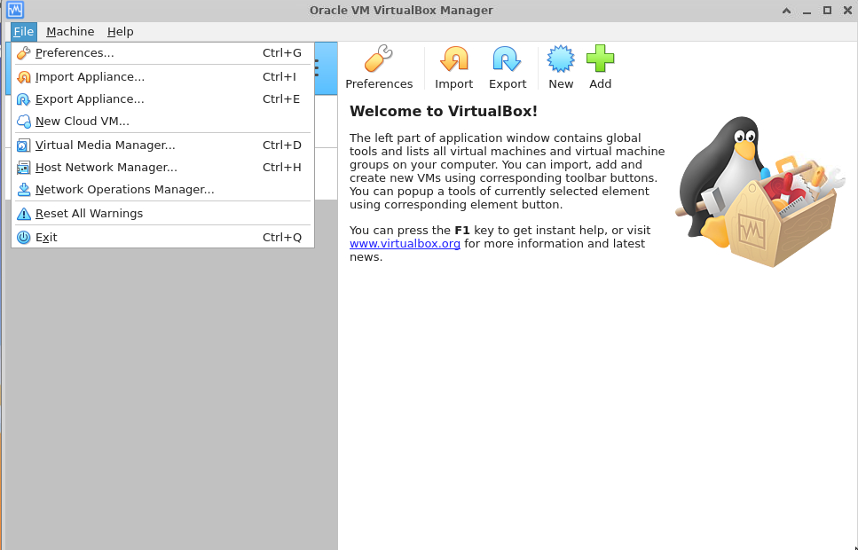
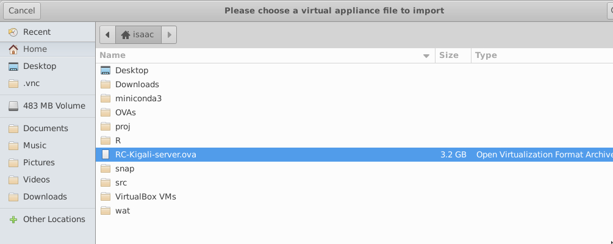
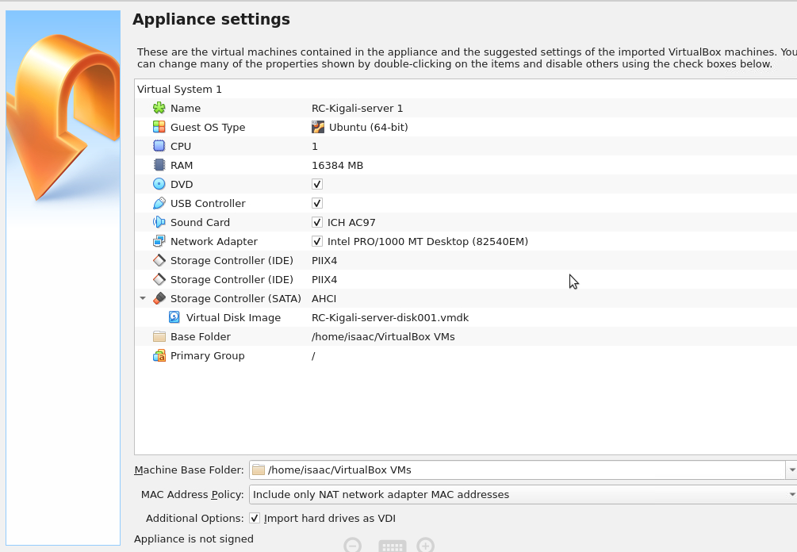
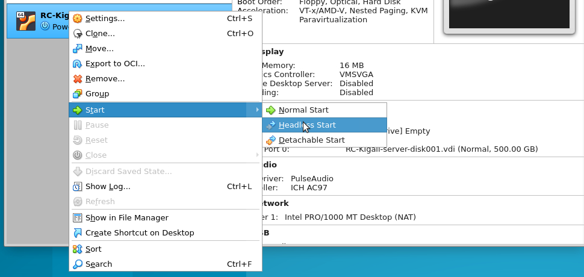
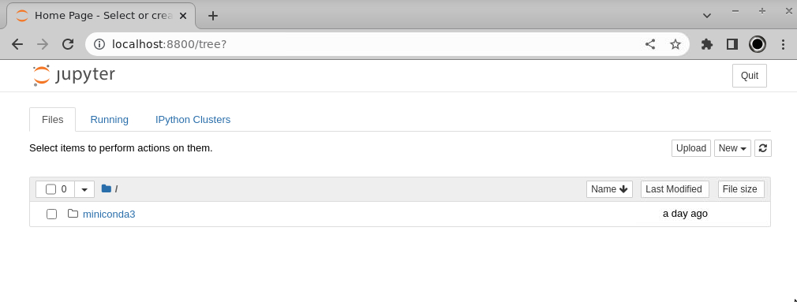

# Software Installation & Configuration

For this workshop we will be using software which has been pre-installed
inside a **"Virtual Machine"** environment. We do this for two reasons: 1) making
sure everyone has access to working software; and 2) preventing any foreseeable
installation difficulties. More details on the 'Why?' are below, so first let's
answer the 'What?' question:

## What is a Virtual Machine (VM)?
A Virtual Machine (or 'VM') is an operating system running as an *application*
on your computer. Think of a VM as a little computer running inside your own
computer. Just like you use Firefox or Google Chrome to run a web browser on
your computer, you can use *virtualization software* to run a Linux VM on your 
computer or to run a Windows VM on your computer!

Here is a more detailed explaination of [Virtual Machines](https://www.mongodb.com/cloud-explained/virtual-machines).

## Why use a Virtual Machine?
In a workshop environment there are two main advantages for using VMs:
* **Heterogeneity of participant laptop configurations:** Each workshop
participant comes with their own laptop which is as unique to them as their
own personality. Each laptop has a different operating system (OS), with
different versions of different software already installed. Installing new
software (such as we will need for this workshop) can involve accounting for
and troubleshooting a LOT of unique laptop configurations, and this can consume
precious time which we would otherwise be dedicating to the content of the
workshop. By pre-installing all software inside a VM and sharing this with
folks, we can transform a multi-dimensional software installation problem
into a one-dimensional problem: installing the VM virtualization software. **This
saves lots of time and guarantees that everyone is working in an environment
that will behave identically.**
* **Spotty/unreliable wifi connectivity:** The other big problem VMs solve
is the need for lots of stable bandwidth for software installation. The
software we will use for this workshop requires downloading ~1GB of packages
and data. Multiply this by 20 participants who are all doing this at once
and it can strain even a strong internet connection to the point of collapse.
By pre-installing everything in a VM and distributing the VM software and images
to participants directly using USB drives we remove the need to rely on
internet connectivity at all, **guaranteeing we can run a successful workshop
even with unstable/patchy internet access**.

## Getting set up with the RADCamp VM image
Now that you know more about VMs it's time to get set up with the custom
VM image we've developed for this workshop:
* Install the **virtualization software** for your OS: [Virtualbox installers](https://www.virtualbox.org/wiki/Downloads)
* Download the [RADCamp virtualbox image](https://www.transfernow.net/dl/20230708ZJ5IIvVf)
* Start virtualbox and choose File->Import appliance.

* Browse to the downloaded file, choose it and click 'Import'

* RADCamp Virtualbox appliance settings will be displayed. Click 'Next' and 'Finish'
to proceed.

* The new image will appear in the left nav as `RC-Kigali-server`.
* Right click, choose 'Start' and wait for it to fire up (alternatively I prefer
'Headless Start' because it doesn't open the VM in a new window, as it is
unnecessary)

* Open a web browser on your computer and navigate to `http://localhost:8800`
* This should present you with a Jupyter notebook environment running inside the VM with all necessary packages installed (for the ipyrad/RADcamp part of the workshop)


**Command Line Access to the VBox image:** If you want to actually log into
the VM the username/password are:
```
uname: osboxes
passwd: osboxes.org
```

If you are interested in how we set up this image, the techinal details are
here: [RADCamp VM technical setup](vm-technical-configuration.md)
