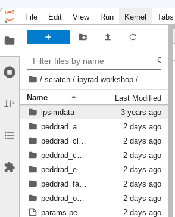
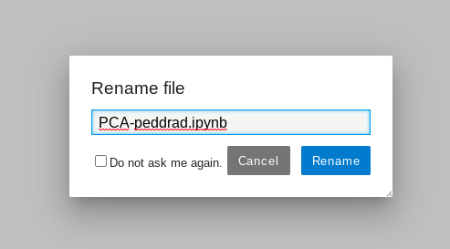
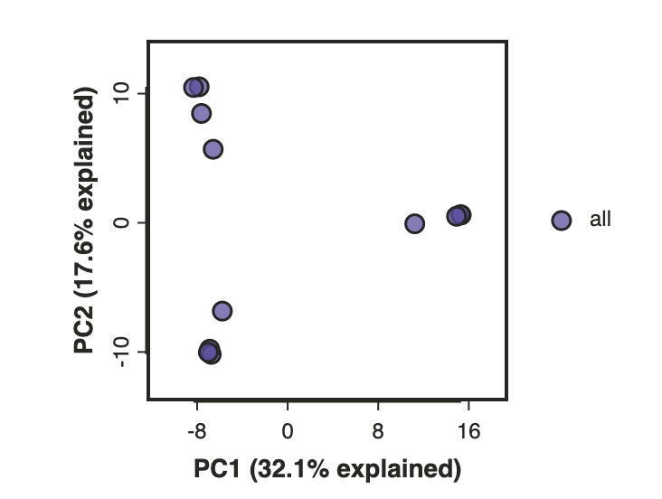
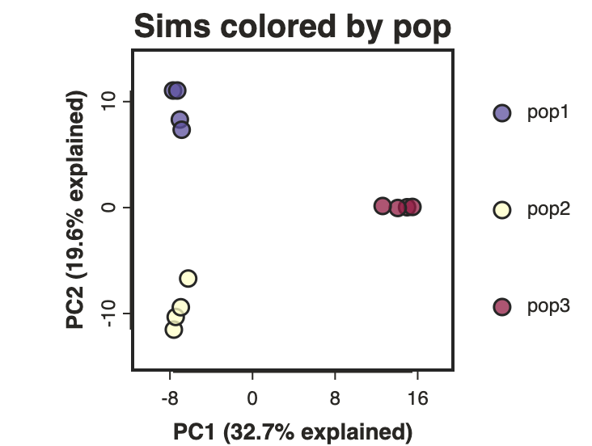
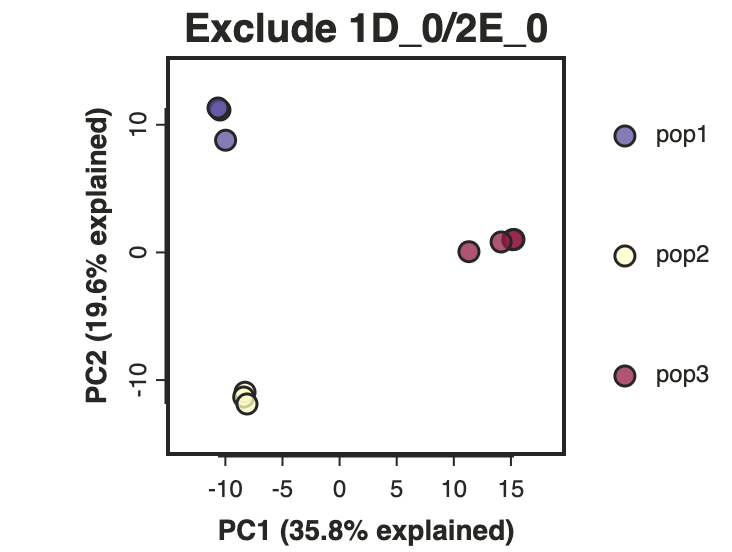
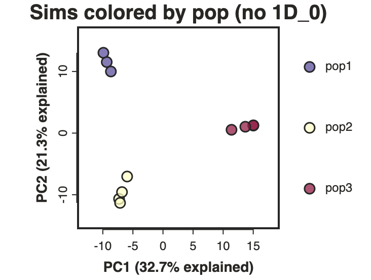
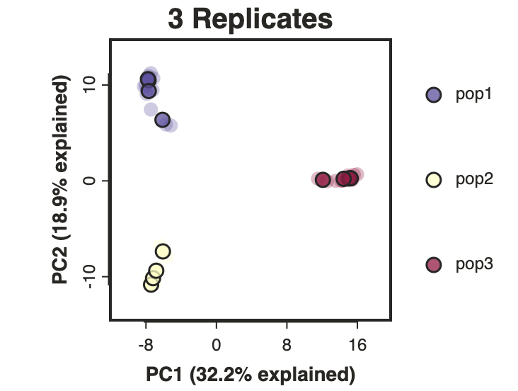
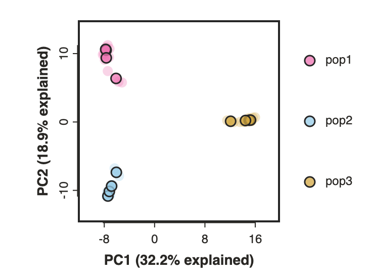
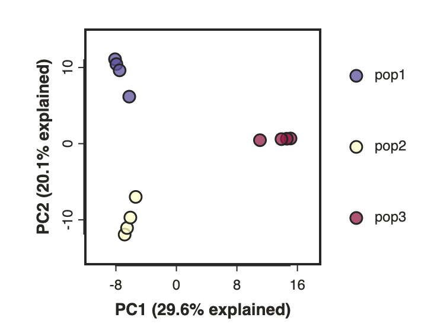
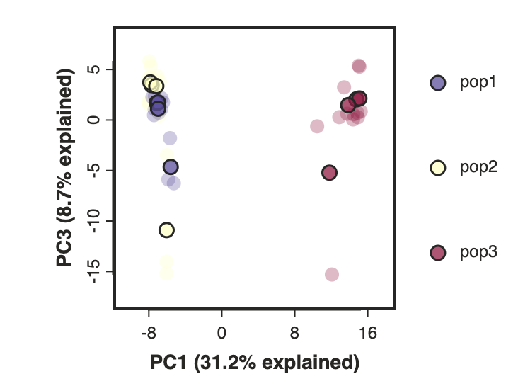

# The ipyrad.analysis module: **PCA**

As part of the `ipyrad.analysis` toolkit we've created convenience functions for
easily performing exploratory principal component analysis (PCA) on your data.
PCA is a very standard dimension-reduction technique that is often used to get
a general sense of how samples are related to one another. PCA has the advantage
over STRUCTURE type analyses in that it is very fast. Similar to STRUCTURE, PCA
can be used to produce simple and intuitive plots that can be used to guide
downstream analysis. These are three very nice papers that talk about the
application and interpretation of PCA in the context of population genetics:

* [Reich et al (2008) Principal component analysis of genetic data](https://www.nature.com/articles/ng0508-491)
* [Novembre & Stephens (2008) Interpreting principal component analyses of spatial population genetic variation](https://www.nature.com/articles/ng.139)
* [McVean (2009) A genealogical interpretation of principal components analysis](http://journals.plos.org/plosgenetics/article?id=10.1371/journal.pgen.1000686)

## A note on Jupyter/IPython
[Jupyter notebooks](http://jupyter.org/) are primarily a way to generate
reproducible scientific analysis workflows in python. ipyrad analysis tools are
best run inside Jupyter notebooks, as the analysis can be monitored and tweaked
and provides a self-documenting workflow.

The rest of the materials in this part of the workshop assume you are running
all code in cells of a jupyter notebook.

# **PCA** analyses

## A bit of setup
**TODO:** Ensure all needed packages are installed during HPC setup.

## Create a new notebook for the PCA
In the file browser on the left of JupyterLab browse to the directory with the
assembly of the simulated data: `~/ipyrad-workshop`.



Open the launcher (the big blue *+* button) and open a new "Python 3" notebook.

First things first, rename your new notebook to give it a meaningful name. You can
either click the small 'disk' icon in the upper left corner of the notebook or choose
File->Save Notebook


### Import ipyrad.analysis module
The `import` keyword directs python to load a module into the currently running
context. This is very similar to the `library()` function in R. We begin by
importing the ipyrad analysis module. Copy the code below into a
notebook cell and click run. 

```python
from ipyrad2.analysis.methods.pca import PCA
```

## Quick guide (tl;dr)
The following cell shows the quickest way to results using the small simulated
dataset in `/scratch/ipyrad-workshop`. Complete explanation of all of the
features and options of the PCA module is the focus of the rest of this tutorial.
Copy this code into a new notebook cell (small grey *+* button on the toolbar)
and run it.

```python
## Create the pca object with the simulated hdf5 data
pca = PCA.run(data="peddrad_outfiles/peddrad.hdf5")
## Bam!
pca.draw()
```



> **Note:** In this block of code, the `#` at the beginning of a line indicates
to python that this is a comment, so it doesn't try to run this line. This is a
very handy thing if you want to add or remove lines of code from an analysis
without deleting them. Simply comment them out with the `#`!

## Full guide

### Simple PCA from ipyrad hdf5 file

In the most common use, you'll want to plot the first two PCs, then inspect the
output, remove any obvious outliers, and then redo the PCA.

```python
## Path to the input data in snps.hdf5 format 
data = "peddrad_outfiles/peddrad.hdf5"
pca = PCA(data)
```
> **Note:** Here we use the hdf5 database file generated with ipyrad from the
simulated data. The database file contains the genotype calls information as well
as linkage information that is used for subsampling unlinked SNPs and bootstrap resampling.

> **Note:** The `ipyrad.analysis.pca` module can also read in data from
*any* vcf file, so it's possible to quickly generate PCA plots for any vcf from
any dataset.

Now construct the default plot, which shows all samples and PCs 1 and 2.
By default all samples are assigned to one population, so everything will 
be the same color.

```python
pca.draw()
```


### Population assignment for sample colors
Typically it is useful to color points in a PCA by some a priori grouping, such
as presumed population, or by experimental treatment groups, etc. 
this it is possible to specify population assignments in a text file.
Sample names need to be identical to the names in the input dataset,
which we can verify with the `samples` property of the PCA object. Open a new cell
and type this:

```python
pca.result.samples
```
```
['1A_0',
 '1B_0',
 '1C_0',
 '1D_0',
 '2E_0',
 '2F_0',
 '2G_0',
 '2H_0',
 '3I_0',
 '3J_0',
 '3K_0',
 '3L_0']
```

In the file browser on the left, left-click and create a new empty text file
by choosing "New File". The format of the population assignment file (or pops file)
is a simple two column and whitespace separated (can be spaces or tabs). The first
column is sample ID (must be identical to the results of `pca.results.samples`
and the second column is Population. To save time, the first population looks like
this. Copy this into your new file and finish filling out the rest of the population
assignments for samples `2E_0` through `3L_0` (the populations they belong to
are keyed by the first integer index of the sample ID).

```
1A_0 pop1
1B_0      pop1
1C_0    pop1
1D_0    pop1
```

When you are done click File->Save As and save this as `sim_pops.txt`.
Now create the `pca` object with the input data again, this time passing 
in the new file name as the second argument and specifying this as the `imap`,
and plot the new figure. We can also easily add a title to our PCA plots
with the `label=` argument.

```python
pca = PCA.run(data=data, imap="sim_pops.txt")
pca.draw(label="Sims colored by pop")
```



This is just much nicer looking now, and it's also much more straightforward
to interpret.

## Removing "bad" samples and replotting.
In PC analysis, it's common for "bad" samples to dominate several of the first
PCs, and thus "pop out" in a degenerate looking way. Bad samples of this kind
can often be attributed to poor sequence quality or sample misidentifcation.
Samples with lots of missing data tend to pop way out on their own, causing
distortion in the signal in the PCs. Normally it's best to evaluate the quality
of the sample, and if it can be seen to be of poor quality, to remove it and
replot the PCA. The simulated dataset is actually relatively nice, but for the
sake of demonstration lets imagine the sample "1D_0" is 'bad'.

> **Hover points in the PCA plot:** We make a lot of use of the interactivity of jupyter notebooks in
the ipyrad.analysis tools. In the PCA you can 'hover' over points to reveal
their sample ID.

The easiest way to achieve this is to use the `exclude` parameter when calling
`PCA.run()` to remove samples before running the PCA. This parameter takes a `list`
of sample names (which is a comma separated group of strings enclosed in square
brackets). Use it to exclude two samples like this:

```python
pca = PCA.run(data=data, imap="sim_pops.txt", exclude=["1D_0", "2E_0"])
pca.draw(label="Exclude two samples")
```



If you have many samples to exclude it might be easiert to simply remove these from 
the `imap` file and run the PCA again. Go to your `sim_pops.txt` file and remove "1D_0"
then choose File->Save Text As and save this new pops file as `subset_pops.txt`.

```python
pca = PCA.run(data=data, imap="subset_pops.txt")
pca.draw(label="Sims colored by pop (no 1D_0)")
```



## Subsampling with replication
By default `run()` will randomly subsample one SNP per RAD locus to reduce the
effect of linkage on your results. This can be turned off by setting
`subsample=False`. However, subsampling *unlinked* SNPs is generally a good
idea for PCA analyses since you want to remove the effects of linkage from your
data. It also presents a convenient way to explore the confidence in your
results. By using the option `replicates` you can run many replicate analyses
that subsample a different random set of unlinked SNPs each time. The replicate
results are drawn with a lower opacity and the centroid of all the points for
each sample is plotted as a black point. 

```python
pca = PCA.run(data=data, imap="sim_pops.txt", replicates=25)
pca.draw(label="3 Replicates");
```



## Custom color points
Another nice feature of the `draw` method is the ability to pass in any custom
color that you like for each population. You can do this by passing in another
tsv file this time mapping population IDs to python colors (either hexadecimal
or named colors). The most straightforward is just to pass in a list of valid color names
from the ['named colors' matplotlib documentation](https://matplotlib.org/stable/gallery/color/named_colors.html).

Open a new text file and save this as `pop_colors.txt`:
```
pop1	hotpink
pop2	skyblue
pop3	goldenrod
```

```python
pca.draw(colors='pop_colors.txt')
```


## Data imputation: Dealing with missing data in PCA
All PCA-family methods in ipyrad2 require a fully imputed genotype matrix. Missing 
genotypes are not allowed to remain in the numerical matrix passed to PCA, t-SNE, or UMAP.

Supported imputation modes are:
* `sample`: sample missing diploid genotypes from allele frequencies within each imputation group
* `zero-fill`: replace missing genotypes with homozygous reference calls

`sample` is the default and generally the preferred choice. If you provide imap, 
sample-mode imputation uses those groups. If you do not provide imap, all 
retained samples are treated as one imputation group.

zero-fill is usually a poor default for exploratory structure analyses because 
it can pull missing-heavy samples toward the reference state. Since none 
currently behaves the same way, users should not treat it as “leave missing data 
unchanged.”

Users should inspect `sample_data_summary.tsv` after every run and consider 
dropping samples that require too much imputation before trusting the structure. 
Heavy imputation is often a warning that missingness, rather than biology, may 
be shaping the ordination.

Here is an example of how to select the zero-fill `impute_method` (for
the simulated data the results don't change much):
```python
pca = PCA.run(data=data, imap='sim_pops.txt', impute_method='zero-fill')
pca.draw()
```



## Filtering data

Another approach is to simply enforce a lower bound on missing data with
the `min_sample_coverage` parameter. This parameter specifies the minimum 
coverage threshold below which a snp is excluded from the analysis.

This code will exclude any snp not present in 100% of samples, a very strict
threshold. Here we print the INFO again, so we can see how many SNPs were
removed by this minimum sample coverage threshold.

```python
pca = PCA.run(data=data, min_sample_coverage=12, log_level="INFO")
```
```
SNP extraction summary
  filter statistic samples: 12
  filter statistic pre_filter_snps: 9425
  filter statistic pre_filter_percent_missing: 0.057 (linked genotype cells missing before site filtering)
  filter statistic masked_genotypes_by_min_depth: 0
  filter statistic filter_by_indels_present: 0
  filter statistic filter_by_non_biallelic: 169
  filter statistic filter_by_mincov: 61
  filter statistic filter_by_minmap: 0
  filter statistic filter_by_min_site_qual: 0
  filter statistic filter_by_invariant_after_subsampling: 0
  filter statistic filter_by_minor_allele_frequency: 0
  filter statistic post_filter_snps: 9196
  filter statistic post_filter_snp_containing_linkage_blocks: 989
```

The INFO log level shows detailed information about all the filters
that are applied prior to running the PCA. Some of these are required
(indels, biallelic, invariant after subsampling), but others can also
be controlled by parameters like `min_minor_allele_frequency` (MAF filters
are common) and `max_sample_missing` (removing samples that exceed a given
missingness threshold).

We encourage you to experiment with different imputation schemes
and missing data thresholds when analysing your own data later.

## Plotting PCs other than the first and second
Even though PC 1 and 2 by definition explain the most variance in the data,
it is still often useful to examine other PCs. You can do this by specifying
which PCs to plot in in the call to `draw`.

> * **PC values are 0-indexed:** We call it "PC 1" but because python is
a zero-indexed for lists/arrays the first column of a matrix has index 0. We
know it is confusing, and it is not just for you.

```python
pca = PCA.run(data, imap="sim_pops.txt", replicates=3)
pca.draw(PC0=0, PC1=2)
```


## Running ipyrad2 PCI CLI tool

The PCA notebook API tool we have been using is really just a wrapper
around the command line version of the tool. The API mode makes it
a bit easier to explore different plotting methods, but the underlying
CLI tool has many more features that we don't expose in the API.

```bash
$ ipyrad2 pca -h
```
```
usage: ipyrad2 pca -d Path [-n str] [-o Path] [-M str] [--replicates int] [--no-subsample] [--seed int] [--perplexity float]
                   [--max-iter int] [--n-neighbors int] [--plot] [--plot-width int] [--plot-height int] [--plot-marker-size int]
                   [--plot-colors Path] [-m int] [-r float] [-a float] [--min-genotype-depth int] [--min-site-qual float] [-I str]
                   [-e [str ...]] [-R] [-i Path] [-g Path] [-c int] [-f] [-l str] [-h]

-------------------------------------------------------------
ipyrad2 [v.0.1.11]
Interactive assembly and analysis of RAD-seq data
-------------------------------------------------------------
ipyrad2 pca: run PCA, t-SNE, or UMAP on SNP HDF5 data

Core inputs:
  -d, --data Path                         Path to an SNP-capable HDF5 file. Convert VCF first with `ipyrad2 vcf2hdf5`.
  -n, --name str                          Prefix name for output files. [default=pca]
  -o, --out Path                          Directory to write numerical outputs and stats. [default=output-pca]

Method and linkage:
  -M, --method str                        Method to run: pca, tsne, or umap. [default=pca]
  --replicates int                        Number of PCA replicate runs. Only valid with `-M pca`. [default=1]
  --no-subsample                          Keep linked SNPs. By default pca subsamples one SNP per RAD locus.
  --seed int                              Random seed for SNP subsampling, imputation, and serial method initialization.
  --perplexity float                      t-SNE perplexity. Used only with `-M tsne`. [default=5.0]
  --max-iter int                          t-SNE maximum iterations. Used only with `-M tsne`. [default=1000]
  --n-neighbors int                       UMAP neighbor count. Used only with `-M umap`. [default=15]

Plotting:
  --plot                                  Write an SVG plot for PCA results. Only supported with `-M pca`.
  --plot-width int                        SVG width in pixels for `--plot`. [default=400]
  --plot-height int                       SVG height in pixels for `--plot`. [default=300]
  --plot-marker-size int                  Marker size for `--plot`. [default=10]
  --plot-colors Path                      Whitespace-delimited population color file for PCA plot marker colors.

Filtering and samples:
  -m, --min-sample-coverage int           Minimum number of samples that must have data at a SNP. [default=4]
  -r, --max-sample-missing float          Maximum missing-data frequency allowed in a sample. [default=1.0]
  -a, --min-minor-allele-frequency float  Minimum minor allele frequency required to retain a SNP. [default=0.0]
  --min-genotype-depth int                Mask sample genotypes with FORMAT/DP below this threshold before site filtering. [default=0]
  --min-site-qual float                   Minimum VCF QUAL score required to retain a SNP site. [default=0.0]
  -I, --impute-method str                 Impute missing genotypes with `sample` or `zero`. [default=sample]
  -e, --exclude [str ...]                 Exclude one or more samples by name. This takes precedence over IMAP membership and `-R`.
  -R, --include-reference                 Include `assembly_reference_sequence`. By default it is excluded unless IMAP already contains it.
  -i, --imap Path                         Sample-to-population mapping file w/ `sample<TAB>population` or `glob<TAB>population` per line.
  -g, --minmap Path                       Population-to-minimum-coverage mapping file with `population<TAB>min` on each line. Adds per-
                                          population minimum coverage checks on top of `-m` when `imap` is used.

Performance and overwrite:
  -c, --cores int                         Number of cores to use during chunked SNP filtering and UMAP embedding. [default=1]
  -f, --force                             Overwrite existing output files with identical names.

Logging:
  -l, --log-level str                     Log level (TRACE, DEBUG, INFO, WARNING, ERROR) [default=INFO]
  -h, --help                              Show this help message and exit.

Examples
--------
$ ipyrad2 pca -d snps.hdf5 -o OUT/
$ ipyrad2 pca -d snps.hdf5 -o OUT/ --plot
$ ipyrad2 pca -d snps.hdf5 -o OUT/ --plot --plot-width 520 --plot-height 360
$ ipyrad2 pca -d snps.hdf5 -o OUT/ --plot -i imap.tsv --plot-colors colors.tsv
$ ipyrad2 pca -d snps.hdf5 -o OUT/ -M tsne --perplexity 8
$ ipyrad2 pca -d snps.hdf5 -o OUT/ -M umap --n-neighbors 10
$ ipyrad2 pca -d snps.hdf5 -o OUT/ --no-subsample --impute-method zero
```

## More to explore
The `ipyrad.analysis.methods.pca` module has many more features that we just don't have
time to go over, but you might be interested in checking them out later:
* [Full ipyrad PCA documentation](https://eaton-lab.org/ipyrad2/analyses/pca/)

