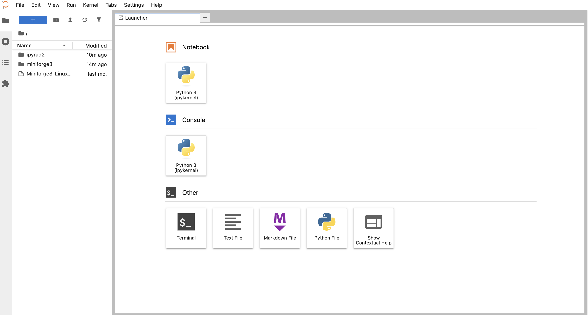

# HPC System Setup
* Genomics/Bioinformatics requires computing resources. Specifically, CPUs,
RAM, and a lot of disk space. Options: workstation, HPC, or cloud computing.
* A server is simply a program running on a remote (different) computer with
which you can interact over the internet. You send it instructions/code, it
runs the code and sends a response. This way you can use your laptop to run
very intensive code on a larger remote machine.
* For this workshop we are going to use compute infrastructure provided by
Tec de Monterrey.

**Get everyone on Tec HPC here: [Link to Node/IP address assignments when available](wat)**

## Tec de Monterrey HPC System Setup

* Log in with ssh
  * On Mac or Linux you can open a Terminal and type `ssh`
  * On windows you should be able to open PowerShell and use `ssh` from there.
    * Windows gotcha: Settings > Apps > Optional features > Add a feature > search for OpenSSH Client and choose "Install"
* Download and install miniconda
  * `wget https://github.com/conda-forge/miniforge/releases/latest/download/Miniforge3-Linux-x86_64.sh`
  * `bash Miniforge3-Linux-x86_64.sh` <- And follow the prompts
* Now log out with `exit` and log back in and you should see your prompt change to have `(base)` at the beginning.
* Install `git` so we can clone the ipyrad2 repository
  * `sudo apt install git` then type in your password
* Create a new conda environment and install all needed software
```
git clone https://github.com/eaton-lab/ipyrad2.git
cd ipyrad2
conda env create -f workshop_environment.yml -n ipyrad2
conda activate ipyrad2
```

You will not typically need to do this, but because ipyrad2 is still in 
development we will clone the repository and install it locally in developer 
mode so that if necessary we can quickly apply changes to address bug fixes.
```
# Install ipyrad2 in developer mode
pip install -e . --no-deps
```

### Launch and access Jupyter lab web interface
* Set jupyter server password: `jupyter server password`
  * I recommend to set this the same as your login password, for simplicity.
* Launch jupyter lab: `jupyter lab --ip="*" &`  
* Access your jupyter lab instance at your personal node IP address
  * Open a new browser tab. For me, my personal node is: `http://10.14.255.198:8888`

You should see the jupyter lab web interface like this:



### Accessing a command line interface on Tec HPC
Our first goal will be to use gain access to a command line interface to view RAD-seq data
as way to become familiar with the format of the raw data that we will analyze, 
while also learning about basic command line programs.

```bash
## Example Code Cell.
## Create an empty file in my home directory called `watdo.txt`
$ touch ~/watdo.txt

## Print "wat" to the screen
$ echo "wat"
wat
```

[Bash command line cheat sheet](https://www.git-tower.com/blog/command-line-cheat-sheet/).

Take a look at the contents of the folder you're currently in.
```bash
$ ls
```

To keep things organized, please create a new directory which we'll be using 
during this Workshop. Use `mkdir`. And then navigate into the new folder, using `cd`.
```bash
$ mkdir ipyrad-workshop
$ cd ipyrad-workshop
```

* Unix tools: cd, ls, less, cat, nano, grep.

## Web-based working environment: Jupyter Lab

Launching and accessing jupyter lab on your compute node
