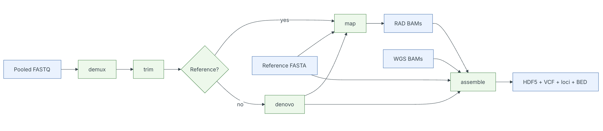
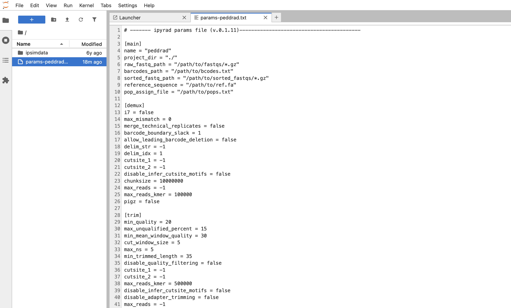

# ipyrad command line assembly tutorial

This is the full tutorial for the command line interface (**CLI**) for ipyrad.
In this tutorial we'll walk through the entire assembly, from raw data to output
files for downstream analysis. This is meant as a broad introduction to
familiarize users with the general workflow, and some of the parameters and
terminology. We will use simulated paired-end ddRAD data as an example in this
tutorial, however, you can follow along with one of the other example datasets
if you like and although your results will vary the procedure will be identical. 

If you are new to RADseq analyses, this tutorial will provide a simple
overview of how to execute ipyrad, what the data files look like, how to
check that your analysis is working, and what the final output formats
will be. We will also cover how to run ipyrad on a cluster and how to do so
efficiently.

Each grey cell in this tutorial indicates a command line interaction. 
Lines starting with `$ ` indicate a command that should be executed 
by copying and pasting the text into your terminal. Elements in code cells
surrounded by angle brackets (e.g. <username>) are variables that need to be 
replaced by the user. All lines in code cells beginning with \#\# are 
comments and should not be copied and executed. All other lines should 
be interpreted as output from the issued commands.

```bash
## Example Code Cell.
## Create an empty file in my home directory called `watdo.txt`
$ touch ~/watdo.txt

## Print "wat" to the screen
$ echo "wat"
wat
```

# Overview of Assembly Steps
Very roughly speaking, ipyrad exists to transform raw data coming off the 
sequencing instrument into output files that you can use for downstream 
analysis. 



The basic steps of this process are as follows:

* Step 1 - demux: Demultiplexing fastq data to Samples
* Step 2 - trim: Trim and quality control
* Step 3 - denovo: Construct pseudo-reference sequence
* Step 4 - map: Map trimmed reads to external reference or denovo pseudoreference
* Step 5 - assemble: Define loci, calls variants, and write assembled outputs

> **Note on files in the project directory:** Assembling RADseq type 
sequence data requires a lot of different steps, and these steps 
generate a **lot** of intermediary files. ipyrad organizes these files 
into directories, and it prepends the name of your assembly to each 
directory with data that belongs to it. One result of this is that 
you can have multiple assemblies of the same raw data with different 
parameter settings and you don't have to manage all the files yourself! 
Another result is that **you should not rename or move any of the directories
inside your project directory**, unless you know what you're doing or
you don't mind if your assembly breaks.

# Getting Started

We will be running through the assembly of simulated data using the ipyrad
CLI, so if you haven't already done so please make sure you have jupyter lab
running on your compute node, you have connected to it through your browser,
and you have opened a new terminal.

## Clone the ipyrad2 repository
You will not typically need to do this, but because ipyrad2 is still in
development we will clone the repository and install it locally in developer
mode so that if necessary we can quickly apply changes to address bug fixes.

```bash 
# Make sure you are in your home directory
$ cd ~

# Clone the ipyrad2 repository
$ git clone https://github.com/eaton-lab/ipyrad2.git

# Install ipyrad2 in developer mode
$ pip install -e ipyrad2 --no-deps
```

## Unpack the simulated data

```bash
# First, make sure you're in your workshop directory
$ cd ~/ipyrad-workshop

# Unpack the simulated data which is included in the ipyrad github repo
# `tar` is a program for reading and writing archive files, somewhat like zip
#   -x eXtract from an archive
#   -z unZip before extracting
#   -f read from the File
$ tar -xzf ~/ipyrad2/tests/ipsimdata.tar.gz

# Take a look at what we just unpacked
$ ls ipsimdata
gbs_example_barcodes.txt         pairddrad_example_R2_.fastq.gz         pairgbs_wmerge_example_genome.fa
gbs_example_genome.fa            pairddrad_wmerge_example_barcodes.txt  pairgbs_wmerge_example_R1_.fastq.gz
gbs_example_R1_.fastq.gz         pairddrad_wmerge_example_genome.fa     pairgbs_wmerge_example_R2_.fastq.gz
pairddrad_example_barcodes.txt   pairddrad_wmerge_example_R1_.fastq.gz  rad_example_barcodes.txt
pairddrad_example_genome.fa      pairddrad_wmerge_example_R2_.fastq.gz  rad_example_genome.fa
pairddrad_example_genome.fa.fai  pairgbs_example_barcodes.txt           rad_example_genome.fa.fai
pairddrad_example_genome.fa.sma  pairgbs_example_R1_.fastq.gz           rad_example_genome.fa.sma
pairddrad_example_genome.fa.smi  pairgbs_example_R2_.fastq.gz           rad_example_genome.fa.smi
pairddrad_example_R1_.fastq.gz   pairgbs_wmerge_example_barcodes.txt    rad_example_R1_.fastq.gz
```
You can see that we provide a bunch of different example datasets, as well as
toy genomes for testing different assembly methods. For now we'll go forward
with the `pairddrad` example dataset, which is a paired-end datatype similar
to what our 3RAD empirical data will look like.

## ipyrad2 classic mode
One of the main differences from the previous ipyrad interface is that ipyrad2
centers the command line around named subcommands with clearer inputs, outputs,
logs, and stats. This new interface is more powerful and more expressive, but it
also has a steeper learning curve. To facilitate ease of use we have implemented
the older ipyrad CLI format, which uses a single command and a params
file through a companion tool `ipyrad2-classic`. We will focus on `ipyrad2-classic`
for the moment, but will return to the new ipyrad2 subcommand interface later on.

## ipyrad help
To better understand how to use ipyrad, let's take a look at the help argument.
We will use some of the ipyrad arguments in this tutorial (for example: -n, -p,
-s, -c, -r). But, the complete list of optional arguments and their explanation
is below.

```
$ ipyrad2-classic -h

usage: ipyrad [-n NEW] [-p PARAMS] [-s STEPS] [-c CORES] [-t THREADS] [-l str] [-f] [-d] [-v]

-------------------------------------------------------------
ipyrad [v.0.1.11]
Interactive assembly and analysis of RAD-seq data
-------------------------------------------------------------
ipyrad2 classic command line tool.

options:
  -n NEW               create new file 'params-{new}.txt' in current directory
  -p PARAMS            path to params file for Assembly
  -s STEPS             Set of assembly steps to run, e.g., -s 123
  -c CORES             number of CPU cores to use (Default=8)
  -t THREADS           tune threading of multi-threaded binaries (Default=2)
  -l, --log-level str  Log level (DEBUG, INFO, SUCCESS, WARN, ERROR) [default=SUCCESS]
  -f, --force          force overwrite of existing data
  -d, --debug          Print debug information
  -v, --version        show program's version number and exit

Examples
--------
ipyrad2-classic -n data                       ## create new file called params-data.txt 
ipyrad2-classic -p params-data.txt -s 123     ## run only steps 1-3 of assembly.
ipyrad2-classic -p params-data.txt -s 3 -f    ## run step 3, overwrite existing data.

  * Documentation: http://ipyrad2.github.io
```

## Create a new parameters file
ipyrad uses a text file to hold all the parameters for a given assembly.
Start by creating a new parameters file with the `-n` flag. This flag
requires you to pass in a name for your assembly. In the example we use
`peddrad` but the name can be anything at all. Once you start
analysing your own data you might call your parameters file something
more informative, like the name of your organism and some details on the
settings.


```bash
# Now create a new params file named 'peddrad'
$ ipyrad2-classic -n peddrad
```

This will create a file in the current directory called `params-peddrad.txt`.
The params file contains parameter key/value pairs grouped into sections
based on which step they apply to. The `[main]` parameters apply to all steps.
Parameters that define file paths __need__ to be enclosed in quotes.
In this tutorial we will only be using a few of the parameters, but you can
refer to the [ipyrad2 documentation](https://eaton-lab.org/ipyrad2/assembly/demux/)
for more detailed information.
``` 
$ cat params-peddrad.txt
# ------- ipyrad params file (v.0.1.11)-----------------------------------------

[main]
name = "peddrad"
project_dir = "./"
raw_fastq_path = "/path/to/fastqs/*.gz"
barcodes_path = "/path/to/bcodes.txt"
sorted_fastq_path = "/path/to/sorted_fastqs/*.gz"
reference_sequence = "/path/to/ref.fa"
pop_assign_file = "/path/to/pops.txt"

[demux]
i7 = false
max_mismatch = 0

<clip>

subsample = -1
populations = -1
rename = -1
masks = -1
keep_tmpdir = false
```

In general the defaults are sensible, and we won't mess with them for now, 
but there are a two parameters we *must* change:
* The path to the raw data
* The barcodes file

Open the new params file by double-clicking on `params-peddrad.txt` in the
left-nav file browser (you might need to navigate to this directory first).



We need to specify where the raw data files and barcodes are located. 
Change the following lines in your params files to look like this:

```bash
raw_fastq_path = "ipsimdata/pairddrad_example_R*.fastq.gz"
barcodes_path = "ipsimdata/pairddrad_example_barcodes.txt"
```
**NB:** Don't forget to choose "File->Save Text" after you are done editing!

Once we start running the analysis ipyrad will create several new directories to
hold the output of each step for this assembly. By default the new directories
are created in the `project_dir` directory and use the prefix specified by the
`assembly_name` parameter. For this example assembly all the intermediate
directories will be of the form: `~/ipyrad-workshop/peddrad_*`. 

# Input data format

Before we get started with the assembly, let's take a look at what the raw data
looks like. Remember that you can use `zcat` and `head` to do this.

```bash
## zcat: unZip and conCATenate the file to the screen
## head -n 20: Just take the first 20 lines of input

$ zcat ipsimdata/pairddrad_example_R1_.fastq.gz | head -n 20
@lane1_locus0_2G_0_0 1:N:0:
CTCCAATCCTGCAGTTTAACTGTTCAAGTTGGCAAGATCAAGTCGTCCCTAGCCCCCGCGTCCGTTTTTACCTGGTCGCGGTCCCGACCCAGCTGCCCCC
+
BBBBBBBBBBBBBBBBBBBBBBBBBBBBBBBBBBBBBBBBBBBBBBBBBBBBBBBBBBBBBBBBBBBBBBBBBBBBBBBBBBBBBBBBBBBBBBBBBBBB
@lane1_locus0_2G_0_1 1:N:0:
CTCCAATCCTGCAGTTTAACTGTTCAAGTTGGCAAGATCAAGTCGTCCCTAGCCCCCGCGTCCGTTTTTACCTGGTCGCGGTCCCGACCCAGCTGCCCCC
+
BBBBBBBBBBBBBBBBBBBBBBBBBBBBBBBBBBBBBBBBBBBBBBBBBBBBBBBBBBBBBBBBBBBBBBBBBBBBBBBBBBBBBBBBBBBBBBBBBBBB
@lane1_locus0_2G_0_2 1:N:0:
CTCCAATCCTGCAGTTTAACTGTTCAAGTTGGCAAGATCAAGTCGTCCCTAGCCCCCGCGTCCGTTTTTACCTGGTCGCGGTCCCGACCCAGCTGCCCCC
+
BBBBBBBBBBBBBBBBBBBBBBBBBBBBBBBBBBBBBBBBBBBBBBBBBBBBBBBBBBBBBBBBBBBBBBBBBBBBBBBBBBBBBBBBBBBBBBBBBBBB
@lane1_locus0_2G_0_3 1:N:0:
CTCCAATCCTGCAGTTTAACTGTTCAAGTTGGCAAGATCAAGTCGTCCCTAGCCCCCGCGTCCGTTTTTACCTGGTCGCGGTCCCGACCCAGCTGCCCCC
+
BBBBBBBBBBBBBBBBBBBBBBBBBBBBBBBBBBBBBBBBBBBBBBBBBBBBBBBBBBBBBBBBBBBBBBBBBBBBBBBBBBBBBBBBBBBBBBBBBBBB
@lane1_locus0_2G_0_4 1:N:0:
CTCCAATCCTGCAGTTTAACTGTTCAAGTTGGCAAGATCAAGTCGTCCCTAGCCCCCGCGTCCGTTTTTACCTGGTCGCGGTCCCGACCCAGCTGCCCCC
+
BBBBBBBBBBBBBBBBBBBBBBBBBBBBBBBBBBBBBBBBBBBBBBBBBBBBBBBBBBBBBBBBBBBBBBBBBBBBBBBBBBBBBBBBBBBBBBBBBBBB
```

The simulated data are 100bp paired-end reads generated as ddRAD, meaning there
will be two overhang sequences. In this case the 'rare' cutter leaves the TGCAT
overhang.
* Can you find this sequence in the raw data?
* What's going on with that other stuff at the beginning of each read?

# Step 1: Demultiplexing the raw data

Since the raw data is still just a huge pile of reads, we need to split it up
and assign each read to the sample it came from. This will create a new
directory called `peddrad_fastqs` with two `.gz` files per sample, one for
R1 and one for R2.

> **Note on step 1:** Sometimes, rather than returning the raw data, sequencing
facilities will give the data pre-demultiplexed to samples. In this case you would
use `sorted_fastq_path` instead of `raw_fastq_path`/`barcodes_path`, and you would
also be able to __skip step 1__. That's not what we are doing here so we do have
to run step 1

Now lets run step 1! For the simulated data this will take just a few moments.

> **Special Note:** In some cases it's useful to specify the number of cores with
the `-c` flag. If you do not specify the number of cores ipyrad assumes you want
**all** of them. Our compute nodes have 16 cores so we'll practice that here.

```bash
## -p    the params file we wish to use
## -s    the step to run
## -c    run on 16 cores
$ ipyrad2-classic -p params-peddrad.txt -s 1 -c 16
```

```
-------------------------------------------------------------
ipyrad [v.0.1.11]
Interactive assembly and analysis of RAD-seq data
-------------------------------------------------------------
Step 1 (demux): Demultiplexing fastq data to Samples
[####################] 100% | Counting kmers - total jobs: 1 
```

## Demultiplexing process in depth
Restriction cutsite motifs at the 5′ or 3′ end of single- or paired-end reads 
are auto-detected using fast k-mer analysis. Inline barcodes are parsed relative 
to the detected motif, and paired reads are evaluated jointly to improve sorting 
accuracy.

## Getting more information about the process with `log-level`

By default classic mode limits the amount of information logged about the things
it is doing, in most cases you won't necessarily need to know what's going on
'under the hood'. But if you do want to see more about the process you can
increase the logging level, to see more detailed info. Because step 1 on the
simulated data is fast, lets run it again and increase the log level.

```bash
## -p    the params file we wish to use
## -s    the step to run
## -c    run on 16 cores
## -l    Set the log level to INFO
## -f    force to re-run step 1 and overwrite existing files
$ ipyrad2-classic -p params-peddrad.txt -s 1 -c 16 -l INFO -f

-------------------------------------------------------------
ipyrad [v.0.1.11]
Interactive assembly and analysis of RAD-seq data
-------------------------------------------------------------
Step 1 (demux): Demultiplexing fastq data to Samples
2026-07-12 13:41:00 | INFO     | cli_main.py          | ---------------------------------------------------------
2026-07-12 13:41:00 | INFO     | cli_main.py          | ----- ipyrad2 demux: demultiplexing reads to samples -----
2026-07-12 13:41:00 | INFO     | cli_main.py          | ---------------------------------------------------------
2026-07-12 13:41:00 | INFO     | cli_main.py          | CMD: ipyrad2 -p params-peddrad.txt -s 1 -c 8 -f -l INFO
2026-07-12 13:41:00 | INFO     | names.py             | paired files by auto-detecting mate tokens in filenames
2026-07-12 13:41:00 | INFO     | names.py             | showing first 1/1 names parsed from file paths
2026-07-12 13:41:00 | INFO     | names.py             | pairddrad_example <- ('pairddrad_example_R1_.fastq.gz', 'pairddrad_example_R2_.fastq.gz')
2026-07-12 13:41:00 | INFO     | demux.py             | Found PE data
2026-07-12 13:41:00 | INFO     | demux.py             | existing demux stats files are present in /home/isaac_tmp/ipyrad-workshop/peddrad_fastqs and will not be overwritten (9 total): ipyrad_demux_stats_0.txt, ipyrad_demux_stats_1.txt, ipyrad_demux_stats_2.txt, ... and 6 more
2026-07-12 13:41:00 | INFO     | demux.py             | removing 24 existing demux output artifact(s) from /home/isaac_tmp/ipyrad-workshop/peddrad_fastqs because --force was set
[####################] 100% | Counting kmers - total jobs: 1 
2026-07-12 13:41:03 | INFO     | demux.py             | cutsite motifs set to R1=[TGCAG] inferred from barcode boundaries
2026-07-12 13:41:03 | INFO     | demux.py             | cutsite motifs set to R2=[<none>] at offset 0
2026-07-12 13:41:03 | INFO     | demux_pipeline.py    | demultiplexing on R1 inline barcodes with 1 reader(s) and 1 writer(s) using python compression
2026-07-12 13:41:03 | INFO     | demux_pipeline.py    | processing pairddrad_example ('pairddrad_example_R1_.fastq.gz', 'pairddrad_example_R2_.fastq.gz')
2026-07-12 13:41:08 | INFO     | demux_report.py      | demultiplexing statistics written to /home/isaac_tmp/ipyrad-workshop/peddrad_fastqs/ipyrad_demux_stats_9.txt and /home/isaac_tmp/ipyrad-workshop/peddrad_fastqs/ipyrad_demux_stats_9.json
```

## Inspecting results of step 1

The demultiplexed fastq files per sample are written to a new directory called
`peddrad_fastqs`. ipyrad2 tracks detailed information about assembly results and 
saves it to a file inside the directories it creates for each step. For
instance, to see full stats for step 1:

```bash 
$ cat peddrad_fastqs/ipyrad_demux_stats_0.txt 
```
```
CMD: ipyrad2 -p params-peddrad.txt -s 1 -c 4

# Raw file statistics
######################
                  total_reads cut_found bar_matched bar_ambiguous
pairddrad_example      239812    239812      239812             0

# Sample demux statistics
######################
      reads_raw
1A_0      19835
1B_0      20071
1C_0      19969
1D_0      20082
2E_0      20004
2F_0      19899
2G_0      19928
2H_0      20110
3I_0      20078
3J_0      19965
3K_0      19846
3L_0      20025

# Restriction motif inference
######################
read_end     role source      decision   position motif  support  support_fraction
      R1 selected   auto auto-selected 9+0:100000 TGCAG   100000          1.000000

# Barcode boundary collisions
######################
none

# Barcode boundary ambiguity statistics
######################
Reads listed in this section matched multiple sample/barcode-boundary candidates and were not assigned or written to any sample output file.
none

# Suspected missing barcode statistics
######################
This section reports frequent unassigned barcode-like observations with bounded-memory estimated counts. min_records is a conservative lower bound.
none

# Barcode detection statistics
######################
           true_bar observed_bar  N_records
1A_0  (CATCATCAT, )    CATCATCAT      19835
1B_0  (CCAGTGATA, )    CCAGTGATA      20071
1C_0  (TGGCCTAGT, )    TGGCCTAGT      19969
1D_0  (GGGAAAAAC, )    GGGAAAAAC      20082
2E_0  (GTGGATATC, )    GTGGATATC      20004
2F_0  (AGAGCCGAG, )    AGAGCCGAG      19899
2G_0  (CTCCAATCC, )    CTCCAATCC      19928
2H_0  (CTCACTGCA, )    CTCACTGCA      20110
3I_0  (GGCGCATAC, )    GGCGCATAC      20078
3J_0  (CCTTATGTC, )    CCTTATGTC      19965
3K_0  (ACGTGTGTG, )    ACGTGTGTG      19846
3L_0  (TTACTAACA, )    TTACTAACA      20025
```

# Step 2 (trim): Trim and quality control

This step filters reads based on quality scores and maximum number of uncalled
bases, minimum trimmed sequence length, and can be used to detect Illumina 
adapters in your reads, which is sometimes a problem under a couple different
library prep scenarios. There are several trimming parameters, and in general
ipyrad does 'the right thing', so you won't typically need to modify these.

Two parameters to be aware of, to highlight one of the behaviors of trimming
are `min-mean-window-quality` (default 30) and `cut-window-size` (default 5).
`cut-window-size` is the sliding-window length, in bases, that fastp uses when 
scanning read tails for quality trimming. `min-mean-window-quality` is the minimum 
average Phred quality that window must maintain. When a tail window’s mean quality 
drops below that threshold, fastp trims low-quality sequence from the read end.

The default average Phred quality score of 30 translates to the probability a base 
call is incorrect of 0.001 (0.1%). This is a safe default, but if you are having 
excess heterozygosity you have reason to believe is due to sequencing error then
you could set this to 40, which will give a probability of a miscalled base of 0.0001. 
See the [Phred quality score wikipedia page](https://en.wikipedia.org/wiki/Phred_quality_score)
for more details.

```bash
$ ipyrad2-classic -p params-peddrad.txt -s 2 -c 8
```
```

-------------------------------------------------------------
ipyrad [v.0.1.11]
Interactive assembly and analysis of RAD-seq data
-------------------------------------------------------------
Step 2 (trim): Filtering and trimming reads
[####################] 100% | Counting kmers - total jobs: 12 
[####################] 100% | Counting kmers - total jobs: 12 
[####################] 100% | Trimming - total jobs: 12
```

The filtered files are written to a new directory called `peddrad_edits`. Again, 
the easiest way to evaluate the behavior of this step is to look at the results 
from this step in the stats files in the `pairddrad_edits` directory

```bash
## View the output of step 2
$ cat peddrad_edits/ipyrad_trim_stats_0.txt 
```
```
CMD: ipyrad2 -p params-peddrad.txt -s 2 -c 8

     total_reads_before total_bases_before q20_rate_before q30_rate_before read1_mean_length_before read2_mean_length_before total_reads_after total_bases_after q20_rate_after q30_rate_after read1_mean_length_after read2_mean_length_after reads_filtered_by_low_quality reads_filtered_by_too_many_N reads_filtered_by_low_complexity reads_filtered_by_too_short adapter_trimmed_reads adapter_trimmed_bases
1A_0              39670            3788485               1               1                       91                      100             39670           3628394              1              1                      85                      96                             0                            0                                0                           0                   146                  1402
1B_0              40142            3833561               1               1                       91                      100             40142           3671710              1              1                      85                      96                             0                            0                                0                           0                   154                  1283
1C_0              39938            3814079               1               1                       91                      100             39938           3652865              1              1                      85                      96                             0                            0                                0                           0                   161                  1462
1D_0              40164            3835662               1               1                       91                      100             40164           3673234              1              1                      85                      96                             0                            0                                0                           0                   181                  1772
2E_0              40008            3820764               1               1                       91                      100             40008           3659039              1              1                      85                      96                             0                            0                                0                           0                   163                  1684
2F_0              39798            3800709               1               1                       91                      100             39798           3639902              1              1                      85                      96                             0                            0                                0                           0                   181                  1606
2G_0              39856            3806248               1               1                       91                      100             39856           3645219              1              1                      85                      96                             0                            0                                0                           0                   174                  1605
2H_0              40220            3841010               1               1                       91                      100             40220           3678481              1              1                      85                      96                             0                            0                                0                           0                   181                  1649
3I_0              40156            3834898               1               1                       91                      100             40156           3672651              1              1                      85                      96                             0                            0                                0                           0                   151                  1623
3J_0              39930            3813315               1               1                       91                      100             39930           3651835              1              1                      85                      96                             0                            0                                0                           0                   200                  1760
3K_0              39692            3790586               1               1                       91                      100             39692           3629873              1              1                      85                      96                             0                            0                                0                           0                   187                  1945
3L_0              40050            3824775               1               1                       91                      100             40050           3662813              1              1                      85                      96                             0                            0                                0                           0                   183                  1762
```bash

You might also take a closer look at the filtered reads: 

```bash
$ zcat peddrad_edits/1A_0.R1.trimmed.fastq.gz | head -n 12
```
```bash
@lane1_locus0_1A_0_0 1:N:0:
TTTAACTGTTCAAGTTGGCAAGATCAAGTCGTCCCTAGCCCCCGCGTCCGTTTTTACCTGGTCGCGGTCCCGACCCAGCTGCCCCC
+
BBBBBBBBBBBBBBBBBBBBBBBBBBBBBBBBBBBBBBBBBBBBBBBBBBBBBBBBBBBBBBBBBBBBBBBBBBBBBBBBBBBBBB
@lane1_locus0_1A_0_1 1:N:0:
TTTAACTGTTCAAGTTGGCAAGATCAAGTCGTCCCTAGCCCCCGCGTCCGTTTTTACCTGGTCGCGGTCCCGACCCAGCTGCCCCC
+
BBBBBBBBBBBBBBBBBBBBBBBBBBBBBBBBBBBBBBBBBBBBBBBBBBBBBBBBBBBBBBBBBBBBBBBBBBBBBBBBBBBBBB
@lane1_locus0_1A_0_2 1:N:0:
TTTAACTGTTCAAGTTGGCAAGATCAAGTCGTCCCTAGCCCCCGCGTCCGTTTTTACCTGGTCGCGGTCCCGACCCAGCTGCCCCC
+
BBBBBBBBBBBBBBBBBBBBBBBBBBBBBBBBBBBBBBBBBBBBBBBBBBBBBBBBBBBBBBBBBBBBBBBBBBBBBBBBBBBBBB
```

# Step 3 (denovo): Construct pseudo-reference sequence

The goal of denovo is to construct a pseudo-reference that is representative for the samples in hand so that later read mapping and assembly steps can proceed against locus references that are empirically supported. In the case that a suitable reference sequence already exists, this step may be skipped.

**TODO:** Do we want to show people here how to do the imap to select samples for denovo?

Now lets run step 3:

```bash
$ ipyrad2-classic -p params-peddrad.txt -s 3 -c 16
```
```
-------------------------------------------------------------
ipyrad [v.0.1.11]
Interactive assembly and analysis of RAD-seq data
-------------------------------------------------------------
Step 3 (denovo): Construct denovo locus reference library
[####################] 100% | Clustering within samples - total jobs: 10 
[####################] 100% | Across-sample clustering 
[####################] 100% | Splitting global clusters - total jobs: 1000 
[####################] 100% | Aligning loci - total jobs: 1000
```

**TODO**: Explain each of the steps a bit better (poached from the docs)
In-depth operations of step 3:
* Clustering within samples - Find reads matching by sequence similarity threshold,
includes a dereplication step to collapse all identical sequences (for efficiency).
Reads are first clustered within samples at a high threshold (--similarity-within) to dereplicate and group reads representing alleles at the same locus into a consensus sequence. 
* Clustering across samples - 
The consensus sequences are then clustered across samples at a lower thresholds (--similarity-across) to group homologous loci, putatively including orthologs and paralogs. 
* Splitting clusters - 
Using a similarity graph among samples, we then apply a graph-splitting algorithm to construct
* Aligning clusters - Align all clusters
**TODO**: Explain each of the steps a bit.

Again we can examine the results. The stats output tells you the parameters that
were used for this step, how many loci were found and locus coverage stats. Use 
`less` to open the stats file.

**TODO**: Break this up with explanation between each section. Potentially skip
any of the stats that are less interesting or relevant for beginners.

```bash
$ less peddrad_reference/denovo.stats.txt
```
```
CMD: ipyrad2 -p params-peddrad.txt -s 3 -c 8

# Inputs
FASTQ files            20
Selected samples       10
Total input samples    12
Sample selection mode  top-half-random
Read layout            paired-end

# Clustering Parameters
Within-sample similarity        0.950000
Across-sample similarity        0.850000
Minimum VSEARCH query coverage  0.750000
Minimum dereplication size      5
Minimum read length             35
Minimum merge overlap           20
Maximum merge differences       4
Allow reverse complement        False

# Denovo Summary
Consensus records                     9,999
Loci written                          1,000
Single-sequence loci                  0
Identical-sequence loci               0
Loci requiring MAFFT                  1,000
Joined-spacer loci                    1,000
Mixed reconciled spacer loci          0
Spacer-stripped output loci           0
Duplicated components seen            0
Same-sample reconciliation attempted  0
Components reconciled                 0
Joined-only reconciled loci           0
Mixed reconciled loci                 0
Mixed reconciled groups               0

# Locus QC
Singleton loci                           0
Singleton locus fraction                 0.000000
Loci with 2+ samples                     1,000
Loci with half or more selected samples  1,000
Loci with all selected samples           999
Mean samples per locus                   9.999
Median samples per locus                 10.000
Maximum samples per locus                10
Mean cores per locus                     9.999
Median cores per locus                   10.000
Maximum cores per locus                  10
Multi-core single-sample loci            0
Duplicated-component loci                0
Reconciled loci                          0

# Component QC
Audited components           0
Processed components         0
Oversize unsplit components  0
...skipping...
Largest component nodes      0

# Component Node Summary
Quantile  Input nodes  Contracted nodes
p50       0            0               
p90       0            0               
p99       0            0               
max       0            0               

# Selected Sample Summary
Sample  Consensus records  Read count  Joined records  Merged records  Single records
1B_0    1,000              17,420      1,000           0               0             
1D_0    1,000              17,534      1,000           0               0             
2E_0    1,000              17,371      1,000           0               0             
2F_0    1,000              17,305      1,000           0               0             
2G_0    1,000              17,281      1,000           0               0             
2H_0    1,000              17,596      1,000           0               0             
3I_0    1,000              17,480      1,000           0               0             
3J_0    1,000              17,409      1,000           0               0             
3L_0    1,000              17,441      1,000           0               0             
1C_0    999                17,420      999             0               0             

# Locus Occupancy
Samples with data  Loci  Fraction of final loci
0                  0     0.000000              
1                  0     0.000000              
2                  0     0.000000              
3                  0     0.000000              
4                  0     0.000000              
5                  0     0.000000              
6                  0     0.000000              
7                  0     0.000000              
8                  0     0.000000              
9                  1     0.001000              
10                 999   0.999000              

# Runtime
Cores                     8
VSEARCH threads per job   2
VSEARCH worker processes  4
MAFFT threads per job     1
MAFFT worker processes    8
Alignment mode            mafft
MAFFT timeout (seconds)   900
Keep intermediates        False

# Outputs
Reference FASTA       /home/isaac_tmp/ipyrad-workshop/peddrad_reference/denovo_reference.fa
Locus mapping table   /home/isaac_tmp/ipyrad-workshop/peddrad_reference/denovo.loci.mapping.tsv
Locus stats table     /home/isaac_tmp/ipyrad-workshop/peddrad_reference/denovo.loci.stats.tsv
Sample graph summary  /home/isaac_tmp/ipyrad-workshop/peddrad_reference/denovo.sample_graph_summary.tsv
Run summary report    /home/isaac_tmp/ipyrad-workshop/peddrad_reference/denovo.stats.txt
Run stats json        /home/isaac_tmp/ipyrad-workshop/peddrad_reference/denovo.stats.json
Audit directory       /home/isaac_tmp/ipyrad-workshop/peddrad_reference/denovo.audit
Intermediate files    cleaned on success
```

At the end of the stats file you can see the outputs that are generated by Step 3.

**TODO:** Detail the interesting denovo outputs


```bash
head -n 8 peddrad_reference/denovo_reference.fa 
```
```bash
>locus_1_1
CTGCACAAGCTTTGAGCACGGGAGAGCCCGAGACAAGCTAAGGCAATATACGTCCAGTACTTAAGACTCATACAACCGTACATCCGNNNNNNNNNNNNNNNNNNNNNNNNNNNNNNNNNNNNNNNNNNNNNNNNNNGGCCTATCTGAGTGGAAGTGCGGAGCCCAGAACTTCACTAATGATAACTGACGAACGCAAATGCGTGCTTTTTCTTTTGTAGTGTGATGAGACTCTC
>locus_2_1
GGTACGACCAATCTAGCAAGCGGGGGTAGTTACGTCTACCCTCCCAAGCAAGACTCAAACAGACAAGACTTTCGACTGCATGTCCCNNNNNNNNNNNNNNNNNNNNNNNNNNNNNNNNNNNNNNNNNNNNNNNNNNAATCGGATTGATTGTCTGTTGGTCACGATAGTGGTGCATGGCTGACGGGGCAATTACAGTTCTGCGCAGCTTCCCGACTCACCTACTAGAGAGAGTA
>locus_3_1
GAAACTGTGTCCGTCGAGAGGTTGATCGTTCTTCCAAGTTATTTTAAATCAGGCGCCATAGCCTAATCCAAGGCGGTGATGCAGATNNNNNNNNNNNNNNNNNNNNNNNNNNNNNNNNNNNNNNNNNNNNNNNNNNACGAAGCCGCCAGTCATGGACCTGAAATCACTTACTATTGATAGTGCGAACATCCTTAGATCCTTCATAATGCGCTAGGGCAAGCTGAGCGATCAGG
>locus_4_1
CTCCGTAACCAAGTGGGAACTCTATACGTACAACTATGTGACCCAGGCGTAAGCATTCAGCACCACCGTTGGTGTAGGCAGACATTNNNNNNNNNNNNNNNNNNNNNNNNNNNNNNNNNNNNNNNNNNNNNNNNNNGTCACACGGTCGTTACCGCAGTGCTACTCGGAAAATGCGTTAGATTGATTCTAGCCTGCGACGACCTGACATCGTAAAGTGTCCATGCCGGAGCATT
```

**TODO:** Talk about any of the other properties of the psuedoreference that are interesting
like the poly-N spacer for example.

# Step 4 (map): Map trimmed reads to external reference or denovo pseudoreference

ipyrad2 `map` aligns sample FASTQ files to a reference or denovo pseudoreference 
and writes coordinate-sorted, indexed BAM files. It uses `bwa-mem2` for alignment and 
`samtools` for filtering, sorting, indexing, duplicate removal, and stats reporting. 
Its main job is to convert trimmed reads into final BAMs that are ready for locus assembly.

```bash
$ ipyrad2-classic -p params-peddrad.txt -s 4 -c 16
```
```
-------------------------------------------------------------
ipyrad [v.0.1.11]
Interactive assembly and analysis of RAD-seq data
-------------------------------------------------------------
Step 4 (map): Map reads to reference assembly
[####################] 100% | Mapping - total jobs: 12 
[####################] 100% | Gathering mapping stats - total jobs: 12 
```

**TODO:** Brief information about what each step has done.

Once again useful information about the results of Step 4 (map) are stored
in a new directory called `peddrad_mapped`. Let's take a look at the stats
file.

**TODO:** Split up the walk-through of these results with brief explanations.
Focus on the most relevant details for beginners.

```bash
$ less peddrad_mapped/ipyrad_map_stats_0.txt
```
```
CMD: ipyrad2 -p params-peddrad.txt -s 4 -c 8

# ipyrad2 map stats
# Final BAMs are coordinate sorted and indexed.
# Paired-end final BAMs keep only mapped mates on the same scaffold.

## Applied mapping summary
# These counts describe filters already applied during ipyrad2 map.

       input_templates reads_removed_unmapped_or_nonprimary reads_removed_same_scaffold_pairing duplicate_records_removed templates_in_final_bam fraction_input_temp
lates_retained_in_final_bam
sample                                                                                                                                                              
                           
1A_0             19835                                    0                                   0                         0                  19835                    
                      1.000
1B_0             20071                                    0                                   0                         0                  20071                    
                      1.000
1C_0             19969                                    0                                   0                         0                  19969                    
                      1.000
1D_0             20082                                    0                                   0                         0                  20082                    
                      1.000
2E_0             20004                                    0                                   0                         0                  20004                    
                      1.000
2F_0             19899                                    0                                   0                         0                  19899                    
                      1.000
2G_0             19928                                    0                                   0                         0                  19928                    
                      1.000
2H_0             20110                                    0                                   0                         0                  20110                    
                      1.000
3I_0             20078                                    0                                   0                         0                  20078                    
                      1.000
3J_0             19965                                    0                                   0                         0                  19965                    
                      1.000
3K_0             19846                                    0                                   0                         0                  19846                    
                      1.000
3L_0             20025                                    0                                   0                         0                  20025                    
                      1.000

## Assemble read-filter preview (not applied during mapping)
# These preview thresholds were not applied during mapping.
# Use them to guide ipyrad2 assemble read filters: -qm/--min-map-q, -ms/--max-softclip, -me/--max-nm, -mt/--max-tlen.
# Preview mode: pair-level thresholds evaluated on final BAM templates.
# MAPQ threshold: 20
# Soft-clipped bases threshold: 25
# NM threshold: 50
# Absolute TLEN threshold: 2000

### Preview filter effects
       templates_failing_min_mapq_20 templates_failing_max_softclip_25 templates_failing_max_nm_50 templates_failing_max_abs_tlen_2000 templates_passing_all_preview
_filters fraction_templates_passing_all_preview_filters
sample                                                                                                                                                              
                                                       
1A_0                               0                                 0                           0                                   0                                 19835                                          1.000
1B_0                               0                                 0                           0                                   0                                 20071                                          1.000
1C_0                               0                                 0                           0                                   0                                 19969                                          1.000
1D_0                               0                                 0                           0                                   0                                 20082                                          1.000
2E_0                               0                                 0                           0                                   0                                 20004                                          1.000
2F_0                               0                                 0                          19                                   0                                 19880                                          0.999
2G_0                               0                                 1                           0                                   0                                 19927                                          1.000
2H_0                               0                                 0                           0                                   0                                 20110                                          1.000
3I_0                               0                                 0                           0                                   0                                 20078                                          1.000
3J_0                               0                                 0                           0                                   0                                 19965                                          1.000
3K_0                               0                                 0                           0                                   0                                 19846                                          1.000
3L_0                               0                                 0                           0                                   0                                 20025                                          1.000

### Preview metric summaries
       min_mapq_mean min_mapq_median min_mapq_stdev max_softclip_mean max_softclip_median max_softclip_stdev max_nm_mean max_nm_median max_nm_stdev abs_tlen_mean abs_tlen_median abs_tlen_stdev
sample                                                                                                                                                                                          
1A_0          60.000          60.000          0.000             0.013               0.000              0.236       0.855         1.000        0.796       232.946         233.000          1.144
1B_0          60.000          60.000          0.000             0.006               0.000              0.166       0.847         1.000        0.788       232.956         233.000          0.968
1C_0          60.000          60.000          0.000             0.002               0.000              0.086       0.845         1.000        0.811       232.946         233.000          1.168
1D_0          60.000          60.000          0.000             0.011               0.000              0.281       0.874         1.000        0.805       232.933         233.000          1.306
2E_0          60.000          60.000          0.000             0.002               0.000              0.094       0.848         1.000        0.782       232.937         233.000          1.312
2F_0          60.000          60.000          0.000             0.012               0.000              0.225       0.895         1.000        2.072       232.943         233.000          1.176
2G_0          60.000          60.000          0.000             0.007               0.000              0.302       0.828         1.000        0.780       232.945         233.000          1.225
2H_0          60.000          60.000          0.000             0.006               0.000              0.161       0.911         1.000        0.809       232.947         233.000          1.189
3I_0          60.000          60.000          0.000             0.008               0.000              0.194       1.170         1.000        0.982       232.936         233.000          1.312
3J_0          60.000          60.000          0.000             0.005               0.000              0.139       1.180         1.000        0.989       232.945         233.000          1.198
3K_0          60.000          60.000          0.000             0.010               0.000              0.232       1.172         1.000        0.972       232.925         233.000          1.433
3L_0          60.000          60.000          0.000             0.014               0.000              0.251       1.169         1.000        0.959       232.930         233.000          1.300
```

# Step 5 (assemble): Define loci, calls variants, and write assembled outputs

In ipyrad2 Step 5 (assemble) is the step that turns mapped BAM files into the 
main project outputs: final assembled loci, a filtered VCF, a final loci BED, 
a human-readable stats report, and the HDF5 database that downstream export and 
analysis commands use.

```bash
$ ipyrad2-classic -p params-peddrad.txt -s 5 -c 16
```
```
-------------------------------------------------------------
ipyrad [v.0.1.11]
Interactive assembly and analysis of RAD-seq data
-------------------------------------------------------------
Step 5 (assemble): Delimit loci, call variants, and write outputs
[####################] 100% | Scanning BAM headers - total jobs: 12 
[####################] 100% | Filtering mapped reads - total jobs: 12 
[####################] 100% | Building per-sample coverage BEDs - total jobs: 12 
[####################] 100% | Preparing loci-restricted paralog BAMs - total jobs: 12 
[####################] 100% | Scoring paralog evidence - total jobs: 12 
[####################] 100% | Preparing cleaned calling BAMs - total jobs: 12 
[####################] 100% | Calling variants - total jobs: 8 
[####################] 100% | Building low-depth masks - total jobs: 12 
[####################] 100% | Building sample-specific paralog masks - total jobs: 12 
[####################] 100% | Merging sample masks - total jobs: 12 
[####################] 100% | Building consensus sequences - total jobs: 12 
[####################] 100% | Resolving and writing final loci - total jobs: 8 
[####################] 100% | Building final VCF masks - total jobs: 12 
[####################] 100% | Masking final VCF chunks - total jobs: 32 
[####################] 100% | Building SNP database chunks - total jobs: 32 
[####################] 100% | Preparing final depth summaries - total jobs: 12 
[####################] 100% | Summarizing final sample depth - total jobs: 12 
```

**TODO:** Detailed breakdown of each substep

**TODO:** Explain the output files
```bash
$ ls peddrad_outfiles/
```
```
peddrad.bed  peddrad.hdf5  peddrad.loci.gz  peddrad.stats.json  peddrad.stats.txt  peddrad.vcf.gz  peddrad.vcf.gz.csi
```

ipyrad always creates the `peddrad.loci.gz` file, as this is our internal format,
as well as the `peddradxstats.txt` file, which reports final statistics for the
assembly (more below). The other files created fall in to 3 categories: files
that contain the full sequence (i.e. the `peddrad.loci.gz` and `peddrad.seqs.hdf5`
files), files that contain only variable sites (i.e. the `peddrad.vcf.gz`
file), and auxiliary files (`peddrad.bed` which contains genomic coordinates for
the output mapped loci).

The most informative, human-readable file here is `peddrad.stats.txt` which
gives extensive and detailed stats about the final assembly. A quick overview
of the different sections of this file:

**TODO:** Break down and explain each of the most relevant sections of the output stats file.

```bash
$ cat peddrad_outfiles/peddrad_stats.txt
```
```
CMD: ipyrad2 -p params-peddrad.txt -s 5 -c 8

# Assemble Summary
Samples                                               12
Shared loci before minimum sample coverage filter     1,000
Shared loci after delimiting                          1,000
Shared loci after paralog filtering                   1,000
Final loci written                                    1,000
Final loci retained fraction after paralog filtering  1.000000
Final loci retained fraction after delimiting         1.000000
Assembled sites                                       232,943
Final SNP sites written                               9,425
Variable sites                                        9,425
Phylogenetically informative sites                    2,408
Alignment matrix occupancy fraction                   0.785199
Overlapping indel clusters masked                     0
Overlapping indel records removed                     0
Overlapping indel bases masked                        0

# Locus Filtering
Loci filtered by minimum length                 0
Loci filtered by minimum sample coverage        0
Loci filtered by maximum variant frequency      0
Loci filtered by maximum shared heterozygosity  0
Loci filtered by maximum depth outlier          0

# Sample Masking
Loci with samples masked by minimum observed fraction threshold  0
Sample masks triggered by minimum observed fraction threshold    0
Loci with samples masked by sample heterozygosity threshold      0
Sample masks triggered by sample heterozygosity threshold        0

# Alignment Summary
Mean locus length                           232.943
Median locus length                         233.000
Minimum locus length                        195
Maximum locus length                        233
Mean samples per locus                      11.998
Median samples per locus                    12.000
Sites with sample coverage >= 2             182,943
Sites with sample coverage >= 3             182,943
Sites with sample coverage >= 4             182,943
Sites with sample coverage >= trim minimum  182,943
```

```
# Sample Summary
Sample  Sample type  Read layout  Reads before filtering  Reads after filtering  Loci in alignment  Loci fraction in alignment  Shared loci with nonzero depth  Shared-depth loci fraction  Mean depth in shared loci  Median depth in shared loci  Mean depth in nonzero shared loci  Median depth in nonzero shared loci  Masked by minimum observed fraction threshold  Masked by sample heterozygosity threshold
1A_0    RAD          PE           39,670                  39,670                 1,000              1.000000                    1,000                           1.000000                    19.835                     20.000                       19.835                             20.000                               0                                              0                                        
1B_0    RAD          PE           40,142                  40,142                 1,000              1.000000                    1,000                           1.000000                    20.071                     20.000                       20.071                             20.000                               0                                              0                                        
1C_0    RAD          PE           39,938                  39,938                 1,000              1.000000                    1,000                           1.000000                    19.969                     20.000                       19.969                             20.000                               0                                              0                                        
1D_0    RAD          PE           40,164                  40,164                 1,000              1.000000                    1,000                           1.000000                    20.081                     20.000                       20.081                             20.000                               0                                              0                                        
2E_0    RAD          PE           40,008                  40,008                 1,000              1.000000                    1,000                           1.000000                    20.004                     20.000                       20.004                             20.000                               0                                              0                                        
2F_0    RAD          PE           39,798                  39,798                 1,000              1.000000                    1,000                           1.000000                    19.899                     20.000                       19.899                             20.000                               0                                              0                                        
2G_0    RAD          PE           39,856                  39,856                 1,000              1.000000                    1,000                           1.000000                    19.928                     20.000                       19.928                             20.000                               0                                              0                                        
2H_0    RAD          PE           40,220                  40,220                 1,000              1.000000                    1,000                           1.000000                    20.110                     20.000                       20.110                             20.000                               0                                              0                                        
3I_0    RAD          PE           40,156                  40,156                 999                0.999000                    999                             0.999000                    20.058                     20.000                       20.078                             20.000                               0                                              0                                        
3J_0    RAD          PE           39,930                  39,930                 999                0.999000                    999                             0.999000                    19.938                     20.000                       19.958                             20.000                               0                                              0                                        
3K_0    RAD          PE           39,692                  39,692                 1,000              1.000000                    1,000                           1.000000                    19.845                     20.000                       19.845                             20.000                               0                                              0                                        
3L_0    RAD          PE           40,050                  40,050                 1,000              1.000000                    1,000                           1.000000                    20.024                     20.000                       20.024                             20.000                               0                                              0
```

```
# Locus Occupancy
Samples with data  RAD loci before min sample coverage  RAD loci after min sample coverage  Final filtered RAD loci with WGS  Cumulative final loci  Fraction of final loci
0                  0                                    0                                   0                                 0                      0.000000              
1                  0                                    0                                   0                                 0                      0.000000              
2                  0                                    0                                   0                                 0                      0.000000              
3                  0                                    0                                   0                                 0                      0.000000              
4                  0                                    0                                   0                                 0                      0.000000              
5                  0                                    0                                   0                                 0                      0.000000              
6                  0                                    0                                   0                                 0                      0.000000              
7                  0                                    0                                   0                                 0                      0.000000              
8                  0                                    0                                   0                                 0                      0.000000              
9                  0                                    0                                   0                                 0                      0.000000              
10                 0                                    0                                   0                                 0                      0.000000              
11                 0                                    0                                   2                                 2                      0.002000              
12                 1,000                                1,000                               998                               1,000                  0.998000
```

**TODO:** Talk here about `inspect`

**TODO:** Do we want to talk about wex/lex/snpex here or no?

Congratulations! You've completed your first RAD-Seq assembly. Now you can try
applying what you've learned to assemble your own real data. Please consult the
[ipyrad2 online documentation](https://eaton-lab.org/ipyrad2) for details about
many of the more powerful features of ipyrad2 such as the `analysis` toolkit, which
includes extensive downstream analysis tools for such things as clustering and
population assignment, phylogenetic tree inference, quartet-based species tree
inference, and much more.
