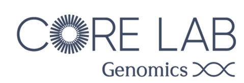
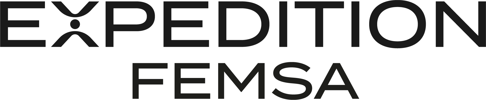
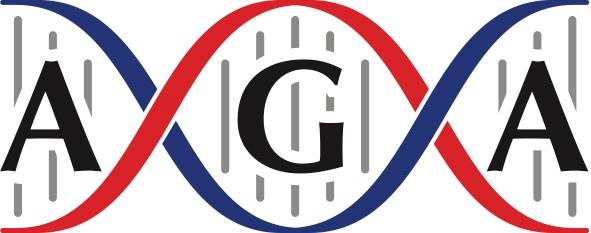
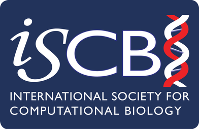
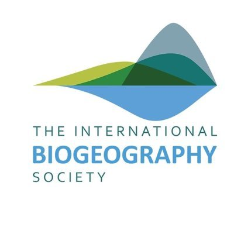
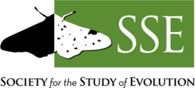
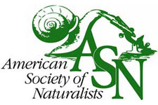
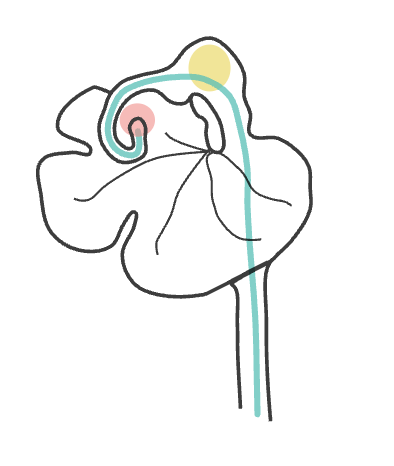
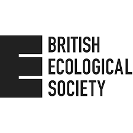

# Welcome to RADcamp 2026 - The Latin America Edition

Wet lab (3RAD protocol) & Bioinformatics (ipyrad)  
July 20-27, 2026

Hosted by Tecnológico de Monterrey at:  
Core Lab Genomics, Expedition FEMSA, 501  
Avenida Eugenio Garza Sada No. 2445,  
Colonia Tecnológico,  
64700 Monterrey, N.L., México  

[Map of the area highlighting Expedition FEMSA](https://drive.google.com/file/d/1Gf9l1IntQ4YLSEcQjrbwM32Z_Ff9SrDF/view?usp=sharing) &  
[Google maps link](https://maps.app.goo.gl/EPJxSFTeFv5ppcTv5)

# Summary
This workshop is designed to guide participants through a full RADseq pilot
study. Although it will take place over eight days, it is structured into two parts.

**Part** I of the workshop is an interactive 3-day wet-lab workshop where attendees will be
guided through a RADseq DNA library preparation ([3RAD]( https://www.biorxiv.org/content/10.1101/205799v4)). 
Participants will have the option of using ~24 of their own extracted DNA samples that can be 
used in the workshop to develop pilot data for their research. In addition to demonstrating and generating 
3RAD libraries, we will introduce RADseq methods, explain common pitfalls and focus on ways to increase 
data quality and reduce missing data while reducing costs compared to other protocols. 
On the fourth and fifth day the libraries will be pooled and sequenced in-house for paired-end Illumina 
sequencing. The best part is that the sequencing cost will be completely subsidized
(free!), and you get to see how the instruments are used.

In **Part II** of this workshop (days 6-8), we will introduce RADseq assembly, phylogenetic and
population genetic methods, high-performance computing, basic unix command line and Python
programming, and jupyter notebooks to promote reproducible science. We will introduce ipyrad,
a unified and self-contained RAD-seq assembly and analysis framework, which emphasizes
simplicity, performance, and reproducibility. We will proceed through all the steps necessary to
assemble the RAD-seq data generated in Part I of the workshop. We will introduce both the
command line interface, as this is typically used in high-performance computing settings, and the
ipython/jupyter notebook API, which allows researchers to generate documented and easily
reproducible workflows. Additionally, we will mentor participants in using the ipyrad.analysis
API which provides a powerful, simple, and reproducible interface to several widely used
methods for inferring phylogenetic relationships, population structure, and admixture.
Participants are invited to give a short research talk on the last day of this session
to showcase their project and data.

This workshop is intended as a bootcamp for early career students, post-docs, or faculty
to learn best practices that they can then help to disseminate to the broader community. The
opportunity to learn while generating and analyzing real data is a bonus that we hope will
accelerate the learning process, particularly for early-stage graduate students who can use the pilot data for
their thesis research. This workshop is geared toward practicing field biologists without RADseq data for
their system and with little or no computational experience. We encourage all scientists to submit
an application. We especially welcome women and under-represented minorities and early-stage
students, or early-career faculty with the potential to pass on skills to large groups. 

This was made possible through generous funding from the American Genetics Association, 
The International Biogeography Society, The Society for the Study of Evolution International 
Event Grants, the International Society for Computational Biology and its award 
for Advancing Bioinformatics, The British Ecological Society, American Society of Naturalists,
and the CoreLab Genomics from Tecnólogico de Monterrey.

# Organizers, Instructors, and Facilitators

  - Natalia Bayona Vásquez (Oxford College Emory University)
  - Isaac Overcast (Columbia University)
  - Erika Magallón-Gayón (Tecnólogico de Monterrey)
  - Deren Eaton (Columbia University)
  - Sandra Hoffberg
  - Todd Pierson (Kennesaw State University)
  - Silvia A. Hinojosa Alvarez (Tecnólogico de Monterrey)
  - Jesús Hernandez Perez (Tecnólogico de Monterrey)
  - Andrea Felix Ceniceros (Tecnólogico de Monterrey)
  - Rocio Alejandra Chavez-Santoscoy (Tecnólogico de Monterrey)

Please contact us at __radcamp.nyc+LatinAmerica@gmail.com__ with any questions.

# Wet Lab (3RAD) Schedule

Times            | Day 1 | Day 2 | Day 3 |
-----            | ----- | ----- | ----- |
8:30-9:00       | Check-in and refreshments | Check-in and refreshments | Check-in and refreshments |
9:00-12:30      | [Introduction slides](https://docs.google.com/presentation/d/1rOKSssEsz7TMOGMQAvOVx64nD8aAVuRj4dnB2WSbUmA/edit#slide=id.g25093f4cab7_0_13) & Lecture | Library amplification | Pooling (Lecture & Practice |
12:30-13:45 | Lunch | Lunch | Lunch |
13:45-18:00 | Digestion, Ligation, Clean up | Clean up and Gel | Troubleshooting Session |
18:00-20:00 | Casual evening        | Size-selection & Quantification | Networking dinner |

## 3RAD resources
* [Inner barcode sequences in ipyrad format](Part_I_files/plate_inner_barcodes.txt)
* [Adapter Info for ordering](Part_I_files/3RAD_iTru_adapter_TaggiMatrix.xlsx)
* [How to resuspend adapters](Part_I_files/Adapter_Mixed_Plate_Instructions.docx)
* [How to resuspend i5 and i7 primers](Part_I_files/Primer_Plate_Instructions_1.25nmole.docx)
* [Index diversity calculator](Part_I_files/Index_diversity_calculator_June2016.xlsx)
* [Homemade speedbeads](Part_1_files/Speedbead_Protocol_June2016.docx)

Additionally these files may be found in the [RADCamp Part I Google Drive](https://drive.google.com/drive/u/0/folders/1CUc_7UlSybFtKPNM24XJykPdwhku0-df):
* i7 and inner barcodes used during workshop
* Find the i5/i7 index sequence from the name
* BadDNA order form with index sequences
* Full 3RAD protocol for plates
* Library pooling guide

# Sequencing Schedule

Times            | Day 4 | Day 5 |
-----            | ----- | ----- |
8:30-9:00        | Check-in and refreshments | Check-in and refreshments |
9:00-12:30       | Lecture on sequencing | [Introductions and iPyrad Assembly Tutorial](RADCamp-PartII-Day1-AM.md) |
12:30-13:45      | Lunch | Lunch |
13:45-18:00      | Set up sequencing run | Optional excursion to the bowling alley |
18:00-20:00      | Free Time | Optional bowling activity (cont); Casual discussion topics: science, genomics, bioinformatics, jobs in research, jobs in teaching, etc. |

## Sequencing Resources
TBD

# Bioinformatics (ipyrad) Schedule

Times            | Day 6 | Day 7 | Day 8 |
-----            | ----- | ----- | ----- |
8:30-9:00       | Check-in and refreshments | Check-in and refreshments | Check-in and refreshments |
9:00-12:30      | [Demux/QC Empirical Data](./RADCamp-PartII-Day2-AM.md) (start API tools if empirical data isn't ready) | Review Assembly results & [ipyrad API and analysis tools](RADCamp-PartII-Day3-AM.md) | [Symposium](https://drive.google.com/drive/folders/1TeDLweZlBW7VOdF-oGX_igBiP46GlvE0?usp=drive_link) |
12:30-13:45 | Lunch | Lunch | Lunch |
13:45-18:00 | [Begin Empirical Assembly](RADCamp-PartII-Day2-PM.md) |  [Empirical analysis w/ API tools](RADCamp-PartII-Day3-PM.md) | Q&As Genomics Core-Instructors- Participants & Farewell Dinner (optional) |

## RADCamp Latin America 2026 co-sponsored by:

<table width="100%">
  <tr> <td width="50%" align="center">

    
<b>Core Lab: Genomics, Tecnológico de Monterrey</b>

  </td> <td width="50%" align="center">

    
<b>Expedition FEMSA</b>

  </td> </tr>

  <tr> <td width="50%" align="center">

    
<b>American Genetics Association through the Special Event Awards program</b>

  </td> <td width="50%" align="center">

    
<b>International Society for Computational Biology</b>

  </td> </tr>

  <tr> <td width="50%" align="center">

    
<b>The International Biogeography Society</b>

  </td> <td width="50%" align="center">

    
<b>Society of the Study of Evolution</b>

  </td></tr>

  <tr> <td width="50%" align="center">

    
<b>The American Society of Naturalists</b>

  </td> <td width="50%" align="center">

    
<b>The Eaton Lab</b>

  </td></tr>

  <tr> <td width="50%" align="center">

    
<b>The British Ecological Society</b>

    
<b>(Award #EF26/1051)</b>

  </td> <td width="50%" align="center">
    
<b>... And viewers like you.</b>

  </td></tr>
</table>

## Acknowledgements
RADcamp Part I tutorial contributors: Sandra Hoffberg, Natalia Bayona Vasquez, 
and Travis Glenn. Many things we reference can be found on 
[badDNA.uga.edu](https://baddna.uga.edu)

RADCamp Part II tutorial contributors (over the years): Isaac Overcast, Deren 
Eaton, Sandra Hoffberg, Natalia Bayona-Vasquez, Mariana Vasconcellos, Laura 
Bertola, Josiah Kuja, Anhubab Kahn, Arianna Kuhn.
