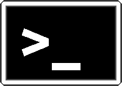

### Preamble

The Command Line Interface (CLI) provides a way to navigate a filesystem, move files around, and run
commands all inside a little text window. The CLI's down side is that you
have to learn many at first seemingly esoteric commands for doing all the
things you would normally do with a mouse. However, it also presents several advantages:
1) you can use it on machines (local or remote!) that don't have a GUI interface (such as
HPC clusters); 2) it's *scriptable*, so you can write programs to execute common
tasks or run analyses in an automated and reproducible fashion; 3)
it's often faster and more efficient than click-and-drag GUI interfaces.


### Tutorial documentation conventions

Each grey cell in this tutorial indicates a command line interaction. Lines starting with `$` indicate a command that should be executed in a terminal, for example by copying and pasting the text after the `$` sign into your terminal. All after a `#` is a "comment" and is ignored when entered into the command line. Elements in code cells surrounded by angle brackets (e.g. `<username>`) are variables that need to be replaced by the user. All other lines should be interpreted as output from the issued commands.
Below is an example code cell:

```bash
# This is a comment. It is frequently used to describe the line(s) below

# "Folders" are called "directories" in Unix systems
# The command below will show all files and directories in your current directory

$ ls  # Comments can also be placed after a command. In this case you should type 'ls' in your command line
```


### Getting started

First you need to open a terminal window. On the provided VM, you just have to click the word "Activities" in the top left of your screen, type the first few letters of "Terminal" and press `Enter`. A new window with a terminal window should open in your screen. You should notice something written in this window:

```
user@machine:~$
```

This represent the command prompt. Left of the `@` is your username, and right of the `@` is the name of th machine you are logged in to. The `:` is a separator (to separate the machine's name from the next information). The `~` represents your current location; don't worry about it for now, but keep in mind that it changes as you move in the filesystem. Finally the `$` character; it represents the end of the prompt and informally means you are an unprivileged user (the default in UNIX systems). The convention is to have a `#` to represent the `root` user (administrator). As with most things \*NIX, the prompt can be altered and is likely to change depending on the system you are using; keep this in mind when using other systems.


### Navigation & orientation

<div style="float: right"></div>

<ul>
<li>Where am I?</li>
  <ul>
  <li>``$ pwd`` </li>
  <li><font color="red">p</font>rint <font color="red">w</font>orking <font color="red">d</font>irectory </li>
  </ul>
<li>What is in here? </li>
  <ul>
  <li>``$ ls`` </li>
  <li><font color="red">l</font>i<font color="red">s</font>t </li>
  </ul>
<li>How do I move around? </li>
  <ul>
  <li>``$ cd`` </li>
  <li><font color="red">c</font>all <font color="red">d</font>irectory </li>
  </ul>
</ul>

The above commands will help you navigate your filesystem. `pwd` will indicate your current location in the filesystem, `ls` will show which files and directories exist in your current location, and `cd` will navigate to another directory (type `cd ..` to move up in the directory hierarchy). Be sure to experiment with them now.

Throughout the workshop we will be introducing new commands as the need for them
arises. We will pay special attention to highlighting and explaining new commands
and giving examples to practice with.

### What if I'm lost?

Don't worry, the CLI interface has you covered: you can ask for help in several different ways:

```bash
$ whatis ls  # What `ls` does
$ ls --help  # A quick guide on the most common options of `ls`
$ man ls  # The full user manual of `ls`
```

### Some shortcuts

Typing in the command line can take a while, especially if you are no keyboard warrior. It is also error prone, and typos may ruin your day on the CLI. However, you can use some useful shortcuts to help overcome this issue:


<div style="float: right"></div>

* "Tab" Key
  * Completes your command
  * Try with one or two "*keypresses*"
* ↓ and ↑ keys
  * Navigate previous commands


### The PATH

Notice the text on your terminal when you enter the command `pwd`? Or do you notice a change in the prompt when you use the `cd` command? Well, that happens because locations on your filesystem are represented as a PATH. In \*NIX systems paths are always relative to the filesystem root which is represented as a `/`. There is a lot to be said about this, but for the purpose of this tutorial, the most important path for you will be `/home/username`. This is the only place you are able to write files to and can be abbreviated as `~/` - your *home directory*.


### Navigation part II

So by now you should have figured out that navigating the shell is similar to using a file browser. Which means you should be wondering how to perform some of the mundane tasks you normally do on file browsers, such as:

1. How do I create a new dir (AKA - folder)? 
2. How do I erase a dir? 
3. How do I create a new file? 
4. How do I copy a file? 
5. How do I move a file? 
6. How do I erase a file? 

```bash
$ mkdir <dir_name>
$ rmdir <dir_name>  # Dir needs to be empty!
$ touch <file_name>
$ cp <origin> <destination>
$ mv <origin> <destination>
$ rm <file_name>
```

### Arguments & whitespace

In the CLI, a program and it's *arguments* (which are like options) are always split by a "whitespace". Here is an example: `ls -l`. Try it. The `-l` is an argument of the program `ls` and they are split by a "whitespace" character. Some programs can take more than one argument, like the `cp` command mentioned before.

Every remotely recent (younger than 1995) filesystem supports using whitespace in their file names. So how do we distinguish filenames with spaces from spaces between arguments in the CLI? The simplest way is to simply not use spaces in your filenames. If you want to write multi-word filenames, use either an `_` character between words, or write them in *CamelCase*.

However, should you encounter filenames with spaces, or really enjoy using them for some reason, there are ways to handle them. Imagine you have a file named `filename with spaces.txt`. Below are two ways you can read its contents:

```bash
cat 'filename with spaces.txt'  # Type the filename within quotes
cat filename\ with\ spaces.txt  # Escape the wihtespace with a backslash
```

The first case is relatively straightforward, but the second one, not so much. What has happened here? If we use a `\` character before a whitespace we are telling the CLI to interpret it not as a split, but rather as a *literal* space, which makes it loose any special meaning it might represent. You can do this to *any* character that has a special meaning on the CLI.
Sounds confusing? Don't worry. Files with whitespace are scarce, so if you don't create one, we won't either. =-)

### Speaking of special characters

Here are some other characters with a special CLI meaning you are likely to find when using this interface. Here are a few of the most common:

* `>` Redirects STDOUT to a file - Instead of a program writing its output to the terminal window, this will make it write the output to a file
* `|` Uses the output of a program as input for another program
* `*` Expands into all possibilities

Below are some examples:

```bash
cd ~/  # Do this to make sure you are in your home directory
$ ls > ls_results.txt
$ ls | sort -r
$ ls D*
```


### Common useful CLI programs

There are many CLI programs. Some of them are very common and equally useful. Here are a few examples:

* `nano` - a CLI text editor. It is used very much like notepad, but on a CLI
* `wget` - a download utility. Pass it an URL as an argument and download it from the web directly to your filesystem
* `gzip` - a file compressing utility
* `gunzip` - a file uncompressing utility

### [Would you like to know more?](https://www.youtube.com/watch?v=RvPRrIOa8Nw)

There is a lot more about using the CLI. Here are a few resources regarding this tutorial

* [What is the linux shell](https://bash.cyberciti.biz/guide/What_is_Linux_Shell)
* [Stdin and Stdout](http://www.learnlinux.org.za/courses/build/shell-scripting/ch01s04.html)
* [Bashcrawl](https://gitlab.com/slackermedia/bashcrawl)

