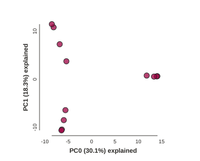
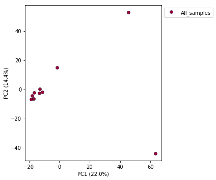
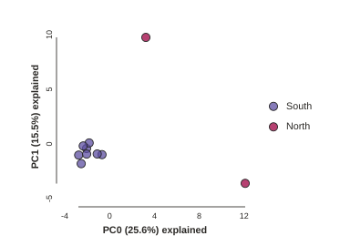
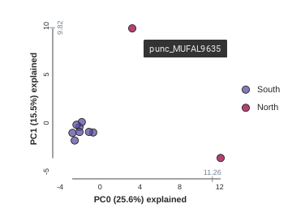
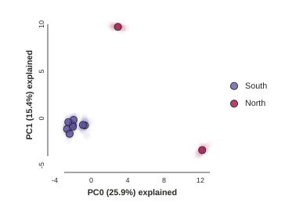
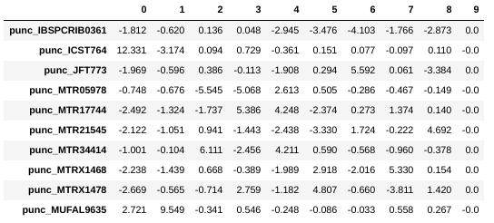
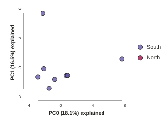

# The ipyrad.analysis module: **PCA**

As part of the `ipyrad.analysis` toolkit we've created a module for
easily performing exploratory principal component analysis (PCA) on your data.
PCA is a very standard dimension-reduction technique that is often used to get a
general sense of how samples are related to one another. PCA has the advantage
over STRUCTURE-type analyses in that it is very fast. Similar to STRUCTURE, PCA
can be used to produce simple and intuitive plots that can be used to guide
downstream analysis. These are three very nice papers that talk about the
application and interpretation of PCA in the context of population genetics:

* [Reich et al (2008) Principal component analysis of genetic data](https://www.nature.com/articles/ng0508-491)
* [Novembre & Stephens (2008) Interpreting principal component analyses of spatial population genetic variation](https://www.nature.com/articles/ng.139)
* [McVean (2009) A genealogical interpretation of principal components analysis](http://journals.plos.org/plosgenetics/article?id=10.1371/journal.pgen.1000686)

# **PCA** analyses

First begin by creating a new Jupyter notebook for your PCA analysis. From the
Jupyter dashboard choose New->Python 3, and this will pop open a new tab with a
new notebook. **The rest of the materials in this part of the workshop assume
you are running all code in cells of a jupyter notebook** that is running inside
the vm.

* [Simple PCA from a VCF file](#simple-pca-from-vcf-file)
* [Coloring by population assignment](#population-assignment-for-sample-colors)
* [Removing "bad" samples and replotting](#removing-bad-samples-and-replotting)
* [Specifying which PCs to plot](#looking-at-pcs-other-than-1--2)
* [Multi-panel PCA](#multi-panel-pca)
* [More to explore](#more-to-explore)

## Create a new notebook for the PCA
First things first, rename your new notebook to give it a meaningful name:


### Import Python libraries
The `import` keyword directs python to load a module into the currently running
context. This is very similar to the `library()` function in R. We begin by
importing ipyrad, as well as the analysis module. Copy the code below into a
notebook cell and click run. 

```python
import ipyrad
import ipyrad.analysis as ipa      ## ipyrad analysis toolkit
```

## Quick guide (tl;dr)
The following cell shows the quickest way to results using the small simulated
dataset we have assembled. Complete explanation of all of the features and
options of the PCA module is the focus of the rest of this tutorial. Copy this
code into a notebook cell and run it.

```python
vcffile = "simdata_outfiles/simdata.vcf"
# Create the pca object
# `quiet=True` indicates we don't care about the details, at this point
pca = ipa.pca(data=vcffile, quiet=True)
pca.run()
pca.draw()
```
```
[####################] 100% 0:00:06 | converting VCF to HDF5 Samples: 12
```



**BAM!**

> **Note** The `#` at the beginning of a line indicates to python that this is
a comment, so it doesn't try to run this line. This is a very handy thing if you
want to add or remove lines of code from an analysis without deleting them.
Simply comment them out with the `#`!

## Full guide

### Simple PCA from vcf file

In the most common use, you'll want to plot the first two PCs, then inspect the
output, remove any obvious outliers, and then redo the PCA. Here we'll use real
data (note that __any__ vcf can be imported and plotted with the ipyrad PCA
analysis tool).

```python
# Fetch the vcf for the subsampled Anolis data from Prates et al (2016)
!wget https://radcamp.github.io/Yale2019/Prates_et_al_2016_example_data/anolis.vcf
```
> **NB:** The `!` here indicates to the notebook that you want to run the
folliwing command not as python, but directly at the terminal, it's a
convenience.

```python
## Path to the input vcf.
vcffile = "anolis.vcf"
pca = ipa.pca(vcffile)
```
```
Converting vcf to HDF5 using default ld_block_size: 20000
Typical RADSeq data generated by ipyrad/stacks will ignore this value.
You can use the ld_block_size parameter of the PCA() constructor to change
this value.

[####################] 100% 0:00:00 | converting VCF to HDF5 Samples: 10
Sites before filtering: 1194
Filtered (indels): 0
Filtered (bi-allel): 7
Filtered (mincov): 0
Filtered (minmap): 0
Filtered (combined): 7
Sites after filtering: 1187
Sites containing missing values: 1147 (96.63%)
Missing values in SNP matrix: 6140 (51.73%)
Imputation (null; sets to 0): 100.0%, 0.0%, 0.0%
```

## PCA and missing data
Creation of the PCA object reports quite a bit of information, all of which is
related to filtering and missing data. The underlying algorithm assumes
a complete data matrix of bi-allelic sites, so missing data is not allowed.
This is a fundamental property of the PCA algorithm, so this is true for any
software that implements it (smartPCA, adegenet, plink, etc). The typical way
of handling missing data is to recode it as 0 (ancestral state). RADSeq data is
characterized by high levels of missingness, the anolis data matrix is 50%
empty! This is totally normal, but coding 50% of the data as 0 will obviously
not fly. Here we remove sites that are non-biallelic or that contain indels,
we apply global and population-level minimum sampling thresholds, and then we
set all missing data to 0 (the default). We will return to more sophisticated
imputation methods in a little bit.

Now construct the default plot, which shows all samples and PCs 1 and 2.
By default all samples are assigned to one population, so everything will 
be the same color.

```python
# First run the PCA
pca.run()
# Now draw the results
pca.draw()
```
```
Subsampling SNPs: 508/1187
(<toyplot.canvas.Canvas at 0x7f12b04a0b50>,
 <toyplot.coordinates.Cartesian at 0x7f12b04a0bd0>,
 <toyplot.mark.Point at 0x7f12b048f290>)
 <matplotlib.axes._subplots.AxesSubplot at 0x7fe0beb3a650>
```


### Population assignment for sample colors
By default all the samples are assigned to the same poplution, which is cool,
but it's not very useful. Fortunately, we make it possible to specify
population assignments in a dictionary. The format of the dictionary should
have populations as keys and lists of samples as values. Sample names need to
be identical to the names in the vcf file, which we can verify with the
`names` property of the PCA object.

```python
print(pca.names)
```
```
['punc_IBSPCRIB0361',
 'punc_ICST764',
 'punc_JFT773',
 'punc_MTR05978',
 'punc_MTR17744',
 'punc_MTR21545',
 'punc_MTR34414',
 'punc_MTRX1468',
 'punc_MTRX1478',
 'punc_MUFAL9635']
```

Here we create a python 'dictionary', which is a key/value pair data structure.
The keys are the population names, and the values are the lists of samples that
belong to those populations. You can copy and paste this into a new cell in your
notebook (saves typing and prevents copy/paste errors).

```python
# create the imap dict to map individuals to populations
imap = {
     "South":['punc_IBSPCRIB0361', 'punc_MTR05978','punc_MTR21545','punc_JFT773',
             'punc_MTR17744', 'punc_MTR34414', 'punc_MTRX1478', 'punc_MTRX1468'],
     "North":['punc_ICST764', 'punc_MUFAL9635']
}
```
Now recreate the `pca` object with the vcf file again, this time passing 
in the imap as the second argument, and plot the new figure.

```python
pca = ipa.pca(data=vcffile, imap=imap)
pca.run()
pca.draw()
```
```
Converting vcf to HDF5 using default ld_block_size: 20000
Typical RADSeq data generated by ipyrad/stacks will ignore this value.
You can use the ld_block_size parameter of the PCA() constructor to change
this value.

[####################] 100% 0:00:00 | converting VCF to HDF5 Samples: 10
Sites before filtering: 1194
Filtered (indels): 0
Filtered (bi-allel): 7
Filtered (mincov): 0
Filtered (minmap): 404
Filtered (combined): 408
Sites after filtering: 786
Sites containing missing values: 746 (94.91%)
Missing values in SNP matrix: 3548 (45.14%)
Imputation (null; sets to 0): 100.0%, 0.0%, 0.0%
Subsampling SNPs: 362/786
    <matplotlib.axes._subplots.AxesSubplot at 0x7fe092fbbe50>
```



This is just much nicer looking now, and it's also much more straightforward to
interpret. The plotting feature uses [toyplot](toyplot.rtft.io) on the backend,
so it does a bunch of nice things for us automatically, like create a legend,
and also it provides a nice 'hover' function so you can identify which samples
are which. Hover one of the points in the figure and you'll see the name pop
up:



Lets notice something really quick, in the previous call to `run()` we were told
`Subsampling SNPs: 508/1187`, yet now we have `Subsampling SNPs: 362/786`. Why
might this be? Lets investigate further. Make a new cell and run this a couple
times:
```
pca.run()
pca.draw()
```


Notice anything? The relationships between samples change a bit, but also the
total number of SNPs retained was reduced from 1187 to 786. This is because we
impose a default minimum of 1 sample with a variable site per SNP within each
population. You can tune this, but it's an advanced feature we'll talk about
later.

## Subsampling SNPs
By default run() will randomly subsample one SNP per RAD locus to reduce the
effect of linkage on your results. This can be turned off by setting
`subsample=False`. Try this:

```
pca.run(subsample=False)
pca.draw()
```


Running this will produce identical results every time, because the subsampling
is disabled. Now we can use the subsampling to our advantage to generate an
estimate of uncertainty in the results!

## Subsampling with replication
Subsampling unlinked SNPs is generally a good idea for PCA analyses since you
want to remove the effects of linkage from your data. It also presents a
convenient way to explore the confidence in your results. By using the option
`nreplicates` you can run many replicate analyses that subsample a different
random set of unlinked SNPs each time. The replicate results are drawn with a
lower opacity and the centroid of all the points for each sample is plotted
with full fill and black stroke. Again, you can hover over the points with
your cursor to see the sample names pop-up.

```
pca.run(nreplicates=25)
pca.draw()
```



## Removing "bad" samples and replotting.
In PC analysis, it's common for "bad" samples to dominate several of the first
PCs, and thus "pop out" in a degenerate looking way. Bad samples of this kind
can often be attributed to poor sequence quality or sample misidentifcation.
Samples with lots of missing data tend to pop way out on their own, causing
distortion in the signal in the PCs. Normally it's best to evaluate the quality
of the sample, and if it can be seen to be of poor quality, to remove it and
replot the PCA. Here's a good example from a study using RADSeq data from 161
geckos:


Here, 5 samples from El Charco House are dominating the figure, with all the
remaining samples crushed down into the little blue dot on the left. Removing
those 5 samples gives a more reasonable looking result.


The Anolis dataset is actually relatively nice, but for the sake of
demonstration lets imagine the "North" samples are "bad samples". From the
figure we can see that "North" samples are distinguished by positive values
on PC1. 


We can get a more quantitative view on this by accessing `pca.pcs()`, which is
a property of the `pca` object that is populated after the `run()` function is
called. It contains the first 10 PCs for each sample. Let's have a look at
these values:

```python
## Printing PCs to the screen
pca.pcs().round(3)
```
> **NB:** The `.round(3) trick is a way to make dataframes print fewer
significant digits, just to make it less messy looking.

```
## You can also save the PCs table to a .csv file
pca.pcs().to_csv("Anolis_10PCs.csv")
```

> **Note** It's always good practice to use informative file names, i.e. here
we use the name of the dataset and the number of PCs retained.



You can see that indeed punc_ICST764 and punc_MUFAL9635 have positive values for
PC1 and all the rest have negative values, so we can target them for removal in
this way. We can construct a 'mask' based on the value of PC1, and then remove
samples that don't pass this filter.

```python
pc1_column = 0
mask = pca.pcs().values[:, pc1_column] > 0
print(mask)
```
    [False  True False False False False False False False  True]

> **Note:** In this call we are "masking" all samples (i.e. rows of the data matrix) which have values greater than 0 for the first column, which here is the '0' in the `[:, 0]` fragment. This is somewhat confusing because python matrices are 0-indexed, whereas it's typical for PCs to be 1-indexed. It's a nomencalture issue, really, but it can bite us if we don't keep it in mind. 

You can see above that the mask is a list of booleans that is the same length as the number of samples. We can use this mask to  print out the names of just the samples we would like to remove.

```python
bad_samples = pca.samples_vcforder[mask]
bad_samples
```
    array([u'punc_ICST764', u'punc_MUFAL9635'], dtype=object)

We can then use this list of "bad" samples in a call to `pca.remove_samples` and then replot the new PCA:

```python
pca.remove_samples(bad_samples)
```
    INFO: Number of PCs may not exceed the number of samples.
    Setting number of PCs = 8

> **Note:** The `remove_samples` function is destructive of the samples in the `pca` object. This means that the removed samples are actually deleted from the `pca`, so if you want to get them back you have to reload the original vcf data.
> **Note:** The number of PCs may not exceed the number of samples in the dataset. The `pca` module detects this and automatically reduces the number of PCs calculated.

```
## Lets prove that the removed samples are gone now
print(pca.samples_vcforder)
```
    [u'punc_IBSPCRIB0361' u'punc_JFT773' u'punc_MTR05978' u'punc_MTR17744'
     u'punc_MTR21545' u'punc_MTR34414' u'punc_MTRX1468' u'punc_MTRX1478']

And now plot the new figure with the "bad" samples removed. We also introduce another nice feature of the `pca.plot()` function, which is the `outfile` argument. This argument will cause the plot function to not only draw to the screen, but also to save a `png` formatted file to the filesystem.

```python
pca.plot(title="Anolis w/o Northern Samples", outfile="Anolis_no_north.png")
```
    <matplotlib.axes._subplots.AxesSubplot at 0x7fe0f8c25410>
    
> **Note:** Spaces in filenames are ***BAD***. It's good practice, as we demonstrate here, to always substitute underscores (`_`) for spaces in filenames.



## Imputation
They `ipyrad.analysis.pca` module offers three algorithms for imputing missing
data:
* sample: Randomly sample genotypes based on the frequency of alleles within
(user-defined) populations (imap).
* kmeans: Randomly sample genotypes based on the frequency of alleles in (kmeans
cluster-generated) populations.
* None: All missing values are imputed with zeros (ancestral allele).

We won't dive into the differences between these imputation methods here, but
if you are interested you can find much more information on in the docs for the
[pca module](https://ipyrad.readthedocs.io/en/latest/API-analysis/cookbook-pca.html#No-imputation-(None))

## Looking at PCs other than 1 & 2
PCs 1 and 2 by definition explain the most variation in the data, but sometimes
PCs further down the chain can also be useful and informative. The plot function
makes it simple to ask for PCs directly.

```python
## Lets reload the full dataset so we have all the samples
pca = ipa.pca(vcffile, pops_dict)
pca.plot(pcs=[3,4])
```
    <matplotlib.axes._subplots.AxesSubplot at 0x7fa3d05fd190>


## Multi-panel PCA
This is a last example of a couple of the nice features of the `pca` module, including the ability to pass in the axis to draw to, and toggling the legend. First, lets say we want to look at PCs 1/2 and 3/4 simultaneously. We can create a multi-panel figure with matplotlib, and pas in the axis for `pca` to plot to. We won't linger on the details of the matplotlib calls, but illustrate this here so you might have some example code to use in the future.
```python
import matplotlib.pyplot as plt

## Create a new figure 12 inches wide by 5 inches high
fig = plt.figure(figsize=(12, 5))

## These two calls divide the figure evenly into left and right
## halfs, and assigns the left half to `ax1` and the right half to `ax2`
ax1 = fig.add_subplot(1, 2, 1)
ax2 = fig.add_subplot(1, 2, 2)

## Plot PCs 1 & 2 on the left half of the figure, and PCs 3 & 4 on the right
pca.plot(ax=ax1, pcs=[1, 2], title="PCs 1 & 2")
pca.plot(ax=ax2, pcs=[3, 4], title="PCs 3 & 4")

## Saving the plot as a .png file
plt.savefig("Anolis_2panel_PCs1-4.png", bbox_inches="tight")
```
    <matplotlib.axes._subplots.AxesSubplot at 0x7fa3d0a04290>

> **Note** Saving the two panel figure is a little different, because we're making
a composite of two different PCA plots. We need to use the native matplotlib
`savefig()` function, to save the entire figure, not just one panel. `bbox_inches`
is an argument that makes the output figure look nicer, it crops the bounding box
more accurately.


It's nice to see PCs 1-4 here, but it's kind of stupid to plot the legend twice, so we can just turn off the legend on the first plot.

```python
fig = plt.figure(figsize=(12, 5))
ax1 = fig.add_subplot(1, 2, 1)
ax2 = fig.add_subplot(1, 2, 2)

## The difference here is we switch off the legend on the first PCA
pca.plot(ax=ax1, pcs=[1, 2], title="PCs 1 & 2", legend=False)
pca.plot(ax=ax2, pcs=[3, 4], title="PCs 3 & 4")

## And save the plot as .png
plt.savefig("My_PCA_plot_axis1-4.png", bbox_inches="tight")
```
    <matplotlib.axes._subplots.AxesSubplot at 0x7fa3d0a8db10>


Much better!

## More to explore
The `ipyrad.analysis.pca` module has many more features that we just don't have time to go over, but you might be interested in checking them out later:
* [Fine grained control of colors per populations](PCA_Advanced_Features.md#controlling-colors)
* [Dealing with missing data](PCA_Advanced_Features.md#dealing-with-missing-data)
* [Dealing with unequal sampling](PCA_Advanced_Features.md#dealing-with-unequal-sampling)
* [Dealing with linked snps](PCA_Advanced_Features.md#dealing-with-linked-snps)
