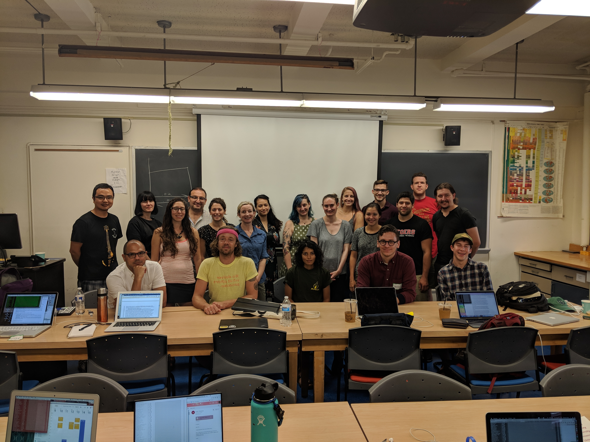

# Welcome to RadCamp 2019 - The New York City Edition

Part I - Wet lab (3RAD protocol)  
September 14-15, 2019

Part II - Bioinformatics (ipyrad)  
October 12-13, 2019  

Schermerhorn Extension Building Room 1010  
Columbia University  
New York City  

# Organisers, Instructors, and Facilitators

  - Deren Eaton (Columbia)
  - Isaac Overcast (CCNY)
  - Sandra Hoffberg (Columbia)

# Registration

Participation will be limited to 30 individuals. Registration for this edition
of RADCamp has not yet been decided, but it will cover coffee and light snacks
for the days of the workshop. The registration fee is more of an inducement to prevent
people from signing up and then flaking, so __nobody will be turned away for
lack of funding.__ If you want to request a fee waiver please contact the
organizers.

__Registration is not yet available. Stay tuned__

# Wet Lab (3RAD) Schedule

Times            | Saturday 9/14 | Sunday 9/15 |
-----            | ------ | ------- |
8:30-9:00       | Check-in and refreshments | Check-in and refreshments |
9:00-12:30      | Intro to RAD-Seq data types | Do some stuff |
12:30-14:00 | Lunch | Lunch |
14:00-17:00 | Do some stuff | Do some more stuff |

# Bioinformatics (ipyrad) Schedule

Times            | Saturday 10/12 | Sunday 10/13 |
-----            | ------ | ------- |
8:30-9:00       | Check-in and refreshments | Check-in and refreshments |
9:00-12:30      | Intro to RAD-Seq data types | (Instruction) [Jupyter notebook setup](Jupyter_Notebook_Setup.md), [Tetrad - A Quartet-based species tree method](https://nbviewer.jupyter.org/github/dereneaton/ipyrad/blob/master/tests/cookbook-tetrad.ipynb), & [Phylogenetic inference: RAxML](06_RAxML_API.md) |
12:30-14:00 | Lunch | Lunch |
14:00-17:00 |[Cluster basics](01_cluster_basics.md) and [ipyrad parts I](02_ipyrad_partI_CLI.md) & [II](03_ipyrad_partII_CLI.md) | (Instruction) [Clustering analysis: PCA](04_PCA_API.md), Demographic analysis ([momi2](07_momi2_API.md)) |

## Additional ipyrad analysis cookbooks

* [Clustering analysis: STRUCTURE](05_STRUCTURE_API.md)
* [BPP - Bayesian inference under a multi-species coalescent model](https://nbviewer.jupyter.org/github/dereneaton/ipyrad/blob/master/tests/cookbook-bpp-species-delimitation.ipynb)
* [Bucky - Phylogenetic concordance analysis](https://nbviewer.jupyter.org/github/dereneaton/ipyrad/blob/master/tests/cookbook-bucky.ipynb)
* [ABBA-BABA - Admixture analysis](https://nbviewer.jupyter.org/github/dereneaton/ipyrad/blob/master/tests/cookbook-abba-baba.ipynb)

## RADCamp NYC 2018 co-sponsored by:

# RADCamp NYC 2018 Group Photo

## Acknowledgements
RADCamp NYC 2018 materials are largely based on materials from the [RADCamp AF-Biota workshop](https://radcamp.github.io/AF-Biota/) which were created by Isaac Overcast, Mariana Vasconcellos, and Laura Bertola.
