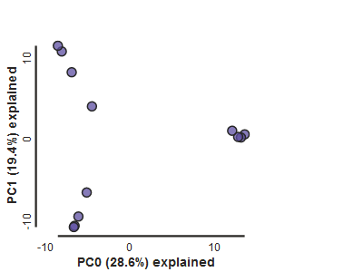
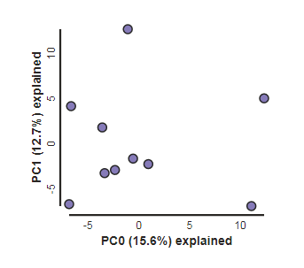
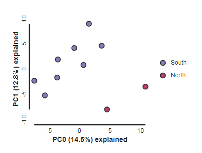
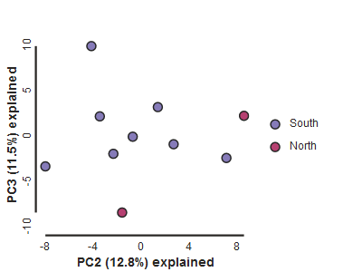

# The ipyrad.analysis module: **PCA**

As part of the `ipyrad.analysis` toolkit we've created convenience functions for
easily performing exploratory principal component analysis (PCA) on your data.
PCA is a very standard dimension-reduction technique that is often used to get a
general sense of how samples are related to one another. PCA has the advantage
over STRUCTURE type analyses in that it is very fast. Similar to STRUCTURE,
PCA can be used to produce simple and intuitive plots that can be used to guide
downstream analysis. These are three very nice papers that talk about the
application and interpretation of PCA in the context of population genetics:

* [Reich et al (2008) Principal component analysis of genetic data](https://www.nature.com/articles/ng0508-491)
* [Novembre & Stephens (2008) Interpreting principal component analyses of spatial population genetic variation](https://www.nature.com/articles/ng.139)
* [McVean (2009) A genealogical interpretation of principal components analysis](http://journals.plos.org/plosgenetics/article?id=10.1371/journal.pgen.1000686)

## A note on Jupyter/IPython
[Jupyter notebooks](http://jupyter.org/) are primarily a way to generate
reproducible scientific analysis workflows in python, R or Julia. ipyrad analysis tools are
best run inside Jupyter notebooks, as the analysis can be monitored and tweaked
and provides a self-documenting workflow.

**The rest of the materials in this part of the workshop assume you are running
all code in cells of a jupyter notebook** that is running on the cluster.

# **PCA** analyses

* [Simple PCA from a VCF file](#simple-pca-from-vcf-file)
* [Coloring by population assignment](#population-assignment-for-sample-colors)
* [Specifying which PCs to plot](#looking-at-pcs-other-than-1--2)
* [Multi-panel PCA](#multi-panel-pca)
* [More to explore](#more-to-explore)

### Install software
In order to visualize plots directly in the notebook, we will install matplotlib, using conda. Switch back to
the terminal (or open a new one) and run this command:

```
$ conda install matplotlib
```
Type 'y' when it asks you if you want to proceed.

## Create a new notebook for the PCA
Return to your jupyter notebook dashboard, navigate to your `ipyrad-workshop`
directory, and create a new notebook by choosing **New->Python 3**, in the
upper right hand corner.

### Import Python libraries
The `import` keyword directs python to load a module into the currently running
context. This is very similar to the `library()` function in R. We begin by
importing ipyrad, as well as the analysis module. Copy the code below into a
notebook cell and click run. 

```python
%matplotlib inline
import ipyrad
import ipyrad.analysis as ipa      ## ipyrad analysis toolkit
```
> **Note:** The call to `%matplotlib inline` here is a jupyter notebook
'magic' command that enables support for plotting directly inside the notebook.

## Quick guide (tl;dr)
The following cell shows the quickest way to results using the simulated data
we just assembled. Complete explanation of all of the features and options of
the PCA module are documented here, but given the limited time, we will only
be covering this very briefly.

```python
vcffile = "/home/jovyan/ipyrad-workshop/rad_outfiles/rad.vcf"
## Create the pca object
pca = ipa.pca(vcffile)
## Run the PCA analysis
pca.run()
## Bam!
pca.draw()
```
   


> **Note** The `#` at the beginning of a line indicates to python that this is
a comment, so it doesn't try to run this line. This is a very handy thing if
you want to add or remove lines of code from an analysis without deleting them.
Simply comment them out with the `#`!

## Full guide

### Simple PCA from vcf file

In the most common use, you'll want to plot the first two PCs (here called axis 0 and axis 1), then inspect
the output, remove any obvious outliers, and then redo the PCA. It's often
desirable to import a vcf file directly rather than to use the ipyrad assembly,
so here we'll demonstrate this with Anolis data from Prates et al 2016.

```python
## Use wget to fetch the vcf from the RADCamp website
!wget https://radcamp.github.io/NYC2020/Prates_et_al_2016_example_data/anolis.vcf
vcffile = "anolis.vcf"
pca = ipa.pca(vcffile)
```
> **Note:** Here we use the anolis vcf generated with ipyrad, but the
`ipyrad.analysis.pca` module can read in from *any* vcf file, so it's possible
to quickly generate PCA plots for any vcf from any dataset.

```python
pca.run()
pca.draw()
```



### Population assignment for sample colors
For the interpretation of the plot it can be very useful to know which points represent which sample, or which population. You can create a dictionary including this information. The format of the dictionary should
have populations as keys and lists of samples as values. Sample names need
to be identical to the names in the vcf file, which we can verify with the
`samples_vcforder` property of the PCA object.

Here we create a python 'dictionary', which is a key/value pair data
structure. The keys are the population names, and the values are the lists
of samples that belong to those populations. You can copy and paste this
into a new cell in your notebook.

```python
imap = {
     "South":['punc_IBSPCRIB0361', 'punc_MTR05978','punc_MTR21545','punc_JFT773',
             'punc_MTR17744', 'punc_MTR34414', 'punc_MTRX1478', 'punc_MTRX1468'],
     "North":['punc_ICST764', 'punc_MUFAL9635']
}
```
Now create the `pca` object with the vcf file again, this time passing 
in the pops_dict as the second argument, and plot the new figure. We can 
also easily add a title to our PCA plots with the `label=` argument.
```python
pca = ipa.pca(vcffile, imap=imap)
pca.run()
pca.draw(label="Anolis PCA")
```



This is just much nicer looking now, and it's also much more straightforward to
interpret.

Here we introduce another nice feature of the `pca.plot()` function, which is
the `outfile` argument. This argument will cause the plot function to not only
draw to the screen, but also to save a `png` formatted file to the filesystem.

```python
pca.draw(label="Anolis PCA", outfile="Anolis_pca.png")
```

> **Note:** Spaces in filenames are ***BAD***. It's good practice, as we
demonstrate here, to always substitute underscores (`_`) for spaces in
filenames.

# More advanced features of the PCA analysis module which you may explore later

## Looking at PCs other than 1 & 2
PCs 0 and 1 by definition explain the most variation in the data, but sometimes
PCs further down the chain can also be useful and informative. The plot function
makes it simple to ask for PCs directly.

```python
## Lets reload the full dataset so we have all the samples
pca = ipa.pca(vcffile, pops_dict)
pca.run()
pca.draw(2,3)
```



## Multi-panel PCA
This is a last example of a couple of the nice features of the `pca` module,
including the ability to pass in the axis to draw to, and toggling the legend.
First, lets say we want to look at PCs 1/2 and 3/4 simultaneously. We can create
a multi-panel figure with matplotlib, and pass in the axis for `pca` to plot to.
We won't linger on the details of the matplotlib calls, but illustrate this here
so you might have some example code to use in the future.

```python
import matplotlib.pyplot as plt

## Create a new figure 12 inches wide by 5 inches high
fig = plt.figure(figsize=(12, 5))

## These two calls divide the figure evenly into left and right
## halfs, and assigns the left half to `ax1` and the right half to `ax2`
ax1 = fig.add_subplot(1, 2, 1)
ax2 = fig.add_subplot(1, 2, 2)

## Plot PCs 1 & 2 on the left half of the figure, and PCs 3 & 4 on the right
pca.plot(ax=ax1, pcs=[1, 2], title="PCs 1 & 2")
pca.plot(ax=ax2, pcs=[3, 4], title="PCs 3 & 4")

## Saving the plot as a .png file
plt.savefig("Anolis_2panel_PCs1-4.png", bbox_inches="tight")
```
   
> **Note** Saving the two panel figure is a little different, because we're making
a composite of two different PCA plots. We need to use the native matplotlib
`savefig()` function, to save the entire figure, not just one panel. `bbox_inches`
is an argument that makes the output figure look nicer, it crops the bounding box
more accurately.


It's nice to see PCs 1-4 here, but it's kind of stupid to plot the legend twice,
so we can just turn off the legend on the first plot.

```python
fig = plt.figure(figsize=(12, 5))
ax1 = fig.add_subplot(1, 2, 1)
ax2 = fig.add_subplot(1, 2, 2)

## The difference here is we switch off the legend on the first PCA
pca.plot(ax=ax1, pcs=[1, 2], title="PCs 1 & 2", legend=False)
pca.plot(ax=ax2, pcs=[3, 4], title="PCs 3 & 4")

## And save the plot as .png
plt.savefig("My_PCA_plot_axis1-4.png", bbox_inches="tight")
```


Much better!

## More to explore
The `ipyrad.analysis.pca` module has many more features that we just don't have time to go over, but you might be interested in checking them out later:
* [Full PCA cookbook](https://ipyrad.readthedocs.io/en/latest/API-analysis/cookbook-pca.html)
* [Fine grained control of colors per populations](https://radcamp.github.io/AF-Biota/PCA_Advanced_Features.html#controlling-colors)
* [Dealing with missing data](https://radcamp.github.io/AF-Biota/PCA_Advanced_Features.html#dealing-with-missing-data)
* [Dealing with unequal sampling](https://radcamp.github.io/AF-Biota/PCA_Advanced_Features.html#dealing-with-unequal-sampling)
