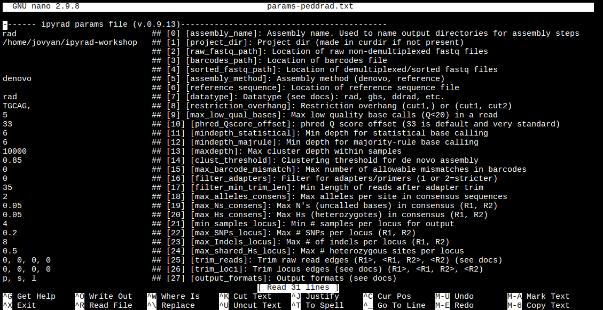

## Intro to binder
We will perform the basic assembly and analysis of simulated data using
[binder](https://mybinder.org/), to launch a working copy of the ipyrad github
repository. The binder project allows the creation of shareable, interactive,
and reproducible environments by facilitating execution of jupyter notebooks
in a simple, web-based format. More information about the binder project is
available in the [binder documentation](https://mybinder.readthedocs.io/en/latest/introduction.html).

**NB:** The binder instance we will use here for the first day is a service
to the community provided by the binder project, so it has limited computational
capacity. This capacity is sufficient to assemble the very small simulated
datasets we provide as examples, but it is in no way capable of assembling
real data, so don't even think about it! We use binder here as a quick and
easy way of demonstrating workflows and API mode interactions without all the
hassle of going through the installation in a live environment. When you
return to your home institution, if you wish to use ipyrad we provide
[extensive documentation for setup and config for both local installs
and installs on HPC systems](https://ipyrad.readthedocs.io/en/latest/3-installation.html).

**NB:** Binder images are transient! Nothing you do inside this instance will
be saved if you close your browser tab, so don't expect any results to be
persistent. Save anything you generate here that you want to keep to your local
machine.

**Get everyone on binder here:** [Launch ipyrad with binder.](https://mybinder.org/v2/gh/dereneaton/ipyrad/master?filepath=newdocs%2FAPI-analysis)


Have patience, this could take a few moments.
If it's ready, it should look like this:


To start the terminal on the jupyter dashboard, choose New>Terminal.


Here we'll use bash commands and command line arguments. If you have trouble remembering the different commands, you can find some very usefull commands on this [cheat sheet](https://www.git-tower.com/blog/command-line-cheat-sheet/).
Take a look at the contents of the folder you're currently in.
```bash
$ ls
```

There are a bunch of folders. To keep things organized, we will create a new directory which we'll be using during this Workshop. Use `mkdir`. And then navigate into the new folder, using `cd`.
```bash
$ mkdir ipyrad-workshop
$ cd ipyrad-workshop
```

# Overview of Assembly Steps
Very roughly speaking, ipyrad exists to transform raw data coming off the
sequencing instrument into output files that you can use for downstream
analysis.


The basic steps of this process are as follows:

* Step 1 - Demultiplex/Load Raw Data
* Step 2 - Trim and Quality Control
* Step 3 - Cluster or reference-map within Samples
* Step 4 - Calculate Error Rate and Heterozygosity
* Step 5 - Call consensus sequences/alleles
* Step 6 - Cluster across Samples
* Step 7 - Apply filters and write output formats

> **Note on files in the project directory:** Assembling RADseq type
sequence data requires a lot of different steps, and these steps
generate a **lot** of intermediary files. ipyrad organizes these files
into directories, and it prepends the name of your assembly to each
directory with data that belongs to it. One result of this is that
you can have multiple assemblies of the same raw data with different
parameter settings and you don't have to manage all the files yourself!
(See [Branching assemblies](https://ipyrad.readthedocs.io/en/latest/8-branching.html) for more info). Another
result is that **you should not rename or move any of the directories
inside your project directory**, unless you know what you're doing or
you don't mind if your assembly breaks.

## ipyrad help
To better understand how to use ipyrad, let's take a look at the help argument.
We will use some of the ipyrad arguments in this tutorial (for example: -n, -p,
-s, -c, -r). But, the complete list of optional arguments and their explanation
is below.

```
$ ipyrad -h

usage: ipyrad [-h] [-v] [-r] [-f] [-q] [-d] [-n NEW] [-p PARAMS] [-s STEPS] [-b [BRANCH [BRANCH ...]]]
              [-m [MERGE [MERGE ...]]] [-c cores] [-t threading] [--MPI] [--ipcluster [IPCLUSTER]]
              [--download [DOWNLOAD [DOWNLOAD ...]]]

optional arguments:
  -h, --help            show this help message and exit
  -v, --version         show program's version number and exit
  -r, --results         show results summary for Assembly in params.txt and exit
  -f, --force           force overwrite of existing data
  -q, --quiet           do not print to stderror or stdout.
  -d, --debug           print lots more info to ipyrad_log.txt.
  -n NEW                create new file 'params-{new}.txt' in current directory
  -p PARAMS             path to params file for Assembly: params-{assembly_name}.txt
  -s STEPS              Set of assembly steps to run, e.g., -s 123
  -b [BRANCH [BRANCH ...]]
                        create new branch of Assembly as params-{branch}.txt, and can be used to drop samples from
                        Assembly.
  -m [MERGE [MERGE ...]]
                        merge multiple Assemblies into one joint Assembly, and can be used to merge Samples into one
                        Sample.
  -c cores              number of CPU cores to use (Default=0=All)
  -t threading          tune threading of multi-threaded binaries (Default=2)
  --MPI                 connect to parallel CPUs across multiple nodes
  --ipcluster [IPCLUSTER]
                        connect to running ipcluster, enter profile name or profile='default'
  --download [DOWNLOAD [DOWNLOAD ...]]
                        download fastq files by accession (e.g., SRP or SRR)

  * Example command-line usage:
    ipyrad -n data                       ## create new file called params-data.txt
    ipyrad -p params-data.txt -s 123     ## run only steps 1-3 of assembly.
    ipyrad -p params-data.txt -s 3 -f    ## run step 3, overwrite existing data.

  * HPC parallelization across 32 cores
    ipyrad -p params-data.txt -s 3 -c 32 --MPI

  * Print results summary
    ipyrad -p params-data.txt -r

  * Branch/Merging Assemblies
    ipyrad -p params-data.txt -b newdata
    ipyrad -m newdata params-1.txt params-2.txt [params-3.txt, ...]

  * Subsample taxa during branching
    ipyrad -p params-data.txt -b newdata taxaKeepList.txt

  * Download sequence data from SRA into directory 'sra-fastqs/'
    ipyrad --download SRP021469 sra-fastqs/

  * Documentation: http://ipyrad.readthedocs.io

## Create a new parameters file
ipyrad uses a text file to hold all the parameters for a given assembly.
Start by creating a new parameters file with the `-n` flag. This flag
requires you to pass in a name for your assembly. In the example we use
`rad` but the name can be anything at all. Once you start
analysing your own data you might call your parameters file something
more informative, like the name of your organism and some details on the
settings.

```bash 
# First, make sure you're in your workshop directory
$ cd ~/ipyrad-workshop

# Unpack the simulated data which is included in the ipyrad github repo
# `tar` is a program for reading and writing archive files, somewhat like zip
#   -x eXtract from an archive
#   -z unZip before extracting
#   -f read from the File
$ tar -xzf ~/tests/ipsimdata.tar.gz

# Take a look at what we just unpacked
$ ls ipsimdata
gbs_example_barcodes.txt         pairddrad_example_R2_.fastq.gz         pairgbs_wmerge_example_genome.fa
gbs_example_genome.fa            pairddrad_wmerge_example_barcodes.txt  pairgbs_wmerge_example_R1_.fastq.gz
gbs_example_R1_.fastq.gz         pairddrad_wmerge_example_genome.fa     pairgbs_wmerge_example_R2_.fastq.gz
pairddrad_example_barcodes.txt   pairddrad_wmerge_example_R1_.fastq.gz  rad_example_barcodes.txt
pairddrad_example_genome.fa      pairddrad_wmerge_example_R2_.fastq.gz  rad_example_genome.fa
pairddrad_example_genome.fa.fai  pairgbs_example_barcodes.txt           rad_example_genome.fa.fai
pairddrad_example_genome.fa.sma  pairgbs_example_R1_.fastq.gz           rad_example_genome.fa.sma
pairddrad_example_genome.fa.smi  pairgbs_example_R2_.fastq.gz           rad_example_genome.fa.smi
pairddrad_example_R1_.fastq.gz   pairgbs_wmerge_example_barcodes.txt    rad_example_R1_.fastq.gz
```
You can see that we provide a bunch of different example datasets, as well as
toy genomes for testing different assembly methods. For now we'll go forward
with the `rad` example dataset.

```bash
# Now create a new params file named 'rad'
$ ipyrad -n rad
```

This will create a file in the current directory called `params-rad.txt`.
The params file lists on each line one parameter followed by a \#\# mark,
then the name of the parameter, and then a short description of its purpose.
Lets take a look at it.

``` 
$ cat params-rad.txt
------- ipyrad params file (v.0.9.13)-------------------------------------------
rad                        ## [0] [assembly_name]: Assembly name. Used to name output directories for assembly steps
/home/jovyan/ipyrad-workshop   ## [1] [project_dir]: Project dir (made in curdir if not present)
                               ## [2] [raw_fastq_path]: Location of raw non-demultiplexed fastq files
                               ## [3] [barcodes_path]: Location of barcodes file
                               ## [4] [sorted_fastq_path]: Location of demultiplexed/sorted fastq files
denovo                         ## [5] [assembly_method]: Assembly method (denovo, reference)
                               ## [6] [reference_sequence]: Location of reference sequence file
rad                            ## [7] [datatype]: Datatype (see docs): rad, gbs, ddrad, etc.
TGCAG,                         ## [8] [restriction_overhang]: Restriction overhang (cut1,) or (cut1, cut2)
5                              ## [9] [max_low_qual_bases]: Max low quality base calls (Q<20) in a read
33                             ## [10] [phred_Qscore_offset]: phred Q score offset (33 is default and very standard)
6                              ## [11] [mindepth_statistical]: Min depth for statistical base calling
6                              ## [12] [mindepth_majrule]: Min depth for majority-rule base calling
10000                          ## [13] [maxdepth]: Max cluster depth within samples
0.85                           ## [14] [clust_threshold]: Clustering threshold for de novo assembly
0                              ## [15] [max_barcode_mismatch]: Max number of allowable mismatches in barcodes
0                              ## [16] [filter_adapters]: Filter for adapters/primers (1 or 2=stricter)
35                             ## [17] [filter_min_trim_len]: Min length of reads after adapter trim
2                              ## [18] [max_alleles_consens]: Max alleles per site in consensus sequences
0.05                           ## [19] [max_Ns_consens]: Max N's (uncalled bases) in consensus (R1, R2)
0.05                           ## [20] [max_Hs_consens]: Max Hs (heterozygotes) in consensus (R1, R2)
4                              ## [21] [min_samples_locus]: Min # samples per locus for output
4                              ## [21] [min_samples_locus]: Min # samples per locus for output
0.2                            ## [22] [max_SNPs_locus]: Max # SNPs per locus (R1, R2)
8                              ## [23] [max_Indels_locus]: Max # of indels per locus (R1, R2)
0.5                            ## [24] [max_shared_Hs_locus]: Max # heterozygous sites per locus
0, 0, 0, 0                     ## [25] [trim_reads]: Trim raw read edges (R1>, <R1, R2>, <R2) (see docs)
0, 0, 0, 0                     ## [26] [trim_loci]: Trim locus edges (see docs) (R1>, <R1, R2>, <R2)
p, s, l                        ## [27] [output_formats]: Output formats (see docs)
                               ## [28] [pop_assign_file]: Path to population assignment file
                               ## [29] [reference_as_filter]: Reads mapped to this reference are removed in step 3
```

In general the defaults are sensible, and we won't mess with them for now,
but there are a few parameters we *must* change: the path to the raw data and
the barcodes file, the dataype, and the restriction overhang sequence(s).

We will use the `nano` text editor to modify `params-rad.txt` and change
these parameters:

```bash
# First we have to install nano. You will have to do this every time you
# launch a new binder, since it's not part of the ipyrad rep
$ conda install nano -y

# Change one stupid default setting. This is annoying <sorry!>
$ echo "set nowrap" > ~/.nanorc

# Now you can edit the params file
$ nano params-rad.txt
```


Nano is a command line editor, so you'll need to use only the arrow keys
on the keyboard for navigating around the file. Nano accepts a few special
keyboard commands for doing things other than modifying text, and it lists
these on the bottom of the frame.

We need to specify where the raw data files are located, the type of data we
are using (.e.g., 'gbs', 'rad', 'ddrad', 'pairddrad), and which enzyme cut site
overhangs are expected to be present on the reads. Change the following lines
in your params files to look like this:

```bash
ipsimdata/rad_example_R*.fastq.gz    ## [2] [raw_fastq_path]: Location of raw non-demultiplexed fastq files
ipsimdata/rad_example_barcodes.txt    ## [3] [barcodes_path]: Location of barcodes file
rad                                   ## [7] [datatype]: Datatype (see docs): rad, gbs, ddrad, etc.
TGCAG,                                  ## [8] [restriction_overhang]: Restriction overhang (cut1,) or (cut1, cut2)
*                                           ## [27] [output_formats]: Output formats (see docs)
```

After you change these parameters you may save and exit nano by typing CTRL+o
(to write **O**utput), and then CTRL+x (to e**X**it the program).

> **Note:** The `CTRL+x` notation indicates that you should hold down the control
key (which is often styled 'ctrl' on the keyboard) and then push 'x'.

Once we start running the analysis ipyrad will create several new directories to
hold the output of each step for this assembly. By default the new directories
are created in the `project_dir` directory and use the prefix specified by the
`assembly_name` parameter. For this example assembly all the intermediate
directories will be of the form: `~/ipyrad-workshop/rad_*`.

> **Note:** Again, the `~` notation indicates a shortcut for the user home
directory, in this case `/home/jovyan`.

# Input data format

Before we get started, let's take a look at what the raw data looks like. Remember that you can use `zcat` and `head` to do this.

```bash
## zcat: unZip and conCATenate the file to the screen
## head -n 20: Just take the first 20 lines of input

$ zcat ipsimdata/rad_example_R1_.fastq.gz | head -n 20
@lane1_locus0_2G_0_0 1:N:0:
CTCCAATCCTGCAGTTTAACTGTTCAAGTTGGCAAGATCAAGTCGTCCCTAGCCCCCGCGTCCGTTTTTACCTGGTCGCGGTCCCGACCCAGCTGCCCCC
+
BBBBBBBBBBBBBBBBBBBBBBBBBBBBBBBBBBBBBBBBBBBBBBBBBBBBBBBBBBBBBBBBBBBBBBBBBBBBBBBBBBBBBBBBBBBBBBBBBBBB
@lane1_locus0_2G_0_1 1:N:0:
CTCCAATCCTGCAGTTTAACTGTTCAAGTTGGCAAGATCAAGTCGTCCCTAGCCCCCGCGTCCGTTTTTACCTGGTCGCGGTCCCGACCCAGCTGCCCCC
+
BBBBBBBBBBBBBBBBBBBBBBBBBBBBBBBBBBBBBBBBBBBBBBBBBBBBBBBBBBBBBBBBBBBBBBBBBBBBBBBBBBBBBBBBBBBBBBBBBBBB
@lane1_locus0_2G_0_2 1:N:0:
CTCCAATCCTGCAGTTTAACTGTTCAAGTTGGCAAGATCAAGTCGTCCCTAGCCCCCGCGTCCGTTTTTACCTGGTCGCGGTCCCGACCCAGCTGCCCCC
+
BBBBBBBBBBBBBBBBBBBBBBBBBBBBBBBBBBBBBBBBBBBBBBBBBBBBBBBBBBBBBBBBBBBBBBBBBBBBBBBBBBBBBBBBBBBBBBBBBBBB
@lane1_locus0_2G_0_3 1:N:0:
CTCCAATCCTGCAGTTTAACTGTTCAAGTTGGCAAGATCAAGTCGTCCCTAGCCCCCGCGTCCGTTTTTACCTGGTCGCGGTCCCGACCCAGCTGCCCCC
+
BBBBBBBBBBBBBBBBBBBBBBBBBBBBBBBBBBBBBBBBBBBBBBBBBBBBBBBBBBBBBBBBBBBBBBBBBBBBBBBBBBBBBBBBBBBBBBBBBBBB
@lane1_locus0_2G_0_4 1:N:0:
CTCCAATCCTGCAGTTTAACTGTTCAAGTTGGCAAGATCAAGTCGTCCCTAGCCCCCGCGTCCGTTTTTACCTGGTCGCGGTCCCGACCCAGCTGCCCCC
+
BBBBBBBBBBBBBBBBBBBBBBBBBBBBBBBBBBBBBBBBBBBBBBBBBBBBBBBBBBBBBBBBBBBBBBBBBBBBBBBBBBBBBBBBBBBBBBBBBBBB
```

The simulated data are 100bp single-end reads generated as original RAD, meaning
there will be one overhang sequence. Can you find this sequence in the raw data?
What's going on with that other stuff at the beginning of each read?

# Step 1: Demultiplexing the raw data

Since the raw data is still just a huge pile of reads, we need to split it up
and assign each read to the sample it came from. This will create a new
directory called `rad_fastqs` with one `.gz` file per sample.

Now lets run step 1! For the simulated data this will take just a few moments.

> **Special Note:** It's good practice to specify the number of cores with the
`-c` flag. If you do not specify the number of cores ipyrad assumes you want
**all** of them. Binder instances run on 1 core, so we will specify `-c 1` for
all ipyrad assembly steps.

```bash
## -p    the params file we wish to use
## -s    the step to run
## -c    run on 1 core
$ ipyrad -p params-rad.txt -s 1 -c 1

 -------------------------------------------------------------
  ipyrad [v.0.9.13]
  Interactive assembly and analysis of RAD-seq data
 -------------------------------------------------------------
  Parallel connection | jupyter-dereneaton-2dipyrad-2d975c3axu: 1 cores

  Step 1: Demultiplexing fastq data to Samples
  [####################] 100% 0:00:09 | sorting reads
  [####################] 100% 0:00:05 | writing/compressing

  Parallel connection closed.
```

As a convenience ipyrad internally tracks the state of all your steps in your
current assembly, so at any time you can ask for results by invoking the `-r`
flag. We also use the `-p` argument to tell it which params file (i.e., which
assembly) we want it to print stats for.

```bash
## -r fetches informative results from currently executed steps
$ ipyrad -p params-rad.txt -r
  loading Assembly: rad
  from saved path: ~/ipyrad-workshop/rad.json

Summary stats of Assembly rad
------------------------------------------------
      state  reads_raw
1A_0      1      19835
1B_0      1      20071
1C_0      1      19969
1D_0      1      20082
2E_0      1      20004
2F_0      1      19899
2G_0      1      19928
2H_0      1      20110
3I_0      1      20078
3J_0      1      19965
3K_0      1      19846
3L_0      1      20025


Full stats files
------------------------------------------------
step 1: ./rad_fastqs/s1_demultiplex_stats.txt
step 2: None
step 3: None
step 4: None
step 5: None
step 6: None
step 7: None
```

**NB:** Even more stats are written to \*_stats.txt files for each step. You can
explore these on your own later.

```bash 
$ cat rad_fastqs/s1_demultiplex_stats.txt
```

# Step 2: Filter reads

This step filters reads based on quality scores and maximum number of uncalled
bases, and can be used to detect Illumina adapters in your reads, which is
sometimes a problem under a couple different library prep scenarios. We know the
simulated data is unrealistically clean, so lets just pretend it's more like the
Anolis data we looked at earlier, i.e. some slight adapter contamination, and a
little noise toward the 3' end of the reads. To account for this we will trim
reads to 75bp and set adapter filtering to be quite aggressive.

> **Note:** Here, we are just trimming the reads for the sake of demonstration.
In reality you'd want to be more careful about choosing these values.

Edit your params file again with `nano`:

```bash
nano params-rad.txt
```

and change the following two parameter settings:

```
2                               ## [16] [filter_adapters]: Filter for adapters/primers (1 or 2=stricter)
0, 75, 0, 0                     ## [25] [trim_reads]: Trim raw read edges (R1>, <R1, R2>, <R2) (see docs)
```
> **Note:** Saving and quitting from `nano`: `CTRL+o` then `CTRL+x`


```bash
$ ipyrad -p params-rad.txt -s 2 -c 1
```

```
  loading Assembly: rad
  from saved path: ~/ipyrad-workshop/rad.json

 -------------------------------------------------------------
  ipyrad [v.0.9.13]
  Interactive assembly and analysis of RAD-seq data
 -------------------------------------------------------------
  Parallel connection | jupyter-dereneaton-2dipyrad-2d975c3axu: 1 cores

  Step 2: Filtering and trimming reads
  [####################] 100% 0:00:21 | processing reads

  Parallel connection closed.
```

The filtered files are written to a new directory called `rad_edits`. Again,
you can look at the results from this step and some handy stats tracked
for this assembly.

```bash
## View the output of step 2
$ cat rad_edits/s2_rawedit_stats.txt
```

# Step 3: denovo clustering within-samples

For a *de novo* assembly, step 3 de-replicates and then clusters reads within
each sample by the set clustering threshold and then writes the clusters to new
files in a directory called `rad_clust_0.85`. Intuitively, we are trying to
identify all the reads that map to the same locus within each sample. You can see the default value is 0.85, so our default directory is named accordingly. This value dictates the percentage of sequence similarity that
reads must have in order to be considered reads at the same locus.

> **NB:** The true name of this output directory will be dictated by the value
you set for the `clust_threshold` parameter in the params file.

You'll
more than likely want to experiment with this value, but 0.85 is a reliable
default, balancing over-splitting of loci vs over-lumping. Don't mess with
this until you feel comfortable with the overall workflow, and also until
you've learned about [branching assemblies](https://ipyrad.readthedocs.io/en/latest/8-branching.html).

> **NB:** What is the best clustering threshold to choose? "It depends."

It's also possible to incorporate information from a reference genome to
improve clustering at this step, if such a resources is available for your
organism (or one that is relatively closely related). We will not cover
reference based assemblies in this workshop, but you can refer to the
[ipyrad documentation](https://ipyrad.readthedocs.io/tutorial_advanced_cli.html) for more information.

> **Note on performance:** Steps 3 and 6 generally take considerably longer
than any of the steps, due to the resource intensive clustering and alignment
phases. These can take on the order of 10-100x as long as the next longest
running step. This depends heavily on the number of samples in your dataset,
the number of cores, the length(s) of your reads, and the "messiness" of your
data.

Now lets run step 3:

```bash
$ ipyrad -p params-rad.txt -s 3 -c 1
```
```
  loading Assembly: rad
  from saved path: ~/ipyrad-workshop/rad.json

 -------------------------------------------------------------
  ipyrad [v.0.9.13]
  Interactive assembly and analysis of RAD-seq data
 -------------------------------------------------------------
  Parallel connection | jupyter-dereneaton-2dipyrad-2d975c3axu: 1 cores

  Step 3: Clustering/Mapping reads within samples
  [####################] 100% 0:00:11 | concatenating
  [####################] 100% 0:00:01 | dereplicating
  [####################] 100% 0:00:12 | clustering/mapping
  [####################] 100% 0:00:00 | building clusters
  [####################] 100% 0:00:00 | chunking clusters
  [####################] 100% 0:04:00 | aligning clusters
  [####################] 100% 0:00:00 | concat clusters
  [####################] 100% 0:00:00 | calc cluster stats

  Parallel connection closed.
```

In-depth operations of step 3:
* concatenating - If multiple fastq edits per sample then pile them all together
* dereplicating - Merge all identical reads
* clustering - Find reads matching by sequence similarity threshold
* building clusters - Group similar reads into clusters
* chunking clusters - Subsample cluster files to improve performance of alignment step
* aligning clusters - Align all clusters
* concat clusters - Gather chunked clusters into one full file of aligned clusters
* calc cluster stats - Just as it says.

Step 4: Joint estimation of heterozygosity and error rate

In this step we jointly estimate sequencing error rate and heterozygosity to
help us figure out which reads are "real" and which include sequencing error.
We need to know which reads are "real" because in diploid organisms there are a
maximum of 2 alleles at any given locus. If we look at the raw data and there
are 5 or ten different "alleles", and 2 of them are very high frequency, and
the rest are singletons then this gives us evidence that the 2 high frequency
alleles are good reads and the rest are probably junk. This step is pretty
straightforward, and pretty fast. Run it like this:

```bash
$ cd ipyrad-workshop
$ ipyrad -p params-rad.txt -s 4 -c 1
```
```
  loading Assembly: rad
  from saved path: ~/ipyrad-workshop/rad.json

 -------------------------------------------------------------
  ipyrad [v.0.9.13]
  Interactive assembly and analysis of RAD-seq data
 -------------------------------------------------------------
  Parallel connection | jupyter-dereneaton-2dipyrad-2dqk37slac: 1 cores

  Step 4: Joint estimation of error rate and heterozygosity
  [####################] 100% 0:00:12 | inferring [H, E]

  Parallel connection closed.
```

In terms of results, there isn't as much to look at as in previous steps, though
you can invoke the `-r` flag to see the estimated heterozygosity and error rate
per sample.

Illumina error rates are on the order of 0.1% per base, so your error rates
will ideally be in this neighborhood. Also, under normal conditions error rate
will be much, much lower than heterozygosity (on the order of 10x lower). If
the error rate is >>0.01% then you might be using too
permissive a clustering threshold.

# Step 5: Consensus base calls

Step 5 uses the inferred error rate and heterozygosity per sample to call the
consensus of sequences within each cluster. Here we are identifying what we
believe to be the real haplotypes at each locus within each sample.

```bash
$ ipyrad -p params-rad.txt -s 5 -c 1
```
```
  loading Assembly: rad
  from saved path: ~/ipyrad-workshop/rad.json

 -------------------------------------------------------------
  ipyrad [v.0.9.13]
  Interactive assembly and analysis of RAD-seq data
 -------------------------------------------------------------
  Parallel connection | jupyter-dereneaton-2dipyrad-2dqk37slac: 1 cores

  Step 5: Consensus base/allele calling
  Mean error  [0.00075 sd=0.00001]
  Mean hetero [0.00195 sd=0.00010]
  [####################] 100% 0:00:01 | calculating depths
  [####################] 100% 0:00:00 | chunking clusters
  [####################] 100% 0:01:03 | consens calling
  [####################] 100% 0:00:03 | indexing alleles

  Parallel connection closed.
```

# Step 6: Cluster across samples

Step 6 clusters consensus sequences across samples. Now that we have good
estimates for haplotypes within samples we can try to identify similar sequences
at each locus among samples. We use the same clustering threshold as step 3 to
identify sequences among samples that are probably sampled from the same locus,
based on sequence similarity.

> **Note on performance of each step:** Steps 3 and 6 generally take
considerably longer than any of the steps, due to the resource intensive
clustering and alignment phases. These can take on the order of 10-100x as long
as the next longest running step. Fortunately, with the simulated data, step 6
will actually be really fast.

```bash
$ ipyrad -p params-rad.txt -s 6 -c 1
```
```
  loading Assembly: rad
  from saved path: ~/ipyrad-workshop/rad.json

 -------------------------------------------------------------
  ipyrad [v.0.9.13]
  Interactive assembly and analysis of RAD-seq data
 -------------------------------------------------------------
  Parallel connection | jupyter-dereneaton-2dipyrad-2dpnwm5vfx: 1 cores

  Step 6: Clustering/Mapping across samples
  [####################] 100% 0:00:01 | concatenating inputs
  [####################] 100% 0:00:04 | clustering across
  [####################] 100% 0:00:00 | building clusters
  [####################] 100% 0:00:35 | aligning clusters

  Parallel connection closed.
```

In-depth operations of step 6:
* concatenating inputs - Gathering all consensus files and preprocessing to
improve performance.
* clustering across - Cluster by similarity threshold across samples
* building clusters - Group similar reads into clusters
* aligning clusters - Align within each cluster

# Step 7: Filter and write output files

The final step is to filter the data and write output files in many
convenient file formats. First, we apply filters for maximum number of
indels per locus, max heterozygosity per locus, max number of snps per
locus, and minimum number of samples per locus. All these filters are
configurable in the params file. You are encouraged to explore
different settings, but the defaults are quite good and quite
conservative.

To run step 7:

```bash
$ ipyrad -p params-rad.txt -s 7 -c 1
```
```
  loading Assembly: rad
  from saved path: ~/ipyrad-workshop/rad.json

 -------------------------------------------------------------
  ipyrad [v.0.9.13]
  Interactive assembly and analysis of RAD-seq data
 -------------------------------------------------------------
  Parallel connection | jupyter-dereneaton-2dipyrad-2dpnwm5vfx: 1 cores

  Step 7: Filtering and formatting output files
  [####################] 100% 0:00:07 | applying filters
  [####################] 100% 0:00:02 | building arrays
  [####################] 100% 0:00:01 | writing conversions

  Parallel connection closed.
```

In-depth operations of step 7:
* applying filters - Apply filters for max # indels, SNPs, & shared hets, and
minimum # of samples per locus
* building arrays - Construct the final output data in hdf5 format
* writing conversions - Write out all designated output formats

Step 7 generates output files in the `rad_outfiles` directory. All the
output formats specified by the `output_formats` parameter will be generated
here. Let's see what's created by default:

```bash
$ ls rad_outfiles/
```
```
rad.loci  rad.phy  rad.seqs.hdf5  rad.snps  rad.snps.hdf5  rad.snpsmap  rad_stats.txt
```

ipyrad always creates the `rad.loci` file, as this is our internal format,
as well as the `rad_stats.txt` file, which reports final statistics for the
assembly (more below). The other files created fall in to 2 categories: files
that contain the full sequence (i.e. the `rad.phy` and `rad.seqs.hdf5`
files) and files that contain only variable sites (i.e. the `rad.snps` and
`rad.snps.hdf5` files). The `rad.snpsmap` is a file which maps SNPs to
loci, which is used downstream in the analysis toolkit for sampling unlinked
SNPs.

The most informative, human-readable file here is `rad_stats.txt` which
gives extensive and detailed stats about the final assembly. A quick overview
of the different sections of this file:

```bash
$ cat rad_outfiles/rad_stats.txt
```

ongratulations! You've completed your first RAD-Seq assembly. Now you can try
applying what you've learned to assemble your own real data. Please consult the
[ipyrad online documentation](http://ipyrad.readthedocs.io) for details about
many of the more powerful features of ipyrad, including reference sequence
mapping, assembly branching, and the extensive `analysis` toolkit, which
includes extensive downstream analysis tools for such things as clustering and
population assignment, phylogenetic tree inference, quartet-based species tree
inference, and much more.
