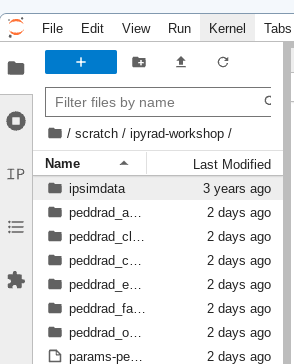
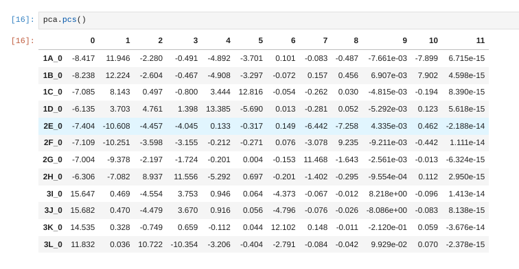

# The ipyrad.analysis module: **PCA**

As part of the `ipyrad.analysis` toolkit we've created convenience functions for
easily performing exploratory principal component analysis (PCA) on your data.
PCA is a very standard dimension-reduction technique that is often used to get
a general sense of how samples are related to one another. PCA has the advantage
over STRUCTURE type analyses in that it is very fast. Similar to STRUCTURE, PCA
can be used to produce simple and intuitive plots that can be used to guide
downstream analysis. These are three very nice papers that talk about the
application and interpretation of PCA in the context of population genetics:

* [Reich et al (2008) Principal component analysis of genetic data](https://www.nature.com/articles/ng0508-491)
* [Novembre & Stephens (2008) Interpreting principal component analyses of spatial population genetic variation](https://www.nature.com/articles/ng.139)
* [McVean (2009) A genealogical interpretation of principal components analysis](http://journals.plos.org/plosgenetics/article?id=10.1371/journal.pgen.1000686)

## A note on Jupyter/IPython
[Jupyter notebooks](http://jupyter.org/) are primarily a way to generate
reproducible scientific analysis workflows in python. ipyrad analysis tools are
best run inside Jupyter notebooks, as the analysis can be monitored and tweaked
and provides a self-documenting workflow.

The rest of the materials in this part of the workshop assume you are running
all code in cells of a jupyter notebook.

# **PCA** analyses

## A bit of setup
Inside your CO capsule open a new terminal and install `scikit-learn`, which we
use internally for some of the PCA functions.
```bash
conda install -c conda-forge scikit-learn
```

## Create a new notebook for the PCA
In the file browser on the left of JupyterLab browse to the directory with the
assembly of the simulated data: `/scratch/ipyrad-workshop`.



Open the launcher (the big blue *+* button) and open a new "Python 3" notebook.

First things first, rename your new notebook to give it a meaningful name. You can
either click the small 'disk' icon in the upper left corner of the notebook or choose
File->Save Notebook


### Import ipyrad.analysis module
The `import` keyword directs python to load a module into the currently running
context. This is very similar to the `library()` function in R. We begin by
importing the ipyrad analysis module. Copy the code below into a
notebook cell and click run. 

```python
import ipyrad.analysis as ipa
```
> The `as ipa` part here creates a short synonym so that we can refer to
`ipyrad.analysis` **as** `ipa`, which is just faster to type.

## Quick guide (tl;dr)
The following cell shows the quickest way to results using the small simulated
dataset in `/scratch/ipyrad-workshop`. Complete explanation of all of the
features and options of the PCA module is the focus of the rest of this tutorial.
Copy this code into a new notebook cell (small grey *+* button on the toolbar)
and run it.

```python
data = "peddrad_outfiles/peddrad.snps.hdf5"
## Create the pca object
pca = ipa.pca(data)
## Run the analysis
pca.run()
## Bam!
pca.draw()
```


> **Note:** In this block of code, the `#` at the beginning of a line indicates
to python that this is a comment, so it doesn't try to run this line. This is a
very handy thing if you want to add or remove lines of code from an analysis
without deleting them. Simply comment them out with the `#`!

## Full guide

### Simple PCA from ipyrad hdf5 file

In the most common use, you'll want to plot the first two PCs, then inspect the
output, remove any obvious outliers, and then redo the PCA.

```python
## Path to the input vcf.
data = "peddrad_outfiles/peddrad.snps.hdf5"
pca = ipa.pca(data)
```
> **Note:** Here we use the hdf5 file with SNPs generated with ipyrad from the
simulated data, but the `ipyrad.analysis.pca` module can also read in data from
*any* vcf file, so it's possible to quickly generate PCA plots for any vcf from
any dataset.

Now construct the default plot, which shows all samples and PCs 1 and 2.
By default all samples are assigned to one population, so everything will 
be the same color.

```python
pca.plot()
```


### Population assignment for sample colors
Typically it is useful to color points in a PCA by some a priori grouping, such
as presumed population, or by experimental treatment groups, etc. To facilitate
this it is possible to specify population assignments in a `dictionary`. The
format of the dictionary should have populations as keys and lists of samples
as values. Sample names need to be identical to the names in the input dataset,
which we can verify with the `names` property of the PCA object. Open a new cell
and type this:

```python
pca.names
```
```
['1A_0',
 '1B_0',
 '1C_0',
 '1D_0',
 '2E_0',
 '2F_0',
 '2G_0',
 '2H_0',
 '3I_0',
 '3J_0',
 '3K_0',
 '3L_0']
```

Here we create a python 'dictionary', which is a key/value pair data structure.
The keys are the population names, and the values are the lists of samples that
belong to those populations. You can copy and paste this into a new cell in your
notebook.
```python
pops_dict = {"pop1":['1A_0', '1B_0', '1C_0', '1D_0'],
             "pop2":['2E_0', '2F_0', '2G_0', '2H_0'],
             "pop3":['3I_0', '3J_0', '3K_0', '3L_0']}
```
Now create the `pca` object with the input data again, this time passing 
in the pops_dict as the second argument and specifying this as the `imap`,
and plot the new figure. We can also easily add a title to our PCA plots
with the `label=` argument.

```python
pca = ipa.pca(data, imap=pops_dict)
pca.run()
pca.draw(label="Sims colored by pop")
```


This is just much nicer looking now, and it's also much more straightforward
to interpret.

## Removing "bad" samples and replotting.
In PC analysis, it's common for "bad" samples to dominate several of the first
PCs, and thus "pop out" in a degenerate looking way. Bad samples of this kind
can often be attributed to poor sequence quality or sample misidentifcation.
Samples with lots of missing data tend to pop way out on their own, causing
distortion in the signal in the PCs. Normally it's best to evaluate the quality
of the sample, and if it can be seen to be of poor quality, to remove it and
replot the PCA. The simulated dataset is actually relatively nice, but for the
sake of demonstration lets imagine the "pop3" samples are "bad samples".

From the figure we can see that "pop3" samples are distinguished by positive
values on PC1. 

We can get a more quantitative view on this by accessing `pca.pcs`, which is a
property of the `pca` object that is populated after the plot() function is
called. It contains the first 10 PCs for each sample. Let's have a look at these
values by printing `pca.pcs`:

```python
## Printing PCs to the screen
pca.pcs()
```


You can see that indeed all the `3\*_0` samples have positive values for PC1
and all the rest have negative values, so we can target them for removal in
this way. We can construct a 'mask' based on the value of PC1, and then remove
samples that don't pass this filter.

```python
mask = pca.pcs().values[:, 0] > 0
print(mask)
```
    [False, False, False, False, False, False, False, False,  True,
        True,  True,  True]

> **Note:** In this call we are "masking" all samples (i.e. rows of the data
matrix) which have values greater than 0 for the first column, which here is
the '0' in the `[:, 0]` fragment. This is somewhat confusing because python
matrices are 0-indexed, whereas it's typical for PCs to be 1-indexed. It's a
nomencalture issue, really, but it can bite us if we don't keep it in mind. 

You can see above that the mask is a list of booleans that is the same length
as the number of samples. We can use this mask to  print out the names of just
the samples we would like to remove.

### Nothing below here works
```python
bad_samples = pca.samples_vcforder[mask]
bad_samples
```
    array([u'punc_ICST764', u'punc_MUFAL9635'], dtype=object)

We can then use this list of "bad" samples in a call to `pca.remove_samples` and then replot the new PCA:

```python
pca.remove_samples(bad_samples)
```
    INFO: Number of PCs may not exceed the number of samples.
    Setting number of PCs = 8

> **Note:** The `remove_samples` function is destructive of the samples in the `pca` object. This means that the removed samples are actually deleted from the `pca`, so if you want to get them back you have to reload the original vcf data.
> **Note:** The number of PCs may not exceed the number of samples in the dataset. The `pca` module detects this and automatically reduces the number of PCs calculated.

```
## Lets prove that the removed samples are gone now
print(pca.samples_vcforder)
```
    [u'punc_IBSPCRIB0361' u'punc_JFT773' u'punc_MTR05978' u'punc_MTR17744'
     u'punc_MTR21545' u'punc_MTR34414' u'punc_MTRX1468' u'punc_MTRX1478']

And now plot the new figure with the "bad" samples removed. We also introduce another nice feature of the `pca.plot()` function, which is the `outfile` argument. This argument will cause the plot function to not only draw to the screen, but also to save a `png` formatted file to the filesystem.

```python
pca.plot(title="Anolis w/o Northern Samples", outfile="Anolis_no_north.png")
```
    <matplotlib.axes._subplots.AxesSubplot at 0x7fe0f8c25410>
    
> **Note:** Spaces in filenames are ***BAD***. It's good practice, as we demonstrate here, to always substitute underscores (`_`) for spaces in filenames.


## Looking at PCs other than 1 & 2
PCs 1 and 2 by definition explain the most variation in the data, but sometimes PCs further down the chain can also be useful and informative. The plot function makes it simple to ask for PCs directly.

```python
## Lets reload the full dataset so we have all the samples
pca = ipa.pca(vcffile, pops_dict)
pca.plot(pcs=[3,4])
```
    <matplotlib.axes._subplots.AxesSubplot at 0x7fa3d05fd190>


## Multi-panel PCA
This is a last example of a couple of the nice features of the `pca` module, including the ability to pass in the axis to draw to, and toggling the legend. First, lets say we want to look at PCs 1/2 and 3/4 simultaneously. We can create a multi-panel figure with matplotlib, and pas in the axis for `pca` to plot to. We won't linger on the details of the matplotlib calls, but illustrate this here so you might have some example code to use in the future.
```python
import matplotlib.pyplot as plt

## Create a new figure 12 inches wide by 5 inches high
fig = plt.figure(figsize=(12, 5))

## These two calls divide the figure evenly into left and right
## halfs, and assigns the left half to `ax1` and the right half to `ax2`
ax1 = fig.add_subplot(1, 2, 1)
ax2 = fig.add_subplot(1, 2, 2)

## Plot PCs 1 & 2 on the left half of the figure, and PCs 3 & 4 on the right
pca.plot(ax=ax1, pcs=[1, 2], title="PCs 1 & 2")
pca.plot(ax=ax2, pcs=[3, 4], title="PCs 3 & 4")

## Saving the plot as a .png file
plt.savefig("Anolis_2panel_PCs1-4.png", bbox_inches="tight")
```
    <matplotlib.axes._subplots.AxesSubplot at 0x7fa3d0a04290>

> **Note** Saving the two panel figure is a little different, because we're making
a composite of two different PCA plots. We need to use the native matplotlib
`savefig()` function, to save the entire figure, not just one panel. `bbox_inches`
is an argument that makes the output figure look nicer, it crops the bounding box
more accurately.


It's nice to see PCs 1-4 here, but it's kind of stupid to plot the legend twice, so we can just turn off the legend on the first plot.

```python
fig = plt.figure(figsize=(12, 5))
ax1 = fig.add_subplot(1, 2, 1)
ax2 = fig.add_subplot(1, 2, 2)

## The difference here is we switch off the legend on the first PCA
pca.plot(ax=ax1, pcs=[1, 2], title="PCs 1 & 2", legend=False)
pca.plot(ax=ax2, pcs=[3, 4], title="PCs 3 & 4")

## And save the plot as .png
plt.savefig("My_PCA_plot_axis1-4.png", bbox_inches="tight")
```
    <matplotlib.axes._subplots.AxesSubplot at 0x7fa3d0a8db10>


Much better!

## More to explore
The `ipyrad.analysis.pca` module has many more features that we just don't have time to go over, but you might be interested in checking them out later:
* [Fine grained control of colors per populations](PCA_Advanced_Features.md#controlling-colors)
* [Dealing with missing data](PCA_Advanced_Features.md#dealing-with-missing-data)
* [Dealing with unequal sampling](PCA_Advanced_Features.md#dealing-with-unequal-sampling)
* [Dealing with linked snps](PCA_Advanced_Features.md#dealing-with-linked-snps)
