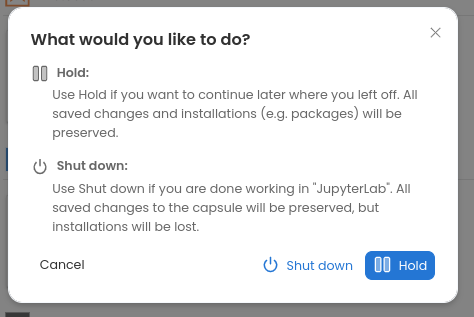
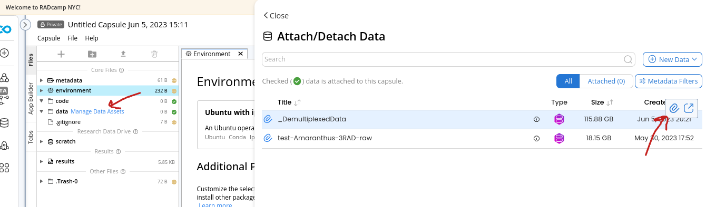

# RADCamp NYC 2023 Part II (Bioinformatics)
# Day 1 (PM)

## Overview of the afternoon activities:
* [A Tour of the Code Ocean Environment](#intro-to-code-ocean)
* [Look at the real data](#Look-at-the-real-data-we-generate)
* [Exercise 3: RADseq data quality control (QC)](#empirical-data-qc)
* [Coffee break](#coffee-break)
* [Assemble real data](#Form-groups-and-assemble-real-data)

## Intro to Code Ocean
Lead: Sandra

**(Sandra's CO intro and walkthrough presentation goes here)**

## Look at the real data we generated
Lead: Isaac

* Now we will move to the real data
 * Covering i7 demultiplexing
 * Show some results from the real demux process.

## Empirical Data QC
Lead: Isaac

### Form groups for working with the empirical data
Groups will be organized around the 10 sets of samples that obtained sufficient
sequencing. Each group will have a lead, normally the individual who the samples
belong to, and the groups will work together to run assemblies today and analyse
the data tomorrow. The following file indicates the group membership:  

[RADCamp groups for assembling and analysing the real data](PartII-Groups.md)

### Attaching 'Data Assets' in CodeOcean
Before we can start QC'ing the data we need to first attach the 'Data Assets'
that contain the raw data files. Data assets are just like physical disk drives
that you can plug and unplug, but they are much easier to work with. If your
capsule is running you'll need to first 'pause' it by choosing the power button
in the upper left hand corner, and then choosing "Hold", this will suspend
but not entirely decommision your capsule.

* Once your capsule spins down, look at the file nave on the left and choose
"Manage Data Assets" next to the Data folder.
* Hover over the data asset that belongs to your group and click the paperclip
icon to attach this dataset to your capsule.
* You will also want to attach the "\_DemultiplexedData" asset as well.
* When you have attached both of these you can choose "\<Close" to exit that pane.

**NB:** The '\_DemultiplexedData' asset contains all of the pre-demultiplexed
samples for all groups. We want to run fastqc on the sample files, not on the
entire raw data files (slow), so we have cheated a bit and pre-demux'd all the
data to make this step faster and easier.

Now the groups will work together on the data QC for their specific dataset.
[3RAD Data Quality Control (fastqc)](Part_II_files/fastqc.md)

## Coffee break

## Briefly report back on fastqc results
* Were there any significant problems with any of the samples?
* Will you choose to use `trim_reads` to remove low quality regions? If so what values?
* Was there noticeable adapter contamination?
* Any other questions?

### New: follow this link to open instructions in slide form
[Slide instructions to start empirical assemblies](https://eaton-lab.org/slides/radcamped)

###  older instructions
* Form your groups and brief introductions
* Open a new terminal window and `cd ipyrad-workshop`.
* Make a new directory for your 3RAD assembly: `mkdir <assembly_name>`.
* Make a new directory for fastq results: `mkdir fastq_out`
* `cd fastq_out`
* Run fastqc on on the real data, passing in the directory of the 3RAD data
for your group, which will be of the form `/media/RADCamp/<username>/raws/*R1*`
and `/media/RADCamp/<username>/raws/*R2*` replacing the username with the last
name of the participant in your group who generated 3RAD data (should take
5-10 minutes per file).
* Examine the results of fastqc by opening the
`~/ipyrad-workshop/<assembly-name>/fastqc_out/\*.html` files in the jupyter
notebook browser.
* Go back to the terminal and `cd ~/ipyrad-workshop/<assembly_name>`.
* Create a params file for the real data (`ipyrad -n <assembly_name>`).
* Update your params file as necessary including the correct
[overhang sequences](PartII-Overhangs.txt) and read trimming and adapter
filtering settings based on the results from fastqc.
* Also, based on preliminary anaylsis, set `max_barcodes_mismatch`
to 2.
* Launch ipyrad steps 1-7
* Go to the mixer and eat pizza and socialize! The results will be done tomorrow.

