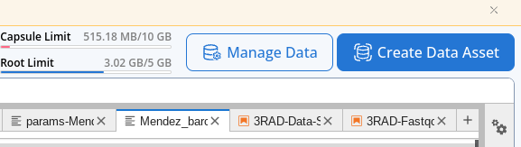

# RADCamp NYC 2023 Part II (Bioinformatics)
# Day 1 (PM)

## Overview of the afternoon activities:
* [A Tour of the Code Ocean Environment](#intro-to-code-ocean)
* [Look at the real data](#Look-at-the-real-data-we-generate)
* [Exercise 3: RADseq data quality control (QC)](#empirical-data-qc)
* Coffee break (3:30-3:45)
* [Assemble real data](#Form-groups-and-assemble-real-data)

## Intro to Code Ocean
Lead: Sandra (45')

[Code Ocean: The Digital Lab for Computational Scientists](https://docs.google.com/presentation/d/17xszqJnK5aLJJhXaX3UBVFZkO2_pEpkKPUzWT8uNH-I/edit?usp=drive_link)

## Look at the real data we generated
Lead: Isaac (30')

Now we will move to the real data
* [Let's look at the results from the real demux process](Demux-Results.txt)
* Unfortunately several of the libraries failed sequencing. There was not an
apparent reason for this (different groups, different enzyme combos).
* We tried to recover more data for the failed libraries by running an
[i7 demux with 1 barcode mismatch](i7-DemuxWithMismatch.txt) and unfortunately
it didn't change the outcome.

## Empirical Data QC
Lead: Isaac (45')

### Form groups for working with the empirical data
Groups will be organized around the 10 sets of samples that obtained sufficient
sequencing (>3m reads total). Each group will have a lead, normally the individual
who the samples belong to, and the groups will work together to run assemblies
today and analyse the data tomorrow. The following file indicates the group membership:  

[RADCamp groups for assembling and analysing the real data](PartII-Groups.md)

### Attaching 'Data Assets' in CodeOcean
Before we can start QC'ing the data we need to first attach the 'Data Assets'
that contain the raw data files. Data assets are just like physical disk drives
that you can plug and unplug, but they are much easier to work with.

* In the top right of the CO panel choose "Manage Data".

* Hover over the data asset that belongs to your group and click the paperclip
icon to attach this dataset to your capsule (you'll use this later).
* You will also want to attach the "\_DemultiplexedData" asset as well.
* When you have attached both of these you can choose "\<Close" to exit that pane.

**NB:** The '\_DemultiplexedData' asset contains all of the pre-demultiplexed
samples for all groups. We want to run fastqc on the sample files, not on the
entire raw data files (slow), so we have cheated a bit and pre-demux'd all the
data to make this step faster and easier.

Now the groups will work together on the data QC for their specific dataset.

[3RAD Data Quality Control (fastqc)](fastqc-exercise.md)

## Coffee break (3:30-3:45)

## Briefly report back on fastqc results
* Were there any significant problems with any of the samples?
* Will you choose to use `trim_reads` to remove low quality regions? If so what values?
* Was there noticeable adapter contamination?
* Any other questions?

## Empirical assembly
<!--[Slide instructions to start empirical assemblies](https://eaton-lab.org/slides/radcamped)
-->
* Get back into your groups (in person or in breakout rooms) and
choose 1 person to be the 'leader' to run the assembly. Consider
sharing screen so everyone who is not driving can watch.
* Open a new terminal window and `cd /scratch/ipyrad-workshop`.
* Create a params file for the real data (`ipyrad -n <assembly_name>`).
* Update your params file as necessary including the correct
[overhang sequences and barcodes files](PartII-Groups.md), and read trimming and adapter
filtering settings based on the results from fastqc.
* Also, based on preliminary anaylsis, set `max_barcodes_mismatch` to 1.
* Launch ipyrad steps 1-7 `ipyrad -p params-wat.txt -s 1234567 -c 16`
* After you verify that the assembly is running you may close your browser tab
and the capsule will continue running on the cloud.
* Go to the mixer and eat pizza and socialize! The results will be done tomorrow.
