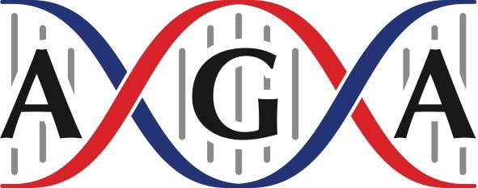

# Welcome to RADcamp 2023 - The New York City Edition

Part I - Wet lab (3RAD protocol)  
Week of May 15th 2023

Part II - Bioinformatics (ipyrad)  
Week of June 12th 2023

Schermerhorn Extension Building Room 1010  
Columbia University  
New York City  

# Summary
This two-part workshop is designed to guide participants through a full RADseq pilot
study.

**Part** I of the workshop is an interactive 2-day wet-lab workshop where attendees will be
guided through a RADseq DNA library preparation ([3RAD]( https://www.biorxiv.org/content/10.1101/205799v4)). 
Participants will have the option of bringing 25-35 of their own extracted DNA samples that can be 
used in the workshop to develop pilot data for their research. In addition to demonstrating and generating 
3RAD libraries, we will introduce RADseq methods, explain common pitfalls and focus on ways to increase 
data quality and reduce missing data while reducing costs compared to other protocols. At the end of the 
first weekend the libraries will be pooled and sent for paired-end Illumina sequencing to generate
~1M reads per sample. The best part is that the sequencing cost will be completely subsidized
(free!). One month later we will meet again to analyze these data.

In **Part II** of this workshop, we will introduce RADseq assembly, phylogenetic and
population genetic methods, high performance computing, basic unix command line and python
programming, and jupyter notebooks to promote reproducible science. We will introduce ipyrad,
a unified and self-contained RAD-seq assembly and analysis framework, which emphasizes
simplicity, performance, and reproducibility. We will proceed through all the steps necessary to
assemble the RAD-seq data generated in Part I of the workshop. We will introduce both the
command line interface, as this is typically used in high performance computing settings, and the
ipython/jupyter notebook API, which allows researchers to generate documented and easily
reproducible workflows. Additionally, we will mentor participants in using the ipyrad.analysis
API which provides a powerful, simple, and reproducible interface to several widely used
methods for inferring phylogenetic relationships, population structure, and admixture.
Participants can give a short research talk on the first day of this session.

This workshop is intended as a bootcamp for early career students, post-docs, or faculty
to learn best practices that they can then help to disseminate to the broader community. The
opportunity to learn while generating and analyzing real data is a bonus that we hope will
accelerate the learning process, particularly for early stage students who can use the pilot data for
their thesis research. This workshop is geared toward practicing field biologists without RADseq data for
their system and with little or no computational experience. We encourage all scientists to submit
their application. We especially welcome women and under-represented minorities and early
stage students, or early-career faculty with the potential to pass on skills to large groups. 

This was made possible through generous funding from the American Genetics Association, E3B 
Department at Columbia University, and Maine Center for Genetics in the Environment at University 
of Maine.

# Organisers, Instructors, and Facilitators

  - Deren Eaton (Columbia)
  - Isaac Overcast (UMaine)
  - Sandra Hoffberg (Columbia)
  - Natalia Bayona Vasquez (Emory University)

# Registration

Registration for each weekend will be separate and preference will be given to participants who
can commit to attending both weekends. A registration fee ($30 per weekend) will be due upon acceptance.

This year, partial, need-based support for travel and accommodations in NYC will be available! 
Apply for this in the workshop application.  Otherwise, you will be responsible for your own 
lodging, transportation, and meals. We will provide coffee and snacks during breaks. 
The workshop will be limited to ~20 participants per weekend. 

# Wet Lab (3RAD) Schedule

Times            | Day 1 | Day 2 |
-----            | ------ | ------- |
8:30-9:00       | Check-in and refreshments | Check-in and refreshments |
9:00-12:30      | Lecture | Library amplification |
12:30-13:30 | Lunch | Lunch |
13:30-17:00 | Digestion and Ligation | Library amplification and QC |
17:00-19:00 | Free evening        | Networking dinner |

## 3RAD resources (added after workshop)
* i7 and inner barcodes used during workshop
* Find the i5/i7 index sequence from the name
* Inner barcode sequences in ipyrad format
* BadDNA order form with index sequences
* Full 3RAD protocol for plates
* Library pooling guide
* Adapter Info
* How to resuspend adapters
* How to resuspend primers - i7 and i5
* Index diversity calculator
* Homemade speedbeads

# Bioinformatics (ipyrad) Schedule

Times            | Day 3 | Day 4 |
-----            | ------ | ------- |
8:30-9:00       | Check-in and refreshments | Check-in and refreshments |
9:00-12:30      | [Introductions, data QC, and ipyrad CLI Part 1](RADCamp-PartII-Day1-AM.md) | [ipyrad API and analysis tools](RADCamp-PartII-Day2-AM.md) |
12:30-14:00 | Lunch | Lunch |
14:00-17:00 |[ipyrad CLI Part 2 & 3RAD Assembly](RADCamp-PartII-Day1-PM.md) |  [Small group analysis of real data](RADCamp-PartII-Day2-PM.md) |
17:00-19:00 | Networking Dinner | Social |

## Additional ipyrad analysis cookbooks

* [Tetrad - A Quartet-based species tree method](https://nbviewer.jupyter.org/github/dereneaton/ipyrad/blob/master/tests/cookbook-tetrad.ipynb)
* [Phylogenetic inference: RAxML](06_RAxML_API.md)
* [Clustering analysis: PCA](04_PCA_API.md)
* [Clustering analysis: STRUCTURE](05_STRUCTURE_API.md)
* [BPP - Bayesian inference under a multi-species coalescent model](https://nbviewer.jupyter.org/github/dereneaton/ipyrad/blob/master/tests/cookbook-bpp-species-delimitation.ipynb)
* [Bucky - Phylogenetic concordance analysis](https://nbviewer.jupyter.org/github/dereneaton/ipyrad/blob/master/tests/cookbook-bucky.ipynb)
* [ABBA-BABA - Admixture analysis](https://nbviewer.jupyter.org/github/dereneaton/ipyrad/blob/master/tests/cookbook-abba-baba.ipynb)
* [Demographic analysis ([momi2](07_momi2_API.md))

## RADCamp NYC 2023 co-sponsored by:

{: width="50%"}  
American Genetics Association through the Special Event Awards program

{: width="75%"}  
Columbia University's Ecology, Evolution and Environmental Biology Department

{: width="50%"}  
Maine Center for Genetics in the Environment & The University of Maine

# RADCamp NYC 2023 Part I Group Photo

# RADCamp NYC 2023 Part II Group Photo

## Acknowledgements
RADcamp NYC 2023 Part I materials are prepared by Sandra Hoffberg, Natalia Bayona Vasquez, and Travis Glenn. Many things we reference can be found on [badDNA.uga.edu](https://baddna.uga.edu).
RADCamp NYC 2023 Part II materials are largely based on materials from the [RADCamp AF-Biota workshop](https://radcamp.github.io/AF-Biota/) which were created by Isaac Overcast, Mariana Vasconcellos, and Laura Bertola.
