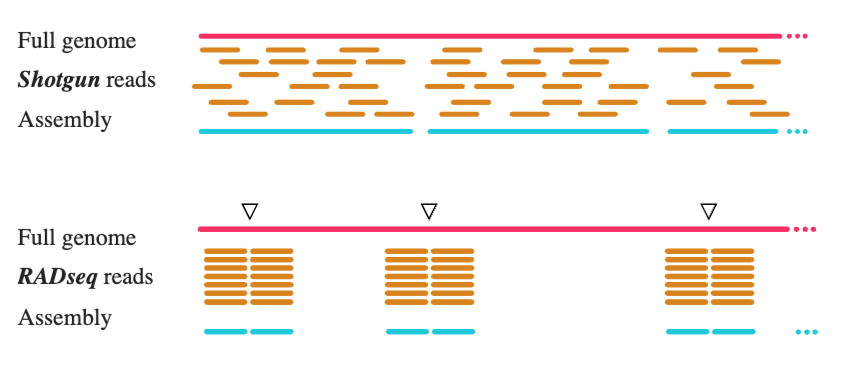
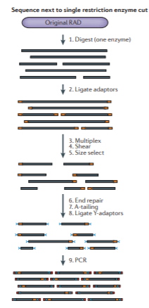
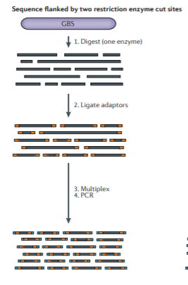
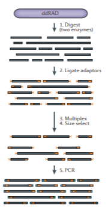

### Important documentation:  
* [ipyrad full documentation](https://ipyrad.readthedocs.io)
* [radcamp home](https://radcamp.github.io/)

## RAD-Seq
### What is RADSeq data?
RADSeq is a technique for creating a reduced representation of genomic
variation of a given set of samples. Restriction endonucleases are used
to randomly fragment genomic DNA, which is followed by several different
possible fragment selection steps.

The core concept of RADSeq is that we want to sequence a random subset of
the total genomic DNA to obtain genome-wide variation at a fraction of the cost
of whole-genome sequencing.

### What does it look like?

The "Original" RAD protocol looks something like this:

> **Figure from Andrews et al 2016.**

### Variants of RAD
Many protocols exist that generate fragments in numerous different ways,
including using 1 or 2 restriction enzymes, with or without a PCR step,
including multiplexed barcodes to further increase sample throughput, and so on.
It's also possible to sequence a library as single-end or paired-end, adding
further information, but also somewhat further complications in assembly. Here
are a couple more conceptual diagrams for different protocols (again from
Andrews).

### Thoughts on informativeness
There is a pervasive misconception that "stacks is for population genetic
scale" and "ipyrad is for phylogenetic scale". I don't know where this idea
came from but it's folklore. ipyrad can assemble data from within population
samples to data including deeply diverged lineages (>50my). Please help me
dispel this myth if you encounter it in the wild.

### Thoughts on missing data
RADSeq is *characterized* by missing data, yet people still have a tendency
to want to treat it as large-scale multi-locus data. Often this manifests as
setting the `min_samples_locus` parameter to remove 80-90% of missing data.
This is *bad practice* in most cases, and results in throwing away most of your
data. The ipyrad analysis tools allow you to make the best use of the data by
implementing replicated subsampling, for instance.

RADSeq is not multi-locus data.

## Why use ipyrad (Eaton & Overcast 2020) at all?
* Simple: Easy to install, easy to use.
* Resourceful: Documentation, tutorials, cookbooks, and help forums available.
* Reproducible: Promoting the use of Jupyter Notebooks to organize workflows.
* Flexible: API access to functions and data to build custom assemblies.
* Transparent: Providing human readable code and data files.

## References
* Andrews KR, Good JM, Miller MR, Luikart G, Hohenlohe PA. Harnessing the power
of RADseq for ecological and evolutionary genomics. Nature Reviews Genetics.
2016 Feb;17(2):81.
* **Eaton DA, Overcast I. ipyrad: Interactive assembly and analysis of RADseq
datasets. Bioinformatics. 2020.**
