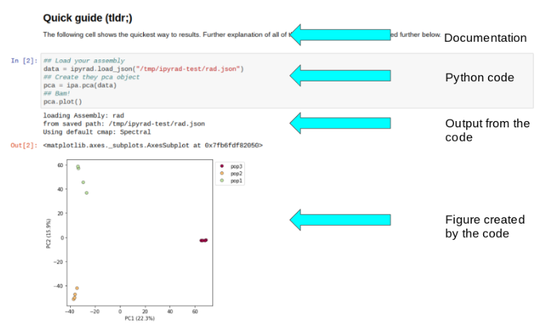

# What are Jupyter Notebooks and why would I want to use one?

Jupyter notebooks are a great way to generate reproducible 
scientific analysis workflows in python. You can mix documentation,
code, tables, and figures in one executable document which can easily
be shared and published to the web. Here is a good examle of a notebook
demonstrating the [ipyrad.analysis.pca module](https://nbviewer.jupyter.org/github/dereneaton/ipyrad/blob/master/tests/cookbook-PCA-pedicularis.ipynb). In this notebook you can see the benefit
of intermingling expanatory text, with executable code, and results:



And this is not a static document! I can open this notebook and
recreate my entire analysis, or even tweak things and rerun it
without having to wrangle a ton of different scripts, or try to 
remember the parameters for a bunch of esoteric analyses I ran, or
even remember **which** analyses I ran, because ***they're all here
in one document***.

If you are familiar with RStudio, the workflow is somewhat similar, the main
difference being that with jupyter notebooks you can export your entire
session with figures, tables, and results, all embedded between consecutive
"tasks" specified by blocks of code.

ipyrad analysis tools are best run inside Jupyter notebooks, as the analysis can
be monitored and tweaked and provides a self-documenting workflow, so we will
focus the next part of the workshop on exploring the anaylsis tools in the
jupyter notebook environment.

> **NB:** If you're a native R coder, [R markdown files](https://rmarkdown.rstudio.com/)
provide a conceptually identical experience.

# **Everything below here is provided for your future reference if you want to run jupyter on your laptop.**

## Getting Set up with Jupyter Notebooks (on your local computer)
Setting up a Jupyter notebook session involves running a couple commands on your
local machine.

Overview of process
* [Set Jupyter notebook password](#set-jupyter-notebook-password)
* [Start remote notebook server](#run-notebook-server)
* [More information about jupyter](#useful-jupyter-tricks/ideas)

### Set Jupyter Notebook Password
Jupyter was already installed as a dependency of ipyrad, so we just 
need to set a password before we can launch it. This command will prompt you
for a new password for your notebook (you will **only ever have to do this once
on a given computer**). Run this command in a terminal:
```
$ jupyter notebook password
```
This will set a password on your notebook server so that other people 
won't have access to your files and notebooks. The notebook server 
will prompt you for your password when you initially connect to it.

> **Note:** The password to access your jupyter notebook and the password for
the vm login ***are two different passwords.*** It will probably reduce
confusion, though, if you make them the same, at least for now.

### Starting the jupyter notebook server with command line
We run the notebook server and specify `--no-browser`, which tells jupyter to
run in the background and wait for connections. 
```
$ jupyter notebook --no-browser
```
```
[I 14:19:02.535 NotebookApp] Serving notebooks from local directory: /home/radcamp2020/ipyrad-assembly
[I 14:19:02.535 NotebookApp] The Jupyter Notebook is running at:
[I 14:19:02.535 NotebookApp] http://localhost:8888/
[I 14:19:02.535 NotebookApp] Use Control-C to stop this server and shut down all kernels (twice to skip confirmation).
```

>**NB:** The ampersand (&) is a special character which tells the terminal to
run the command in a new process and return control of the command line to you.

## Test your notebook connection
To test your jupyter notebook configuration open a new browser tab and open a
connection to port 8888 on the localhost, like this:
```
http://localhost:8888
```
You should see that your notebook server prompts you for your password before it
gives you access. This is the password that you entered above during the
`jupyter notebook password` command. If everything is working, and you type the
password correctly, then you'll be presented with the jupyter dashboard! **Magic!!!**

> **Note on terms:** A "port" is just a number, like the address of a house, or
a telephone number. Every computer has 32,000 ports, most of which are unused.
You might not know this, but when you use a web browser to look at a web page,
your computer is talking to the remote server on **port 80**. This is
standardized. When you `ssh` to an HPC system you are making a connection on
**port 22**, and this is standard too. 

## A word on Jupyter notebook setup in an HPC environment
It is possible to run Jupyter notebooks on an HPC system and access them
remotely, but it takes a little bit of setup. In the future if you want to try
this, you can see the docs on [running notebooks on an HPC](Jupyter_Notebook_HPC.md).

## Further exploration with jupyter notebooks
Here are links to a couple useful jupyter tutorials that explore much more of
the functionality, should you be interested in learning more:

* [Notebook tutorial from plotly (includes animated figures)](https://plot.ly/python/ipython-notebook-tutorial/)
