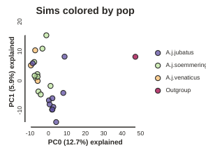
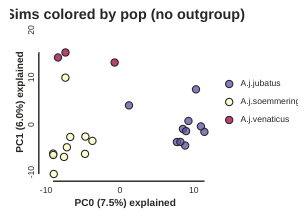
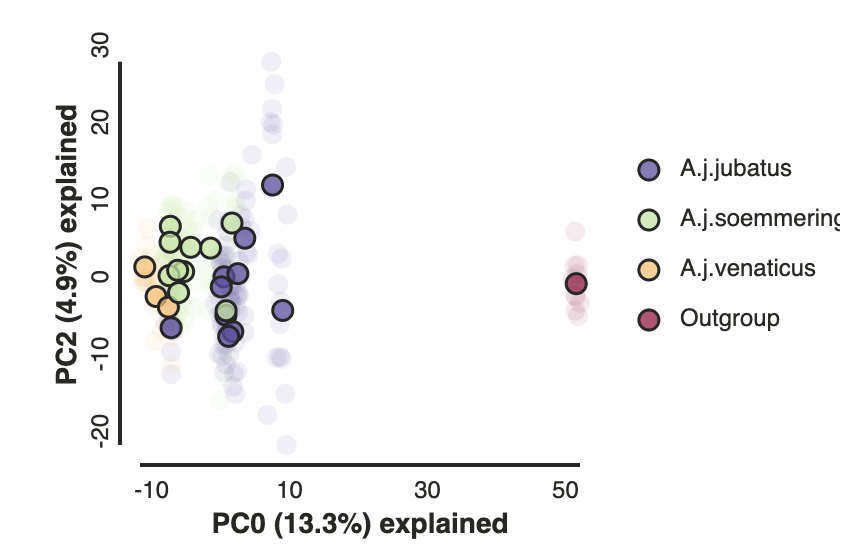
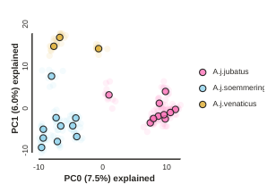
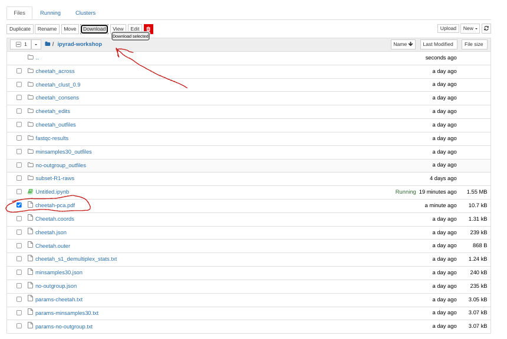

# The ipyrad.analysis module: **PCA**

As part of the `ipyrad.analysis` toolkit we've created convenience functions for
easily performing exploratory principal component analysis (PCA) on your data.
PCA is a very standard dimension-reduction technique that is often used to get
a general sense of how samples are related to one another. PCA has the advantage
over STRUCTURE type analyses in that it is very fast. Similar to STRUCTURE, PCA
can be used to produce simple and intuitive plots that can be used to guide
downstream analysis. These are three very nice papers that talk about the
application and interpretation of PCA in the context of population genetics:

* [Reich et al (2008) Principal component analysis of genetic data](https://www.nature.com/articles/ng0508-491)
* [Novembre & Stephens (2008) Interpreting principal component analyses of spatial population genetic variation](https://www.nature.com/articles/ng.139)
* [McVean (2009) A genealogical interpretation of principal components analysis](http://journals.plos.org/plosgenetics/article?id=10.1371/journal.pgen.1000686)

## A note on Jupyter/IPython
[Jupyter notebooks](http://jupyter.org/) are primarily a way to generate
reproducible scientific analysis workflows in python. ipyrad analysis tools are
best run inside Jupyter notebooks, as the analysis can be monitored and tweaked
and provides a self-documenting workflow.

The rest of the materials in this part of the workshop assume you are running
all code in cells of a jupyter notebook.

# **PCA** analyses

## Create a new notebook for the PCA

Similar how you've previously opened the Terminal, now open a new "Python 3" notebook by clicking on `New`.


## Download an empirical dataset
For this exercise we'll use empirical data, so it'll be more fun and also a bit more like running a PCA
in real life than doing so with the simulated data would be. In a new cell in the notebook copy and paste
this command and then click the 'Run' button:

```
!wget https://radcamp.github.io/Chicago2024/cheetah.snps.hdf5

# Also fix a temporary issue with a PCA dependency
!conda install -c conda-forge pandas=2.0.3 -y
```

This .hdf5 file is one of the results files writen to the `outputs` directory of ipyrad after step 7.


### Import ipyrad.analysis module
For this analysis, we'll use python. The `import` keyword directs python to load a module into the currently running context. This is very similar to the `library()` function in R. We begin by importing the ipyrad analysis module. Copy the code below into a notebook cell and click run. 

```python
import ipyrad.analysis as ipa
```
> The `as ipa` part here creates a short synonym so that we can refer to
`ipyrad.analysis` **as** `ipa`, which is just faster to type.

## Quick guide (tl;dr)
The following cell shows the quickest way to results using the small simulated
dataset in `/ipyrad-workshop`. Complete explanation of all of the
features and options of the PCA module is the focus of the rest of this tutorial.
Copy this code into a new notebook cell (you can add new cells with the *+* button on the toolbar)
and run it.

```python
data = "cheetah.snps.hdf5"
## Create the pca object
pca = ipa.pca(data)
## Run the analysis
pca.run()
## Bam!
pca.draw()
```


> **Note:** In this block of code, the `#` at the beginning of a line indicates
to python that this is a comment, so it doesn't try to run this line. This is a
very handy thing if you want to add or remove lines of code from an analysis
without deleting them. Simply comment them out with the `#`!

## Full guide

### Simple PCA from ipyrad hdf5 file

In the most common use, you'll want to plot the first two PCs, then inspect the
output, remove any obvious outliers, and then redo the PCA.

```python
## Path to the input data in snps.hdf5 format 
data = "cheetah.snps.hdf5"
pca = ipa.pca(data)
```
> **Note:** Here we use the hdf5 database file with SNPs generated with ipyrad from the
cheetah data. The database file contains the genotype calls information as well
as linkage information that is used for subsampling unlinked SNPs and bootstrap resampling.

> **Note:** The `ipyrad.analysis.pca` module can also read in data from
*any* vcf file, so it's possible to quickly generate PCA plots for any vcf from
any dataset.

Now construct the default plot, which shows all samples and PCs 1 and 2.

```python
pca.run()
pca.draw()
```


### Population assignment for sample colors
Typically it is useful to color points in a PCA by some a priori grouping, such
as presumed population, or by experimental treatment groups, etc. To facilitate
this it is possible to specify population assignments in a `dictionary`. The
format of the dictionary should have populations as keys and lists of samples
as values. Sample names need to be identical to the names in the input dataset,
which we can verify with the `names` property of the PCA object. Open a new cell
and type this:

```python
pca.names
```
This will show you a list of sample names.

Here we create a python 'dictionary', which is a key/value pair data structure.
The keys are the population names, in our case cheetah subspecies, and the values are the lists of samples that
belong to those populations. You can copy and paste this into a new cell in your
notebook.
```python
imap = {"A.j.jubatus":['SRR19760918','SRR19760920','SRR19760921','SRR19760924','SRR19760927','SRR19760928','SRR19760942','SRR19760946','SRR19760947','SRR19760956'],
        "A.j.soemmeringii":['SRR19760910','SRR19760912','SRR19760954','SRR19760955','SRR19760957','SRR19760958','SRR19760959','SRR19760960','SRR19760961','SRR19760962'],
        "A.j.venaticus":['SRR19760950','SRR19760951','SRR19760953'],
        "Outgroup":['SRR19760949']}
```
Now create the `pca` object with the input data again, this time passing 
in the new dictionary as the second argument and specifying this as the `imap`,
and plot the new figure. We can also easily add a title to our PCA plots
with the `label=` argument.

```python
pca = ipa.pca(data, imap=imap)
pca.run()
pca.draw(label="Sims colored by pop")
```



This is just much nicer looking now, and it's also much more straightforward
to interpret.

## Removing "bad" samples and replotting.
In PC analysis, it's common for "bad" samples to dominate several of the first
PCs, and thus "pop out" in a degenerate looking way. Bad samples of this kind
can often be attributed to poor sequence quality or sample misidentifcation.
Samples with lots of missing data tend to pop way out on their own, causing
distortion in the signal in the PCs. Normally it's best to evaluate the quality
of the sample, and if it can be seen to be of poor quality, to remove it and
replot the PCA. In our dataset, we don't really have bad samples, but we do have
an outlier: the outgroup (which in this case is *Puma concolor*). Because we're
intersted in cheetah only, **let's remove the outgroup sample and rerun the PCA**.

> **Note:** We make a lot of use of the interactivity of jupyter notebooks in
the ipyrad.analysis tools. In the PCA you can 'hover' over points to reveal
their sample ID.

The easiest way to achieve this is to simply remove the sample from the `imap`
file and run the PCA again.

```python
imap = {"A.j.jubatus":['SRR19760918','SRR19760920','SRR19760921','SRR19760924','SRR19760927','SRR19760928','SRR19760942','SRR19760946','SRR19760947','SRR19760956'],
        "A.j.soemmeringii":['SRR19760910','SRR19760912','SRR19760954','SRR19760955','SRR19760957','SRR19760958','SRR19760959','SRR19760960','SRR19760961','SRR19760962'],
        "A.j.venaticus":['SRR19760950','SRR19760951','SRR19760953']}
pca = ipa.pca(data, imap=imap)
pca.run()
pca.draw(label="Sims colored by pop (no outgroup)")
```



## Subsampling with replication
By default `run()` will randomly subsample one SNP per RAD locus to reduce the
effect of linkage on your results. This can be turned off by setting
`subsample=False`. However, subsampling *unlinked* SNPs is generally a good
idea for PCA analyses since you want to remove the effects of linkage from your
data. It also presents a convenient way to explore the confidence in your
results. By using the option `nreplicates` you can run many replicate analyses
that subsample a different random set of unlinked SNPs each time. The replicate
results are drawn with a lower opacity and the centroid of all the points for
each sample is plotted as a black point. 

```python
pca.run(nreplicates=10)
pca.draw();
```


## Plotting PCs other than 0 and 1
Even though PC 0 and 1 by definition explain the most variance in the data,
it is still often useful to examine other PCs. You can do this by specifying
which PCs to plot in in the call to `draw`.

```python
pca.draw(2,3)
```


## Custom color points
Another nice feature of the `draw` method is the ability to pass in any custom
color that you like for each population. You can do this in a couple different
ways, but the most straightforward is just to pass in a list of valid color names
from the ['named colors' matplotlib documentation](https://matplotlib.org/stable/gallery/color/named_colors.html).

```python
pca.draw(colors=["hotpink", "skyblue", "goldenrod"])
```


## Saving a PCA plot to a file
You can save the figure as a PDF or SVG automatically by passing an `outfile`
argument to the `.draw()` function.

```python
# The outfile must end in either `.pdf` or `.svg`
pca.draw(outfile="cheetah-pca.pdf")
```

This will save `cheetah-pca.pdf` into your notebook environment. You can open the
jupyter file browser and open or download the pdf from there.



## Dealing with missing data in PCA
PCA can be _extremely_ sensitive to missing data if there is any pattern
at all in the missingness.

We offer three algorithms for imputing missing data:

* `sample`: Randomly sample genotypes based on the frequency of alleles within
(user-defined) populations (`imap`).
* `kmeans`: Randomly sample genotypes based on the frequency of alleles in
(kmeans cluster-generated) populations.
* 'random': This is less an imputation method than an attempt to reduce the bias
of assigning all missing data to the ancestral state. Instead missing data
are randomly assigned to ancestral or derived states.
* `None` (default): All missing values are imputed with zeros (ancestral allele).

Here is an example of how to select an `impute_method`:
```python
pca1 = ipa.pca(
    data=data,
    imap=imap,
    impute_method='sample',
)
```

A fourth approach is to simply enforce an lower bound on missing data with
the `mincov` parameter. `mincov` specifies the minimum coverage threshold
below which a snp is excluded from the analysis.

This code will exclude any snp not present in 100% of samples, a very strict
threshold.
```python
pca2 = ipa.pca(
    data=data,
    mincov=1.0,
    impute_method=None,
)
```

We encourage you to experiment with different imputation schemes
and missing data thresholds when analysing your own data later.

## Practice running PCA on different datasets

* [A variety of vcf files for running PCA](https://drive.google.com/drive/folders/10MQx1u0uGDqlEQRdOiUuQRPeP7ZTRLmF?usp=sharing)

## More to explore
The `ipyrad.analysis.pca` module has many more features that we just don't have
time to go over, but you might be interested in checking them out later:
* [Full ipyrad.analysis.pca cookbook](https://ipyrad.readthedocs.io/en/master/API-analysis/cookbook-pca.html)
