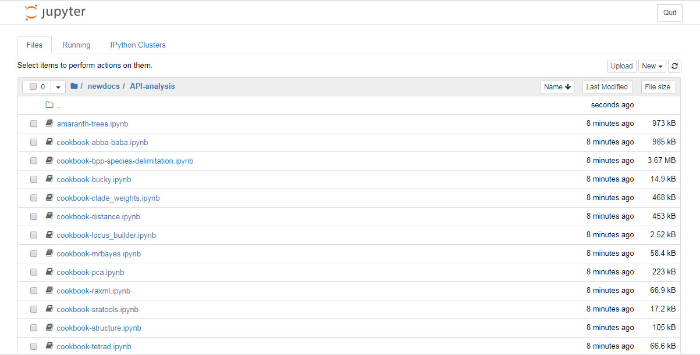
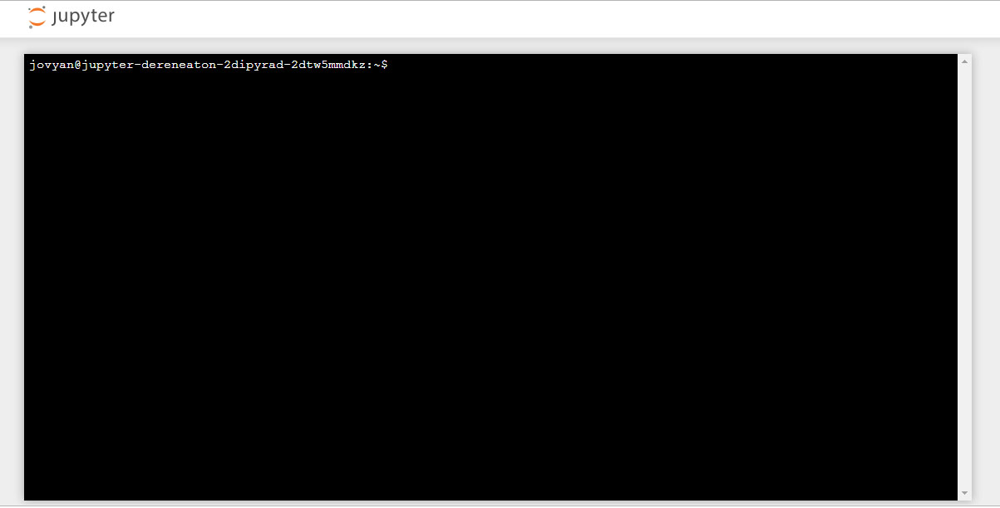
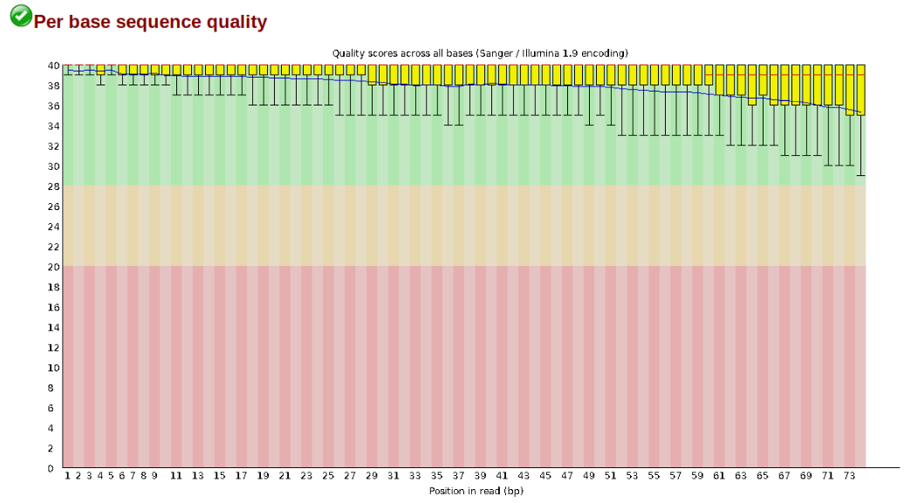
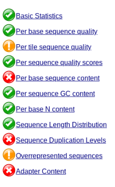
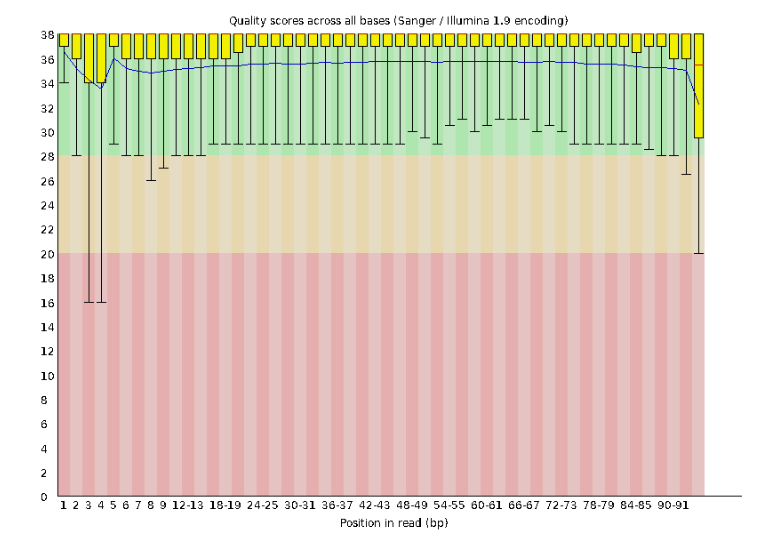
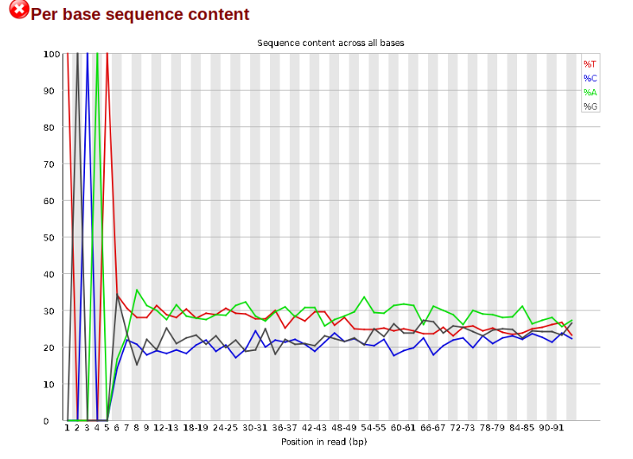
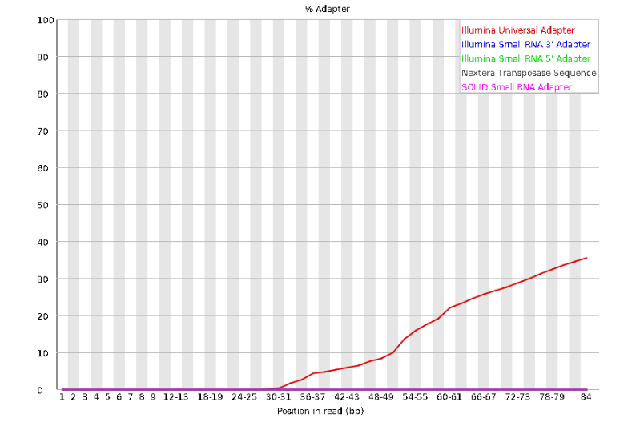

# RADCamp Phoenix 2024 - Day 1

## Overview of the mornings activities:
* [Intro to ipyrad documentation](#intro-ipyrad-docs)
* [Software setup](#open-ipyrad-in-binder)
* [RADseq data quality control (QC)](#data-qc)
* [ipyrad assembly of simulated data Part I](#ipyrad-assembly-part-I)

## Intro ipyrad Docs
[ipyrad documentation](https://ipyrad.readthedocs.io/en/latest/)

## Open ipyrad in Binder
We will perform the basic assembly and analysis of simulated data using
[binder](https://mybinder.org/), to launch a working copy of the ipyrad github
repository. The binder project allows the creation of shareable, interactive,
and reproducible environments by facilitating execution of jupyter notebooks
in a simple, web-based format. More information about the binder project is
available in the [binder documentation](https://mybinder.readthedocs.io/en/latest/introduction.html).

**NB:** The binder instance we will use here for the first day is a service
to the community provided by the binder project, so it has limited computational
capacity. This capacity is sufficient to assemble the very small simulated
datasets we provide as examples, but it is in no way capable of assembling
real data, so don't even think about it! We use binder here as a quick and
easy way of demonstrating workflows and API mode interactions without all the
hassle of going through the installation in a live environment. When you
return to your home institution, if you wish to use ipyrad we provide
[extensive documentation for setup and config for both local installs
and installs on HPC systems](https://ipyrad.readthedocs.io/en/latest/3-installation.html).

**NB:** Binder images are transient! Nothing you do inside this instance will
be saved if you close your browser tab, so don't expect any results to be
persistent. Save anything you generate here that you want to keep to your local
machine.

**Get everyone on binder here:** [Launch ipyrad with binder.](https://mybinder.org/v2/gh/dereneaton/ipyrad/master)


Have patience, this could take a few moments.
If it's ready, it should look like this:



## Data QC: Fastq format and FastQC

Each grey cell in this tutorial indicates a command line interaction. 
Lines starting with `$ ` indicate a command that should be executed 
in a terminal, for example by copying and pasting the text into your
terminal. Elements in code cells surrounded by angle brackets (e.g.<username>)
are variables that need to be replaced by the user. All
lines in code cells beginning with \#\# are comments and should not
be copied and executed. All other lines should be interpreted as
output from the issued commands.

```bash
## Example Code Cell.
## Create an empty file in my home directory called `watdo.txt`
$ touch ~/watdo.txt

## Print "wat" to the screen
$ echo "wat"
wat
```

To start the terminal on the jupyter dashboard, choose New>Terminal.


Here we'll use bash commands and command line arguments. If you have trouble remembering the different commands, you can find some very usefull commands on this [cheat sheet](https://www.git-tower.com/blog/command-line-cheat-sheet/).
Take a look at the contents of the folder you're currently in.
```bash
$ ls
```

There are a bunch of folders. To keep things organized, we will create a new
directory which we'll be using during this Workshop. Use `mkdir`. And then
navigate into the new folder, using `cd`.

```bash
$ mkdir ipyrad-workshop
$ cd ipyrad-workshop
```

## Unpack the simulated example data
For this workshop, we provide a bunch of different example datasets, as well as
toy genomes for testing different assembly methods. For now we'll go forward
with the `rad` example dataset. First we need to unpack the data, which are
located in the tests folder.

```bash 
# First, make sure you're in your workshop directory
$ cd ~/ipyrad-workshop

# Unpack the simulated data which is included in the ipyrad github repo
# `tar` is a program for reading and writing archive files, somewhat like zip
#   -x eXtract from an archive
#   -z unZip before extracting
#   -f read from the File
$ tar -xzf ~/tests/ipsimdata.tar.gz

# Take a look at what we just unpacked
$ ls ipsimdata
gbs_example_barcodes.txt         pairddrad_example_R2_.fastq.gz         pairgbs_wmerge_example_genome.fa
gbs_example_genome.fa            pairddrad_wmerge_example_barcodes.txt  pairgbs_wmerge_example_R1_.fastq.gz
gbs_example_R1_.fastq.gz         pairddrad_wmerge_example_genome.fa     pairgbs_wmerge_example_R2_.fastq.gz
pairddrad_example_barcodes.txt   pairddrad_wmerge_example_R1_.fastq.gz  rad_example_barcodes.txt
pairddrad_example_genome.fa      pairddrad_wmerge_example_R2_.fastq.gz  rad_example_genome.fa
pairddrad_example_genome.fa.fai  pairgbs_example_barcodes.txt           rad_example_genome.fa.fai
pairddrad_example_genome.fa.sma  pairgbs_example_R1_.fastq.gz           rad_example_genome.fa.sma
pairddrad_example_genome.fa.smi  pairgbs_example_R2_.fastq.gz           rad_example_genome.fa.smi
pairddrad_example_R1_.fastq.gz   pairgbs_wmerge_example_barcodes.txt    rad_example_R1_.fastq.gz
```

### Data QC
The first step of any RADSeq assembly is to inspect your raw data to
estimate overall quality. Your input data will be in fastQ format, usually
ending in `.fq`, `.fastq`, `.fq.gz`, or `.fastq.gz`. The file(s) may be
compressed with gzip so that they have a .gz ending, but they do not need to be.

We begin first with a visual inspection, but of course we can only visually 
inspect a very tiny proportion of the total data. 

Now, we will use the `zcat` command to read lines of data from this file and
we will trim this to print only the first 20 lines by piping the output to the
`head` command. Using a pipe (|) like this passes the output from one command to
another and is a common trick in the command line.

Here we have our first look at a **fastq formatted file**. Each sequenced
read is spread over four lines, one of which contains sequence and another
the quality scores stored as ASCII characters. The other two lines are used
as headers to store information about the read.

```bash
$ zcat ipsimdata/rad_example_R1_.fastq.gz | head -n 20
@lane1_locus0_2G_0_0 1:N:0:
CTCCAATCCTGCAGTTTAACTGTTCAAGTTGGCAAGATCAAGTCGTCCCTAGCCCCCGCGTCCGTTTTTACCTGGTCGCGGTCCCGACCCAGCTGCCCCC
+
BBBBBBBBBBBBBBBBBBBBBBBBBBBBBBBBBBBBBBBBBBBBBBBBBBBBBBBBBBBBBBBBBBBBBBBBBBBBBBBBBBBBBBBBBBBBBBBBBBBB
@lane1_locus0_2G_0_1 1:N:0:
CTCCAATCCTGCAGTTTAACTGTTCAAGTTGGCAAGATCAAGTCGTCCCTAGCCCCCGCGTCCGTTTTTACCTGGTCGCGGTCCCCACCCAGCTGCCCCC
+
BBBBBBBBBBBBBBBBBBBBBBBBBBBBBBBBBBBBBBBBBBBBBBBBBBBBBBBBBBBBBBBBBBBBBBBBBBBBBBBBBBBBBBBBBBBBBBBBBBBB
@lane1_locus0_2G_0_2 1:N:0:
CTCCAATCCTGCAGTTTAACTGTTCAAGTTGGCAAGATCAAGTCGTCCCTAGCCCCCGCGTCCGTTTTTACCTGGTCGCGGTCCCGACCCAGCTGCCCCC
+
BBBBBBBBBBBBBBBBBBBBBBBBBBBBBBBBBBBBBBBBBBBBBBBBBBBBBBBBBBBBBBBBBBBBBBBBBBBBBBBBBBBBBBBBBBBBBBBBBBBB
@lane1_locus0_2G_0_3 1:N:0:
CTCCAATCCTGCAGTTTAACTGTTCAAGTTGGCAAGATCAAGTCGTCCCTAGCCCCCGCGTCCGTTTTTACCTGGTCGCGGTCCCGACCCAGCTGCCCCC
+
BBBBBBBBBBBBBBBBBBBBBBBBBBBBBBBBBBBBBBBBBBBBBBBBBBBBBBBBBBBBBBBBBBBBBBBBBBBBBBBBBBBBBBBBBBBBBBBBBBBB
@lane1_locus0_2G_0_4 1:N:0:
CTCCAATCCTGCAGTTTAACTGTTCAAGTTGGCAAGATCAAGTCGTCCCTAGCCCCCGCGTCCGTTTTTACCTGGTCGCGGTCCCGACCCAGCTGCCCCC
+
BBBBBBBBBBBBBBBBBBBBBBBBBBBBBBBBBBBBBBBBBBBBBBBBBBBBBBBBBBBBBBBBBBBBBBBBBBBBBBBBBBBBBBBBBBBBBBBBBBBB
```

The first is the name of the read (its location on the plate). The second line
contains the sequence data. The third line is unused. And the fourth line is
the quality scores for the base calls. The [FASTQ wikipedia](https://en.wikipedia.org/wiki/FASTQ_format)
page has a good figure depicting the logic behind how quality scores are encoded.

In this case the restriction enzyme leaves a TGCAG overhang. Can you find this
sequence in the raw data? What's going on with that other stuff at the beginning
of each read?

To get a better view of the data quality, without looking at individual reads,
we use automated approaches to check the quality. We will use
[FastQC](https://www.bioinformatics.babraham.ac.uk/projects/fastqc/) to generate
a sample-wide summary of data quality. 

The logic of FastQC is that we want to obtain a high-level view of the quality
of the sequencing. You may be able to detect low quality samples, but if you
have a *lot* of samples, you may not want to run FastQC for every single file.
Even running it for a few samples will give you good insight into overall
quality of the sequencing run. For example, a key QC procedure involves
inspecting average quality scores per base position and trimming read edges,
which is where low quality base-calls tend to accumulate. In this figure, the
X-axis shows the position on the read in base-pairs and the Y-axis depicts
information about [Phred quality score](https://en.wikipedia.org/wiki/Phred_quality_score)
per base for all reads, including median (center red line), IQR (yellow box),
and 10%-90% (whiskers). As an example, here is a very clean base sequence
quality report for a 75bp RAD-Seq library. These reads have generally high
quality across their entire length, with only a slight (barely worth
mentioning) dip toward the end of the reads:



In contrast, here is a somewhat typical base sequence quality report for R1 of
a 300bp paired-end Illumina run of ezRAD data:


This figure depicts a common artifact of current Illumina chemistry, whereby
quality scores per base drop off precipitously toward the ends of reads, with
the effect being magnified for read lengths > 150bp. The purpose of using
FastQC to examine reads is to determine whether and how much to trim our reads
to reduce sequencing error interfering with basecalling. In the above figure,
as in most real dataset, we can see there is a tradeoff between throwing out
data to increase overall quality by trimming for shorter length, and retaining
data to increase value obtained from sequencing with the result of increasing
noise toward the ends of reads.

Installing and running fastqc can be done like this:

```bash
$ conda install -c bioconda fastqc -y
$ fastqc ipsimdata/rad_example_R1_.fastq.gz
```

FastQC will indicate its progress in the terminal. This toy data will run quite
quickly, but real data can take somewhat longer to analyse (10s of minutes).

FastQC will save the output as an html file in the folder you're currently in.
You want to look at it in your browser window. So, go back to the jupyter
dashboard and navigate to /home/ipyrad-workshop/ and click on `rad_example_R1__fastqc.html`.
This will open the FastQC report which provides extensive information about the
quality of the data, which we will briefly review here.

### Inspecting and Interpreting FastQC Output

FastQC generates an html file as output, and on the left you'll see a summary
of all the results, which highlights areas FastQC indicates may be worth further
examination. We will only look at a few of these.

**NB:** The simulated data is very boring and too clean, so the following
figures illustrate FastQC results for a real dataset (Anolis; Prates et al 2016).



Lets start with Per base sequence quality.



For the Anolis data the sequence quality per base is uniformly quite high, with
dips only in the first and last 5 bases (again, this is typical for Illumina
reads). Based on information from this plot we can see that the Anolis data
doesn't need any trimming, which is good.

Now lets look at the `Per base sequece content`, which FastQC highlights with a
scary red **X**.



The squiggles indicate base composition per base position averaged across the
reads. It looks like the signal FastQC is concerned about here is related to
the *extreme* base composition bias of the first 5 positions. We happen to know
this is a result of the restriction enzyme overhang present in all reads
(`TGCAT` in this case for the EcoT22I enzyme used), and so it is in fact of no
concern. Now lets look at `Adapter Content`:



Here, we can see adapter contamination increases toward the tail of the reads,
approaching 40% of total read content at the very end. The concern here is that
if adapters represent some significant fraction of the read pool, then they
will be treated as "real" data, and potentially bias downstream analysis. In
the Anolis data this looks like it might be a real concern so we shall keep
this in mind during step 2 of the ipyrad analysis, and incorporate 3' read
trimming and aggressive adapter filtering.

## ipyrad assembly part I

[ipyrad CLI Part I](ipyrad_CLI_partI.md)

# References
Prates, I., Xue, A. T., Brown, J. L., Alvarado-Serrano, D. F., Rodrigues, M. T., Hickerson, M. J., & Carnaval, A. C. (2016). Inferring responses to climate dynamics from historical demography in neotropical forest lizards. Proceedings of the National Academy of Sciences, 113(29), 7978-7985.
