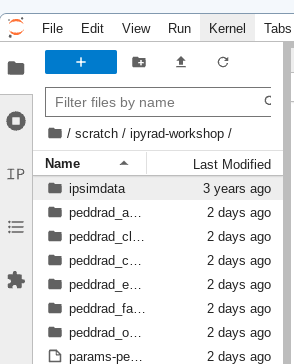
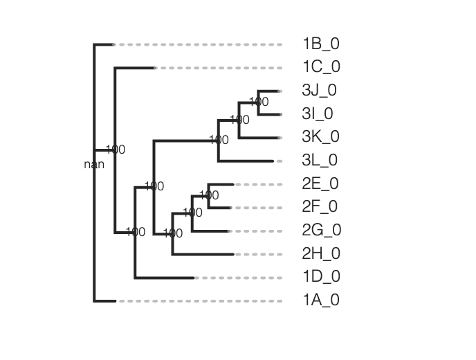
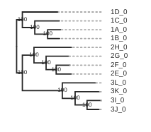
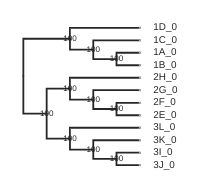
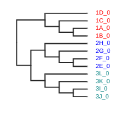
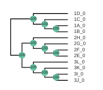
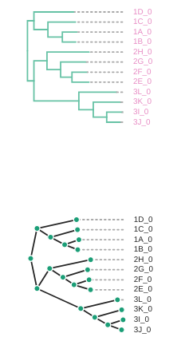
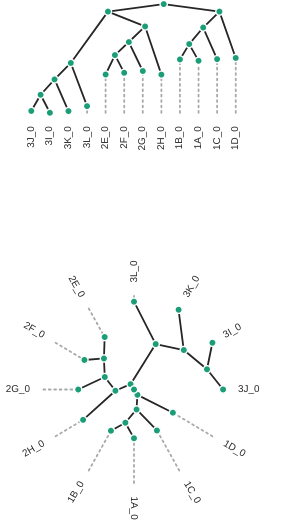

# The ipyrad.analysis module: **RAxML**

RAxML is the most popular tool for inferring phylogenetic trees using maximum
likelihood. It is fast even for very large data sets. The documentation for
raxml is huge, and there are many options. However, we tend to use the same small
number of options very frequently, which motivated us to write the `ipa.raxml()`
tool to automate the process of generating RAxML command line strings, running
them, and accessing the resulting tree files. The simplicity of this tool makes
it easy to incorporate into other more complex tools, for example, to infer
tress in sliding windows along the genome using the `ipa.treeslider` tool.

More information about RAxML can be found [here](https://cme.h-its.org/exelixis/web/software/raxml/) and the scientific paper [Stamatakis *et al.* (2014)](https://academic.oup.com/bioinformatics/article/30/9/1312/238053).

## Install RAxML
Open a terminal and install RAxML using conda:

```
conda install -c bioconda raxml -y
```

## Input data
The raxml tool takes a phylip formatted file as input. In addition you can set
a number of analysis options either when you init the tool, or afterwards by
accessing the `.params` dictionary. You can view the raxml command string that is
generated from the input arguments and you can call `.run()` to start the tree inference.

## A note on Jupyter/IPython
[Jupyter notebooks](http://jupyter.org/) are primarily a way to generate
reproducible scientific analysis workflows in python. ipyrad analysis tools are
best run inside Jupyter notebooks, as the analysis can be monitored and tweaked
and provides a self-documenting workflow.

The rest of the materials in this part of the workshop assume you are running
all code in cells of a jupyter notebook.

# **RAxML** analyses
## Create a new notebook for the RAxML analysis
In the file browser on the left of JupyterLab make sure you are in your home directory.
You can click the folder icon above the file browser to return Home.



Open the launcher (the big blue *+* button) and open a new "Python 3" notebook.

First things first, rename your new notebook to give it a meaningful name. You can
either click the small 'disk' icon in the upper left corner of the notebook or choose
`File->Save Notebook` and rename your notebook to "RAxML-peddrad.ipynb"

### Import ipyrad.analysis module
The `import` keyword directs python to load a module into the currently running
context. This is very similar to the `library()` function in R. We begin by
importing the ipyrad analysis module. Copy the code below into a
notebook cell and click run. 

```python
import ipyrad.analysis as ipa
import toytree
```
> The `as ipa` part here creates a short synonym so that we can refer to
`ipyrad.analysis` **as** `ipa`, which is just faster to type.

The following cell shows the quickest way to results using the simulated data we assembled earlier.
Copy this code into a new notebook cell (or use the small grey *+* button on the toolbar) and run it.

```python
# Path to the input phylip file
phyfile = "peddrad_outfiles/peddrad.phy"

# init raxml object with input data and (optional) parameter options
rax = ipa.raxml(data=phyfile, T=4, N=2)

# print the raxml command string for prosperity
print(rax.command)

# run the command, (options: block until finishes; overwrite existing)
rax.run(block=True, force=True)
```
> **Note:** In this block of code, the `#` at the beginning of a line indicates
to python that this is a comment, so it doesn't try to run this line. This is a
very handy thing if you want to add or remove lines of code from an analysis
without deleting them. Simply comment them out with the `#`!

This runs for a minute or two...

### Draw the inferred tree
After inferring a tree you can then visualize it in a notebook using `toytree`.

```python
# load from the .trees attribute of the raxml object, or from the saved tree file
tre = toytree.tree(rax.trees.bipartitions)
tre.draw(tip_labels_align=True, node_labels="support");
```



```
# draw the tree rooting on all samples from species 1
rtre = tre.root('1A_0', '1B_0', '1C_0', '1D_0')
rtre.draw(tip_labels_align=True, node_labels="support");
```



## Draw the tree showing topology only
Sometimes we might be more interested in visualizing the topology itself,
and ignoring branch lengths, so specify this with the `use_edge_lengths`
parameter set to `False`.
```
rtre.draw(tip_labels_align=True, node_labels="support", use_edge_lengths=False);
```



## Coloring tip labels by sub-species identity

Now, we can actually see what samples group together. However, we don't know
all the sample codes by heart. We can assign colors to the labels, similar as
we did in the PCA. Try running the following code:

```python
imap = {"pop1":['1A_0', '1B_0', '1C_0', '1D_0'],
        "pop2":['2E_0', '2F_0', '2G_0', '2H_0'],
        "pop3":['3I_0', '3J_0', '3K_0', '3L_0']}

colormap = {"pop1":"red",
           "pop2":"blue",
            "pop3": "teal"}

colorlist = []
for sample in rtre.get_tip_labels():
    for species, samples in imap.items():
        if sample in samples:
            colorlist.append(colormap[species])
```
```python
rtre.draw(
    tip_labels_align=True,
    tip_labels_colors=colorlist,
    use_edge_lengths=False
)
```


## Setting parameters
By default several parameters are pre-set in the raxml object. To remove those
parameters from the command string you can set them to `None`. Additionally, you
can build complex raxml command line strings by adding almost any parameter to
the raxml object init, as below.

```python
# parameter dictionary for a raxml object
rax.params
```
```
N        2                   
T        4                   
binary   ~/miniconda3/envs/ipyrad/bin/raxmlHPC-PTHREADS-AVX2
f        a                   
m        GTRGAMMA            
n        test                
p        54321               
s        ~/minsamples10_outfiles/minsamples10.phy
w        ~/src/notebooks/analysis-raxml
x        12345   
```

```python
# Demonstrating setting parameters
rax.params.N = 10
rax.params.f = "d"
```
This will perform 10 rapid hill-climbing ML analyses from random starting trees,
with no bootstrap replicates. 10 is a small value so it will run fast.

## Styling the tree
The default plotted tree can be manipulated with `toytree`, which offers a huge
number of options for styling phylogenetic trees. A complete overview is available
in the [toytree tree styling documentation](https://toytree.readthedocs.io/en/latest/8-styling.html)
here we'll just show a few of these.

```python
# Add node labels showing node support
rtre.draw(node_sizes=15, node_labels="support", use_edge_lengths=False)
```



```python
# Change the tree style
rtre.draw(tree_style='d')          # dark-style
rtre.draw(tree_style='o')          # umlaut-style
```



```python
# Change the orientation
rtre.draw(tree_style="o", layout='d')
# Circle plot orientation
rtre.draw(tree_style="o", layout='c')
```



Again, much more is available in the [toytree tree styling documentation](https://toytree.readthedocs.io/en/latest/8-styling.html).

## Saving trees to pdf
[Saving trees to pdf/svg/other output formats](https://toytree.readthedocs.io/en/latest/4-tutorial.html#Drawing:-saving-figures)

# **Exercise:** Infer a phylogeny for the Mimophis data

Make a new notebook titled 'Mimophis-RAxML.ipynb' and infer the
phylogeny for the dataset in this file: `/data/mimophis.phy`. Feel
free to copy commands directly from the other notebook.
* Extra credit: Choose a set of samples to root on and plot the rooted tree.
