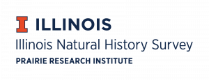

# Welcome to RadCamp 2024 - The INHS @ UIUC Edition

Tuesday March 10, 2026

[Natural Resources Building](https://maps.app.goo.gl/Deskz6WVp9Fj5Mvb6), Room 439  
University of Illinois, Urbana-Champaign  
Champaign, IL 61820

# Organisers, Instructors, and Facilitators

  - Dr Isaac Overcast (Columbia University; INHS)
  - Dr Arianna Kuhn (INHS)
  - Jordyn Chace (NRES)
  - Nick Iacaruso (NRES)

# Registration

Registration for this edition of RADCamp is **free**, but participation will be 
limited to ~20 individuals. Please fill out this brief registration survey, so 
we can get a better idea of who will attend:

[**Register for RADCamp INHS/UIUC 2026**](https://forms.gle/mNm94eLBgZHWwu8j9)

# Schedule

Times           | Sat Nov 9 |
-----           | ------ |
08:30-09:00     | Check-in and Introductions |
09:00-10:00     | [Intro to RADSeq](Intro_RAD.md) & [RADSeq QC](setup_and_fastqc.md) |
10:00-10:15     | Coffee Break |
10:15-11:30     | [ipyrad assembly: Part I](ipyrad_CLI_partI.md) & [Part II](ipyrad_CLI_partII.md) |
11:30-12:30     | [Assemble mystery data in small groups](mystery_data.md) |
12:30-13:30      | Group Photo & Lunch |
13:30-15:30      | [Jupyter notebooks](Jupyter_Notebook_Setup.md) & [Clustering analysis: PCA](PCA_API.md) |
15:30-15:45     | Coffee Break |
15:45-17:00      | [Phylogenetic inference: RAxML](RAxML_API.md) |

## Access an ipyrad binder instance
* [**Launch ipyrad with binder**](https://mybinder.org/v2/gh/dereneaton/ipyrad/master)

### Binder reinstall instructions
```bash
$ wget https://radcamp.github.io/UIUC2026/binder-reinstall.sh
$ bash binder-reinstall.sh
```

## Refreshments provided and workshop sponsored by:
<div align="center" markdown="1">

</div>

## Group Photo
<!--

-->

## Acknowledgements
RADCamp tutorial contributors and instructors (over the years): Isaac Overcast,
Deren Eaton, Sandra Hoffberg, Natalia Bayona-Vasquez, Mariana Vasconcellos,
Laura Bertola, Josiah Kuja, Anhubab Kahn, Arianna Kuhn.
