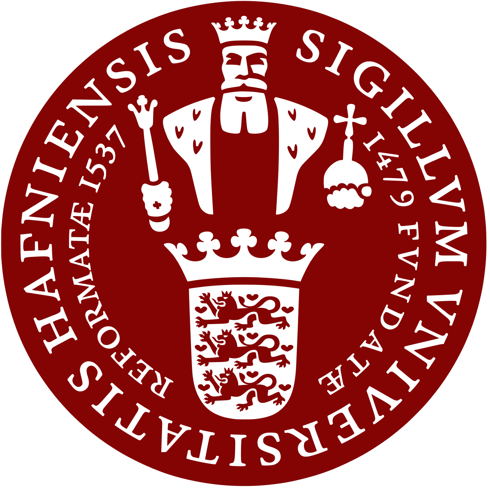
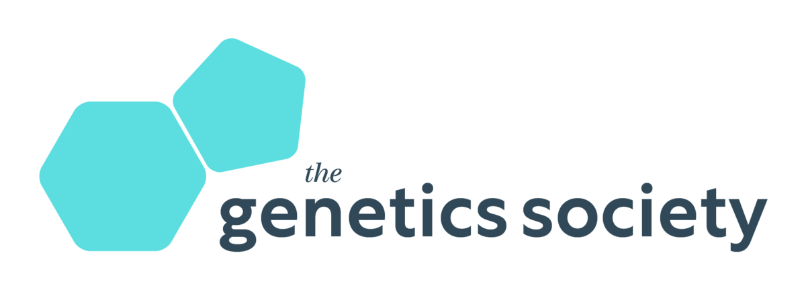
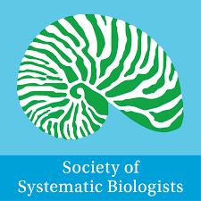
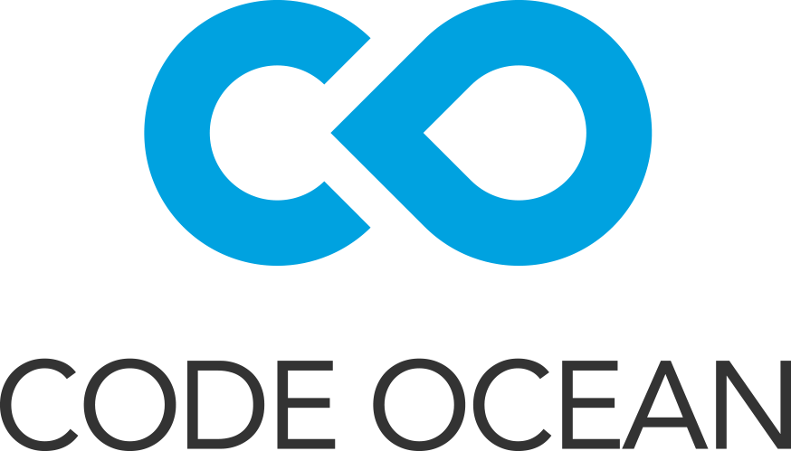
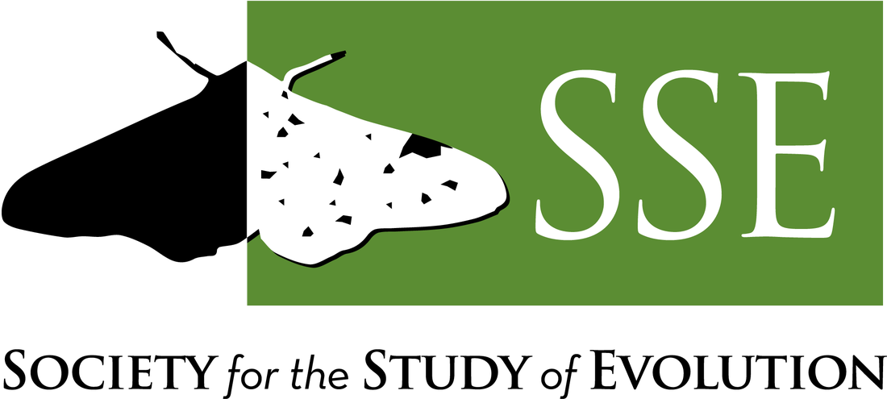
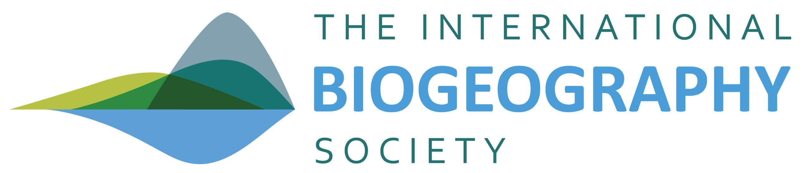

# We acknowledge all the generous support for previous RADCamp workshops

## RADCamp Chicago 2023/2024
* [The Ruane Lab @ FMNH](https://sararuane.com/)
* [Grainger Bioinformatics Center @ FMNH](https://www.fieldmuseum.org/department/grainger-bioinformatics-center)

## RADCamp Kigali 2023
* University of Copenhagen  
{: width="15%"}
* The Genetics Society  
{: width="60%"} 
* University of Rwanda - Center of Excellence in Biodiversity & Natural Resources Management  

* One anonymous donor

## RADCamp NYC 2023

<table width="100%">
  <tr> <td width="50%" align="center">

    
<b>Columbia University's Ecology, Evolution and Environmental Biology Department</b>

  </td> <td width="50%" align="center">

    
<b>American Genetics Association through the Special Event Awards program</b>

  </td> </tr>
  <tr> <td width="50%" align="center">

    
<b>Maine Center for Genetics in the Environment & The University of Maine</b>

  </td> <td width="50%" align="center">

    
<b>Society of Systematic Biologists</b>

  </td> </tr>
  <tr> <td width="50%" align="center">

  </td> </tr>
</table>

## RADCamp Lisbon 2020
* Centre for Ecology, Evolution and Environmental Changes @ University of Lisbon

## RADCamp Marseille 2020
* Eccorev Research Federation
* The Environmental Genomics Research Group
* IMBE laboratory
* Aix-Marseille University

## RADCamp Yale 2019
* YIBS Center for Genetic Analyses of Biodiversity Laboratory & Director Adalgisa Caccone

## RADCamp NYC 2019

 

## RADCamp Malaga 2019
* 

## RADCamp NYC 2018:

## RADCamp Brazil 2018
Funding was provided by grants from FAPESP (BIOTA, 2013/50297-0
to Michael J. Hickerson  and Ana Carnaval), NASA through the Dimensions
of Biodiversity Program (DOB 1343578) and the National Science
Foundation (DEB-1253710 to MJH).

