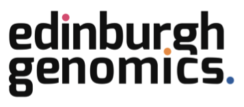
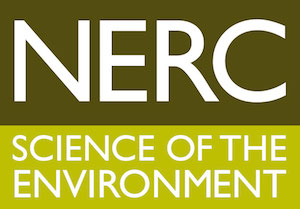
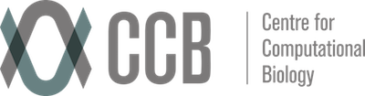

# {{ page.title }}

PoreCamp 2015
14th December - 18th December 2015

Centre for Computional Biology / Institute of Microbiology and Infection
University of Birmingham, UK

PoreCamp is a training bootcamp based around Oxford Nanopore
MinION sequencing. It is a unique opportunity to learn about
this exciting new sequencing platform from some of the leading
experts in the field. 

PoreCamp will be entirely hands-on and the relatively high
cost of entry reflects the costs of running the course;
participants will gain practical experience of sequence library
preparation, operation of the MinION and small group
interactive bioinformatics teaching.

**Organisers / Chief Instructors**

  - Nick Loman, Institute of Microbiology and Infection, University of Birmingham
  - Matt Loose, DeepSeq, University of Nottingham
  - Mick Watson, Edinburgh Genomics, The Roslin Institute
  - Josh Quick, University of Birmingham

**Special Invited Guest Lecturers**

  - John Tyson, University of British Columbia, Vancouver
  - Justin O'Grady, University of East Anglia

**Teaching Assistants**

  - Emily Richardson, University of Birmingham
  - Judith Risse, Edinburgh Genomics
  - Solomon Mwaigwisya, University of East Anglia
  - Pablo Fuentes-Utrilla, University of Birmingham

## Sponsors

  - Oxford Nanopore Technologies
  - MicrobesNG
  - CLIMB
  - DeepSeq

## Admission Information

This course is open to all applicants including those from outside of the UK.

**Cost**: 500 UK Pounds per person (accommodation not included)

Bursaries are available: 10 bursaries from NERC and 5 bursaries from CLIMB for
UK applicants only.

27 places are available.

Please refer to the <a href="PorecampApplicationForm.docx">application form</a>.

Send completed application forms to Jennie Law, <a href="mailto:courses@microbesng.uk">courses@microbesng.uk</a>
 
To apply for a NERC bursary, please also send forms to Bert Overduin, <a href="mailto:bert.overduin@ed.ac.uk">bert.overduin@ed.ac.uk</a>

## Accommodation options

**Venue Birmingham**
£50 per night - only 14 rooms on the Monday, 28 rooms on the other days. Visit
<a href="http://www.venuebirmingham.com">venuebirmingham.com</a>.

Alternative accommodation options in the City Centre are being explored.

## Admission criteria

Places are **strictly limited**. Places will be allocated according
to the following strict criteria:

You must:

  - be a member of the MinION Access Programme
  - have basic “hands-on” experience of the MinION and/or MinION data analysis
  - have a background in either bioinformatics and/or wet lab work
  - be able to attend ALL FIVE days of the course; this is non-negotiable

In the event the course is over subscribed, the instructors will
allocate places according to the strength of the application form
and the applicant's relevant experience.

## How to Apply

**Applications close on Wednesday, 11th November 2015 at 6pm UK time.**

If you are successful you will sent a link to make payment online via credit card.

Please refer to the <a href="PorecampApplicationForm.docx">application form</a>.

Send completed application forms to Jennie Law, <a href="mailto:courses@microbesng.uk">courses@microbesng.uk</a>
 
To apply for a NERC bursary, please also send forms to Bert Overduin, <a href="mailto:bert.overduin@ed.ac.uk">bert.overduin@ed.ac.uk</a>

