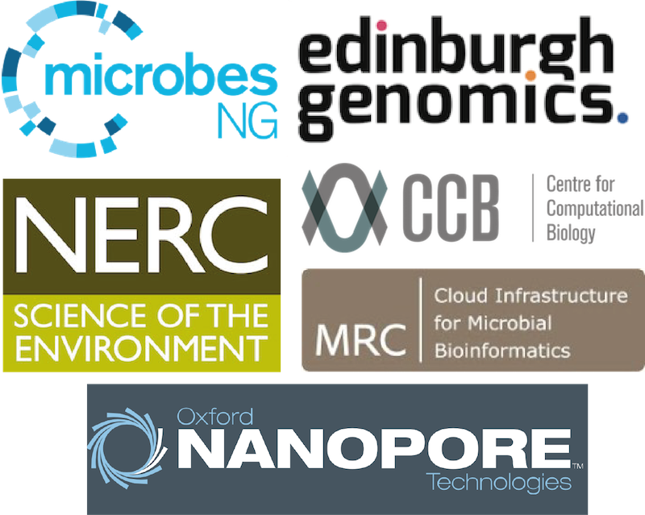

PoreCamp is a training bootcamp based around [Oxford Nanopore MinION](https://www2.nanoporetech.com//products-services/minion-mki) sequencing. It is a unique opportunity to learn about this exciting new sequencing platform from some of the leading experts in the field.

The series was founded by Nick Loman, Matt Loose and Mick Watson in 2015 and has been run as a 1-week hands-on course led by Nick, Matt, Josh Quick, Justin O'Grady and John Tyson.

The next Porecamp is [PoreCamp2017](2017/index.html) on 3 - 7 July 2017 at the University of Birmingham, UK.

Follow us on [Twitter](https://twitter.com/search?q=%23porecamp&src=typd) with #porecamp

# What is nanopore sequencing?

The Oxford Nanopore is a USB-size DNA sequencer which is capable of producing up to 10 Gbase of sequence data with read lengths limited primarily by the input material. One of its key advantages is to produce data in near-real time - the system has been used to monitor the [Ebola outbreak](http://www.nature.com/nature/journal/v530/n7589/full/nature16996.html) in 2015, the [Zika outbreak](http://zibraproject.github.io/) in 2016, and in July 2016 became the first sequencer in [space](http://www.nasa.gov/mission_pages/station/research/experiments/2181.html). The Porecamp instructors recently [sequenced a whole human genome](http://github.com/nanopore-wgs-consortium/NA12878) with this technology.

# Who should attend?

Any researchers wanting training in library preparation, running the MinION Oxford Nanopore instrument, and data analysis are welcome to attend. Participants do not require both wet-lab and bioinformatics skills to benefit from the course - training will be provided in both components.

# Course structure and programme

PoreCamp is currently run as a 1-week course. It is entirely hands-on. The aim is to provide hands-on training by researchers, for researchers in library preparation, running the instrument and the analysis of data as well as the opportunity to meet and discuss applications with nanopore sequencing experts. As of Porecamp 2016 each course features a sequencing field trip to explore the portable capabilities of the device.

The programme and teaching materials for previous courses can be found at:

- [PoreCamp2016](2016/index.html) (15 - 19 August 2016, University of Exeter, Penryn Campus, Cornwall)
- [PoreCamp2015](2015/index.html) (14 - 18 December 2015, University of Birmingham)

## Affiliated events

- [PoreCamp Australia](https://porecamp-au.github.io/) (8 - 10 February 2017)
- PoreCamp US - details coming soon!

# Admission Criteria

Places are **strictly limited**. Places will be allocated according to the following strict criteria.

You must:

- have a MinION;
- have basic hands-on experience of the MinION and/or MinION data analysis;
- have a background in either bioinformatics and/or wet lab work; and
- be able to attend ALL FIVE days of the course; this is non-negotiable.

In the event the course is over-subscribed, the instructors will allocate places according to the strength of the application and the applicant’s relevant experience.

# Acknowledgements

Thank you to the following organisations for providing support (time, bursaries, reagents, space) to PoreCamp:

